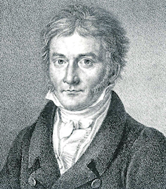
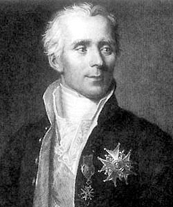

 

 
Judea Pearl said that much of machine learning is just curve fitting[^1] --- but it is quite impressive how far you can get with that, isn't it? In this blog post, we will look at the mother of all curve fitting problems: fitting a straight line to a number of points. In doing so, we will engage in some statistical detective work and discover the methods of least squares as well as the Gaussian distribution.[^2]
 
 
## Fitting a line
A straight line in the Euclidean plane is described by an intercept ($$b_0$$) and a slope ($b_1$), i.e.,
 
$$
y = b_0 + b_1x \enspace .
$$
 
We are interested in finding the values for $(b_0, b_1)$, and so we must collect data points $d = \\{(x_1, y_1), (x_2, y_2), \ldots, (x_n, y_n)\\}$. Data collection is often tedious, so let's do it one point at a time. The first point is $P_1 = (x_1, y_1) = (1, 2)$, and if we plug the values into the equation for the line (i.e., set $x_1 = 1$ and $y_1 = 2$), we get
 
$$
2 = b_0 + 1b_1 \enspace ,
$$
 
<div style= "float: left; padding: 10px 10px 10px 0px;">

</div>
an equation with two unknowns. We call this system of equations *underdetermined* because we cannot uniquely solve for $b_0$ and $b_1$, but will have a number of solutions all for which $b_1 = 2 - b_0$; see Figure 1 on the left. However, if we add another point $P_2 = (3, 1)$, the resulting system of equations becomes
 
$$
\begin{aligned}
2 &= b_0 + 1b_1 \\
1 &= b_0 + 3b_1 \enspace .
\end{aligned}
$$
 
We have two equations in two unknowns, and this is *determined* or *identified*: there is a unique solution for $b_0$ and $b_1$. After some rearranging, we find $b_1 = -0.5$ and $b_0 = 2.5$. This specifies exactly one line, as you can see in Figure 2 on the right.
 
<div style= "float: right; padding: 10px 0px 10px 10px">

</div>
 
We could end the blog post here, but that would not be particularly insightful for data analysis problems in which we have more data points. Thus, let's see where it takes us when we add another point, $P_3 = (2, 2)$. The resulting system of equations becomes
 
$$
\begin{aligned}
2 &= b_0 + 1b_1\\
1 &= b_0 + 3b_1 \\
2 &= b_0 + 2b_1 \enspace ,
\end{aligned}
$$
<div style= "float: left;">

</div>
 
which is *overdetermined* --- we cannot fit a line that passes through all three of these points. We can only fit three *separate* lines, given by two out of three of the equations; see Figure 3. But which of these lines, if any, is the "best" line?
 
 
## (Over)Fitting a curve
Lacking justification to choose between any of these three, we could reduce the case to one that we have solved already, which is usually a good strategy in mathematics. In particular, we could try to reduce the *overdetermined* to the *determined* case. Above, we noticed that we can exactly solve for the two parameters $(b_0, b_1)$ using two data points $\{P_1, P_2\}$. This generalizes such that we can exactly solve for $p$ parameters using $p$ data points. In the problem above, we have three data points, but only two parameters. Let's bend the notion of a *line* a bit --- call it *curve* --- and introduce a third parameter $b_2$. But what multiplies this parameter $b_2$ in our equations? It seems we are missing a dimension. To amend this, let's add a dimension by simply squaring the $x$ coordinate such that a new point becomes $P_1' = (y_1, x_1, x_1^2)$. The resulting system of equations is
 
$$
\begin{aligned}
2 &= b_0 + 1b_1 + 1b_2\\
1 &= b_0 + 3b_1 + 9b_2\\
2 &= b_0 + 2b_1 + 4b_2 \enspace .
\end{aligned}
$$
 
To simplify notation, we can write these equations in matrix algebra. Specifically, we write
 
$$
\begin{aligned}
\mathbf{y} &= \mathbf{X}\mathbf{b} \\[1em]
\begin{pmatrix}
2 \\ 1 \\ 2
\end{pmatrix} &=
\begin{pmatrix}
1 & 1 & 1\\
1 & 3 & 9\\
1 & 2 & 4
\end{pmatrix} \cdot
\begin{pmatrix}
b_0 \\ b_1 \\ b_2
\end{pmatrix} \enspace ,
\end{aligned}
$$
 
where we are again interested in solving for the unknown $\mathbf{b}$. Because this system is *determined*, we can arrive at the solution by inverting the matrix $\mathbf{X}$, such that $\mathbf{b} = \mathbf{X}^{-1}\mathbf{y}$, where $\mathbf{X}^{-1}$ is the inverse of $\mathbf{X}$. The resulting "line" is shown in Figure 4 on the left.
 
<div style= "float: left;">

</div>
 
There are two issues with this approach. First, it leads to overfitting, that is, while we explain the data at hand well (in fact, we do so perfectly), it might poorly generalize to new data. For example, this curve is so peculiar (and it would get much more peculiar if we had fitted it to more data in the same way) that it is likely that new points lie far away from it. Second, we haven't really explained anything. In the words of the great R.A. Fisher:
 
> "[T]he objective of statistical methods is the reduction of data. A quantity of data, which usually by its mere bulk is incapable of entering the mind, is to be replaced by relatively few quantities which shall adequately represent [...] the relevant information contained in the original data." (Fisher, 1922, p. 311)
 
By introducing as many parameters as we have data points, no such reduction has taken place. So let's go back to our original problem: which line should we draw through three, or more generally, any number of points $n$?
 
## Legendre and the "best fit"
Reducing the overdetermined to the determined case did not really work. But there is still one option: reducing it to the underdetermined case. To achieve that, we make the reasonable assumption that each observation is corrupted by noise, such that
 
 
$$
\begin{aligned}
1 &= b_0 + 4b_1 + \epsilon_1 \\
4 &= b_0 + 2b_1 + \epsilon_2 \\
3 &= b_0 + 1b_1 + \epsilon_3
\end{aligned}
$$
 
where ($\epsilon_1$, $\epsilon_2$, $\epsilon_3$) are unobserved quantities[^3]. This introduces another $n$ unknowns! Therefore, we have too few equations for too many parameters --- our previously overdetermined system becomes underdetermined.
 
However, as we saw above, we cannot uniquely solve an underdetermined system of equations. We have to add more constraints. Adrien-Marie Legendre, of whom [favourable pictures are difficult to find](https://en.wikipedia.org/wiki/Adrien-Marie_Legendre#/media/File:Legendre.jpg), proposed what has become known as the *methods of least squares* to solve this problem:
 
> "Of all the principles which can be proposed for that purpose, I think there is none more general, more exact, and more easy of application, that of which we made use in the preceding researches, and which consists of rendering the sum of squares of the errors a *minimum*. By this means, there is established among the errors a sort of equilibrium which, preventing the extremes from exerting an undue influence, is very well fitted to reveal that state of the system which most nearly approaches the truth. (Legendre, 1805, p. 72-73)
 
<div style= "float: right; padding: 10px 10px 10px 0px;">

</div>
 
There is only one line that minimizes the sum of squared errors. Thus, by adding this constraint we can uniquely solve the underdetermined system; see the Figure on the right. The development of least squares was a watershed moment in mathematical statistics --- Stephen Stigler likens its importance to the development of calculus in mathematics (Stigler, 1986, p. 11).
 
We have now seen, conceptually, how to find the "best" fitting line. But how do we do it mathematically? How do we arrive at the Figure on the right? I will illustrate two approaches: the one proposed by Legendre using optimization, and another one using a geometrical insight.
 
 
## Least squares I: Optimization
Our goal is to find the line that minimizes the *sum of squared errors*. To simplify, we center the data by subtracting the mean from $y$ and $x$, respectively; i.e., $y' = y - \frac{1}{n} \sum_{i=1}^n y_i$ and $x' = x - \frac{1}{n} \sum_{i=1}^n x_i$. This makes it such that the intercept is zero, $b_0 = 0$, and we avoid the need to estimate it. In the following, to avoid cluttering notation, I will omit the apostrophe and assume both $y$ and $x$ are mean-centered.
 
For a particular observation $y_i$, our line predicts it to be $x_i b_1$. This implies that the error is $\epsilon_i = y_i - x_i b_1$, and the sum of all squared errors is
 
$$
\sum_{i=1}^n \epsilon_i^2 = \sum_{i=1}^n (y_i - x_i b_1)^2 \enspace .
$$
 
We want to find the value for $b_1$, call it $\hat{b}_1$, that minimizes this quantity; that is, we must solve
 
$$
\hat{b}_1 = \underbrace{\text{argmin}}_{b_1} \left (\sum_{i=1}^n (y_i - x_i b_1)^2 \right) \enspace
$$
 
We could use fancy algorithms like [gradient descent](https://en.wikipedia.org/wiki/Gradient_descent), but we can also engage in some good old high school mathematics and minimize the expression analytically. We note that the expression is quadratic, and thus has a single minimum, and this happens when the derivative is zero. Alas, to work!
 
$$
\begin{aligned}
0 &= \frac{\partial}{\partial b_1} \left (\sum_{i=1}^n (y_i - x_i b_1)^2 \right) \\[0.5em]
0 &= \frac{\partial}{\partial b_1} \left(\sum_{i=1}^n y_i^2 - 2\sum_{i=1}^n y_i x_i b_1 + \sum_{i=1}^n x_i^2 b_1^2 \right) \\[0.5em]
0 &= 0 - 2 \sum_{i=1}^n y_i x_i + 2 \sum_{i=1}^n x_i^2 b_1 \\[0.5em]
 2 \sum_{i=1}^n x_i^2 b_1 &= 2 \sum_{i=1}^n y_i x_i \\[0.5em]
\hat{b}_1 &= \frac{\sum_{i=1}^n y_i x_i}{\sum_{i=1}^n x_i^2} \enspace ,
\end{aligned}
$$
 
where $\sum_{i=1}^n y_i x_i$ is the (scaled by $n$) covariance between x and y, and $\sum_{i=1}^n x_i^2$ is the (scaled by $n$) variance of x.[^4]
 
 
## Least squares II: Projection
Another way to think about this problem is *geometrically*. This requires some linear algebra, and so we better write the system of equations in matrix form. For ease of exposure, we again mean-center the data. First, note that the errors in matrix form yield
 
<div style= "float: left; padding: 10px 10px 10px 0px;">

</div>
 
$$
\begin{aligned}
\begin{pmatrix}
\epsilon_1 \\ \epsilon_2 \\ \vdots \\ \epsilon_n
\end{pmatrix} &= 
\begin{pmatrix}
y_1 \\ y_2 \\ \vdots \\ y_n
\end{pmatrix} -
\begin{pmatrix}
x_1 \\ x_2 \\ \vdots \\ z_n
\end{pmatrix} b_1 \\[1em]
\mathbf{\epsilon} &= \mathbf{y} - \mathbf{x}b_1 \enspace .
\end{aligned}
$$
 
and that the errors are *perpendicular* to the x-axis, that is, they are at a 90 degree angle of each other; see the Figure on the left. This means that the *dot product* of the vector of errors and the x-axis points is zero, i.e.,
 
$$
\begin{pmatrix}
x_1 & x_2 & \ldots & x_n
\end{pmatrix}
\begin{pmatrix}
\epsilon_1 \\ \epsilon_2 \\ \vdots \\ \epsilon_n
\end{pmatrix} = 0 \enspace ,
$$
 
or $\mathbf{x}^T \mathbf{\epsilon} = 0$, in short. Using this geometric insight, we can derive the least squares solution as follows
 
$$
\begin{aligned}
\mathbf{x}^T \mathbf{\epsilon} &= 0 \\[.5em]
\mathbf{x}^T \left(\mathbf{y} - \mathbf{x} b_1 \right) &= 0 \\[.5em]
\mathbf{x}^T \mathbf{x} b_1 &= \mathbf{x}^T \mathbf{y} \\[.5em]
b_1 &= \frac{\mathbf{x}^T \mathbf{y}}{\mathbf{x}^T \mathbf{x}} \\[.5em]
b_1 &= \frac{\sum_{i=1}^n x_i y_i}{\sum_{i=1}^n x_i^2} \enspace ,
\end{aligned}
$$
 
which yields the same result as above.[^5] As an important special case, note the least square solution to a system of equations with only the intercept $b_0$ as unknown, i.e., $y_i = b_0$, yields the mean of $y$. It is this fact that Gauss used to justify the Gaussian distribution as an error distribution, see below.
 
 
## Gauss, Laplace, and "how good is best?"
<!-- The methods of least squares, first published by Legendre in 1805, is an intuitive method to fit curves. *Of course you would minimize the sum of squared errors*, you might say. We could either predict too high or too low a value, leading to positive or negative errors, respectively. So as to not cancel each other out when summing them, we square the errors them. The square also penalizes large errors more than smaller errors ... *now that I think of it*, you might continue, *why not just take the absolute value? Why square?* -->
 
The method of least squares yields the "best" fitting line in the sense that it minimizes the sum of squared errors. But without any statements about the stochastic nature of the errors $\mathbf{\epsilon}$, the question of "how good is best?" remains unanswered.
 
It was Carl Friedrich Gauss who in 1809 couched the least squares problem in *probabilistic terms*. Specifically, he assumed that each error term $\epsilon_i$ comes from some distribution $\phi$. Using this distribution, the probability (density) of a particular $\epsilon_i$ is large when $\epsilon_i$ is small, that is, when observed and predicted value are close together. Further assuming that the errors are *independent and identically* distributed, he wanted to find the parameter values which *maximize*
 
$$
\Omega = \phi(\epsilon_1) \cdot \phi(\epsilon_2) \cdot \ldots \cdot \phi(\epsilon_n) = \prod_{i=1}^n \phi(\epsilon_i) \enspace ,
$$
 
that is, maximize the probability of the errors being small (see also Stigler, 1986, p. 141).[^6]
 

 
All that is left now is to find the distribution $\phi$. Gauss noticed that he could make some general statements about $\phi$, namely that it should be symmetric and have its maximum at 0. He then *assumed* that the mean should be the best value for summarizing $n$ measurements $(y_1, \ldots, y_n)$; that is, he assumed that maximizing $\Omega$ should lead to the same solution as minimizing the sum of squared errors when we have one unknown.[^7]
 
With this circularity --- to justify least squares, I assume least squares --- he proved that the distribution must be of the form
 
$$
\phi(\epsilon_i) = \frac{1}{\sqrt{2\pi\sigma^2}} \exp \left (-\frac{1}{2\sigma^2} \epsilon_i^2 \right) \enspace ,
$$
 
where $\sigma^2$ is the variance[^8]; see the Figure below for three examples. The distribution has become known as the Gaussian distribution, although --- in the spirit of Stigler's law of eponomy[^9] --- de Moivre and Laplace have discovered it before Gauss (see also Stahl, 2006). Karl Pearson popularized the term *normal distribution*, an act for which he seems to have shown some regret:
 
> "Many years ago I called the Laplace–Gaussian curve the normal curve, which name, while it avoids an international question of priority, has the disadvantage of leading people to believe that all other distributions of frequency are in one sense or another 'abnormal'." (Pearson, 1920, p. 25)
 
<!-- <div style= "float: left; padding: 10px 10px 10px 0px;"> -->

<!-- </div> -->
 
Using the Gaussian distribution, the maximization problem becomes
 
$$
\begin{aligned}
\Omega = \prod_{i=1} \phi(\epsilon_i) = \prod_{i=1}^n \frac{1}{\sqrt{2\pi\sigma^2}} \exp \left (-\frac{1}{2\sigma^2} \epsilon_i^2 \right) = \left(\frac{1}{\sqrt{2\pi\sigma^2}}\right)^n \exp \left (-\frac{1}{2\sigma^2} \sum_{i=1}^n \epsilon_i^2 \right) \enspace .
\end{aligned}
$$
 
Note that the value at which $\Omega$ takes its maximum does not change when we drop the constants and take logarithms. This results in $-\sum_{i=1}^n \epsilon_i^2$ as being the expression to be maximized, which is the same as minimizing its negation, that is, minimizing the sum of squared errors.
 

 
The "Newton of France", Pierre Simone de Laplace, took notice of Gauss' argument in 1810 and rushed to give the Gaussian error curve a much more beautiful justification. If we take the errors to be themselves aggregates of many (tiny) perturbing influences, then they will be normally distributed by the *central limit theorem*. So what is this central limit theorem, anyway?
 
 
## The central limit theorem
The central limit theorem is one of the most stunning theorems of statistics. In the poetic words of Francis Galton
 
> "I know of scarcely anything so apt to impress the imagination as the wonderful form of cosmic order expressed by the "Law of Frequency of Error". The law would have been personified by the Greeks and deified, if they had known of it. It reigns with serenity and in complete self-effacement, amidst the wildest confusion. The huger the mob, and the greater the apparent anarchy, the more perfect is its sway. It is the supreme law of Unreason. Whenever a large sample of chaotic elements are taken in hand and marshalled in the order of their magnitude, an unsuspected and most beautiful form of regularity proves to have been latent all along." (Galton, 1889, p. 66)
 
The theorem basically says that if you have a sequence of independent and identically distributed random variables --- what Galton calls "the mob" --- and if that sequence has finite variance, than the mean of this sequence, as $n$ grows larger and larger --- "the greater the apparent anarchy" --- will get closer and closer to a normal distribution. As $n \rightarrow \infty$, the mean in fact converges in distribution to the normal distribution.[^10]
 
<!-- Formally, let $(X_1, X_2, \ldots, X_n)$ be a sequence of $n$ independent and identically distributed random variables with mean $\mu$ and variance $\sigma^2$. Then we have that, by the law of large numbers, that the sample mean $\bar{X}_n$ converges to $\mu$ as $n \rightarrow \infty$. The central limit theorem states that, as $n \leftarrow n$ -->
 
<!-- $$ -->
<!-- \sqrt{n} \left(\frac{\bar{X}_n - \mu}{\sigma}\right) \rightarrow \mathcal{N}(0, 1)  -->
<!-- $$ -->
 
Laplace realized that, if one takes the errors in the least squares problem to be themselves aggregates (i.e., means) of small influences, then they will be normally distributed. This provides an elegant justification for the least squares solution.
 
To illustrate, assume that a particular error $\epsilon_i$ is in fact the average of $m = 500$ small irregularities that are independent and identically distributed; for instance, assume these influences follow a uniform distributions. Let's say we have $n = 200$ observations, thus 200 individual errors. The R code and Figure below illustrate that the error distribution will tend to be Gaussian.
 


set.seed(1776)
 
n <- 200 # number of errors
m <- 500 # number of influences one error is made of
 
# compute errors which are themselves aggregates of smaller influences
errors <- replicate(n, mean(runif(m, -10, 10)))
 
hist(
  errors, breaks = 30, main = 'Central Limit Theorem',
  xlab = expression(epsilon), col = 'grey76', ylab = 'Frequency',
  yaxt = 'n', xlim = c(-1, 1), prob = TRUE
)
axis(2, las = 2)
 
# plot approximate Gaussian density line
x <- seq(-1, 1, .001)
se <- sqrt(20^2 / 12 ) / sqrt(m)
lines(x, dnorm(x, mean = 0, sd = se))



 
I don't know about you, but I think this is really cool. We started out with small irregularities that are uniformly distributed. Then we took an average of a bulk ($m = 500$) of those which constitute an error $\epsilon_i$; thus, the error itself is an aggregate. Now, by some fundamental fact about how our world works, the distribution of these errors (here, $n = 200$) can be well approximated by a Gaussian distribution. I can see why, as Galton conjectures, the Greeks would have deified such a law, if only they had known of it.
 
 
## Linear regression
One neat feature of the Gaussian distribution is that any *linear combination* of normally distributed random variables is itself normally distributed. We may write the linear regression problem in matrix form, which makes apparent that $\mathbf{y}$ is a weighted linear combination of $\mathbf{x}$. Specifically, if we have $n$ data points, we have a system of $n$ equations which we can write in matrix notation more concisely
 
$$
\begin{aligned}
\begin{pmatrix}
y_1 \\
y_2 \\
\vdots \\
y_n
\end{pmatrix} &=
\begin{pmatrix}
1 & x_1 \\
1 & x_2 \\
\vdots & \vdots \\
1 & x_n
\end{pmatrix} \cdot
\begin{pmatrix}
b_0 \\
b_1
\end{pmatrix} +
\begin{pmatrix}
\epsilon_1 \\
\epsilon_2 \\
\vdots \\
\epsilon_n \\
\end{pmatrix} \\[1em]
\mathbf{y} &= \mathbf{X}\mathbf{b} + \mathbf{\epsilon}
\end{aligned}
$$
 
<div style= "float: left; padding: 10px 10px 10px 0px;">

</div>
 
 
 
Due to this linearity, the assumption of normally distributed errors propagates and results in a *conditional normal distribution* of $\mathbf{y}$, that is,
 
$$
y_i \mid \mathbf{x}_i \sim \mathcal{N}(\mathbf{x}_i^T \mathbf{b}, \sigma^2) \enspace .
$$
 
In other words, the probability density of a particular point $y_i$ is given by
 
$$
\frac{1}{\sqrt{2\pi\sigma^2}} \exp \left( -\frac{1}{2\sigma^2} (y_i - \mathbf{x}_i^T \mathbb{b})^2\right) \enspace ,
$$
 
which is visualized in the Figure on the left. Intuitively, the smaller the error variance, the better the fit.
 
 
## Conclusion
In this blog post, we have discussed the mother of all curve fitting problems --- fitting a straight line to data points --- in great detail. On this journey, we have met the method of least squares, a pillar of statistical thinking. We have seen how Gauss arrived at "his" distribution, and how Laplace gave it a beautiful justification in terms of the central limit theorem. With this, it was only a small step towards linear regression, one of the most important tools in statistics and machine learning.
 
 
---
*I would like to thank Don van den Bergh and Jonas Haslbeck for helpful comments on this blogpost.*
 
## Post Scriptum I: Linking correlation to regression
It is a *trivium* that correlation does not imply causation. [Some](https://stats.stackexchange.com/questions/376920/the-book-of-why-by-judea-pearl-why-is-he-bashing-statistics) believe that linear regression is a causal model. This is not true. To see this, we can relate the regression coefficient in simple linear regression to correlation --- they differ only in standardization.
 
Assuming mean-centered data, the sample Pearson correlation is defined as
 
$$
r_{xy} = \frac{\sum_{i=1}^n x_i y_i}{\sqrt{\sum_{i=1}^n x_i^2 \sum_{i=1}^n y_i^2}} \enspace .
$$
 
Note that correlation is symmetric --- it does not matter whether we correlate $x$ with $y$, or $y$ with $x$. In contrast, regession is not symmetric. In the main text, we have used $x$ to predict $y$ which yielded
 
$$
b_{xy} = \frac{\sum_{i=1}^n y_i x_i}{\sum_{i=1}^n x_i^2} \enspace .
$$
 
If we were to use $y$ to predict $x$, the coefficient would be
 
$$
b_{yx} = \frac{\sum_{i=1}^n y_i x_i}{\sum_{i=1}^n y_i^2} \neq b_{xy} \neq r_{xy} \enspace .
$$
 
However, by *standardizing* the data, that is, by dividing the variables by there respective standard deviations, the regression coefficient becomes the sample correlation, i.e.,
 
$$
\begin{aligned}
\frac{\partial L}{\partial b_{xy}} &= \frac{\partial}{\partial b_{xy}} \sum_{i=1}^n\left(\frac{y_i}{\sqrt{\sum_{i=1}^n y_i^2}} - b_{xy} \frac{x_i}{\sqrt{\sum_{i=1}^n x_i^2}} \right)^2 \\[0.5em]
&= \frac{\partial}{\partial b_{xy}} \left( \frac{\sum_{i=1}^n  y_i^2}{\sqrt{\sum_{i=1}^n y_i^2}} - 2 b_{xy} \frac{\sum_{i=1}^n y_i x_i}{\sqrt{\sum_{i=1}^n y_i^2 \sum_{i=1}^n x_i^2}} + b_{xy}^2 \frac{\sum_{i=1}^n x_i^2}{\sum_{i=1}^n x_i^2}\right)\\[0.5em]
&= 0 - 2 \frac{\sum_{i=1}^n y_i x_i}{\sqrt{\sum_{i=1}^n y_i^2 \sum_{i=1}^n x_i^2}} + 2 b_{xy}  \\[0.5em]
2 b_{xy} &= 2 \frac{\sum_{i=1}^n y_i x_i}{\sqrt{\sum_{i=1}^n y_i^2 \sum_{i=1}^n x_i^2}} \\[0.5em]
b_{xy} &= \frac{\sum_{i=1}^n y_i x_i}{\sqrt{\sum_{i=1}^n y_i^2 \sum_{i=1}^n x_i^2}} \enspace,
\end{aligned}
$$
 
which is equal to $r_{xy}$. This *standardized* regression coefficient can also be achieved by multiplying the *raw* regression coefficient, i.e.,
 
$$
b_s = b_{xy} \times \frac{\sqrt{\sum_{i=1}^n x_i^2}}{\sqrt{\sum_{i=1}^n y_i^2}} = \frac{\sum_{i=1}^n y_i x_i}{\sum_{i=1}^n x_i^2} \times \frac{\sqrt{\sum_{i=1}^n x_i^2}}{\sqrt{\sum_{i=1}^n y_i^2}} = \frac{\sum_{i=1}^n y_i x_i}{\sqrt{\sum_{i=1}^n y_i^2 \sum_{i=1}^n x_i^2}}.
$$
 
$b_{yx}$ can be standardized in a similar way, such that 
 
$$
b_s = b_{yx} \times \frac{\sqrt{\sum_{i=1}^n y_i^2}}{\sqrt{\sum_{i=1}^n x_i^2}} = \frac{\sum_{i=1}^n y_i x_i}{\sum_{i=1}^n y_i^2} \times \frac{\sqrt{\sum_{i=1}^n y_i^2}}{\sqrt{\sum_{i=1}^n x_i^2}} = \frac{\sum_{i=1}^n y_i x_i}{\sqrt{\sum_{i=1}^n y_i^2 \sum_{i=1}^n x_i^2}} \enspace .
$$
 
<!-- ## Post Scriptum II: Why $\pi$? -->
<!-- You might wonder why there is a $\pi$ in the expression of the normal distribution. The mathematical reason for this is that -->
 
<!-- $$ -->
<!-- \int_{-\infty}^{\infty} e^{-x^2 / 2} \, \mathrm{d}x = \sqrt{2\pi} \enspace , -->
<!-- $$ -->
 
<!-- shown by Laplace. -->
 
<!-- Because the proof is so cool, I reproduce it here. As is so often the case in mathematics, writing things more complicated can help[^9], i.e., -->
 
<!-- $$ -->
<!-- \begin{aligned} -->
<!-- \left(\int_{-\infty}^{\infty} e^{-x^2 / 2} \, \mathrm{d}x \right) \left(\int_{-\infty}^{\infty} e^{-x^2 / 2} \, \mathrm{d}x \right) &= \left(\int_{-\infty}^{\infty} e^{-x^2 / 2} \, \mathrm{d}x \right) \left(\int_{-\infty}^{\infty} e^{-y^2 / 2} \, \mathrm{d}y \right) \\[1em] -->
<!-- &= \int_{-\infty}^{\infty} \int_{-\infty}^{\infty} e^{-\frac{x^2 + y^2}{2}} \, \mathrm{d}x \mathrm{d}y \enspace . -->
<!-- \end{aligned} -->
<!-- $$ -->
 
<!-- Note that we can describe a point in the plane using polar coordinates, i.e., $x = r \, \text{cos}\,\theta$ and $y = r \, \text{sin}\,\theta$, where $r$ is the distance of $(x, y)$ to the origin and $\theta \in [0, 2\pi)$ is the angle. The Jacobian matrix of this transformation is -->
 
<!-- $$ -->
<!-- \frac{d(x, y)}{d(r, \theta)} = \begin{pmatrix} \text{cos}\,\theta & -r \, \text{sin}\, \theta\\ \text{sin}\,\theta & r \, \text{cos}\,\theta  \end{pmatrix} \enspace , -->
<!-- $$ -->
 
<!-- which has determinant $r$. Noting that $x^2 + y^2 = r^2$, we continue with -->
 
<!-- $$ -->
<!-- \begin{aligned} -->
<!-- \int_{0}^{2\pi} \int_{0}^{\infty} r \cdot e^{-r^2 / 2} \, \mathrm{d}r \mathrm{d}\theta = \int_{0}^{\infty} -->
<!-- \end{aligned} -->
<!-- $$ -->
 
 
 
<!-- ## Post Scriptum II: Curves and regularization -->
<!-- In the blog post, I have hinted at the fact that adding polynomials in order to fit the data perfectly generalizes poorly to unseen data. We can show this with a simple example. Assume we observe $n = 10$ data points from the following polynomial function -->
 
<!-- $$ -->
<!-- y = 2 + 0.25 x -0.75 x^2 \enspace . -->
<!-- $$ -->
 
<!-- ```{r, echo = FALSE} -->
<!-- gen_y <- function(x, sd_err = NULL) { -->
<!--   y <- 2 + 3 * x - 0.2 * x^2 -->
<!--   if (!is.null(sd_err)) { y <- y + rnorm(length(x), 0, sd_err) } -->
<!--   y -->
<!-- } -->
 
<!-- get_coefs <- function(y, X) solve(t(X) %*% X) %*% t(X) %*% y -->
 
<!-- get_prederr <- function(test_set, train_set) { -->
<!-- } -->
 
<!-- n_train <- 50 -->
<!-- n_test <- 150 -->
<!-- x <- seq(0, 10, length.out = n_train + n_test) -->
 
<!-- data_sets <- t(replicate(n = 1000, gen_y(x, sd_err = 1))) -->
 
<!-- train_sets <- data_sets[, seq(n_train)] -->
<!-- test_sets <- data_sets[, -seq(n_train)] -->
 
<!-- plot(1, type = "n", xlim = c(0, 10), ylim = c(0, 15), -->
<!--      bty = "n", xlab = "x", ylab = "y", main = 'True function' -->
<!-- ) -->
 
<!-- lines(x, gen_y(x), pch = 20, col = 'skyblue') -->
 
<!-- x <- seq(0, 10) -->
<!-- ``` -->
 
---
## References
- Blitzstein, J. K., & Hwang, J. (2014). *Introduction to Probability*. Chapman and Hall/CRC. [[Link](https://www.amazon.com/Introduction-Probability-Chapman-Statistical-Science/dp/1466575573)]
 
- Ford, M. (2018). *Architects of Intelligence: The truth about AI from the people building it*. Packt Publishing. [[Link](https://www.amazon.com/Architects-Intelligence-truth-people-building/dp/1789131510/ref=sr_1_1?s=books&ie=UTF8&qid=1546765292&sr=1-1&keywords=martin+ford)]
 
- Fisher, R. A. (1922). On the mathematical foundations of theoretical statistics. *Phil. Trans. R. Soc. Lond. A*, *222(594-604)*, 309-368. [[Link](https://royalsocietypublishing.org/doi/abs/10.1098/rsta.1922.0009)]
 
- Galton, F. (1889). *Natural Inheritance*. London, UK: Richard Clay and Sons. [[Link](http://galton.org/books/natural-inheritance/pdf/galton-nat-inh-1up-clean.pdf)]
 
- Pearson, K. (1920). Notes on the history of correlation. *Biometrika*, *13(1)*, 25-45. [[Link](https://www.jstor.org/stable/2331722?seq=1#metadata_info_tab_contents)]
 
- Stahl, S. (2006). The evolution of the normal distribution. *Mathematics magazine*, *79(2)*, 96-113. [[Link](https://www.tandfonline.com/doi/abs/10.1080/0025570X.2006.11953386?journalCode=umma20)]
 
- Stigler, S. M. (1980). Stigler's Law of Eponymy. *Transactions of the New York Academy of Sciences*, *39(1 Series II)*, 147-157. [[Link](https://nyaspubs.onlinelibrary.wiley.com/doi/abs/10.1111/j.2164-0947.1980.tb02775.x)]
 
- Stigler, S. M. (1981). Gauss and the invention of least squares. *The Annals of Statistics*, *9(3)*, 465-474. [[Link](https://projecteuclid.org/download/pdf_1/euclid.aos/1176345451)]
 
- Stigler, S. M. (1986). *The history of statistics: The measurement of uncertainty before 1900*. Harvard University Press. [[Link](http://www.hup.harvard.edu/catalog.php?isbn=9780674403413)]
 
- Stigler, S. M. (2007). The epic story of maximum likelihood. *Statistical Science*, *22(4)*, 598-620. [[Link](https://www.jstor.org/stable/27645865?casa_token=QqFTvsgYX0MAAAAA:VfdvDgUOdMH95y5V-d9YQ4P1SemlxCU7Xrx-9OIEG4EN69iIU3L7yU5q4XIewzYjPhpDzKFh-LbJk6X6RiogDo_2fw4kI0Q_Tl5GSgBvaTdzwGGHTj_xQQ&seq=1#metadata_info_tab_contents)]
 
- Yarkoni, T., & Westfall, J. (2017). Choosing prediction over explanation in psychology: Lessons from machine learning. *Perspectives on Psychological Science*, *12(6)*, 1100-1122. [[Link](https://journals.sagepub.com/doi/abs/10.1177/1745691617693393?casa_token=FaEkfz8xxLMAAAAA%3AxO7ygcT8h8GVYPqizcJ8Mt3spZ8vinhA4yGQ_j1w_-HwjqZ04-yphCnCsC0j0S2xghh5DR69ppb3od4)]
 
--- 
## Footnotes
[^1]: See [this](https://www.quantamagazine.org/to-build-truly-intelligent-machines-teach-them-cause-and-effect-20180515/) interview and Martin Ford's [new book](https://www.amazon.com/Architects-Intelligence-truth-people-building/dp/1789131510/ref=sr_1_1?s=books&ie=UTF8&qid=1546765292&sr=1-1&keywords=martin+ford) in which he interviews 23 leading voices in AI, one of them being Pearl. (The comment about curve fitting is on p. 366).
[^2]: This blog post was in part inspired by Neil Lawrence's talk at the Gaussian Process summer school last year. You can view it [here](http://gpss.cc/gpss18/program).
[^3]: I think it is fair to say that this 'error' is a catch-all term, expressing our ignorance or lack of knowledge. [This](https://www.bayesianspectacles.org/a-galton-board-demonstration-of-why-all-statistical-models-are-misspecified/) blog post argues that, by virtue of introducing error, all statistical models are misspecified.
[^4]: The generalization to higher dimensions is straightforward. Instead of simple derivatives, we have to take partial derivatives, one for each parameter $b$. When expressed in matrix form, the solution yields $\mathbf{b} = (\mathbf{x}^T \mathbf{x})^{-1} \mathbf{x}^T y$, where $\mathbf{x}$ is a $n \times p$ matrix and $\mathbf{b}$ is a $p \times 1$ vector.
[^5]: The generalization to higher dimensions is straightforward. Simply let $\mathbf{x}$ to be a $n \times p$ matrix and $\mathbf{b}$ be a $p \times 1$ vector, where $p$ is the number of dimensions. The derivation is exactly the same, except that because $\mathbf{x}^T \mathbf{x}$ is not a scalar anymore but a matrix, we have to left-multiply by its inverse. This yields $\mathbf{b} = (\mathbf{x}^T \mathbf{x})^{-1} \mathbf{x}^T y$.
[^6]: To arrive at this maximization criterion, Gauss used Bayes' rule. Inspired by Laplace, he assumed a uniform prior over the parameters and chose the mode of the posterior distribution over the parameters as his estimator; this is equivalent to maximum likelihood estimation, see also Stigler (2008).
[^7]: Note that while I have mostly talked about "fitting lines" or "predicting values", the words used during the discovery of least squares where "summarizing" or "aggregating" observations. For instance, they would say that, absent other information, the mean summarizes the data best while I would, using the language of this blog post, be forced to say the mean predicts the data best. I think that "summarizing" is more adequate than "predict", especially since we are not predicting out of sample (see also Yarkoni & Westfall, [2017](https://journals.sagepub.com/doi/abs/10.1177/1745691617693393?casa_token=HBqivCFyDcUAAAAA%3ABMKLq2EDzASwBuP5yNRBXk45iblKe1RJ9-lBSI3sR70ATw28R7gilW1s30iDIgW8QYonpDqxs14J9w)).
[^8]: Gauss introduced a [different parameterization](https://en.wikipedia.org/wiki/Normal_distribution#History) using *precision* instead of variance. The parameterization using variance was introduced by Fisher. (Karl Pearson used the standard deviation before.)
[^9]: The law states that "no scientific discovery is named after its original discoverer" (Stigler, [1980](https://nyaspubs.onlinelibrary.wiley.com/doi/abs/10.1111/j.2164-0947.1980.tb02775.x), p. 147).
[^10]: The proof is not difficult, and can be found in Blitzstein & Hwang ([2014](https://www.amazon.com/Introduction-Probability-Chapman-Statistical-Science/dp/1466575573), p. 436), which is an amazing book on probability theory full of [gems](https://twitter.com/fdabl/status/981106227143954432). I wholeheartedly recommend working through Blitzstein's [Stat 110](https://projects.iq.harvard.edu/stat110/youtube) class --- it's one of the best classes I ever took (online, and in general).
