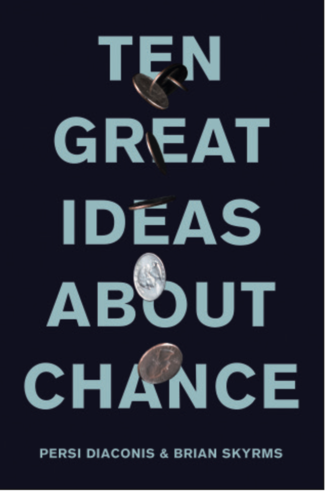

*The blog post reviews and summarizes the book "Ten Great Ideas about Chance" by Diaconis and Skyrms. A much shorter version of this review has been published in Significance, see [here](https://rss.onlinelibrary.wiley.com/doi/10.1111/j.1740-9713.2018.01217.x).*

In ten short chapters, Persi Diaconis and Brian Skyrms provide a bird's eye perspective on probability theory and its connection to other disciplines. The book grew out of a course which the authors taught at Stanford, and is intended as a "history book, a statistics book, and a philosophy book".

The first great idea is that chance can be measured. Here, the authors take us back into the 17th and 18th century, to scholars such as Cardano, Pascal, Fermat, Newton, and the Bernoullis who arrived of what one would call today the *naive* definition of probability by counting equiprobable cases. As gambling was a common hobby back then, the discussion focused on the notion of fairness. Say we engage in a gamble which requires throwing a coin a hundred times, but get interrupted mid-game by a war or a revolution. How should we split the money? With Newtonian physics in hand, John Arbuthnot --- who also conducted the first significance test --- ponders the role of chance in a deterministic universe. (But wait until chapter nine.) The authors' fascination for probability is contagious, and it's hard to suppress a smile when they discuss a deterministic coin-tossing machine that the physics department built for them. The coins would always land on the same side, “viscerally disturbing” the authors (one of which, by the way, is a former professional magician). The appendix also shatters the idealization of introductory probability textbooks, concluding that ordinary coin tosses are biased: the coin lands the same way it starts with a probability of .51.

With 26 pages, the second great idea receives the most coverage. It concerns judgement, and the authors make it clear that if your judgements, that is, betting behaviour, do not accord with the rules of probability, then bookies can systematically make money off of you. But money is not the end-all be-all, as Gabriel Cramer and Daniel Bernoulli conclude, independently, in discussing the St. Petersburg paradox: Say I throw an unbiased coin until it lands tails. If it lands tails on the n\textsuperscript{th} trial, you receive $2^n$ dollars. While the expected value of this proposal is infinite, you may hesitate even to pay the equivalent of a nice dinner to enter this game. These considerations led to utility theory, and the author's summary of how John von Neumann, Oskar Morgenstern, and Frank Ramsey pioneered the measurement of utility is both accessible and fascinating.

The third great idea is that the logic of chance is different from the psychology of chance. Here we meet the messiness of the mind, and puzzle over several paradoxes that seemingly violate the axioms of utility theory introduced in the previous chapter. Diaconis and Skyrms are quick to point out that these violations are superficial: with a complete analysis that accounts for how a particular decision would make you feel, the paradoxes introduced by Allais and Ellsberg do not violate the axioms --- they cease to test them. The authors go on to discuss the “heuristics and biases” program of Kahneman and Tversky, and this is where the discrepancy between utility theory as a prescriptive theory of choice and actual human behaviour cannot be explained away so easily.

The fourth great idea is the connection between frequency and chance via the law of large numbers; the second part of the chapter discusses the failure of frequentism to provide an adequate treatment of probability. We meet Jacob Bernoulli's weak law of large numbers and his "swindle" --- claiming to have solved the "inverse problem" of going from frequencies to chances without the use of prior probabilities. John Venn tried to formalize probability as the limit of a relative frequency. Within four pages, the authors discuss why this fails, and move on to von Mises' treatment. Instead of assuming the existence of limiting relative frequencies, von Mises postulated this as a defining attribute of his “Kollektiv” --- an infinite series which exhibits global order (i.e., converges to a limiting relative frequency) and local disorder (which is captured by randomness). What is the nature of a random sequence? Von Mises suggested that the limiting relative frequency of a series should be invariant under selection of subsequences chosen by a particular place-selection function. Difficulties arose in finding appropriate place-selection functions, and the authors pick up this idea again in chapter eight. Overall, the idealizations inherent in using frequency to define probability --- as put forward by Venn and von Mises --- lead to problems that ultimately render the account unfeasible. Although referred to in a future chapter, the appendix of chapter four does not seem to exist.

The fifth chapter represents a slight shift in treatment of the ideas; it concerns the integration of probability theory into mathematics proper, based on set-theoretic principles and measure theory. Naturally, this requires heavier mathematical notation and the introduction of some abstract concepts. The main character here is Andrew Kolmogorov, who provided a unifying treatment of probability in his 1933 book. Regardless of the interpretation of probability --- frequentist or otherwise --- its mathematical basis has become clear.

In chapter six, we finally meet the Presbyterian minister and hobby mathematician Thomas Bayes. His famous essay is viewed as an answer to Hume's inductive skepticism. In contrast to Jacob Bernoulli's "swindle", Bayes truly solves the "inverse problem" of going from frequencies to chances which the authors illustrate with the problem Bayes starts his essay with: estimating the bias of a coin with a uniform prior. Bayes’ interpretation of probability concerns degrees of belief instead of limiting relative frequencies. Working on the same problem in France, Laplace derived the identical result as Bayes, but further discussed predictions, leading to his (in)famous “rule of succession”: the probability of a success on the next trial given m previous successes in n trials is (m + 1)/(n + 2). Diaconis and Skyrms extend the analysis of Laplace from the uniform to a Beta prior. They also tip their hat to what has been dubbed the "replicability crisis" in science: researchers --- guided by Bayes --- should report negative studies, pool evidence across studies, and consider prior probabilities. It is good to see such reflections on practical scientific matters in a book about probability.

Throughout the chapters, we read about probability, frequencies, and chances. But what are they? And how are they related? It takes some detective work to answer these questions. Probability, put on a solid mathematical basis by Kolmogorov, is interpreted by Bayes, Laplace, as well as Diaconis and Skyrms as degree of belief. Frequentists such as Venn and von Mises treat it as the limit of a relative frequency. (Chapter 4 discussed various defects of this perspective.) A relative frequency is something familiar; for instance, the ratio of m successes in n trials. But what is chance? Curiously for a book on the topic, the authors never give a definition. Throughout the first chapters, they equivocate “chance” with “probability”, for example when they define expectation as “weighting the costs and benefits of various outcomes by their chances” (p. 13), or explain that “humans often make mistakes in reasoning about chance” (p. 58). It becomes clear that these concepts are distinct only when the authors discuss how Bayes used a prior probability over chances to solve the “inverse problem”. In this example, chance is the rate parameter $\theta$ in a Binomial model (see also Lindley, 2013, p. 115). Chapter 7 describes how Bruno de Finetti, an Italian probabilist who spearheaded subjective Bayesianism in the 20th century, tied together these different concepts with his representation theorem: if your beliefs about certain outcomes are exchangeable, that is, their order does not influence your probability assignment, this is equivalent to conditional independence in the outcomes and uncertainty about the parameters (i.e., “chances”). More formally, a sequence of random quantities is said to be exchangeable if

\begin{equation}
p(x_1, x_2, \ldots , x_n) = p(x_{\pi(1)}, x_{\pi(2)}, \ldots, x_{\pi(n)})
\end{equation}

holds for all permutations $\pi$ defined on the set $\{1, \ldots, n\}$ and for every finite subset of them. de Finetti’s theorem shows that if this condition holds, then there exists a parametric model $p(x \mid \theta)$ governed by some parameter $\theta$ which, as n tends to infinity, is the limit of some function of the $x_i$’s (in the Binomial case, a relative frequency!), and there exists a probability distribution over $\theta$, $p(\theta)$, such that

\begin{equation}
p(x_1, \ldots, x_n) = \int_{\Theta} \prod_{i=1}^n p(x_i \mid \theta) p(\theta) \mathrm{d}\theta
\end{equation}

(see also Bernardo, 1996). With this, de Finetti “showed how chance, frequency, and degree of belief all interact to give statistical inference” (p. 133).

From the securities of banks to statistical simulations, much of modern technology depends on randomness. But what makes a sequence of numbers random? Von Mises viewed the impossibility of a successful gambling system --- this notion is made precise by *martingales* --- as an essential feature of a random sequence. Chapter eight shows how von Mises' formalism of randomness proved inadequate, and introduces Martin-Löf’s modern theory of algorithmic randomness, which depends on the notion of computability, as the great idea of this chapter. Equipped with these ideas, a random sequence is simply a sequence which passes (increasingly stringent) Martin-Löf tests of randomness. Validating von Mises’ intuition, a successful gambling system is impossible if and only if it is Martin-Löf random.

If Laplace’s demon existed --- if, given the current state of all atoms, it could predict all future states --- what room is left for probability? What is the role of chance in such a deterministic universe? Already in the 17th century, and discussed in the first chapter, Arbuthnot ponders the role of chance in a deterministic universe. Equipped with Newtonian mechanics, he concludes that chance is merely an artefact of our ignorance. In chapter nine, Diaconis and Skyrms argue that our world is fundamentally a world of chance. They make this point in two rounds. First, the authors discuss why the second law of thermodynamics required a probabilistic reformulation and how the sensitive dependence on initial conditions in dynamical systems makes clear-cut predictions impossible; on this level, Diaconis and Skyrms might well grant Laplace his demon, and agree with Arbuthnot: probability enters classical physics due to the impossibility of exact predictions (which is due to our ignorance). Quantum mechanics --- according to the orthodox view --- however, “sets the world at chance” (p. 180). Here, as the authors note, predictions appear to be uncertain at a deeper level.[^1]

Each chapter includes images of important historical figures. In chapter ten we see Karl Popper, as if in despair, putting both hands on his head. The last great idea concerns the problem of induction, and Diaconis and Skyrms argue that inductive skepticism can be constrained. “Trying to answer a thoroughgoing skeptic is a fool’s game,” the authors state.

> “But it is possible, and sometimes quite reasonable, to be skeptical about some things but not others. Thus, there are *grades of inductive skepticism*, which differ in what the skeptic calls into question and what he is willing to accept. For each grade, a discussion of whether such a skeptic’s doubts are justified *in his own terms* might actually be worthwhile.”

Take a simple coin-tossing example. After observing a few tosses, why should you believe the coin's future behaviour would resemble its past behaviour? This is Hume's struggle, and de Finetti provides an answer: if you believe that all outcome patterns with the same number of successes are equally likely, then you must believe that the frequency of successes in the past must be similar to the frequency of successes in the future, and that this frequency converges. Thus, a skeptic with exchangeable beliefs is incoherent; or, as the authors put it: “*If your degrees of beliefs are exchangeable, you cannot be an inductive skeptic*” (p. 200). Diaconis and Skyrms go through the usual objections (e.g., how to specify the prior, what if exchangeability does not hold), ending the book by tying together various notions explicated in the previous chapters.

The authors are luminaries in their respective fields (statistics and philosophy), and it is exciting to see them take the time to share their thoughts with a more popular audience. They also know how to condense their vast knowledge concisely. This is apparent when, for example, they review the early history of probability in a mere eight pages, Martin-Löf tests of randomness in two, or Bell's theorem in three. While they suggest a prerequisite of one course in statistics or probability suffices, I think this is overly optimistic: it may hold for the first four chapters, but readers might puzzle over expressions such as unique smallest Borel field, dense explanations of exchangeability, or Lyapunov exponents. An example is their treatment of Church's notion of *computability*, which is condensed into four *paragraphs*. I doubt that these paragraphs allow the naive reader to reduce her uncertainty concerning computability. In fact, they may well have increased it.

But then this is a book which aims to provide an overview of the vast web spanned by probability theory in a mere two hundred pages. It is clear that, with such an ambitious goal, some confusion must remain. The authors remedy this to some degree by means of extensive referencing in footnotes[^2] and a selected bibliography (most of which, however, incomprehensible to somebody without a solid understanding of probability) --- but this fuels the critic's suspicion that the book is a polished version of the author's lecture notes of their Stanford class. This particular critic may long for the release of the video lectures in which Diaconis and Skyrms would explicate the ideas discussed in the book in more depth.

The ten great ideas are well selected and may complement a reading of Stigler's book on the seven pillars of statistical wisdom (Stigler, 2016). The ordering of the ideas --- from “easier” ones concerning history and psychology to “harder” ones concerning theoretical computer science and quantum physics --- makes sense, too, and it is good to see later chapters revisit earlier ideas. Have they missed any big ideas? I don’t think so. But they may have omitted minor ones: for example, that Laplace’s rule of succession is inadequate to establish a general law, as it expresses a strong prior belief that no such law holds. A remedy, which pushed Harold Jeffreys to develop the Bayes factor, is to assign a prior probability to the general law (Zabell, 2005, pp. 58).

*Ten Great Ideas about Chance* is well illustrated, and the cover looks great. If you find
yourself discovering it in a bookstore, browsing through its pages, you will certainly be drawn
to the enthusiasm that shines through the concise writing. You decide to buy the book. There
are two ways in which this story can continue. A “pessimist” will puzzle over the book; she will find key concepts only hinted at, their deeper meaning lost in the rapid succession of ideas; she will struggle through most of the chapters, and while each individual sentence makes sense to her, she will have difficulties grasping the bigger picture; lured in by the layout, she expected a popular treatment of probability theory, but is quickly forced to adjust her expectations; she is frustrated and not willing to invest the extra work into understanding the ten great ideas. An "optimist" will puzzle over the book; she will marvel at the great ideas and discuss them with her peers (some of whom have a better grasp on probability); she will occasionally be annoyed by the brevity of exposition, but consult the references to gain deeper insight; she soon realizes that this book is not light reading, and treats it as such.

As illustrated by the above story, I cannot unreservedly recommend the book. In fact, I
have found myself alternating between the position of the pessimist and of the optimist, and
your own transition probability will vary depending on your background and expectations. I
cannot influence the former, but hope that, with this review, I have given you an impression
that can either heighten or curb your enthusiasm for "Ten Great Ideas about Chance".

## References
- Bernardo, J. M. (1996). The Concept of Exchangeability and Its Applications. *Far East Journal of Mathematical Sciences*, 111–122.

- Diaconis, P. & Skyrms, B. (2017). *Ten Great Ideas About Chance*. Princeton University Press.

- Lindley, D. V. (2013). *Understanding Uncertainty*. John Wiley & Sons.

- Stigler, S. M. (2006). Isaac Newton as a Probabilist. *Statistical Science*, *23(1)* 400–403.

- Stigler, S. M. (2016). *The Seven Pillars of Statistical Wisdom*. Harvard University Press.

- Zabell, S. L. (2005). *Symmetry and Its Discontents: Essays on the History of Inductive Probability*. Cambridge University Press.

## Footnotes
[^1]: However, not all physicists agree with the *Copenhagen interpretation*, i.e., the orthodox view. A non-negligible percentage espouses the *Many-worlds interpretation*, which is deterministic.
[^2]: Awkwardly, one footnote claims that Newton was a poor probabilist, referencing Stigler (2004). The correct reference is Stigler (2006), in which Stigler claims the exact opposite, stating that “Newton was thinking like a great probabilist.”