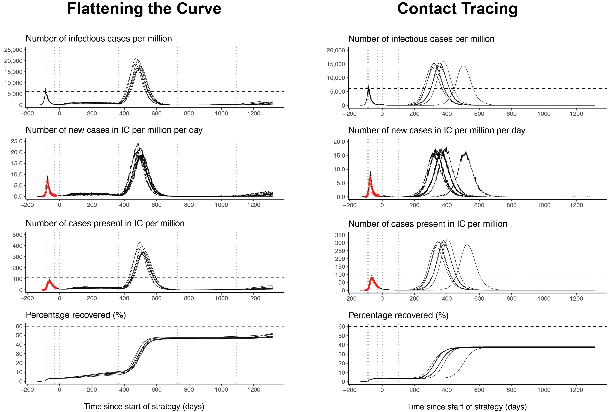

 

 
The COVID-19 pandemic will end only when a sufficient number of people have become immune, thus preventing future outbreaks. Principally, so-called *exit strategies* differ on whether immunity is achieved through natural infections, or whether it is achieved through a vaccine. Countries across the world are scrambling to find an adequate exit strategy, with [differential success](https://www.endcoronavirus.org/countries).
 
To model different exit strategies from an epidemiological standpoint, de Vlas & Coffeng ([2020](https://www.medrxiv.org/content/10.1101/2020.03.29.20046011v2)) developed a stochastic individual-based SEIR model which allows for inter-individual differences in how effectively individuals spread the virus and how well individuals adhere to measures designed to curb virus transmission. The model also allows for preferential mixing of individuals with similar contact rates. A key innovation of the model is that it stratifies the population into communities and regions within which transmission mainly occurs. Their paper is excellent and insightful, and I encourage you to read it.
 
To make the underlying model more easily accessible, [Luc Coffeng](https://twitter.com/luc_coffeng) and I have developed a [Shiny app](https://scienceversuscorona.shinyapps.io/covid-exit/) that allows you to explore these exit strategies interactively. In this blog post, I provide a brief overview of the Shiny app and ideas about possible model extensions. Note that I am not an epidemiologist, and my aim here is not to endorse different exit strategies nor to make policy recommendations.
 
This work was carried out under the umbrella of [Science versus Corona](https://scienceversuscorona.com/), an initiative I founded together with [Denny Borsboom](https://dennyborsboom.com/), [Tessa Blanken](https://twitter.com/tfblanken), and [Charlotte Tanis](https://twitter.com/CharlotteCTanis).
 
 
# Modeling exit strategies
The two figures below illustrate particular parameterizations of five different exit strategies: Radical Opening, Phased Lift of Control, Intermittent Lockdown, Flattening the Curve, and Contact Tracing. The first four strategies aim for a (controlled) build-up of herd immunity through natural infection, while Contact Tracing aims to minimize cases until a vaccine is available.
 
Since the model is stochastic, that is, events in the simulations occur randomly according to pre-defined probabilities, the black solid lines in the figures below show a number of possible trajectories. Note that the dashed vertical lines below indicate interventions, with lines before day 0 indicating interventions specific to the Netherlands during the initial lockdown, and lines from day 0 onwards interventions that are specific to the exit strategies.
 
<!-- Each figure comprises four panels, showing --- per million --- (a) the number of infectious cases, (b) the number of new cases in intensive care per day, (c) the number of cases present in intensive care (IC), and (d) the proportion of people having recovered. The horizontal dashed line in (a) and (c) indicate the intensive care capacity for the Netherlands; the horizontal line in (d) indicates the herd immunity threshold. The red dots show intensive care data for the Netherlands. Since the model is stochastic, repeated simulations follow slightly different trajectories, as indicated by the black solid lines. -->
 

  

 
Radical Opening lifts all measures at once on day 0, resulting in a huge increase in the number of infections per million, as the top panel shows. The dashed vertical line indicates the number of infections at which the intensive care capacity is reached in the Netherlands, which is 6000 infections per million inhabitants. The second panel shows the simulated number of new cases in intensive care per day, with the red dots showing the actual number of cases in intensive care in the Netherlands. The third panel shows the number of cases that are present in intensive care per million; the dashed vertical line indicates the number of beds per million --- 115 --- that are available for COVID-19 cases in the Netherlands. Radical Opening massively overshoots this capacity, which would result in a large number of excess deaths. The bottom panel shows that herd immunity is reached quickly, yet [overshoots](https://www.nytimes.com/2020/05/01/opinion/sunday/coronavirus-herd-immunity.html).
 
Phased Lift of Control, as proposed by de Vlas & Coffeng ([2020](https://www.medrxiv.org/content/10.1101/2020.03.29.20046011v2)), splits a country into geographical units and, one at a time, lifts the measures in that part; the time points at which measures are lifted is indicated by the vertical dotted lines. Phased Lift of Control as presented here does not lead to an overburdening of the healthcare system and thus in no excess death as compared to Radical Opening (note the $y$-axis difference). However, the strategy still aims at achieving herd immunity naturally, and so depending on who exactly gets infected, there will be deaths proportional to the case fatality ratio of that subpopulation. Phased Lift of Control allows a natural epidemic within the region where measures are being lifted, and so it overshoots herd immunity regionally and therefore nationally as well, as seen in the bottom panel. As a side note, overshoot does not occur when 25% of the participants "remain in hiding" when control measures are lifted (Luc Coffeng, personal communication), which strikes me as a realistic scenario; overall, Phased Lift of Control is robust to this non-participation (see [Supplementary 3](https://www.medrxiv.org/content/10.1101/2020.03.29.20046011v2.supplementary-material) in de Vlas & Coffeng, 2020).
 
The intention of Intermittent Lockdown is to reinstate lockdown measures just before intensive care units are at full capacity. Compared to Phased Lift of Control, the Intermittent Lockdown exit strategy does not use the intensive care capacity efficiently, as some intensive care beds remain unused during periods of lockdown (see days 200 - 600). Moreover, the strategy comes with a high risk of overshooting intensive care capacity (see days 0 - 200 and days 600 - 750).
 

  

 
Flattening the Curve aims to balance the number of infections so that the healthcare system does not become overburdened by relaxing interventions after an initial lockdown. If not enough interventions are lifted (as in this example), herd immunity hardly develops (e.g., see day 400). Conversely, if too many interventions are lifted (or people adhere poorly to interventions), case numbers may increase beyond health care capacity (e.g., see day 500). As the bottom panel shows, this version of Flattening the Curve does not reach herd immunity even after 1200 days.
 
In contrast to all strategies so far, the Contact Tracing exit strategy does not aim for natural herd immunity. Instead, it aims to keep the number of infections low until a vaccine is developed, with vaccine development being a [highly complex undertaking](https://www.nytimes.com/interactive/2020/06/09/magazine/covid-vaccine.html) that may take years. Until that point, due to the low proportion of people who have acquired immunity, large outbreaks are possible at all times, and this is indeed what the figure above shows. There is some debate on how well the testing, tracing, and isolating of infectious and exposed cases will [work in practice](https://www.sciencemag.org/news/2020/05/countries-around-world-are-rolling-out-contact-tracing-apps-contain-coronavirus-how), and you can play around with these parameters in the Shiny app. Heterogeneity might work in our favour, however. Recent estimates suggest that the spread of the novel coronavirus is [largely driven by superspreading events](https://www.sciencemag.org/news/2020/05/why-do-some-covid-19-patients-infect-many-others-whereas-most-don-t-spread-virus-all) (see also Althouse et al. [2020](https://arxiv.org/abs/2005.13689)), which has [ramifications for control](https://www.nytimes.com/2020/06/02/opinion/coronavirus-superspreaders.html). Heterogeneity in networks that connect individuals can also increase the efficiency of contact tracing (Kojaku et al., [2020](https://arxiv.org/abs/2005.02362)).
 
The [Shiny app](https://scienceversuscorona.shinyapps.io/covid-exit/) describes these exit strategies and their different parameterizations in more detail, and allows you to interactively compare variations of them. Except Radical Opening, all exit strategies that aim at herd immunity presented above take an extraordinary amount of time to reach it. Indeed, [modeling suggests](https://mrc-ide.github.io/covid19estimates/#/total-infected), and recent seroprevalence studies confirm, that [we are far from herd immunity](https://www.nytimes.com/interactive/2020/05/28/upshot/coronavirus-herd-immunity.html). I am not espousing these types of exit strategies here, and they make me feel a little uneasy (compare [the case of Sweden](https://medium.com/@tomaspueyo/coronavirus-should-we-aim-for-herd-immunity-like-sweden-b1de3348e88b)). An assessment of these and other exit strategies that do not aim at herd immunity through natural infection requires input from multiple disciplines, and goes far beyond this blog post and the Shiny app. The goal of the [Shiny app](https://scienceversuscorona.shinyapps.io/covid-exit/) is instead to allow you to see how robust various exit strategies are to changes in their parameters, and how they compare to each other from a purely epidemiological standpoint.
 
 
# Model extensions
The modeling work by de Vlas & Coffeng ([2020](https://www.medrxiv.org/content/10.1101/2020.03.29.20046011v2)) is impressive, and I again encourage you to read up on it; see especially their [Supplementary 1](https://www.medrxiv.org/content/10.1101/2020.03.29.20046011v2.supplementary-material). Here, I want to briefly mention a number of interesting dimensions along which the model could be extended, with some being more realistic than others.
 
First, the model currently assumes life-long immunity (or at least for the duration of the simulation), which is unrealistic. Depending on the exact duration of immunity, the dynamics of the exit strategies simulations presentated above will change. For an investigation of how seasonality and immunity might influence the course of the pandemic, see Kissler et al. ([2020](https://science.sciencemag.org/content/368/6493/860)).
 
Second, the model currently does not stratify the population according to age, the most important risk factor for mortality. Extending the model in this way would allow one to model interventions targeted at a particular age group, as well as assess mortalities in a more detailed manner. The model currently also does not simulate mortality, and they have to be computed using the number of infections and an estimate of the case fatality ratio. Needless to say, if the prevalence of people who require intensive care exceeds the intensive care capacity, mortalities will be much higher.
 
Third, the model assumes that individuals live in clusters (e.g., villages), which a part of super clusters (e.g., provinces), which together make up a country. It allows for heterogeneity among contact rates and preferential mixing of individuals with similar contact behaviour, but currently does not incorporate an explicit network structure. Instead, it assumes that, barring very strong preferential mixing, every individual is connected to every other individual. Adding a network structure would result in more realistic assessment of interventions such as contact tracing, with potentially large ramifications (e.g., Kojaku et al., [2020](https://arxiv.org/abs/2005.02362)).
 
Fourth, the exit strategies presented above are somewhat monolithic. Except for Radical Opening and Contact Tracing, they work by reducing the transmission over a particular period of time in which measures are taken place. Contact Tracing is slightly more involved, and you can read more details in the [Shiny app](https://scienceversuscorona.shinyapps.io/covid-exit/). This coarse-grained approach ignores the finer-grained choices governments have to make; should schools be re-opened? What about hairdressers and church services? International travel? A more detailed exploration of the effect of exit strategies would associate each such intervention with a reduction in transmission, and simulate what would happen when they are being lifted or enforced. Needless to say, this requires a good understanding of how such interventions reduce virus spread (see e.g., Chu et al., [2020](https://www.sciencedirect.com/science/article/pii/S0140673620311429)), an understanding we are currently lacking. [Systematic experimentation](https://theconversation.com/lockdown-we-need-to-experiment-with-reopenings-now-to-prevent-a-second-wave-138741) might help.
 
 
# Multidisciplinary assessment
Lastly, the pandemic affects not only the physical health of citizens, but has also inflicted severe economic and psychological damage. While models that focus on a single aspect of the pandemic can yield valuable insights, they should ideally combine different disciplinary perspectives to provide a holistic assessment of exit strategies. Recently, various works have combined economic and epidemiological modeling. For example, using the UK as a case study, Pichler et al. ([2020](https://papers.ssrn.com/sol3/papers.cfm?abstract_id=3606984)) compare strategies that differ in which sectors they would reopen; even radical opening would reduce the GDP by 16 percentage points compared to pre-lockdown levels, all the while keeping the effective reproductive number $R_t$ above 1.
 
But there are other disciplines who could chip in besides epidemiology and economics, such as psychology, law, and history. Some would provide a quantitative assessment, for example by formalizing the effect of different interventions such as opening schools or closing churches. What are the epidemiological effects of opening schools? How do school closures adversely affect the educational development of children? In what ways do they increase existing economic inequalities? What are the legal ramifications of "protecting the elderly", which sounds sensible but has a discriminatory undertone? From a historical perspective, what lessons can we learn from citizens' behaviour -- such as [anti-mask protests](https://www.theguardian.com/world/2020/apr/29/coronavirus-pandemic-1918-protests-california) --- in past pandemics? All these interventions and effects interact in complex ways, severely complicating analysis; but who said it would be easy?
 
 
# Conclusion
In this blog post, I have described a [Shiny app](https://scienceversuscorona.shinyapps.io/covid-exit/) which allows you to interactively explore different exit strategies using the epidemiological model described in de Vlas & Coffeng ([2020](https://www.medrxiv.org/content/10.1101/2020.03.29.20046011v2)). I have discussed potential model extensions and the need for a multidisciplinary assessment of exit strategies. Overall, the modeling suggests that exit strategies aimed at the controlled build-up of immunity will take a long time; but so might be [waiting for a vaccine](https://www.nytimes.com/interactive/2020/science/coronavirus-vaccine-tracker.html). Best to brace for the long haul.
 
---
 
I want to thank Luc Coffeng for an insightful collaboration and valuable comments on this blog post. Thanks also to Denny Borsboom, Tessa Blanken, and Charlotte Tanis for helpful comments on this blog post and for being a great team.
 
---
 
*This blog post has also been posted to the [Science versus Corona blog](https://scienceversuscorona.com/interactive-exploration-of-covid-19-exit-strategies).*
 
 
## References
- Althouse, B. M., Wenger, E. A., Miller, J. C., Scarpino, S. V., Allard, A., Hébert-Dufresne, L., & Hu, H. ([2020](https://arxiv.org/abs/2005.13689)). Stochasticity and heterogeneity in the transmission dynamics of SARS-CoV-2. *arXiv preprint arXiv:2005.13689*.
- Chu, D. K., Akl, E. A., Duda, S., Solo, K., Yaacoub, S., Schünemann, H. J., ... & Hajizadeh, A. (2020). Physical distancing, face masks, and eye protection to prevent person-to-person transmission of SARS-CoV-2 and COVID-19: A systematic review and meta-analysis. *The Lancet*.
- de Vlas, S. J., & Coffeng, L. E. ([2020](https://www.medrxiv.org/content/10.1101/2020.03.29.20046011v2)). A phased lift of control: a practical strategy to achieve herd immunity against Covid-19 at the country level. *medRxiv*.
- Flaxman, Mishra, Gandy et al. ([2020](https://www.nature.com/articles/s41586-020-2405-7)) Estimating the effects of non-pharmaceutical interventions on COVID-19 in Europe. *Nature*, 3164.
- Kojaku, S., Hébert-Dufresne, L., & Ahn, Y. Y. ([2020](https://arxiv.org/abs/2005.02362)). The effectiveness of contact tracing in heterogeneous networks. *arXiv preprint arXiv:2005.02362*.
- Pichler, A., Pangallo, M., del Rio-Chanona, R. M., Lafond, F., & Farmer, J. D. ([2020](https://papers.ssrn.com/sol3/papers.cfm?abstract_id=3606984)). Production networks and epidemic spreading: How to restart the UK economy?
