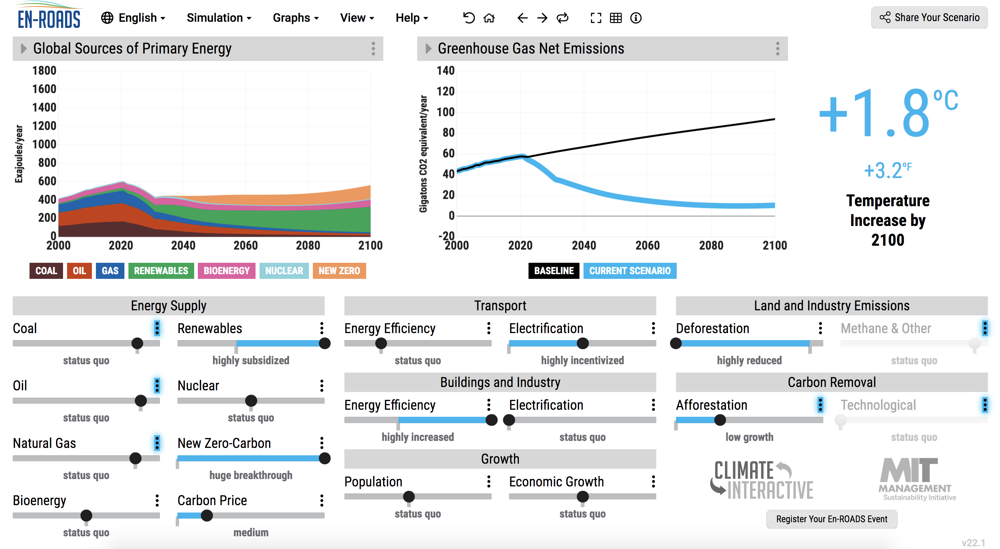

 

  

 
The unusually stable climate of the past 10,000 years has enabled human agriculture and civilization. And without further intervention, [at least another 10,000 years](https://www.science.org/doi/abs/10.1126/science.1076120) of stability would have ensued. Yet starting in the 1950s, in what has been dubbed [*The Great Acceleration*](https://journals.sagepub.com/doi/10.1177/2053019614564785), humans dramatically grew their population and their economies, becoming a [planetary-scale geological force](https://www.goodreads.com/book/show/36004703-the-human-planet) that continues to exert enormous pressure on the Earth system. The consequences of this are [becoming increasingly apparent](https://www.nytimes.com/interactive/2021/12/13/opinion/climate-change-effects-countries.html). But they could become much worse.
 
Current policies would lead to [about 2.7 °C of warming](https://climateactiontracker.org/publications/glasgows-2030-credibility-gap-net-zeros-lip-service-to-climate-action/) by the end of this century, something last seen over [three million years ago](https://www.pnas.org/content/115/52/13288) in the Mid-Pliocene Warm Period, where sea levels were [17 metres higher](https://www.nature.com/articles/s41586-019-1543-2). This amount of warming would almost certainly [trigger tipping points](https://www.carbonbrief.org/explainer-nine-tipping-points-that-could-be-triggered-by-climate-change), causing regional havoc on short time-scales and [potentially further amplifying global heating](https://www.pnas.org/content/115/33/8252). Put bluntly, our current trajectory [could result](https://theecologist.org/2019/jan/03/its-nonlinearity-stupid) in the [end of human civilization](https://www.goodreads.com/en/book/show/19145016-the-collapse-of-western-civilization) as we know it.
 
There is, however, still a chance to avert the worst and, in the process, create a better world than we have today. But the challenge is monumental, the [necessary system transformations](https://www.wri.org/research/state-climate-action-2021) enormous. To be on track to limit warming to 1.5°C requires that we cut global carbon emissions [in half by 2030](https://www.science.org/doi/10.1126/science.aah3443). Yet the [people in power have failed](https://www.annualreviews.org/doi/abs/10.1146/annurev-environ-012220-011104), and [continue to fail](https://climateactiontracker.org/countries/), to enact changes commensurate with the scale and urgency of the climate emergency. We cannot remain inert and just hope for the best.
 
Instead, we need to build the largest, most inclusive social movement in history and make it be heard that we do not stand for the continued destruction of the natural world. Climate action has to move from something that others do to something that [we all engage in](https://twitter.com/climatehuman/status/1315065413500166144). Each and everyone of us has a role to play — this is humanity’s decisive decade.
 
As people living in wealthy countries, which [overshoot multiple biophysical boundaries](https://www.nature.com/articles/s41893-021-00799-z), we are responsible for [most of the excess emissions](https://www.sciencedirect.com/science/article/pii/S2542519620301960) and thus have a [special responsibility](https://www.carbonbrief.org/in-depth-qa-what-is-climate-justice) to act and avoid further climate breakdown. On an individual level, the higher your income and wealth, the larger your [energy](https://www.nature.com/articles/s41560-020-0579-8) and [carbon footprint](https://www.ecoequity.org/wp-content/uploads/2020/12/GAP-graphic.png) tends to be. As people with a high socio-economic status, we play many roles – as consumers, investors, role models, organizational participants, and citizens – and can [use our positions and influence](https://www.nature.com/articles/s41560-021-00900-y) to accelerate rapid decarbonization.
 
I recently explored these themes – future climate impacts, our failure to bend the emissions curve so far, and what we can do today – with the [CorrelAid Netherlands community](https://www.meetup.com/DataForGood-CorrelAid-X-Netherlands/) in a workshop on the climate emergency and climate action. After an introductory talk of about 60 minutes, situating ourselves in this unfolding drama, we tried to find policies that limit warming to well below 2°C and ideally to 1.5°C in an equitable and just manner using [En-ROADS](https://en-roads.climateinteractive.org/scenario.html?v=21.12.0), an interactive climate simulator.
 
What if we planted a trillion trees? Massively scaled up nuclear energy? Kept fossil fuels in the ground? All turned vegan? Introduced a world-wide carbon tax? These are some of the questions we addressed. Ultimately, we ended up with a [scenario](https://en-roads.climateinteractive.org/scenario.html?v=21.12.0&p196=50&p198=50&p200=50&p16=-0.03&p35=2&p39=50&p47=5&p53=50&p57=-10&p209=1&p60=-80&p61=-50&p254=2021&p65=30&p218=5&p208=2&p68=10&p70=50) that limits warming to 1.8°C. Not too bad.
 

  

 
The workshop was intense. It lasted more than two hours and thirty minutes, with 45 people attending. We had wide-ranging conversations, from the basics of climate science to the finer details of mitigation modelling; from individual responsibility to considerations of justice; from structures of power to social movements and effective action. I felt that people came away with a better understanding of the scale and urgency of the climate emergency and a renewed sense of, if not hope, then of the necessity to take action. Hope is what we create through action.
 
We unfortunately messed up the recording of the event, so I [recorded it again](https://twitter.com/fdabl/status/1465313483759796231) without an audience. This means that the interactive part is not included. However, I do provide a short rundown of the En-ROADS simulator. If you think that such an interactive workshop could be valuable to you and your community, do not hesitate to reach out — I am sure we can arrange something. I am always up for discussing climate and climate action; indeed, it is difficult for me to think about anything else these days.
 
---
*A version of this blog post [first appeared](https://correlaid.nl/blog/climate-action/) on the blog of CorrelAid Netherlands, an initiative that connects data scientists with organizations that advance the social good.*
 
*I am currently writing a three-part series expanding on the contents of the workshop, so if you are curious, watch this space! If you want to learn more about the climate emergency and could benefit from an overview of resources, you might find [this selection](https://fabiandablander.com/menu/climate.html) helpful.*
