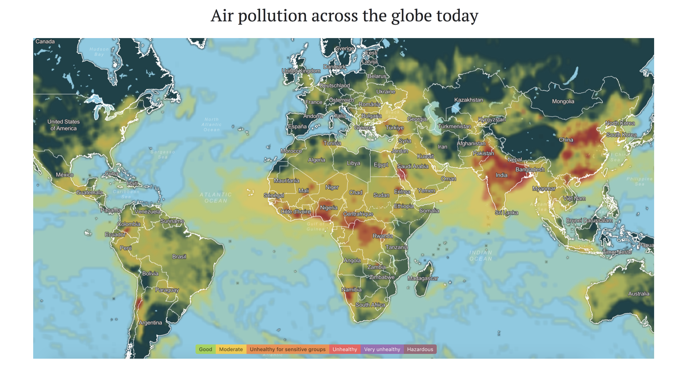
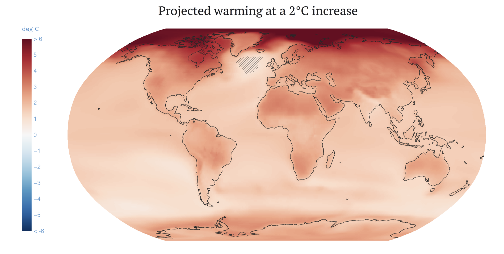
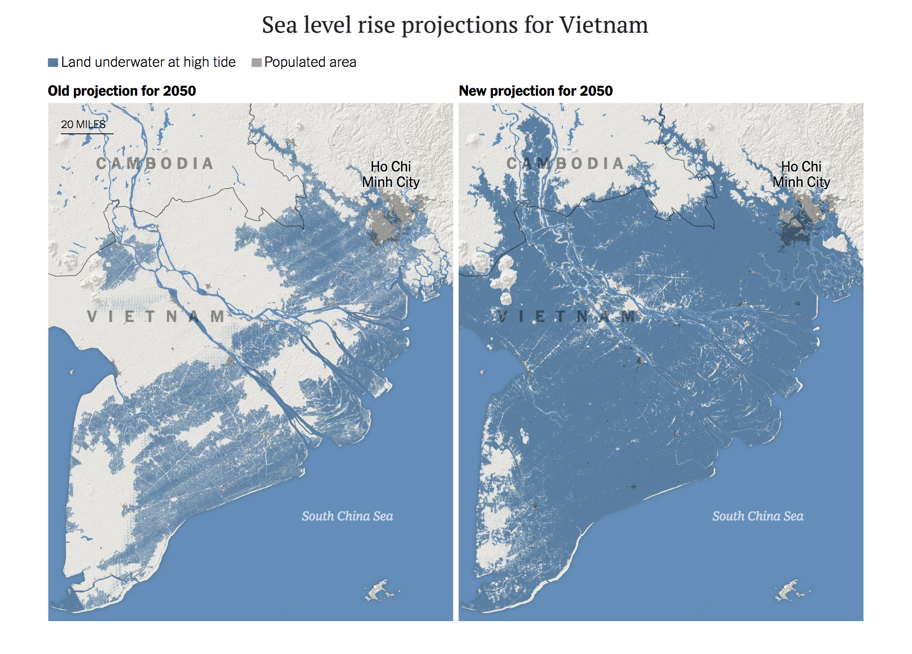
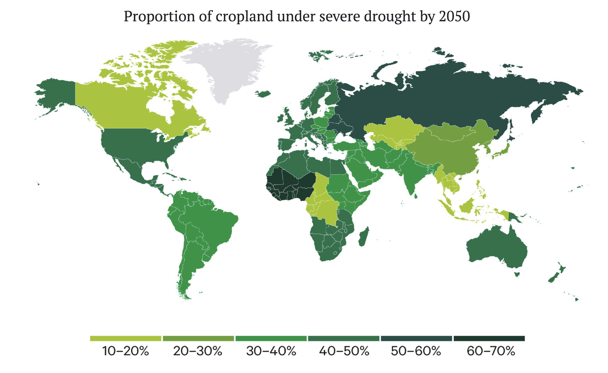
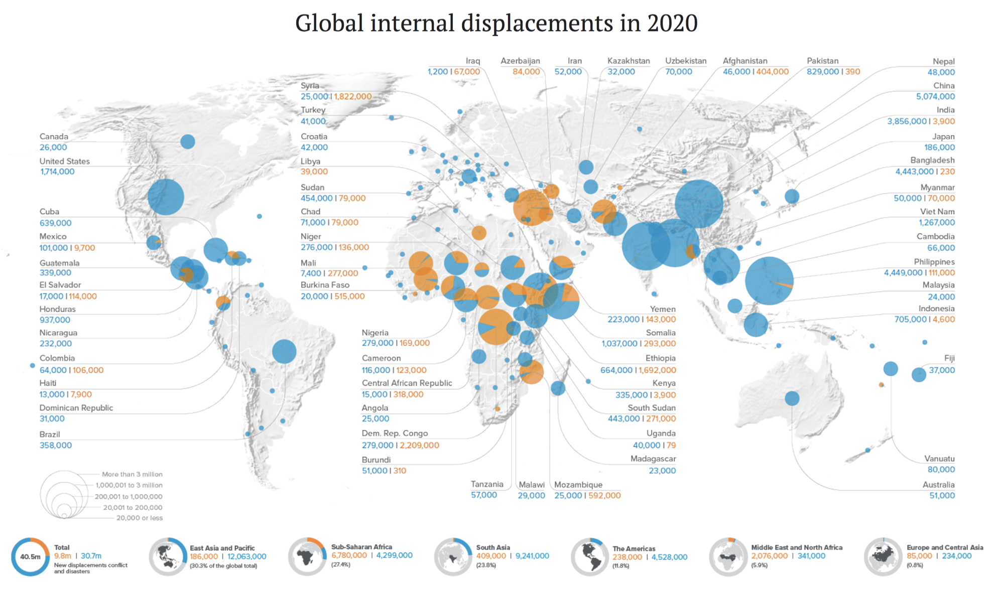
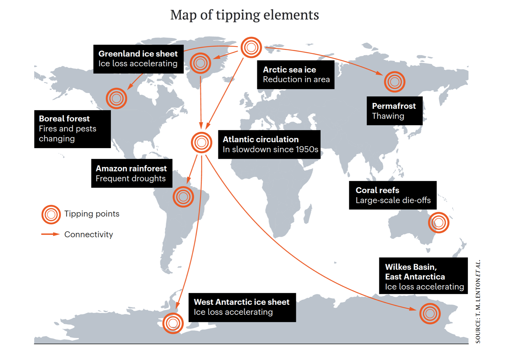

 

 

  

 
Climate change always felt like a distant, almost surreal threat to me. I learned about it in high school over ten years ago and thought: "This sounds pretty bad ... But surely the people in power — the adults in the room — will manage to fix this and we can all just move on." And so I grumbled on in the comfort and ignorance of my own life, focusing on individual consumption behaviour (no meat! no dairy! fewer flights!) as my way to contribute to the cause. As if isolated individual actions and hoping for the best would cut it.
 
What rattled me out of the comfort of my life was the COVID-19 pandemic. I realized that *stability is not a given* — things can change dramatically, quickly, and for the worse. I also realized that we cannot rely on the people in power to fix things. These realizations caused me to take another, more in-depth look at climate change. I started to read the scientific literature, attended talks and lectures, took courses on the topic, immersed myself in [books, podcasts, and documentaries](https://fabiandablander.com/menu/climate.html), invited climate scientists to speak at a [colloquium I co-organized](https://fabiandablander.com/Simulation-based-Science.html), and attended a conference on tipping points in the summer when Covid cases were low. You could safely say that I became obsessed with the topic.
 
Slowly, over weeks and months, I began to appreciate the gravity of the situation; it is, by all accounts, an emergency. Once you see it, you cannot *unsee* it anymore. But you have to force yourself to see it first. You have to pause and not — as I did for too many years — simply move on with your life. It is difficult. Engaging with this topic makes you feel sad, disappointed, angry, scared. Sometimes you feel hopeless. Sometimes you cry.
 
But the truth of the matter is that there is a lot of hope. We are beginning to see the emergency of a truly global, massive climate movement, something it is exciting to be a part of — and something that is direly needed. The [system transformations](https://www.wri.org/research/state-climate-action-2021) required to address the climate emergency are enormous, yet governments are either [moving too slowly or in the wrong direction](https://climateactiontracker.org/countries/). To exert the necessary pressure to effect change, climate action has to move from something that a few others do to something that [we all engage in](https://twitter.com/climatehuman/status/1315065413500166144). Each and every one of us has a role to play. It may sound grandiose, but this really is humanity’s decisive moment.
 
When I started to speak to friends, family, and colleagues about the climate emergency, I noticed three things. First, there is a general lack of awareness of how dire the situation is, and how bad it could still get if we continue on our current path. Second, there are misunderstandings about the key drivers underlying climate change and what obstructs progress. Third, there is a sense that we as individuals and collectively cannot do much about it, or that we should leave it to others.
 
In the next three blog posts, I will try to address some of these points, expanding on [a recent workshop](https://twitter.com/fdabl/status/1465313483759796231) I gave. In this first post, I discuss the climate impacts that are already here, and how they would worsen under our current, business as usual trajectory. In a second post, I discuss how we got to where we are today and what obstructs progress. In the final post, I discuss what we as individuals and groups can do to prevent worsening climate breakdown and create a better future. This first post is the most difficult post to read out of the three. You might feel bad reading it — I certainly felt bad writing it. If you can make it through this one, the other two are a walk in the park.[^0]
 
Lastly, a disclaimer: While I have discussed the facts and figures in these posts with climate scientists, all errors are mine. I am, as should be obvious, not speaking from a position of authority. Instead, I am speaking as a concerned citizen and a fellow traveller. Together, we can do this.
 
Let's get on with it.
 
---
 
 
# Business as usual
I was spending part of the pandemic lockdown isolated with my girlfriend when I stumbled upon a book whose beginning shook me to the core. The book was *The Future We Choose: Surviving the Climate Crisis* by Christiana Figueres and Tom Rivett-Carnac, key architects of the Paris agreement. Here is an excerpt from its opening chapter describing a world in 2050 that is on a trajectory towards a 3°C temperature increase in 2100:
 
<blockquote>

"The first thing that hits you is the thick air. In many places around the world, the air is hot, heavy, and depending on the day, clogged with <b>particulate pollution</b>. Your eyes often water. Your cough never seems to disappear."
 
<!-- The increasing heat of the Earth is suffocating us, and in five to ten years, vast swaths of the planet will be increasingly inhospitable to humans. We don't know how habitable the regions of Australia, North Africa, and the western United States will be by 2100. No one knows what the future holds for their children and grand children: tipping point after tipping point is being reached, casting doubt on the form of future civilization. [...] -->

 

"<b>Extreme heat</b> is on the rise. If you live in Paris, you endure summer temperatures that regularly rise to 44 degrees Celsius. Everyone stays inside, drinks water, and dreams of air-conditioning. You lie on your couch, a cold, wet towel over your face, and try to rest without dwelling on the poor farmers on the outskirts of town who, despite recurrent droughts and wildfires, are still trying to grow grapes, olives, or soy – luxuries for the rich, not for you."

 

"More moisture in the air and higher sea surface temperatures have caused a surge in extreme <b>hurricanes and tropical storms</b>. Recently, coastal cities in Bangladesh, Mexico, the United States, and elsewhere have suffered brutal infrastructure destruction and <b>extreme flooding</b>, killing many thousands and displacing millions. This happens with increasing frequency now. Every day, because of <b>rising sea levels</b>, some part of the world must evacuate to higher ground."
<!-- Every day the news shows images of mothers with babies strapped to their backs, wading through floodwaters, and homes ripped apart by vicious currents that resemble mountain rivers." -->

 

"<b>Food production swings wildly</b> from month to month, season to season, depending on where you live. More people are starving than ever before. [...] Disasters and wars rage, choking off trade routes. The tyranny of supply and demand is now unforgiving; because of its increasing scarcity, food can now be wildly expensive."

 

"Places such as central India are becoming increasingly challenging to inhabit. [...] <b>Mass migrations</b> to less hot rural areas are beset by a host of refugee problems, civil unrest, and bloodshed over water availability. [...] Even in some parts of the United States, there are fiery <b>conflicts over water</b>, battles between the rich who are willing to pay for as much water as they want and everyone else demanding equal access to the life-enabling resource."

 

"The demise of the human species is being discussed more and more. For many, the only uncertainty is how long we'll last, how many more generations will see the light of the day. Suicides are the most obvious manifestation of the prevailing despair, but there are other indications: a sense of bottomless loss, unbearable guilt, and fierce resentment at previous generations who didn't do what was necessary to ward off this unstoppable calamity."

</blockquote>
 
This description might sound like hyperbole, using colourful language to evoke fear of what surely is an exceedingly unlikely dystopia. Digging into the details, I realized that it may not be. The latest projections suggest that continuing on our trajectory — business as usual — would lead to about [2.7°C of warming by 2100](https://climateactiontracker.org/publications/glasgows-2030-credibility-gap-net-zeros-lip-service-to-climate-action/), with estimates ranging from 2°C to 3.6°C. This is a similar temperature increase as in the dystopia painted by Figueres and Rivett-Carnac. The key question, then, is about what climate impacts such a temperature increase would cause.
 
# Climate impacts
Understanding the climate impacts happening already today and that our current emissions trajectory would further intensify is the core goal of this blog post.[^1] After discussing those, we will reflect on the fact that scientific models, while extremely powerful, are still only simplifications of the marvellous complexity of the real world — nasty surprises cannot be ruled out. And yet, fortunately, everything is still in our hands: the greatest uncertainty concerning climate impacts are our future emissions, which are entirely up to us. Dystopia is not a given. This is humanity's decisive decade.
 
## Dirty air
"A single death is a tragedy", so the saying — widely attributed to Stalin — goes, while "a million deaths is a mere statistic." But sometimes a statistic can still pull the rug out from under your feet. So it is with **air pollution**, which is estimated to kill [between *seven*](https://ourworldindata.org/data-review-air-pollution-deaths) *and* [*ten million people*](https://lrb.co.uk/the-paper/v43/n23/david-wallace-wells/ten-million-a-year) every year *already today* --- with [heartbreaking stories](https://www.nytimes.com/interactive/2020/12/17/world/asia/india-pollution-inequality.html) from across the world --- slashing average global life expectancy by [more than two full years](https://www.theguardian.com/environment/2021/sep/01/air-pollution-is-slashing-years-off-the-lives-of-billions-report-finds). Outdoor air pollution from the burning of fossil fuels is the main culprit. While [estimates vary](https://ourworldindata.org/data-review-air-pollution-deaths), the latest study puts the annual death toll from the pollution due to fossil fuels at [8.7 million](https://ourworldindata.org/data-review-air-pollution-deaths) globally — a death toll larger than that of smoking and malaria [*combined*](https://www.theguardian.com/environment/2021/feb/09/fossil-fuels-pollution-deaths-research). Air pollution is also associated with a [myriad of negative outcomes](https://twitter.com/dwallacewells/status/1463517703226937348) short of death, such as heart disease, cancer, asthma, and reduced cognitive performance. Regional impacts [vary greatly](https://aqli.epic.uchicago.edu/the-index/), with Africa and South and East Asia taking the biggest hit.
 

  
  <figcaption><b>Figure 1</b>. Air pollution across the globe using data from <a href="https://www.iqair.com/air-quality-map" target="_blank">IQi<i>Air</i></a>. For an explanation of their air quality index, see <a href="https://www.iqair.com/us/blog/air-quality/what-is-aqi" target="_blank">here</a>.</figcaption>

 
The annual death toll due to air pollution is simply staggering. The latest estimates surpass the official death toll of COVID-19 so far, and are about half of all deaths that occurred in World War I.  But while Figueres and Rivett-Carnac paint a picture of increasingly dirty air under business as usual, I am more confident that we will be able to reign in air pollution; just look at the recent [progress in China](https://earth.org/how-china-is-winning-its-battle-against-air-pollution/).
 
Yet herein lies a cruel conundrum: aerosols from anthropogenic sources cool the Earth by about 0.50°C, as the latest assessment report (AR6) on the physical science basis from the IPCC [notes](https://www.carbonbrief.org/in-depth-qa-the-ipccs-sixth-assessment-report-on-climate-science#pollution). The major sources are sulphur dioxide, which has a cooling effect, and black carbon, which has a warming effect — both arise from the burning of fossil fuels. If we improve air quality and save millions of lives, the warming that aerosols mask will be set free. This warming can be counteracted by reductions in greenhouse gases such as ozone and methane, but only partly so. Combining changes in short-lived pollutants such as aerosols, ozone, and methane, the latest IPCC report finds that these changes [could increase warming](https://www.carbonbrief.org/in-depth-qa-the-ipccs-sixth-assessment-report-on-climate-science#pollution) between 0.06°C and 0.35°C by 2040, depending on the scenario. The rate of warming in the next decades may thus [increase sharply](https://insideclimatenews.org/news/15092021/global-warming-james-hansen-aerosols/). This could intensify and hasten the climate impacts we turn to now.
 
 
## Feeling the heat
People used to look forward to summer. That [may be changing](https://www.theguardian.com/uk-news/2021/jul/24/as-the-climate-crisis-deepens-the-uks-attitude-to-summer-begins-to-shift). With wildfires raging from [California](https://www.bbc.com/news/world-us-canada-58141340) to [Europe](https://ec.europa.eu/commission/presscorner/detail/en/ip_21_5627), [Siberia](https://www.theguardian.com/world/2021/sep/22/russia-forest-fire-damage-worst-since-records-began-says-greenpeace), and down to [Australia](https://www.nbcnews.com/news/world/australian-wildfires-declared-among-worst-wildlife-disasters-modern-history-n1235071), the sky [eerily red and full of pollution](https://www.newscientist.com/article/mg24733013-300-wildfire-nightmare-captured-in-harrowing-image-of-california-burning/), attitudes may well shift. Baking in **extreme heat** in [Sicily](https://www.newscientist.com/article/2286967-sicily-hits-48-8c-the-highest-temperature-ever-recorded-in-europe/) or [Spain](https://www.thelocal.es/20210815/spain-sizzles-in-record-heat-as-fires-blaze/) is not what anybody is eager to sign up for — or indeed can cope with without air conditioning.
 
Global mean surface temperature [has increased by about 1.09°C](https://www.carbonbrief.org/in-depth-qa-the-ipccs-sixth-assessment-report-on-climate-science#temperature) between the pre-industrial baseline period 1850-1900 and the decade of 2011-2020. However, temperatures have increased much more over land (by about 1.59°C) than over the oceans (by about 0.88°C). But these are averages, with different regions of the Earth [warming at different rates](https://interactive-atlas.ipcc.ch/regional-information#eyJ0eXBlIjoiQVRMQVMiLCJjb21tb25zIjp7ImxhdCI6MjQ0NjQ1LCJsbmciOjE5NTcxMDAsInpvb20iOjMsInByb2oiOiJFUFNHOjU0MDMwIiwibW9kZSI6ImNvbXBsZXRlX2F0bGFzIn0sInByaW1hcnkiOnsic2NlbmFyaW8iOiJzc3AyNDUiLCJwZXJpb2QiOiIyIiwic2Vhc29uIjoieWVhciIsImRhdGFzZXQiOiJDTUlQNiIsInZhcmlhYmxlIjoidGFzIiwidmFsdWVUeXBlIjoiQU5PTUFMWSIsImhhdGNoaW5nIjoiU0lNUExFIiwicmVnaW9uU2V0Ijoibm9uZSIsImJhc2VsaW5lIjoicHJlSW5kdXN0cmlhbCIsInJlZ2lvbnNTZWxlY3RlZCI6W119LCJwbG90Ijp7ImFjdGl2ZVRhYiI6InBsdW1lIiwibWFzayI6Im5vbmUiLCJzY2F0dGVyWU1hZyI6bnVsbCwic2NhdHRlcllWYXIiOm51bGwsInNob3dpbmciOmZhbHNlfX0=). The Arctic is warming the fastest, about two to [three times the global average](https://phys.org/news/2021-05-arctic-faster-planet.html), with dramatic effects on the [indigenous populations living there](https://earth.org/effects-of-arctic-warming-on-indigenous-communities/) and the [global climate system](https://www.carbonbrief.org/qa-how-is-arctic-warming-linked-to-polar-vortext-other-extreme-weather) more broadly.
 
 

  
  <figcaption><b>Figure 2</b>. Projected warming across the globe at a 2°C average increase over pre-industrial levels. From the IPCC's <a href="https://interactive-atlas.ipcc.ch/regional-information#eyJ0eXBlIjoiQVRMQVMiLCJjb21tb25zIjp7ImxhdCI6MjQ0NjQ1LCJsbmciOjE5NTcxMDAsInpvb20iOjMsInByb2oiOiJFUFNHOjU0MDMwIiwibW9kZSI6ImNvbXBsZXRlX2F0bGFzIn0sInByaW1hcnkiOnsic2NlbmFyaW8iOiJzc3AyNDUiLCJwZXJpb2QiOiIyIiwic2Vhc29uIjoieWVhciIsImRhdGFzZXQiOiJDTUlQNiIsInZhcmlhYmxlIjoidGFzIiwidmFsdWVUeXBlIjoiQU5PTUFMWSIsImhhdGNoaW5nIjoiU0lNUExFIiwicmVnaW9uU2V0Ijoibm9uZSIsImJhc2VsaW5lIjoicHJlSW5kdXN0cmlhbCIsInJlZ2lvbnNTZWxlY3RlZCI6W119LCJwbG90Ijp7ImFjdGl2ZVRhYiI6InBsdW1lIiwibWFzayI6Im5vbmUiLCJzY2F0dGVyWU1hZyI6bnVsbCwic2NhdHRlcllWYXIiOm51bGwsInNob3dpbmciOmZhbHNlfX0=" target="_blank">Interactive Atlas</a>.</figcaption>

 
Extreme heat, combined with dangerous humidity that can impair the cooling effect of sweating and [kill you](https://www.technologyreview.com/2021/07/10/1028172/climate-change-human-body-extreme-heat-survival/), has [more than doubled](https://www.theguardian.com/environment/2020/may/08/climate-change-global-heating-extreme-heat-humidity) since the 1970s. If we do not curb emissions, vast swaths of the tropics --- projected to be home to 50% of the global population by 2050 --- may have [regularly life-threatening wet-bulb temperatures](https://www.theguardian.com/science/2021/mar/08/global-heating-tropical-regions-human-livability). Indeed, a [recent analysis found](https://www.metoffice.gov.uk/about-us/press-office/news/weather-and-climate/2021/2c-rise-to-put-one-in-eight-of-global-population-at-heat-stress-risk) that at just 2°C of global warming, one billion people could experience wet-bulb temperatures exceeding workability thresholds. Barring strong adaptation efforts, huge areas of the globe may become uninhabitable.
 
 
Heatwaves have increased in [frequency and duration](https://phys.org/news/2020-07-heatwave-trends-worldwide.html). More than [a third of heat deaths](https://www.nature.com/articles/d41586-021-01475-0) are already attributable to climate change, with increases in mortality on every continent. Just last summer, [another heatwave](https://www.dailysabah.com/life/environment/record-breaking-heat-waves-7-deadly-european-summers) scorched [parts of Europe](https://www.politico.eu/article/europe-fries-in-a-heat-wave-made-more-intense-by-climate-change/), after the Pacific Northwest burned in a [freakish heat dome](https://www.theguardian.com/environment/2021/jul/02/canadian-inferno-northern-heat-exceeds-worst-case-climate-models) that shattered temperature records by up to *nine degrees Celsius*. Such record-shattering heat extremes are [becoming increasingly likely](https://www.theguardian.com/environment/2021/jul/26/record-shattering-heat-becoming-much-more-likely-says-climate-study) as temperatures rise further.
 
Using climate projections with the [SSP2-4.5](https://www.carbonbrief.org/explainer-how-shared-socioeconomic-pathways-explore-future-climate-change) pathway[^2], which best resembles our current trajectory and would lead to about 2.7°C of warming by 2100, [a recent report](https://www.chathamhouse.org/2021/09/climate-change-risk-assessment-2021)[^3] finds that half the global population will experience annual major heatwaves --- defined as regional temperatures in the 99th percentile for at least four consecutive days --- by 2050, with no region being spared. 44°C in Paris by 2050, as Figueres and Rivett-Carnac envision? No problem.
 
 
## Storms and rising seas
Few extreme weather events embody the wrath of nature more powerfully than hurricanes. With 2021 being the [third most active](https://www.bbc.co.uk/news/science-environment-59489559) hurricane season to date — right behind 2020 and 2015 — frequent reminders of nature's power abound. Indeed, **hurricanes and tropical storms** are becoming [more intense](https://www.nytimes.com/2020/05/18/climate/climate-changes-hurricane-intensity.html) and [decay more slowly](https://www.nature.com/articles/d41586-020-03118-2) as temperature increase. Similarly, **extreme flooding** is also becoming more frequent. Warm air [can hold more moisture](https://www.carbonbrief.org/explainer-what-climate-models-tell-us-about-future-rainfall) --- 7% more for every 1°C temperature rise --- discharging it abruptly. Indeed, rainfall extremes have increased, with [about a quarter](https://www.nature.com/articles/s41612-021-00202-w) of the most severe rainfall events in the last decade being attributable to climate change. [Rich countries](https://en.wikipedia.org/wiki/2021_European_floods) cannot think themselves in safety, with the intensity and scale of the 2021 flooding in Germany [shocking climate scientists](https://www.theguardian.com/environment/2021/jul/16/climate-scientists-shocked-by-scale-of-floods-in-germany). 
 
 
While tropical storms and extreme flooding focus minds on local destruction, it is **rising sea levels** that most vividly capture the planetary scale transformation a warming planet brings. The IPCC Special Report on the Ocean and Cryosphere notes that about [680 million people](https://www.ipcc.ch/srocc/chapter/summary-for-policymakers/) reside in low-lying coastal areas today, defined as being less than ten metres below sea level, a number that is projected to increase to over one billion by 2050. This exposes them directly to rising sea levels and coastal flooding. Since the 1900s, the [sea has risen by about 0.20 metres](https://www.ipcc.ch/report/ar6/wg1/#SPM), mostly due to [thermal expansion](https://www.carbonbrief.org/explainer-how-climate-change-is-accelerating-sea-level-rise), but with ice sheet and glacier mass loss being the dominant contributor since 2006.
 
Under our current emissions trajectory, sea levels are projected to rise [between 0.66 and 1.33 metres](https://www.ipcc.ch/report/ar6/wg1/downloads/report/IPCC_AR6_WGI_SPM_final.pdf) by 2100. The melting of the ice sheets is a very slow process, however, with most of the sea level rise occurring after 2100. The [current best estimate](https://www.essoar.org/doi/10.1002/essoar.10509769.1) for the tipping point of the Greenland ice sheet — containing ice equivalent to 7.2 metres of sea level rise — is 1.5°C, with an uncertainty band from 0.80°C to 3°C. The West Antarctic Ice Sheet — containing ice equivalent to about 3.3 metres of sea level rise — could cross an irreversible tipping point between [1.5°C and 2°C of warming](https://www.carbonbrief.org/guest-post-how-close-is-the-west-antarctic-ice-sheet-to-a-tipping-point). With 3°C of warming, then, the total melting of these two ice sheets is virtually certain, causing sea levels to eventually rise more than 10 metres, engulfing virtually all coastal regions and [many major cities](https://picturing.climatecentral.org/).
 
 

  
  <figcaption><b>Figure 3</b>. Latest sea level rise projections find much of Vietnam under water at high tide by 2050. From <a href="https://www.nytimes.com/interactive/2019/10/29/climate/coastal-cities-underwater.html" target="_blank">this article</a> in <i>The New York Times</i>.</figcaption>

 
While the total melting of the Greenland ice sheet could take [at least a millennium](https://www.science.org/doi/10.1126/sciadv.aav9396), regions situated in the Middle East and Asia such as [Vietnam](https://www.ft.com/content/5804b93f-8b80-40c4-9b30-3d8b9bf8da3d), Egypt, and Mumbai — [comprising about 150 million people](https://www.nytimes.com/interactive/2019/10/29/climate/coastal-cities-underwater.html) — are severely vulnerable to sea level rise already by 2050. With two key glaciers in the Antarctic — the [Thwaites Glacier](https://www.science.org/content/article/ice-shelf-holding-back-keystone-antarctic-glacier-within-years-failure) and the [Pine Island Glacier](https://www.science.org/doi/10.1126/sciadv.abg3080) — becoming destabilized more quickly than previously thought, sea level rise may further accelerate. Indeed, [recent research suggests](https://www.nature.com/articles/s41586-021-03427-0) that our current pathway could speed up sea level rise by an order of magnitude by 2060.
 
 
## Food and drink
<!-- https://www.nature.com/articles/s41558-019-0600-z -->
<!-- Food prices going up: https://www.ft.com/content/fd57ad0b-b98a-4e34-b6b7-f9bbae2ce12e -->
<!-- Food prices highest in 2021 since 2011: https://www.agriculture.com/news/business/stability-uncertain-after-global-food-prices-surge-28-in-2021 -->
 
If you are anything like me, then you probably know shockingly little about how our food gets produced. I once grew tomatoes, which was fun. For all other things, I visit my local supermarket. People like me are usually alienated from the land — even though we collectively use about [half of it](https://ourworldindata.org/land-use#breakdown-of-global-land-use-today) for agriculture. While [all countries](https://ourworldindata.org/land-use#how-much-land-do-countries-use-for-agriculture) engage in agriculture, there are a number of [major breadbaskets](https://iopscience.iop.org/article/10.1088/1748-9326/ac22c1) for the four major crops: maize (corn) is chiefly produced in the US (34%), China (23%), and Europe (10%); rice in China (28%), India (21%), and Indonesia (10%); soybeans in the US (34%), Brazil (30%), and Argentina (17%); and wheat in Europe (24%), China (13%), and India (13%).
 
For the first time in history, our own actions threaten our life support systems, **food production in particular**. Our current food system is [already broken](https://www.fao.org/state-of-food-security-nutrition/en/), with around 800 million experiencing chronic hunger, 3 billion unable to afford a healthy diet, 2 billion being overweight, [a third of all food being wasted](https://www.unep.org/thinkeatsave/get-informed/worldwide-food-waste), and nearly all farm subsidies --- 90% out of 540 billion yearly --- [causing harm](https://www.theguardian.com/environment/2021/sep/14/global-farm-subsidies-damage-people-planet-un-climate-crisis-nature-inequality). Our food system is still able to sustain us. It might cease to in the future.
 
 
You might come across the occasional scattered report about droughts impacting agriculture in your favourite newspaper. It is difficult to connect the dots when only passively consuming the news. But once you start looking for it, within minutes you find that [agricultural droughts](https://www.carbonbrief.org/guest-post-climate-change-is-already-making-droughts-worse) (that is, crop yield reductions or failures due to soil moisture deficits) are already experienced literally [all over the world](https://twitter.com/JimBair62221006/status/1433829191405826052) --- from the [United States](https://abcnews.go.com/Technology/wireStory/severe-drought-devastates-washington-states-wheat-crop-79406669), [Canada](https://nationalpost.com/news/canada/worst-year-ive-ever-witnessed-drought-withers-western-canadas-spring-wheat), and [Mexico](https://www.aljazeera.com/news/2021/7/2/mexico-water-supply-buckles-on-worsening-drought-crops-at-risk) to [Chile](https://www.scmp.com/news/world/americas/article/3144665/record-breaking-drought-chile-offers-bountiful-proof-climate), [Brazil](https://www.nytimes.com/2021/06/19/world/americas/brazil-drought.html), and [Argentina](https://www.as-coa.org/articles/record-droughts-plague-latin-america); from [Madagascar](https://www.theguardian.com/global-development/2021/may/10/at-least-1m-people-facing-starvation-madagascar-drought-worsens), [Kenya](https://www.theguardian.com/global-development/2021/sep/15/drought-puts-21-million-kenyans-at-risk-of-starvation), and [Angola](https://www.amnesty.org/en/latest/press-release/2021/07/angola-millions-facing-hunger-as-thousands-flee-their-homes-as-drought-ravages-the-south-of-angola/) to [Afghanistan](https://www.theguardian.com/global-development/2021/sep/21/drought-war-livelihoods-afghan-farmers-risk-taliban-security-forces-kandahar), [Iran](https://www.reuters.com/article/iran-grains-import/iran-buying-record-volume-of-wheat-after-worst-drought-in-50-years-sources-idUSKBN2H3152), and [Jordan](https://www.aljazeera.com/gallery/2021/5/6/drought-hit-jordan-critical-as-water-sources-dry-up); from [Europe](https://www.theguardian.com/environment/2021/mar/15/climate-crisis-recent-european-droughts-worst-in-2000-years) to [China](https://www.sixthtone.com/news/1006812/the-weather-has-changed-historic-drought-hits-coastal-china) and all the way down to [Australia](https://time.com/longform/australia-drought-photos/). Climate impacts on agriculture are here. But they could become much worse.
 
<!-- https://www.fao.org/worldfoodsituation/foodpricesindex/en/ -->
<!-- https://theconversation.com/flash-droughts-can-dry-out-soil-in-weeks-new-research-shows-what-they-look-like-in-australia-161286 -->
 
Using the SSP2-4.5 pathway, which would lead to about 2.7°C of warming by 2100, [a recent report](https://www.chathamhouse.org/2021/09/climate-change-risk-assessment-2021) finds that, assuming that the global cropland remains constant at 14.7 million km$^2$, 40% of this area will be exposed to severe drought for three months or more each year by 2050. This is compared to just 9% between 1981 and 2010. Europe, which has the second-largest cropland area --- 20% of the global total --- would experience such severe droughts in nearly half the cropland area. Southern Europe will be hit harder than the North, likely further [driving a wedge](https://www.politico.eu/article/how-climate-change-will-widen-european-divide-road-to-cop26/) within the European Union. Africa and North America, which represent 14% and 15% of the global cropland, are projected to suffer severe drought on 44% and 38% of the cropland, respectively.
 

  
  <figcaption><b>Figure 4</b>. Proportion of cropland projected to be exposed to severe drought every year by 2050. Adapted from <a href="https://www.chathamhouse.org/2021/09/climate-change-risk-assessment-2021" target="_blank">here</a>.</figcaption>

 
There are important benefits for plants in a warming world, however. An increase in CO$_2$ in the atmosphere can markedly increase global photosynthesis, and has done so by [about 12% between 1981 and 2020](https://www.nature.com/articles/s41586-021-04096-9). This effect known as *CO$_2$ fertilization*. Increased CO$_2$ levels are [known to increase the yields of C$_3$ crops](https://www.nature.com/articles/s43016-020-00195-4#Sec3), which include wheat and rice, if ample nutrients and water are available. They do not significantly increase the yields of C$_4$ crops, however, which include maize. The [difference between](https://www.khanacademy.org/science/biology/photosynthesis-in-plants/photorespiration--c3-c4-cam-plants/a/c3-c4-and-cam-plants-agriculture) these two types of crops is that C$_4$ crops have evolved a mechanism to minimize [photorespiration](https://en.wikipedia.org/wiki/Photorespiration), and can thus survive well in hot, sunny environments. CO$_2$ fertilization can further [decrease crop evotranspiration](https://onlinelibrary.wiley.com/doi/abs/10.1002/047147844X.aw57), the process in which water moves from the soil into the atmosphere. This improves the water-use efficiency for crops, which makes them [more resistant to drought](https://www.nature.com/articles/s43016-020-00195-4#Sec3).
 
A [major recent study](https://www.nature.com/articles/s43016-021-00400-y), using the latest generation of crop and climate models, projects that the average crop productivity — a measure of crop yield — by the end of the century could decline strongly for maize (ranging from -6.4% to -24.1%); increase markedly for wheat (+8.8% to +17.5%); stay roughly the same for soybeans (+2% to -2.1%); and increase slightly for rice (+3.4% to +1.7%). These ranges indicate a best-case and a worst-case climate mitigation scenario, respectively. The authors further note that climate impacts are projected to arrive earlier than in the previous generation of models.
 
These averages hide [important regional differences](https://twitter.com/JonasJaegermeyr/status/1458901406761562114), however. Tropical and subtropical regions, where increasing temperatures have the largest impacts, will see large declines in maize. In contrast, in higher latitudes where wheat is generally grown, warming will increase gains. We will explore this familiar injustice — countries least responsible for climate change will suffer the harshest consequences — in the second part of this series in more depth. For now, note that this shift of agricultural zones has the potential to cause severe disruptions of the food system and requires strong adaptation efforts.
 
Importantly, these insights and estimates are derived from models that by their very nature abstract away complexity and do not include all relevant factors; they may thus give us an overly optimistic picture of what lies ahead. The Herculean effort mentioned above, for instance, does not incorporate [insect pests](https://www.carbonbrief.org/qa-are-the-2019-20-locust-swarms-linked-to-climate-change), which could [depress global yield substantially](https://www.carbonbrief.org/rise-in-insect-pests-under-climate-change-to-hit-crop-yields-study-says), although the details about the response of [individual species are complex](https://esajournals.onlinelibrary.wiley.com/doi/full/10.1002/fee.2160). Similarly, the study does not incorporate the fact that increased CO$_2$ levels can [significantly decrease](https://www.nature.com/articles/s43016-020-00195-4#Sec4) the nutritional value of crops, nor does it model water scarcity.
 
<!-- WATER SCARCITY https://www.unwater.org/water-facts/scarcity/ -->
<!-- WATER STRESS https://www.weforum.org/agenda/2020/06/world-population-water-stress-2050-climate-change/ -->
 
Major breadbaskets are projected to experience water scarcity, which could impede irrigation. Under such circumstances, [a recent study](https://iopscience.iop.org/article/10.1088/1748-9326/ac22c1) finds that the probability of annual global crop failures, defined as a 10% decline in yield, will nearly triple for maize (reaching 30%) and about double for wheat and soybean (reaching 20%) already by 2030. Such declines would cause significant spikes in food prices in rich countries — leading to social unrest — and mass starvation and famine in poorer countries. Overall, the climate impacts on agriculture are very concerning, especially given the fact that we will need to produce about [50% more food](https://www.wri.org/insights/how-sustainably-feed-10-billion-people-2050-21-charts) to feed an [additional two billion mouths](https://www.un.org/development/desa/en/news/population/world-population-prospects-2019.html) by 2050.
 
 
Water is key not only for plant, but also for human life. Climate change will exacerbate [hydrological droughts](https://www.carbonbrief.org/guest-post-climate-change-is-already-making-droughts-worse) (that is, water shortages in streams or storages such as lakes), leading to **decreased water availability**. On the SSP2-4.5 pathway, the global population experiencing a hydrological drought of at least six months would be [nearly double](https://www.chathamhouse.org/2021/09/climate-change-risk-assessment-2021) the historical average by 2040, reaching almost 700 million souls.
 
The severity of these droughts would be at least as bad as the 1934 wave of the Dust Bowl drought in the US, known as the ["drought of record"](https://drought.unl.edu/dustbowl/Home.aspx). No region will be spared, but East and South Asia, with 125 and 105 million people being impacted, respectively, and Africa, with 152 million people being impacted, will see the most severe consequences by 2040. Europe will see the [greatest increase](https://www.chathamhouse.org/2021/09/climate-change-risk-assessment-2021) in droughts in percentage terms (120%) compared to a scenario with no additional climate change.
 
## Internal displacement and migration
I have had the enormous privilege to live in a number of wonderful European cities. After a period in which I completed part of my studies, I moved from one city to the next, full of melancholy about leaving but also excited to explore new opportunities. I always moved by choice. Millions of people do not; it is difficult to truly grasp their pain and trauma.
 
The United Nations Refugee Agency [notes that](https://www.unhcr.org/mid-year-trends), by the end of June 2021, the number of people displaced in their own country has risen to nearly 50.9 million people. The majority of internal displacement is already caused by weather-related disasters, amounting to about [30 million people](https://www.internal-displacement.org/global-report/grid2021/) in 2020. China (5.1 million), The Philippines (4.4m), Bangladesh (4.4m), India (3.9m), and the United States (1.7m) were hit the hardest. While many weather-related internal displacements are temporary, by the end of 2020 [at least 7 million](https://www.internal-displacement.org/global-report/grid2021/) people globally were persistently uprooted. It is of course difficult to attribute any single extreme weather event to climate change, but we have seen above how climate change has played already an important role in increasing the frequency and intensity of such events. And it is getting worse.
 

  
  <figcaption><b>Figure 5</b>. Global internal displacements in 2020 due to conflict (orange) and weather-related disasters (blue). From <a href="https://www.internal-displacement.org/global-report/grid2021/" target="_blank">here</a>.</figcaption>

 
The situation can also become so dire that people are forced to leave their home country, becoming refugees. The United Nations Refugee Agency [estimated](https://www.unhcr.org/mid-year-trends) that the number of global refugees has surpassed 20.8 million by mid-2021, with the majority coming from Syria (6.8 million), Venezuela (4.1m), Afghanistan (2.6m), South Sudan (2.3m), and Myanmar (1.1m). Migration never has a single cause, arising instead from an interconnected web of social, economic, political, and climatic factors. Under our current business as usual trajectory, however, migration could become much, much worse.
 
As we have seen above, increasingly uninhabitable zones --- be it due to extreme heat, sea level rise, famine, or lack of water --- will inevitably **force people to move**. While quantifying environmental migration [is challenging](https://www.migrationdataportal.org/themes/environmental_migration_and_statistics), some work exists that hints at the scale of the [climate migration](https://www.nytimes.com/interactive/2020/07/23/magazine/climate-migration.html) that lies ahead. For one, humans have evolved in a surprisingly small [climate niche](https://www.pnas.org/content/117/21/11350), with mean annual temperatures of around 13°C. A nightmarish emission scenario would result in up to *3.5 billion people* living outside this climate niche by 2100. This emissions scenario, which would lead to nearly 5°C of warming by 2100, is [fortunately unlikely](https://www.nature.com/articles/d41586-020-00177-3). Yet even limiting warming to 2°C would push 1.5 billion people — nearly 20% of humanity — outside the climate niche. This does not, of course, directly translate to migration, which, among other things, depends crucially on adaptation options. But these results indicate the scale of the historic transformation that is underway.
 
In a [recent report](https://www.worldbank.org/en/news/feature/2021/09/13/millions-on-the-move-in-their-own-countries-the-human-face-of-climate-change), the World Bank estimates that up to 212 million people could be displaced within their countries by 2050. Another [recent report](https://www.theguardian.com/environment/2020/sep/09/climate-crisis-could-displace-12bn-people-by-2050-report-warns) puts the number of people that could be displaced by 2050 at 1.2 billion.
 
Whatever the actual numbers, recall the Syrian civil war, to which a drought amplified by climate change [contributed](https://www.pnas.org/content/112/11/3241) and which lead to about [6.8 million Syrians](https://www.worldvision.org/refugees-news-stories/syrian-refugee-crisis-facts) leaving their home country. The conflict led to a wave of migrants which led to a steep rise in right-wing politics and parties in Europe. Imagine increasing this number by a one or even *two orders of magnitude*. Our already weakened political system would not stand this pressure. Ecofascism, [already on the rise](https://www.theguardian.com/environment/2021/nov/21/climate-denial-far-right-immigration), might become the dominant sentiment. Social cohesion might erode.
 
 
While being a major threat itself, climate change is also a *threat multiplier*. Whatever problem arises, climate change will likely exacerbate it. This is how the Pentagon, which has an [enormous carbon footprint](https://theconversation.com/us-military-is-a-bigger-polluter-than-as-many-as-140-countries-shrinking-this-war-machine-is-a-must-119269) and which is busy making preparations, [views](https://podcasts.apple.com/hu/podcast/michael-klare-on-the-pentagons-view-of-climate/id1170991978?i=1000530555741) [the issue](https://www.rollingstone.com/politics/politics-features/how-the-pentagon-thinks-about-the-climate-crisis-887832/). A warmer climate or increased precipitation is [linked to increasing conflict](https://www.science.org/doi/10.1126/science.1235367). Conflict is also enhanced by climate-related disasters, especially in [ethnically fractured countries](https://www.pnas.org/content/113/33/9216.short). Naturally, **conflicts over resources** [become more likely](https://www.cnbc.com/2021/10/08/defense-department-warns-climate-change-will-increase-conflicts.html) as food and water insecurity increase. Tensions between nuclear armed states, such as Pakistan and India, both strongly exposed to climate impacts, might escalate as the situation worsens.
 
 
In summary, continuing on our current trajectory would lead to extreme heat and heatwaves of increased duration and frequency that would impact billions of people; more hurricanes, tropical storms, and extreme flooding; increased sea level rise that would uproot hundreds of millions of people; increased agricultural and hydrological droughts leading to crop failures, famine, and water stress; mass migration and conflict over resources. It is with this bleak vision of our future, one that we are currently hurdling towards, that Figueres and Rivett-Carnac imagine, by 2050, that the "demise of the human species is being discussed more and more."
 
 
# The map is not the territory
The previous section makes it abundantly clear that there is ample reason to act, swiftly and with resolve, if we wish to avoid the worst outcomes. But it makes sense to step back for a second and reflect on how we make sense of this moment. Climate scientists use [very sophisticated models](https://www.carbonbrief.org/qa-how-do-climate-models-work) to better understand the world and predict how it might change under different circumstances. Modelling is an extremely powerful approach, and science, more broadly, has been an invaluable tool for humanity; it is by far the best thing we have to make sense of a changing world.
 
But while the scientific consensus is absolutely clear on the [emergency situation](https://academic.oup.com/bioscience/article/71/9/894/6325731) we are in — it is ["code red for humanity"](https://news.un.org/en/story/2021/08/1097362) — our understanding of the climate and the Earth system is [not perfect](https://www.pnas.org/content/116/49/24390.short). [Climate models](https://www.carbonbrief.org/qa-how-do-climate-models-work) have done a [reasonably good job](https://www.carbonbrief.org/analysis-how-well-have-climate-models-projected-global-warming) at predicting future warming, but they may well have underestimated the extent of the climate impacts --- as evidenced by the [surprisingly severe floods](https://www.theguardian.com/environment/2021/jul/16/climate-scientists-shocked-by-scale-of-floods-in-germany) and a wobbly jet stream causing the [freakish heat dome](https://www.theguardian.com/environment/2021/jul/02/canadian-inferno-northern-heat-exceeds-worst-case-climate-models) last summer that shattered temperature records by up to *nine degrees Celsius*.
 
On the same token, advances in research usually suggest worsening impacts, as we have seen above with regards to [air pollution](https://ourworldindata.org/data-review-air-pollution-deaths), [extreme heat](https://www.theguardian.com/environment/2020/may/08/climate-change-global-heating-extreme-heat-humidity), [sea level rise](https://www.nytimes.com/interactive/2019/10/29/climate/coastal-cities-underwater.html), and [agriculture](https://www.nature.com/articles/s43016-021-00400-y). This is frightening, as it suggests that the already hellish impacts outlined above might turn out to be worse — and may happen sooner — should we choose to continue with business as usual. One prominent area of research hints at this possibility.
 
 
## Tipping elements
The projections sketched above --- and climate models more generally --- tend to [not capture tipping elements well](https://climatetippingpoints.info/2021/10/31/ipcc-ar6-climate-tipping-points-feedbacks/). Tipping elements are [large-scale components of the Earth system](https://www.pnas.org/content/105/6/1786) that, once a critical threshold is passed, can transition into an undesirable state, a transition that is generally irreversible on human time scales. These are [high impact events](https://www.carbonbrief.org/explainer-nine-tipping-points-that-could-be-triggered-by-climate-change) which can wreak havoc on regional or even global scales.
 
The Greenland ice sheet, as mentioned above, is [one such tipping element](https://www.nature.com/articles/nclimate1449). Once a critical temperature threshold is crossed, runaway melting is set in process that is extremely hard to reverse. While the full melting of Greenland would take millennia, other tipping elements can wreak havoc on much shorter time scales. The Amazon rainforest is one such example. The mechanism is [complicated and debated](https://www.youtube.com/watch?v=A9cAzsTE0q8), but once a critical temperature threshold — combined with a deforestation threshold — is crossed, parts of the Amazon cannot efficiently generate their own rainfall anymore. This could lead them to [tip into a savannah](https://www.nature.com/articles/d41586-020-00508-4), potentially releasing an [enormous amount of carbon dioxide](https://www.sciencedaily.com/releases/2019/11/191118100834.htm) into the atmosphere.
 

  
  <figcaption><b>Figure 6</b>. Map of selected tipping elements, adapted from Lenton et al. (<a href="https://www.nature.com/articles/d41586-019-03595-0" target="_blank">2019</a>).</figcaption>

 
Another tipping element is the Atlantic Meridional Overturning Circulation (AMOC), a system of ocean currents in the Atlantic Ocean of which the Gulf Stream — [first sketched](https://youtu.be/6wFsibz5kvw?t=417) by Benjamin Franklin — is a part of. The AMOC transports warm, salty water from the tropics to Europe and beyond. There it cools and sinks, returning the cold water to the tropics. This heat exchange warms Europe and cools the tropics. As more freshwater feds into other North Atlantic --- due to increased rainfall and increased melting of the Greenland ice sheet --- it makes the water less salty, preventing it from sinking into the depths of the ocean, thereby [slowing down the AMOC](https://www.nytimes.com/interactive/2021/03/02/climate/atlantic-ocean-climate-change.html).
 
The AMOC is currently the weakest as it has been [in a millennium](https://www.theguardian.com/environment/2021/feb/25/atlantic-ocean-circulation-at-weakest-in-a-millennium-say-scientists). It has severely slowed or possibly even shutdown in the past, [playing a key role](https://www.nature.com/articles/ngeo2557) in the [Younger Dryas cooling event](https://www.britannica.com/science/Younger-Dryas-climate-interval), which occurred from 12,900 to 11,700 years ago. This had dramatic consequences for Europe, where temperatures dropped by up to 4°C. But a collapse of the AMOC would also [dramatically shift precipitation and hammer wheat and maize crop productivity](https://www.youtube.com/watch?v=dkDbCpn0_9I) across the world. These consequences, once triggered, can unfold [within decades](https://www.nature.com/articles/s41561-021-00790-5). The most recent IPCC report [expresses *medium confidence*](https://climatetippingpoints.info/2021/10/31/ipcc-ar6-climate-tipping-points-feedbacks/)[^4] that a collapse of the AMOC will not happen this century.
 
Permafrost thawing is [another tipping element](https://www.carbonbrief.org/guest-post-the-irreversible-emissions-of-a-permafrost-tipping-point) in the climate system that is not well represented in models. Permafrost is ground that stays frozen for at least two consecutive years, containing large amounts of dead plants, animals, and microbes. It underlies most of the Arctic, covering about [15% of the Northern Hemisphere](https://www.grida.no/resources/13519), and holds about [1,600 billion tonnes](https://www.nature.com/articles/d41586-021-00659-y) of carbon dioxide, which is more than twice the amount we have in the atmosphere today.
 
When permafrost thaws it unfreezes microbes which decompose organic material, releasing methane and carbon dioxide. While the most recent IPCC report [expresses *high confidence*](https://www.carbonbrief.org/in-depth-qa-the-ipccs-sixth-assessment-report-on-climate-science) that warming will lead to carbon dioxide release from the thawing of permafrost, it expresses *low confidence* in the size and timing of the emissions. Nonlinear processes such as [abrupt thawing events](https://www.nature.com/articles/s41561-019-0526-0), wildfires, and the fact that increased plant growth can [speed up microbial production](https://www.sciencealert.com/plant-roots-are-melting-permafrost-and-unearthing-vast-stores-of-carbon-emissions) are [not incorporated into models](https://www.pnas.org/content/118/21/e2100163118), but could greatly amplify permafrost thawing. In fact, some researchers argue that our lack of understanding is so grave as to [question the size of our remaining carbon budgets](https://www.pnas.org/content/118/21/e2100163118).
 
 
## Interconnections and the forgotten limit
Importantly, these tipping elements are interconnected and can potentially lead to tipping cascades. It may thus not be possible to 'safely' land at, say, 2°C --- instead, tipping elements might [further amplify](https://www.pnas.org/content/115/33/8252) global heating. Using a simplified modelling approach, [recent research](https://www.theguardian.com/environment/2021/jun/03/climate-tipping-points-could-topple-like-dominoes-warn-scientists) found that an increase in the melting of Greenland can cause the AMOC to slow down, which leads to less efficient cooling of the tropics which can increase the chances of (parts of) the Amazon tipping.
 
Equally concerning, scientists discovered that systems can tip when a [*critical rate* of warming](https://royalsocietypublishing.org/doi/10.1098/rspa.2010.0485) is exceeded even when a *critical threshold* is not. As an example of such "rate-induced tipping", researchers recently found that the [AMOC may tip](https://www.pnas.org/content/118/9/e2017989118) when a critical rate of ice melt is exceeded even when a critical threshold is not.
 
Our climate targets, while [mentioning critical rates](https://youtu.be/AAGQHPbsvTY?t=2190) in the early years, now only speak of thresholds such as 1.5 and 2°C, ignoring critical rates completely. This may be a huge blind spot, especially considering that the rate of warming is unprecedented in at least the [last 24,000 years](https://www.sciencedaily.com/releases/2021/11/211110131616.htm). At the same time, the IPCC has [continuously revised](https://www.nature.com/articles/d41586-019-03595-0) their risk assessment concerning tipping elements upwards: while the third assessment report (AR3) in 2001 has classified the risk of tipping points as 'undetectable' with even a 3°C rise, the IPCC Special Report released in 2018 quantifies the risk as 'moderate' to 'high' already at 2°C. The [most recent assessment](https://www.essoar.org/doi/10.1002/essoar.10509769.1) of tipping points reinforces the extremely high risk associated with our current trajectory.
 
 
## Precaution be damned
The above shows that uncertainty tends not to be our friend, and that unmodelled factors substantially increase the risk of our current emissions trajectory. Earth's climate is extremely complex, with a [delicate balance](https://twitter.com/xr_cambridge/status/1455499725239640071) in place across its multiple interconnected systems. Include the social system, and uncertainty goes through the roof. A severe drought in the Middle East helped create the conditions for the Arab Spring, the ensuing Syrian civil war and a refugee crisis that lead to a rise in right-wing populism that further derails action on climate.
 
That's a nice story, maybe even a plausible one. But actually foreseeing these network effects is next to impossible --- life is too complicated, irregularities abound. Cascading climate impacts, which are impossible to model adequately let alone predict, could [plunge the world into chaos](https://thehill.com/opinion/energy-environment/570284-how-easily-the-climate-crisis-can-become-global-chaos). Once things begin to crumble and crack, the disintegration of society may well [unfold rather quickly](https://theecologist.org/2019/jan/03/its-nonlinearity-stupid). Because of our lack of understanding of key Earth system elements and their interactions with the social domain, the extent and timing of the hellish consequences our current pathway pushes us towards may be profound underestimates of what could lie ahead.
 
At no point in history have we ever violated the precautionary principle with such ferocity and dogged determination as we do today. With the current atmospheric concentration of CO$_2$ at [417ppm](https://keelingcurve.ucsd.edu/), something [last seen three million years ago](https://mashable.com/article/carbon-dioxide-earth-co2), we are already exceeding the [planetary boundary](https://www.nature.com/articles/461472a) of [350ppm](https://arxiv.org/abs/0804.1126) that is considered "safe" by Earth system scientists. The consequences of this transgression are [becoming increasingly apparent](https://www.nytimes.com/interactive/2021/12/13/opinion/climate-change-effects-countries.html). But they could, as we have seen, become much worse. [We are in an emergency](https://academic.oup.com/bioscience/article/71/9/894/6325731). We have no time to lose.
 
 
# Choices
In the year 2050, I will be 57 years old. My kids, [should I decide to have any](https://www.theguardian.com/environment/2020/nov/27/climate-apocalypse-fears-stopping-people-having-children-study), might just be reaching university age. Your situation might be similar. Maybe you already have kids, and are wondering about their future. Are we really going to let this happen? Do we really want to spend our old age living through the [collapse of civilization](https://cup.columbia.edu/book/the-collapse-of-western-civilization/9780231169547), a sense of bottomless loss and unbearable guilt in our hearts, the fate of our young children sealed?
 
I know I don't want this. And you probably don't want this either. And so here we are, at a precipice. At a historic moment in our individual lives and our species at large. We have been given a distressing choice, but a choice nonetheless: do we stand by as this enormous catastrophe unfolds, or do we rise up and do everything we can to try to avert it --- to rattle ourselves out of the paralyzing comfort of our current lives and [rage, rage against the dying of the light](https://www.youtube.com/watch?v=ESWzPhZWYeI)?
 
In *The Future We Choose: Surviving the Climate Crisis*, Figueres and Rivett-Carnac sketch another future — one where energy is derived from renewable sources, trees cool cities, buildings produce their own electricity, high-speed electric railways have replaced the vast majority of domestic flights, and industrialized farming has given way to regenerative agriculture. This world is still possible. But it is getting late.
 
There is a scene in *The Lord of the Rings* I think about frequently in the context of the climate emergency. "I wish the Ring had never come to me. I wish none of this had happened", says Frodo, to which Gandalf [replies](https://www.youtube.com/watch?v=hdAN0o3oqB8): "So do all who live to see such times, but that is not for them to decide. All we have to decide is what to do with the time that is given to us." 
 
The people in power [have squandered](https://www.annualreviews.org/doi/abs/10.1146/annurev-environ-012220-011104) the time that was given to them. Key decades have passed in which we could have made minor adjustments to business as usual to prevent climate breakdown. Instead, emissions have soared. And so today we are cornered — forced to take [decisive action](https://www.currentaffairs.org/2021/11/what-would-it-look-like-if-we-treated-climate-change-as-an-actual-emergency) if we wish to hold on to the hopes and the dreams we have for our lives and our loved ones.
 
We cannot change the past. But we can, as Gandalf reminds us, still change the future.
 
---
 
*I want to thank [Eviatar Bach](http://eviatarbach.com/), [Jonathan Donges](https://www.pik-potsdam.de/members/donges/homepage), [Cameron Brick](https://www.cameronbrick.com/), [Anna Castiglione](https://www.linkedin.com/in/anna-castiglione-54094a48/), [Lea Jakob](https://www.researchgate.net/profile/Lea-Jakob-2), and [Andrea Bacilieri](https://twitter.com/abacilieri) for helpful comments on this blog post. A special thanks goes to [Jonas Haslbeck](https://jonashaslbeck.com/), whose critical comments and suggestions considerably improved the post.*
 
---
 
*In Part II of this series, we discuss how we got to where we are today. In Part III, we discuss what we as individuals and groups can do to prevent worsening climate breakdown. Stay tuned.[^5]*
 
---
 
## Footnotes
[^0]: The title of this blog post is inspired by the 2017 piece [*The Uninhabitable Earth*](https://nymag.com/intelligencer/2017/07/climate-change-earth-too-hot-for-humans-annotated.html) by David Wallace-Wells. Wallace-Wells used the worst-case climate projections — which would lead to nearly 5°C of warming by 2100 — and vividly described the hellish consequences this could unleash. Such a scenario is [considered unlikely](https://www.nature.com/articles/d41586-020-00177-3) today. Instead, I focus on our current emissions trajectory, which would lead to about 2.7°C of warming by 2100 (with some caveats applied that we will explore later in the post). That world might not be uninhabitable. But it would still look nothing like our world looks today.
[^1]: In his wide-ranging new book *The Nutmeg's Curse*, Amitav Ghosh notes that, in the West, the climate crisis is generally treated as an isolated issue and as something that lies in the future. In contrast, Ghosh notes, people from the Global South, who are at the frontlines and already suffer severely from climate impacts, generally view the climate crisis as happening right here, right now; as being interconnected with many other crises; and as a familiar injustice, a [continuation of colonialism](https://youtu.be/s7uOGgi3dCM?t=447) and imperialism. I will explore this injustice in greater depth and discuss the climate crisis as one of [several interlinked crises](https://www.nature.com/articles/461472a) in the second post of this series. [Climate impacts](https://www.theguardian.com/environment/ng-interactive/2021/oct/14/climate-change-happening-now-stats-graphs-maps-cop26) are indeed already [experienced everywhere](https://www.nytimes.com/interactive/2021/12/13/opinion/climate-change-effects-countries.html). But, at least for me, there is nothing that focusses my mind and compels me to act more strongly than knowing just how dramatically our current trajectory could upend the world as we know it. Hence this blog post.
[^2]: Since one cannot predict the extent of future emissions and how society develops, the climate modelling community relies on *scenarios* or *narratives* of the future. There exist five different so-called *Shared Socioeconomic Pathways* (SSPs), which can be combined with various climate mitigation scenarios. The latter are distinguished by the extent of the radiative forcing — the difference between incoming and outgoing power in Watts per square metre — by 2100. SSP2-4.5 combines the SSP2 scenario — called "middle of the road", in which past societal trends continue<small>&#11089;</small> — with a mitigation scenario that limits radiative forcing to 4.5 W/m$^2$ by 2100, resulting in a median of about 2.7°C of global heating by 2100. In this scenario, [we would reach](https://www.carbonbrief.org/analysis-when-might-the-world-exceed-1-5c-and-2c-of-global-warming) 1.5°C in 2032 (median; range: 2026 - 2042) and 2°C in 2052 (median; range 2038 - 2072). I quote median estimates throughout, although one would be well advised to look at the whole distribution and — given that uncertainty tends not to be our friend — revise estimates accordingly. For an excellent introduction to the SSPs, see [this](https://www.carbonbrief.org/explainer-how-shared-socioeconomic-pathways-explore-future-climate-change) post over at [CarbonBrief](https://www.carbonbrief.org/), the best source of information on climate. <small>&#11089;</small>A caveat: The SSPs were developed in a world before Brexit, before Trump, before the resurgent nationalism we see around the world today. Indeed, [our current trajectory may well resemble SSP3](https://www.nature.com/articles/d41586-020-01125-x) — called "regional rivalry" — more closely than SSP2. International collaboration on climate is more difficult in SSP3, leading to higher mitigation and adaptation challenges and generally worse outcomes. Life can get ahead of science very quickly these days it seems.
[^3]: The [Chatham House report](https://www.chathamhouse.org/2021/09/climate-change-risk-assessment-2021) I refer to summarises the results regarding the SSP2-4.5 scenario detailed in Arnell et al. ([2019](https://iopscience.iop.org/article/10.1088/1748-9326/ab35a6/meta)). This research uses projections from the [Coupled Model Intercomparison Project](https://www.carbonbrief.org/qa-how-do-climate-models-work#cmip) 5 (CMIP5), while the IPCC AR6 by Working Group I (on the physical science basis) draws on projections from CMIP6. In other words, the results I mention based on the Chatham House report do not use the latest generation of climate models. Given that climate impacts generally turn out to be worse and / or happen sooner than anticipated, I do not think that using the previous generation of models overestimates the risks; if anything, it might underestimate it. For a short summary of what the latest IPCC report by Working Group I has to say about extreme weather events and climate risks, see [here](https://www.carbonbrief.org/in-depth-qa-the-ipccs-sixth-assessment-report-on-climate-science#weather). Also be sure to keep an eye out for the report by Working Group II (on impacts, adaptation, and vulnerability), which will go into these matters in much greater depth; it is scheduled to be released at the end of February 2022.
[^4]: The IPCC [distinguishes between](https://www.carbonbrief.org/in-depth-qa-the-ipccs-sixth-assessment-report-on-climate-science#report) *confidence* and *likelihood*. Confidence is "a qualitative measure of the validity of a finding, based on the type, amount, quality and consistency of evidence [...] and the degree of agreement." Likelihood, on the other hand, is "a quantitative measure of uncertainty in a finding, expressed probabilistically", based on "statistical analysis of observations or model results, or both, and expert judgement by the author team or from a formal quantitative survey of expert views, or both." Only if there is sufficient confidence (and a probabilistic assessment exists) does the IPCC attach probabilities to outcomes.
[^5]: The second blog post is reasonably close to the finishing line, and I should have it ready by March. The third one will take more time. This is because I am a little bit of an academic, and so I want to read more about the relevant historical social movements and of the scientific literature. There is, of course, no need to wait for this post to get started. Time, as you know, is of the essence. So if you want to already get started, I suggest you read this excellent [three-part series](https://jksteinberger.medium.com/an-audacious-toolkit-actions-against-climate-breakdown-part-1-a-is-for-advocacy-7baa108f00e9) on climate action by Julia Steinberger. I also touch on climate action in a [recent workshop](https://twitter.com/fdabl/status/1465313483759796231) I gave. Thanks for reading, and welcome! Together, we can do this.
