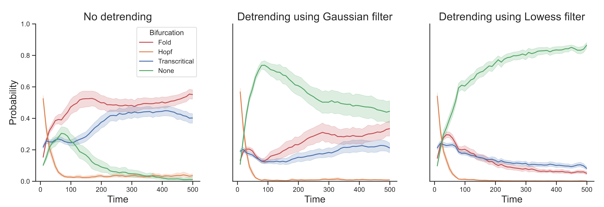
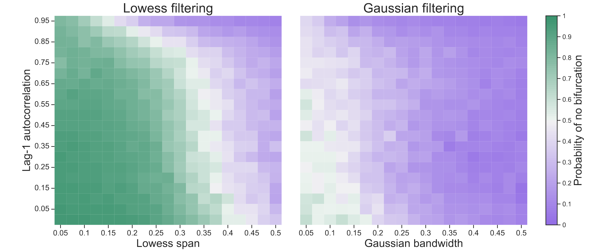

 

 
*The text below is taken verbatim from Dablander & Bury ([2022](https://psyarxiv.com/j7xug)).*
 
Bury et al. ([2021](https://www.pnas.org/content/118/39/e2106140118.short)) present a powerful approach to anticipating tipping points based on deep learning that not only substantially outperforms traditional early warning indicators, but also classifies the type of bifurcation that may lie ahead. Their work is impressive, innovative, and an important step forward. However, deep learning methods are notorious for sometimes exhibiting unintended behavior, and we show that this is also the case for the method proposed by Bury et al. ([2021](https://www.pnas.org/content/118/39/e2106140118.short)).
 
We simulate $n = 500$ observations from an AR(1) process with lag-1 autocorrelation $\rho = 0.50$ and standard Gaussian noise term and apply the deep learning method. The left panel in Figure 1 shows the probability of a fold (red), Hopf (orange), transcritical (blue), and no (green) bifurcation, with solid lines indicating averages and shaded areas indicating standard deviations across 100 iterations. We find that the deep learning method suggests that the process is approaching a fold (or possibly a transcritical) bifurcation. The middle panel shows that detrending with a Gaussian filter with bandwidth $0.20$ improves performance, but substantial uncertainty remains. The right panel shows the results after detrending using a Lowess filter with span $0.20$, as performed by Bury et al. ([2021](https://www.pnas.org/content/118/39/e2106140118.short)).[^1] We find that the deep learning method is able to correctly classify the system as not approaching a bifurcation.
 

  
  <figcaption class="smaller-caption"><b>Figure 1</b>. Deep learning classification for a stationary AR(1) process without detrending (left) and with detrending using a Gaussian (middle) and Lowess filter with bandwidth / span of $0.20$ (right). Solid lines show averages and shaded regions standard deviations over 100 iterations.</figcaption>

 
To further explore this behavior, we conducted the same analysis for a range of lag-1 autocorrelations $\rho \in [0, 0.05, \ldots, 0.95]$ and Lowess spans / Gaussian bandwidths $b \in [0.05, 0.075, \ldots, 0.50]$. The left panel in Figure 2 shows the probability of correctly classifying the time series as approaching no bifurcation after observing all $n = 500$ data points. Classification becomes more challenging as the lag-1 autocorrelation approaches 1. In general, the deep learning method performs better the smaller the Lowess span. Performance drops substantially, however, when using Gaussian filtering, as the right panel in Figure 2 shows.
 

  
  <figcaption class="smaller-caption"><b>Figure 2</b>. Probability of correctly inferring that no bifurcation lies ahead after observing $n = 500$ data points from a stationary AR(1) process with a particular lag-1 autocorrelation that has been detrended with a particular Lowess span (left) or Gaussian bandwidth (right), averaged over 100 iterations.</figcaption>

 
Bury et al. ([2021](https://www.pnas.org/content/118/39/e2106140118.short)) trained the deep learning method only on time series that have been detrended using a Lowess filter with span $0.20$. While the authors showed that the method exhibits excellent performance in several empirical and model systems, we found that it did not extract features generic enough to classify stationary AR(1) processes that have not been detrended (or have been detrended using a Gaussian filter) as approaching no bifurcation. This sensitivity to different types of detrending suggests that the method may have learned features specific to a Lowess filter rather than (only) generic features of a system approaching a bifurcation.
 
Interestingly, detrending takes on a different purpose in this context: for traditional early warning indicators, adequate detrending helps avoid biased estimates (e.g., Dakos et al., [2012](https://journals.plos.org/plosone/article?id=10.1371/journal.pone.0041010)), while for the deep learning method developed by Bury et al. ([2021](https://www.pnas.org/content/118/39/e2106140118.short)) a particular type of detrending is necessary because all training examples were detrended using it. Both Bury et al. ([2021](https://www.pnas.org/content/118/39/e2106140118.short)) and Lapeyrolerie & Boettiger ([2021](https://www.pnas.org/doi/10.1073/pnas.2115605118)) note that the training set would have to be expanded substantially to include richer dynamical behavior than fold, transcritical, and Hopf bifurcations. With this note, we suggest that other aspects of the training, including the preprocessing steps, also need careful consideration.
 
*This note was rejected at PNAS because it was submitted 6 months after the original article appeared online. We were encouraged to contact the original authors with our concerns directly.*
 
---
 
## Footnotes
[^1]: The Lowess span and Gaussian bandwidth are given as a proportion of the time series length; detrending was conducted using the *ewstools* Python package.
