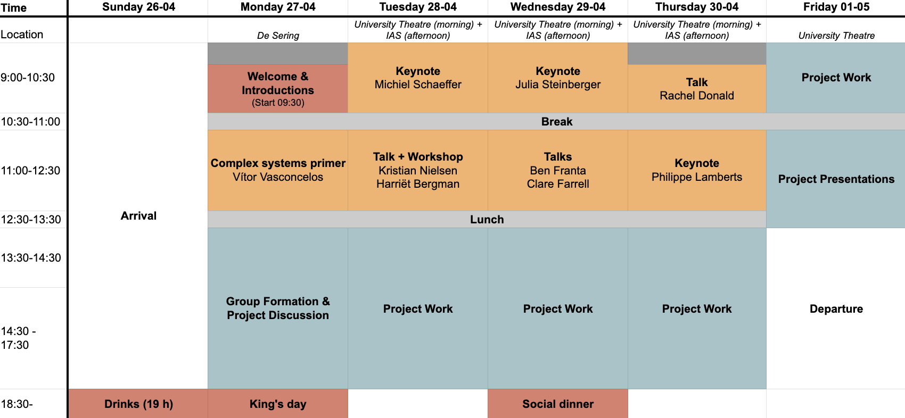
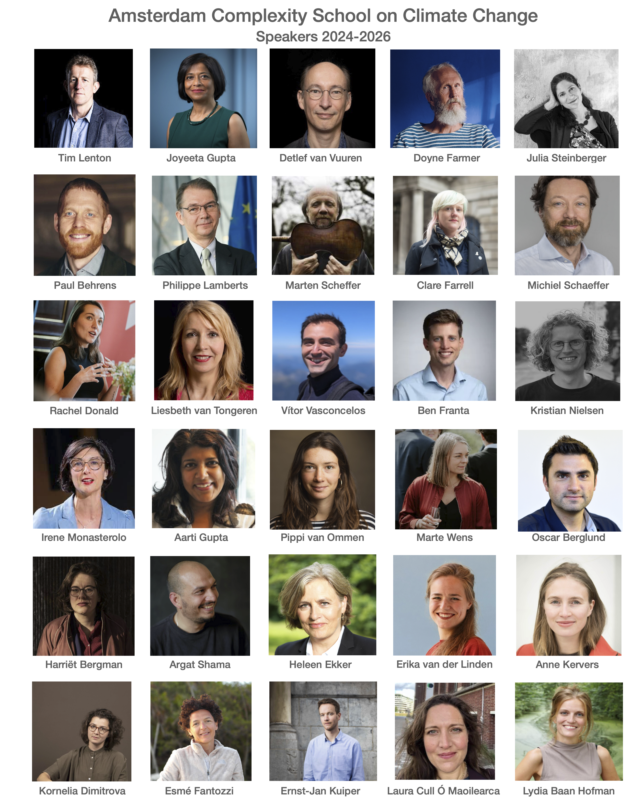
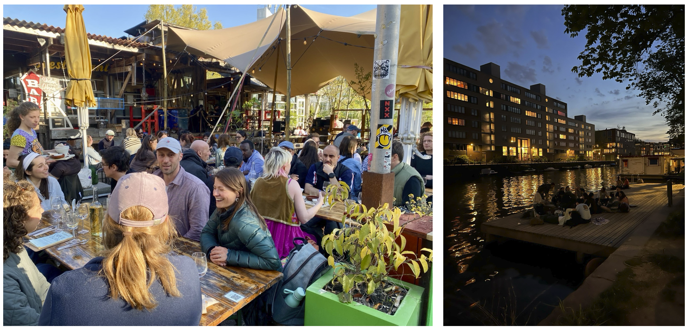
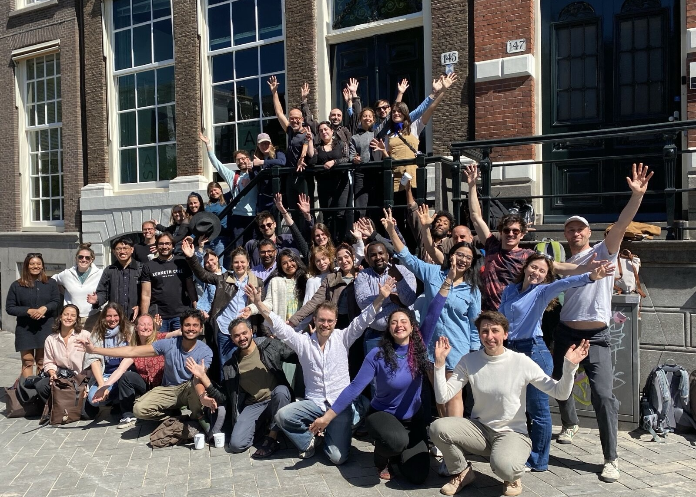

 

 
*This blog post was also published on SEVEN's blog, see [here](https://seven.uva.nl/en/output/blog/blog-fabian-dablander/blog-fabian-dablander.html).*
 
We are increasingly feeling the heat. Hounded by an unprecedented number of heatwaves this summer, temperature records were shattered (39.4°C in the Netherlands!) while vast wildfires forced hundreds of thousands from their homes in France, Spain, and Greece, among others. Elsewhere, Morocco endured four heatwaves in three months, with temperatures reaching 50°C, and in South Korea, record 42.5°C heat destroyed crops, with farmers finding potatoes effectively cooked in the ground.
 
This is at a mere 1.4°C of global heating. We are headed—if one is to put much credence in such projections—for [around 2.6°C](https://climateactiontracker.org/global/emissions-pathways/) under current policies by the end of the century, resulting in a world of climate extremes far outside anything modern society has ever experienced. It is difficult to see how anything resembling today’s social, political, and economic order could remain stable under such pressures. In the [immortal words](https://www.ipcc.ch/report/ar6/syr/resources/spm-headline-statements/) of the IPCC, “there is a rapidly closing window of opportunity to secure a liveable and sustainable future for all (very high confidence)”.
 
At the same time, the [IPCC notes](https://www.ipcc.ch/report/ar6/wg2/about/frequently-asked-questions/keyfaq6/) that "targeting a climate resilient, sustainable world involves fundamental changes to how society functions, including changes to underlying values, worldviews, ideologies, social structures, political and economic systems, and power relationships."
 
This is a Herculean task. From the perspective of scientists and academics, addressing it requires (at least) two things. It requires breaking down disciplinary boundaries that prevent us from seeing the complex whole. We are no longer in an era when climate scientists paid little attention to how social change happens, behavioural scientists thought we could nudge ourselves out of extinction, and economists dreamed of optimal warming targets. But the disciplinary structures that enabled such blind spots are still with us. We must break them down, reach across disciplinary aisles, and understand the intergenerational struggle for a liveable Earth from a complex systems perspective.
 
It also requires stepping out of the ivory tower and engaging with practitioners, including policymakers, activists, journalists, lawyers, bankers, and technologists. True insight into system transformation requires engaging in it, and we better start rolling up our sleeves.
 
## Fostering inter- and transdisciplinary exchanges
 
There are not enough spaces that foster such an inter- and transdisciplinary exchange. The premier event for interdisciplinary exchange on complex systems is the Santa Fe Institute's [Complex Systems Summer School](https://www.santafe.edu/engage/learn/programs/sfi-complex-systems-summer-school), which I cannot recommend highly enough. However, this event and shorter events in the same spirit, such as the Winter Workshop on Complex Systems, do not have sustainability as their core motivating issue. Noticing this gap, [Adam Finnemann](https://adamfinnemann.com/), [Jonas Haslbeck](https://jonashaslbeck.com/), [Karoline Huth](https://www.linkedin.com/in/karolinehuth/), and I got together to see what could be done in this space. This is how the [Amsterdam Complexity School on Climate Change (ACSCC)](https://acscc.nl/) was born in 2024.
 
ACSCC brings together around 40 early-career researchers from all disciplines and people working in industry, NGOs, policymaking, journalism, and grassroots organisations to tackle challenges related to climate change from a complex systems perspective. The school is structured around lectures in the morning and project work in the afternoon, and is hosted at the [Institute for Advanced Study](https://ias.uva.nl/). See below for the programme of ACSCC 2026.
 

  
  <figcaption class="smaller-caption">Programme of ACSCC 2026.</figcaption>

 
## An exciting intellectual journey
 
ACSCC is an exciting *intellectual journey*, where participants follow in the footsteps of [Alexander von Humboldt](https://www.goodreads.com/en/book/show/23995249-the-invention-of-nature), who saw—just like many Indigenous knowledge traditions centuries before him—nature and society as interconnected parts of a dynamic, living whole. We encourage participants to step out of the routine of daily life, away from emails, deadlines, and Zoom calls, and to think big, take intellectual risks, and immerse themselves deeply in the ACSCC experience.
 
Every year, we do our best to provide participants with inspiring speakers, from world-renowned scientists and fearless journalists to legendary grassroots organisers and high-profile politicians, as seen below.
 

  
  <figcaption class="smaller-caption">List of all past ACSCC speakers (2024-2026).</figcaption>

 
Speakers aim to speak for half of their allotted time, leaving the other half for questions. However, it is rare for them to make it long without interesting questions or alternative viewpoints popping up. There are always many more questions, comments, and discussion points raised than there is time for in the Q&A, and these discussions carry over to lunch, which speakers usually join. Many talks were recorded and are available on [ACSCC's YouTube channel](https://www.youtube.com/@AmsterdamCSCC).
 
Participants form groups and work together on a project throughout the afternoons of the week. Past projects [include work](https://acscc.nl/past_editions/) on climate delay discourses in the media; organising the facts, misinformation, and local costs of data centres; understanding how social power influences social tipping; creating an agent-based model of heat pump adoption with an illustrative case in Switzerland; mapping the various impacts of the super-rich on the climate crisis; mapping the pillars of support for the fossil fuel industry; building a web app to help citizens understand the carbon footprint of daily activities; trying to better understand the impact of celebrities such as Taylor Swift taking climate action; and a poetic reflection on solidarity beyond the “I”—rethinking how we talk and think about nature. Several collaborations and research projects initiated during ACSCC have continued beyond the week.
 
## An exciting social journey
 
ACSCC is also an exciting *social journey*: an exercise in community building and the development of the nourishing social bonds needed for tackling climate and environmental breakdown. This is reflected throughout the programme, from the afternoon group working sessions to the joint lunches and the social events in the evenings (including our three-course plant-based social dinner). Participants from abroad stay together at a hostel situated in one of Amsterdam’s many great parks.
 
While participants often feel a great frustration with the status quo and a lack of perspective on how to move forward, the ACSCC experience—being together with so many passionate and driven individuals—provides new insights into how to tackle climate breakdown and renews a sense of hope that we can, indeed, turn this ship around. It is never too late, in the words of Greta Thunberg, to do everything we can.
 

  
  <figcaption class="smaller-caption">Left: Social dinner at De Ceuvel. Right: Late-night pizza and fun on the waterfront.</figcaption>

 
It is important to us to make ACSCC as inclusive and affordable as possible. The participant fee is €500 and includes accommodation, breakfast, lunch, and the social dinner. We also give out fee waivers for people who need financial assistance, and due to the generous contribution of the Institute for Advanced Study we were able to provide a number of travel stipends in the last edition. In total, we gave out 13 fee waivers and 4 travel stipends. All organisers are volunteers and run ACSCC on a not-for-profit basis.
 
The participants come from virtually all disciplines and almost all corners of the world. We take great care to select—in a process that spans multiple days—those who we believe would benefit most from ACSCC and make it the special event that it is. It has been wonderful to meet past participants again at various conferences and fondly reminisce about the week we spent together in Amsterdam.
 

  
  <figcaption class="smaller-caption">Group picture of ACSCC 2026..</figcaption>

 
## Next steps
 
The Amsterdam Complexity School on Climate Change is an absolute highlight for me and the other organisers every year. We will make sure that it continues to take place every year and we are excited to welcome [Maien Sachisthal](https://www.uva.nl/en/profile/s/a/m.s.m.sachisthal/m.s.m.sachisthal.html) and [Shreyas Gadge](https://www.uva.nl/en/profile/g/a/s.r.gadge/s.r.gadge.html) to strengthen the organising team. While I just started as an [assistant professor](https://www.lse.ac.uk/people/fabian-dablander) at the London School of Economics and Political Science, I am excited to still be involved in the upcoming edition of ACSCC. I am also thinking of organising something similar in London, so stay tuned!
 
There will also be exciting new opportunities as we strengthen the integration of ACSCC with the wider ecosystem of the Institute for Advanced Study and SEVEN. So make sure to keep an eye out for ACSCC [applications opening](https://acscc.nl/application/) in November!
