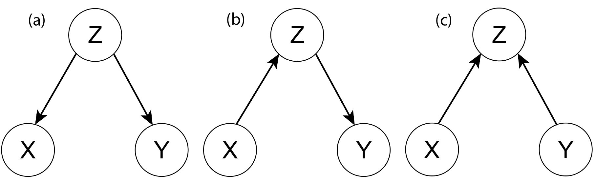
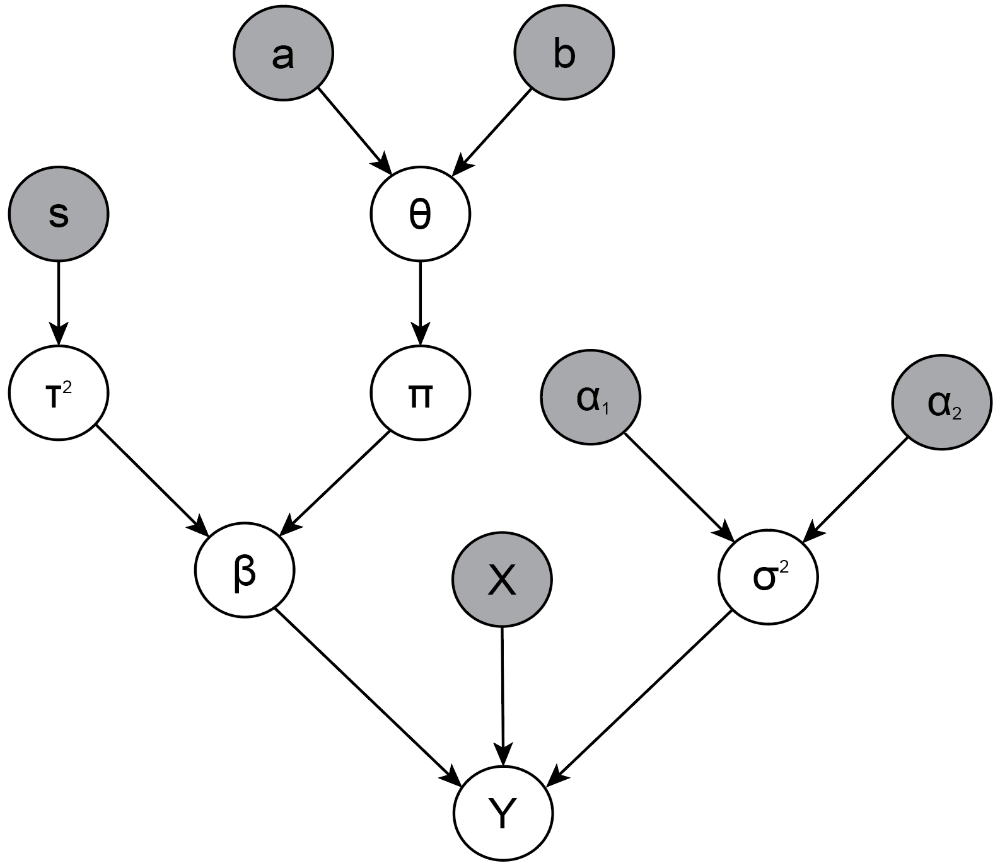

"Which variables are important?" is a key question in science and statistics. In this blog post, I focus on linear models and discuss a Bayesian solution to this problem using *spike-and-slab priors* and the *Gibbs sampler*, a computational method to sample from a joint posterior distribution using only conditional posterior distributions.

Variable selection is a beast. To slay it, we must draw on ideas from different fields. We have to discuss the basics of Bayesian inference which motivates our principal weapon, the Gibbs sampler. As an instruction manual, we apply it to a simple example: drawing samples from a bivariate Gaussian distribution (for pre-combat exercises, see [here](http://127.0.0.1:4000/statistics/Two-Properties.html)). The Gibbs sampler feeds on conditional distributions. To be able to derive those easily, we need to equip ourselves with $d$-separation and directed acyclic graphs (DAGs). Having trained and become stronger, we attack variable selection in the linear regression case using Gibbs sampling with spike-and-slab priors. These priors are special in that they are a discrete mixture of a Dirac delta function --- which can shrink regression coefficients exactly to zero --- and a Gaussian distribution. We tackle the single predictor case first, and then generalize it to $p > 1$ predictors. For $p$ predictors, the Gibbs sampler with spike-and-slab priors yields a posterior distribution over all possible $2^p$ regression models, an enormous feat. From this, posterior inclusion probabilities and model-averaged parameter estimates follow straightforwardly. To wield this weapon in practice, we implement the method in R and engage in variable selection on simulated and real data. Seems like we have a lot to cover, so let's get started!


# Quantifying uncertainty
Bayesian inference is an excellent tool for uncertainty quantification. Assume you have assigned a prior distribution to some parameter $\beta$ of a model $\mathcal{M}$, call it $p(\beta \mid \mathcal{M})$. After you have observed data $\mathbf{y}$, how should you update your belief to arrive at the posterior, $p(\beta \mid y, \mathcal{M})$? The rules of probability dictate:

$$
\underbrace{p(\beta \mid \mathbf{y}, \mathcal{M})}_{\text{Posterior}} = \underbrace{p(\beta \mid \mathcal{M})}_{\text{Prior}} \times \frac{\overbrace{p(\mathbf{y} \mid \beta, \mathcal{M})}^{\text{Likelihood}}}{\underbrace{\int p(\mathbf{y} \mid \beta, \mathcal{M}) \, p(\beta \mid \mathcal{M}) \, \mathrm{d} \beta}_{\text{Marginal Likelihood}}} \enspace .
$$

The computationally easy parts of the right-hand side is the specification of the prior and, unless you do [crazy things](https://en.wikipedia.org/wiki/Approximate_Bayesian_computation), also the likelihood. The tough bit is the marginal likelihood or *normalizing constant* which, as the name implies, makes the posterior distribution integrate to one, as all proper probability distributions must. In contrast to differentiation, which is a local operation, integration is a global operation and is thus [much harder](https://xkcd.com/2117/). It becomes even harder with many parameters.

Usually, Bayes' rule is given without conditioning on the model, $\mathcal{M}$. However, this assumes that we know one model to be true with certainty, thus ignoring the uncertainty we have about the models. We can apply Bayes' rule not only on parameters, but also on models:

$$
p(\mathcal{M} \mid \mathbf{y}) = p(\mathcal{M}) \times \frac{p(\mathbf{y} \mid \mathcal{M})}{\sum_{i = 1}^m p(\mathbf{y} \mid \mathcal{M}_i) \, p(\mathcal{M}_i)} \enspace ,
$$

where $m$ is the number of all models and

$$
p(\mathbf{y} \mid \mathcal{M}) = \int p(\mathbf{y} \mid \mathcal{M}, \beta) \, p(\beta \mid \mathcal{M}) \, \mathrm{d} \beta \enspace ,
$$

is in fact the marginal likelihood of our first equation. To illustrate how one could do variable selection, assume we have two models, $\mathcal{M}_1$ and $\mathcal{M}_2$, which differ in their number of predictors:

$$
\begin{aligned}
\mathcal{M}_2&: \mathbf{y} = \beta_0 + \beta_1 \mathbf{x}_1 \\[0.5em]
\mathcal{M}_4&: \mathbf{y} = \beta_0 + \beta_1 \mathbf{x}_1 + \beta_2 \mathbf{x}_2 \enspace .
\end{aligned}
$$

If these two are the only models we consider, then we can quantify their respective merits using posterior odds:

$$
\underbrace{\frac{p(\mathcal{M}_4 \mid \mathbf{y})}{p(\mathcal{M}_2 \mid \mathbf{y})}}_{\text{Posterior Odds}} = \underbrace{\frac{p(\mathcal{M}_4)}{p(\mathcal{M}_2)}}_{\text{Prior Odds}} \times \underbrace{\frac{p(\mathbf{y} \mid \mathcal{M}_4)}{p(\mathbf{y} \mid \mathcal{M}_2)}}_{\text{Bayes factor}} \enspace ,
$$

where we can interpret the Bayes factor as an indicator for how much more likely the data are under $\mathcal{M}_4$, which includes $\beta_2$, compared to $\mathcal{M}_2$, which does not include $\beta_2$. However, two additional regression models are possible:

$$
\begin{aligned}
\mathcal{M}_1&: \mathbf{y} = \beta_0\\[0.5em]
\mathcal{M}_3&: \mathbf{y} = \beta_0 + \beta_2 \mathbf{x}_2 \enspace .
\end{aligned}
$$

In general, if $p$ is the number of predictors, then there are $2^p$ possible regression models in total. If we ignore some of those a priori, we will have violated *Cromwell's rule*, which states that we should never assign prior probabilities of zero to things that could possibly happen. Otherwise, regardless of the evidence, we would never change our mind. As Dennis Lindley put it, we should

> "[...] leave a little probability for the moon being made of green cheese; it can be as small as 1 in a million, but have it there since otherwise an army of astronauts returning with samples of the said cheese will leave you unmoved." (Lindley, 1991, p. 101)

One elegant aspect about the Bayes factor is that we do not need to compute the normalizing constant of all models (it cancels in the ratio), which would require us to enumerate and assign priors to all possible models. If we are willing to do this, however, then we can model-average to get a posterior distribution of $\beta_j$ that takes into account the uncertainty about all $m$ models:

$$
\begin{aligned}
p(\beta_j \mid \mathbf{y}) &= \sum_{i=1}^m \, p(\beta_j, \mathcal{M}_i \mid \mathbf{y}) \\[.5em]
&= \sum_{i=1}^m \, p(\beta_j \mid \mathbf{y}, \mathcal{M}_i) \, p(\mathcal{M}_i \mid \mathbf{y}) \enspace ,
\end{aligned}
$$

which requires computing the posterior distribution over the parameter of interest $\beta_j$ in each model $\mathcal{M}_j$, as well as the posterior distribution over all such models. Needless to say, this is a difficult problem; the bulk of this blog post is to find an efficient way to do this in the context of linear regression models. For variable selection, we might be interested in another quantity: the posterior probability that $\beta_j \neq 0$, averaged over all models. We can arrive at this by similar means:


$$
\begin{aligned}
p(\beta_j \neq 0 \mid \mathbf{y}) & = \sum_{i=1}^m \, p(\beta_j \neq 0, \mathcal{M}_i \mid \mathbf{y}) \\[.5em]
&= \sum_{i=1}^m \, p(\beta_j \neq 0 \mid \mathbf{y}, \mathcal{M}_i) \, p(\mathcal{M}_i \mid \mathbf{y}) \enspace .
\end{aligned}
$$

Note that conditional on a model $\mathcal{M}_i$, $\beta_j$ is either zero or not zero. Therefore, all the terms in which $\beta_j$ is zero drop out of the sum, and we are left with summing the posterior model probabilities for the models in which $\beta_j \neq 0$. This model-averaging perspective strikes me as a very elegant approach to variable selection.[^1] In the remainder of this blog post, we will solve this variable selection problem for linear regression using the Gibbs sampler with spike-and-slab priors.


# Gibbs sampling
Much of the advent in Bayesian inference in the last few decades is due to methods that arrive at the posterior distribution without calculating the marginal likelihood. One such method is the Gibbs sampler, which breaks down a high-dimensional problem into a number of smaller low-dimensional problems. It's really one of the coolest things in statistics: it samples from the joint posterior distribution and its marginals by sampling from the conditional posterior distributions. To prove that it works mathematically is not trivial, and beyond this already lengthy introductory blog post.[^2] Thus, instead of getting bogged down in the technical details, let's take a look at a motivating example.

## Sampling from a bivariate Gaussian
To illlustrate, let $X_1$ and $X_2$ be bivariate normally distributed random variables with population mean zero ($\mu_1 = \mu_2 = 0$), unit variance ($\sigma_1^2 = \sigma_2^2 = 1$), and correlation $\rho$. As you may recall from a [previous](http://127.0.0.1:4000/statistics/Two-Properties.html) blogpost, the conditional Gaussian distribution of $X_1$ given $X_2 = x_2$, and $X_2$ given $X_1 = x_1$, respectively, are:

$$
\begin{aligned}
X_1 \mid X_2 = x_2 &\sim \mathcal{N}\left(\rho x_2, \, (1 - \rho^2)\right) \\[0.5em]
X_2 \mid X_1 = x_1 &\sim \mathcal{N}\left(\rho x_1, \, (1 - \rho^2)\right) \enspace .
\end{aligned}
$$


<!-- $$ -->
<!-- \begin{aligned} -->
<!-- x_2^1 &\sim \mathcal{N}(0, 1) \\[.5em] -->
<!-- x_1^2 &\sim \mathcal{N}\left(\rho x_2^1, \, (1 - \rho^2)\right) \\[0.5em] -->
<!-- x_2^2 &\sim \mathcal{N}\left(\rho x_1^2, \, (1 - \rho^2)\right) \\[0.5em] -->
<!-- x_1^3 &\sim \mathcal{N}\left(\rho x_2^2, \, (1 - \rho^2)\right) \\[0.5em] -->
<!-- x_2^3 &\sim \mathcal{N}\left(\rho x_1^3, \, (1 - \rho^2)\right) \\[0.5em] -->
<!-- \vdots &\sim \vdots \\[.5em] -->
<!-- \end{aligned} -->
<!-- $$ -->

The Gibbs sampler makes it so that if we sample repeatedly from these two conditional distributions:

$$
(x_1^1, x_2^1), (x_1^2, x_2^2), \ldots, (x_1^{n - 1}, x_2^{n - 1}), (x_1^n, x_2^n) \enspace ,
$$

then these will be samples from the joint distribution $p(X_1, X_2)$ and its marginals.

<!-- The astounding thing with Gibbs sampling is that, if we sample $x_1^t$ from the conditional distribution $p(X_1^t \mid X_2 = x_2^{t-1})$ and $x_2^t$ from the conditional distribution $p(X_2^t \mid X_1 = x_1^{t-1})$, then under some regularity conditions, the joint samples will be from the bivariate Gaussian distribution! -->

To illustrate, we implement this Gibbs sampler in R.
```{r}
sample_bivariate_normal <- function(rho, nr_samples) {
  x <- matrix(0, nrow = nr_samples, ncol = 2)
  
  for (i in seq(2, nr_samples)) {
    x[i, 1] <- rnorm(1, rho*x[i-1, 2], sqrt(1 - rho^2))  # sample from p(X1 | X2 = x2)
    x[i, 2] <- rnorm(1, rho*x[i, 1]  , sqrt(1 - rho^2))  # sample from p(X2 | X1 = x1)
  }
  
  x
}
```

Let's see it in action:

```{r}
set.seed(1)
samples <- sample_bivariate_normal(rho = 0.5, nr_samples = 10000)
cov(samples)
```

```{r, echo = FALSE, fig.width = 6, fig.height = 6, fig.align = 'center', message = FALSE, warning = FALSE}
library('ggpubr')
library('ggplot2')
library('latex2exp')

ggplot(data.frame(x1 = samples[, 1], x2 = samples[, 2]), aes(x = x1, y = x2)) +
  geom_point(alpha = .4) +
  xlim(c(-4, 4)) +
  ylim(c(-4, 4)) +
  theme_pubclean() +
  ylab(TeX('$$x_2$$')) +
  xlab(TeX('$$x_1$$')) +
  ggtitle('Gibbs-sampled Gaussian') +
  theme(
    panel.grid.major = element_blank(),
    panel.grid.minor = element_blank(),
    panel.background = element_blank(),
    panel.border = element_blank(), 
    axis.line = element_line(colour = 'black'),
    plot.title = element_text(hjust = .5, size = 20),
    text = element_text(size = 18)
  )
```

Wait a minute, you might say. In this toy example, what was the prior distribution, and which posterior did we compute? The answer is: there were none! We have used the Gibbs sampler not to learn about a parameter, but rather to illustrate that sampling from conditional distributions in this way results in samples from the joint distribution. In the next section, we look at how graphs can help us in finding conditional independencies.[^3]

<!-- Although you could get philosophical and ask: what exactly is the [difference](https://www.tandfonline.com/doi/abs/10.1080/15366360802035497) between 'data' (here $x_1$ and $x_2$) and parameters (here $\rho$)? -->


<!-- ## Example II: Another thing -->
<!-- The example above is a little fishy: in the Gaussian case, if we know both conditional distributions, then we also [know the joint distribution](https://fdabl.github.io/statistics/Two-Properties.html)! -->


# Conditional independence and graphs
Before we look into variable selection using spike-and-slab priors in the linear regression case, we need to get some preliminaries about conditional independence out of the way. We write:

$$
X \perp Y \hspace{.4em} \vert\, Z \enspace ,
$$

to denote that $X$ and $Y$ are *conditionally independent* given $Z$.[^4] We can visualize conditional independencies between random variables using directed acyclic graphs (DAGs). The figure below distinguishes between three different DAG structures.



DAG (a) above is a *common cause* structure. A good example is the positive correlation between the number of storks and the number of human babies delivered; these two variables become independent once one conditions on the common cause *economic development* (Matthews, 2001). DAG (b) is an example where the effect of $X$ on $Y$ is *fully mediated* by $Z$: conditional on $Z$, $X$ does not have an effect on $Y$. Thus, both in DAGs (a) and (b), conditioning on $Z$ renders $X$ and $Y$ independent.

Two variables can also be *marginally independent*, for which we write:

$$
X  \perp Y \enspace ,
$$

which holds in DAG (c). Note, however, that if we would condition on $Z$ in DAG (c), then $X$ and $Y$ would become *dependent*. $Z$ is a *collider*, and conditioning on it induces a dependency between $X$ and $Y$. Although not visible in the DAG, a dependency would also have been induced btween $X$ and $Y$ if we had conditioned on any children of $Z$.

<!-- There are various good examples of so-called *collider bias*; for example: ... -->

Note that although we visualize the conditional independencies in a DAG, we do not interpret it causally. We are merely interested in *seeing*, not *doing*, and view the arrows as "incidental construction features supporting the
$d$-separation semantics" (Dawid, 2010 p. 90).

<!-- From $d$-separation, we can distill the following factorization for the conditional probability of a node: -->

<!-- $$ -->
<!-- p(X \mid \mathcal{G} \setminus \{X\}) \propto \,p(X \mid \text{Pa}(X)) \, \prod_{Y \in \text{Ch(X)}} p(Y \mid \text{Pa(Y)}) \enspace . -->
<!-- $$ -->

As we will see in the next section, being able to read conditional independencies from a graph greatly aids in finding conditional distributions feeding the Gibbs sampler.

# Spike-and-Slab Regression
## Model specification
In a previous blog post, we discussed the (history of the) methods of least squares and [linear regression](https://fdabl.github.io/statistics/Curve-Fitting-Gaussian.html). However, we did not assess whether a particular variable $X$ is actually associated with an outcome $Y$. We can think of this problem as hypothesis testing, variable selection, or structure learning. In particular, we may write the regression model with a single predictor variable as:

$$
y_i \sim \mathcal{N}(\beta \, x_i , \sigma_e^2) \enspace .
$$

We put the following prior on $\beta$:

$$
\beta \sim (1 - \pi) \, \delta_0 + \pi \, \mathcal{N}(0, \sigma_y^2 \tau^2) \enspace ,
$$

where $\pi \in [0, 1]$ is a mixture weight, $\sigma_y^2$ is the variance of $\mathbf{y}$, $\delta_0$ is the [Dirac delta function](https://en.wikipedia.org/wiki/Dirac_delta_function) (the *spike*), and $\tau^2$ is the variance of the *slab*. We multiply $\tau^2$ with $\sigma_y^2$ so that the prior naturally scales with the scale of the outcome. If we would not do this, then our results would depend on the measurement units of $\mathbf{y}$. Instead of fixing $\tau^2$ to a constant, we learn it by specifying

$$
\tau^2 \sim \text{Inverse-Gamma}(1/2, s^2/2) \enspace ,
$$

which results in a scale-mixture of Gaussians, that is, a Cauchy distribution with scale $s$. The figure below visualizes the marginal prior on $\beta$ as a discrete mixture ($\pi = 0.5$) of a Dirac delta, a Cauchy with scale $s = 1/2$, and $\sigma_y^2 = 1$.

```{r, echo = FALSE, fig.width = 6, fig.height = 6, fig.align = 'center', message = FALSE, warning = FALSE}
library('ggpubr')
library('ggplot2')
library('mvtnorm')
library('latex2exp')

n <- 10e5

p2 <- ggplot() +
  stat_function(
    data = data.frame(x = seq(-2.5, 2.5, length.out = n)),
    fun = function(x) dcauchy(x, 0, (1)^2)
  ) +
  geom_segment(
    aes(x = 0, y = 0, xend = 0, yend = 1.0, group = 1),
    arrow = arrow(length = unit(.5, 'cm'))
  ) +
  xlim(c(-2.5, 2.5)) +
  theme_pubclean() +
  ylab('Density') +
  ggtitle('Spike-and-Slab Prior') +
  xlab(expression(beta)) +
  theme(
    panel.grid.major = element_blank(),
    panel.grid.minor = element_blank(),
    panel.background = element_blank(),
    panel.border = element_blank(), 
    axis.line = element_line(colour = 'black'),
    plot.title = element_text(hjust = .5, size = 20),
    text = element_text(size = 18)
  )

p2
```

The idea behind this specification is to allow the regression weight $\beta$ to be *exactly* zero. Using Gibbs sampling, we will arrive at $p(\pi \mid y)$ which indicates the posterior probability of the parameter $\beta$ being zero. We continue the prior specification with


$$
\begin{aligned}
\pi &\sim \text{Bern}(\theta) \\[0.5em]
\theta &\sim \text{Beta}(a, b) \\[0.5em]
\sigma_e^2 &\sim \text{Inverse-Gamma}(\alpha_1, \alpha_2) \enspace ,
\end{aligned}
$$

where we set $a = b = 1$ and $\alpha_1 = \alpha_2 = 2$. We can visualize the relations between all random variables in a DAG, see the figure below. Nodes with a grey shadow are observed or set by us, white nodes denote random variables.



Using $d$-separation as introduced in the previous section, we note that this larger graph is basically a collection of DAGs (b) and (c). This helps us see that the joint probability distribution factors:

$$
p(\mathbf{y}, \beta, \pi, \theta, \tau^2, \sigma_e^2) = p(\mathbf{y} \mid \beta, \sigma_e^2) \, p(\sigma_e^2) \, p(\beta \mid  \pi, \tau^2) \, p(\pi \mid \theta) \, p(\theta) \, p(\tau^2) \enspace ,
$$

where we have suppressed conditioning on the hyperparameters $a = b = 1$, $\alpha_1 = \alpha_2 = 0.01$, $s = 1/2,$ the predictor variables $X$, and the variance of the outcome $\sigma_y^2$.

For the Gibbs sampler, we need the conditional posterior distribution of each parameter given the data and all other parameters. Using the conditional independence structure of the graph, this results in the following conditional distributions:

$$
\begin{aligned}
&p(\theta \mid \mathbf{y}, \beta, \pi, \tau^2, \sigma_e^2 ) = p(\theta \mid \pi) \\[0.5em]
&p(\tau^2 \mid \mathbf{y}, \beta, \pi, \theta, \sigma_e^2) = p(\tau^2 \mid \beta, \pi) \\[0.5em]
&p(\sigma_e^2 \mid \mathbf{y}, \beta, \pi, \theta, \tau^2) = p(\sigma_e^2 \mid \mathbf{y}, \beta) \\[0.5em]
&p(\pi \mid \mathbf{y}, \beta, \theta, \tau^2, \sigma_e^2) = p(\pi \mid \beta, \theta, \tau^2) \\[0.5em]
&p(\beta \mid \mathbf{y}, \pi, \theta, \tau^2, \sigma_e^2) = p(\beta \mid \mathbf{y}, \pi, \tau^2, \sigma_e^2) \enspace .
\end{aligned}
$$

<!-- These conditional independencies result in *local computation*: certain parts are shielded from other parts of the graph. The shield is called the *Markov blanket*. Information trickles through the graph from node to node. -->

In the next sections, we derive these conditional posterior distributions in turn. Since the single predictor case is slightly simpler to follow, we focus on it. However, the generalization to the multiple predictor setting is relatively straightforward, and I will sketch it afterwards.

## Conditional posterior $p(\theta \mid \pi)$
We expand:

$$
\begin{aligned}
p(\theta \mid \pi) &= \frac{p(\pi \mid \theta) \, p(\theta)}{\int p(\pi \mid \theta) \, p(\theta) \, \mathrm{d}\theta} \\[.5em]
&=\frac{\theta^\pi (1 - \theta)^{1 - \pi} \frac{1}{B(a,b)} \theta^{a - 1} (1 - \theta)^{b - 1}}{\int \theta^\pi (1 - \theta)^{1 - \pi} \frac{1}{B(a,b)} \theta^{a - 1} (1 - \theta)^{b - 1} \, \mathrm{d}\theta} \\[.5em]
&= \frac{\theta^{(a + \pi) - 1} (1 - \theta)^{(b + 1 - \pi) - 1}}{\int \theta^{(a + \pi) - 1} (1 - \theta)^{(b + 1 - \pi) - 1} \, \mathrm{d}\theta} \enspace ,
\end{aligned}
$$

where $B$ is the [beta function](https://en.wikipedia.org/wiki/Beta_function), and where we realize the numerator is the *kernel* of a Beta distribution, and the denominator is the normalizing constant. Thus, the posterior is again a Beta distribution:

$$
\theta \mid \pi \sim \text{Beta}(a + \pi, b + 1 - \pi) \enspace .
$$

As we can see, the conditional posterior of $\theta$ only depends on $\pi$. That means, however, that we can never get much information about this parameter, as $\pi$ can only be 0 or 1, and so the Beta distribution can only become $\text{Beta}(2, 1)$ or $\text{Beta}(1, 2)$ with a uniform prior $a = b = 1$. The posterior mean of $\theta$ can thus never become larger than $2/3$ or smaller than $1/3$.


## Conditional posterior $p(\tau^2 \mid \beta, \pi)$
The conditional posterior on $\tau^2$ also depends on $\pi$ because conditioning on $\beta$ means conditioning on a collider, inducing the dependency. We expand:

$$
\begin{aligned}
p(\tau^2 \mid \beta, \pi) &= \frac{p(\beta \mid \tau^2, \pi) \, p(\pi) \, p(\tau^2)}{\int p(\beta \mid \tau^2, \pi) \, p(\pi) \, p(\tau^2) \, \mathrm{d}\tau^2} \\[.5em]
&= \frac{p(\beta \mid \tau^2, \pi) \, p(\tau^2)}{\int p(\beta \mid \tau^2, \pi) \, p(\tau^2) \, \mathrm{d}\tau^2} \enspace .
\end{aligned}
$$

To make the notation less cluttered, we will call the normalizing constant in this and all following derivations $Z$. Note that terms that do not depend on the parameter of interest in the numerator cancel, as the same terms appear in the normalizing constant. Further note that $\pi$ can be either 0 or 1. We first tackle the $\pi = 1$ case and write

$$
\begin{aligned}
p(\tau^2 \mid \beta, \pi = 1) &= \frac{1}{Z} \, p(\beta \mid \tau^2, \pi) \, p(\tau^2) \\[0.5em]
&= \frac{1}{Z} \, \left(2\pi\sigma_y^2\tau^2\right)^{-\frac{1}{2}} \text{exp}\left(-\frac{1}{2\sigma_y^2\tau^2} \beta^2\right) \frac{\left(\frac{s^2}{2}\right)^{\frac{1}{2}}}{\Gamma\left(\frac{1}{2}\right)} \left(\tau^2\right)^{- \frac{1}{2} - 1} \text{exp}\left(-\frac{\frac{s^2}{2}}{\tau^2}\right) \enspace ,
\end{aligned}
$$

where $\Gamma$ is the [gamma function](https://en.wikipedia.org/wiki/Gamma_function). Absorbing everything that does not depend on $\tau^2$ into the normalizing constant, we write:

$$
\begin{aligned}
p(\tau^2 \mid \beta, \pi = 1) &= \frac{1}{Z} \, \left(\tau^2\right)^{-\frac{1}{2} - 1 -\frac{1}{2}} \text{exp}\left(-\frac{1}{2\sigma_y^2\tau^2} \beta^2 - \frac{\frac{s^2}{2}}{\tau^2} \right) \\[0.5em]
&= \frac{1}{Z} \, \left(\tau^2\right)^{-\left(\frac{1}{2} + \frac{1}{2}\right) - 1} \text{exp}\left(-\frac{\left(\frac{s^2}{2} + \frac{\beta^2}{2\sigma_y^2}\right)}{\tau^2}\right) \enspace ,
\end{aligned}
$$

which is a new inverse Gamma distribution:

$$
\tau^2 \mid \beta , \pi = 1 \sim \text{Inverse-Gamma}\left(\frac{1}{2} + \frac{1}{2}, \frac{s^2}{2} + \frac{\beta^2}{2\sigma_y^2}\right) \enspace .
$$

On the other hand, if $\pi = 0$, then $\beta = 0$ and we simply sample from the prior:

$$
\tau^2 \mid \beta , \pi = 0 \sim \text{Inverse-Gamma}\left(\frac{1}{2}, \frac{s^2}{2}\right) \enspace .
$$

Because the derivation is very similar, we look at the conditional posterior $p(\sigma_e^2 \mid y, \beta)$ next.


## Conditional posterior $p(\sigma_e^2 \mid y, \beta)$
Again writing the normalizing constant as $Z$, we expand:

$$
\begin{aligned}
p(\sigma_e^2 \mid \mathbf{y}, \beta) &= \frac{1}{Z} \, p(\mathbf{y} \mid \beta, \sigma_e^2)\, p(\beta) \, p(\sigma_e^2) \\[1em]
&= \frac{1}{Z} \, \left(2\pi\sigma_e^2\right)^{-n/2} \text{exp} \left(-\frac{1}{2\sigma_e^2} \sum_{i=1}^n \left(y_i - bx_i\right)^2 \right) \frac{\alpha_2^{\alpha_1}}{\Gamma(\alpha_1)} \left(\sigma_e^2\right)^{- \alpha_1 - 1} \text{exp} \left(-\frac{\alpha_2}{\sigma_e^2}\right) \enspace ,
\end{aligned}
$$

which looks very similar to the conditional posterior on $\tau^2$. In fact, using the same tricks as above --- absorbing terms that do not depend on $\sigma_e^2$ into $Z$, and putting terms together --- we write:

$$
\begin{aligned}
p(\sigma_e^2 \mid \mathbf{y}, \beta) &= \frac{1}{Z} \, \left(\sigma_e^2\right)^{-\frac{n}{2}} \text{exp} \left(-\frac{1}{2\sigma_e^2} \sum_{i=1}^n \left(y_i - bx_i\right)^2 \right) \left(\sigma_e^2\right)^{- \alpha_1 - 1} \text{exp} \left(-\frac{\alpha_2}{\sigma_e^2}\right) \\[1em]
&= \frac{1}{Z} \, \left(\sigma_e^2\right)^{-\left(\alpha_1 + \frac{n}{2}\right) - 1} \text{exp} \left(-\frac{1}{\sigma_e^2} \left[\alpha_2 + \frac{\sum_{i=1}^n(y_i - bx_i)^2}{2}\right]\right) \enspace ,
\end{aligned}
$$

which is again an inverse Gamma distribution:

$$
\sigma_e^2 \mid \mathbf{y}, \beta \sim \text{Gamma}\left(\alpha_1 + \frac{n}{2}, \alpha_2 + \frac{\sum_{i=1}^n(y_i - \beta x_i)^2}{2}\right) \enspace .
$$

Contrasting this derivation with the one above, we note something interesting. Our belief about the variance $\sigma_e^2$ gets updated using the $n$ data points $\mathbf{y}$, whereas our belief about $\tau^2$ gets updated using only $\beta$. "In the Bayesian framework, the difference between data and parameters is fuzzy", McElreath points out (2016, p. 34); or, put even more strongly, Dawid (1979, p.1): "[...] the distinction between data and parameters is largely irrelevant".

Because the conditional posterior of $\pi$ is quite tricky, we continue with the conditional posterior of $\beta$.


## Conditional posterior $p(\beta \mid y, \pi, \tau^2, \sigma_e^2)$
The conditional posterior of $\beta$ given $\pi = 0$ is easy: it is the Dirac delta function $\delta_0$, from which samples will always have value 0. The conditional posterior for $\pi = 1$ is a little more complicated to derive, but not by much. We start by writing:

$$
\begin{aligned}
p(\beta \mid \mathbf{y}, \pi = 1, \tau^2, \sigma_e^2) &= \frac{p(\mathbf{y} \mid \beta, \pi = 1, \tau^2, \sigma_e^2) \, p(\beta \mid \pi = 1, \tau^2) \, p(\pi = 1) \, p(\tau^2)}{\int p(\mathbf{y} \mid \beta, \pi = 1, \tau^2, \sigma_e^2) \, p(\beta \mid \pi = 1) \, p(\pi = 1) \, p(\tau^2) \, \mathrm{d} \beta} \\[1em]
&= \frac{p(\mathbf{y} \mid \beta, \pi = 1, \tau^2, \sigma_e^2) \, p(\beta \mid \pi = 1)}{\int p(\mathbf{y} \mid \beta, \pi = 1, \tau^2, \sigma_e^2) \, p(\beta \mid \pi = 1) \, \mathrm{d} \beta} \enspace ,
\end{aligned}
$$

where we again write the normalizing constant as $Z$. Expanding, we get:

$$
\begin{aligned}
p(\beta \mid \mathbf{y}, \pi = 1, \tau^2, \sigma_e^2) &= \frac{1}{Z} \, \left(2\pi\sigma_e^2\right)^{-n/2} \text{exp} \left(-\frac{1}{2\sigma_e^2} \sum_{i=1}^n \left(y_i - \beta x_i\right)^2 \right) \left(2\pi\sigma_y^2\tau^2\right)^{-1/2} \text{exp} \left(-\frac{1}{2\sigma_y^2\tau^2} \beta^2 \right) \enspace .
\end{aligned}
$$

We can again absorb terms that do not depend on $\beta$ into $Z$. We proceed:

$$
\begin{aligned}
p(\beta \mid \mathbf{y}, \pi = 1, \tau^2, \sigma_e^2) &= \frac{1}{Z} \, \text{exp} \left(-\frac{1}{2\sigma_e^2} \sum_{i=1}^n \left(y_i - \beta x_i\right)^2 \right) \text{exp} \left(-\frac{1}{2\sigma_y^2\tau^2} \beta^2 \right) \\[0.5em]
&= \frac{1}{Z} \, \text{exp} \left(-\frac{1}{2\sigma_e^2} \sum_{i=1}^n \left(y_i - \beta x_i\right)^2 -\frac{1}{2\sigma_y^2\tau^2} \beta^2 \right) \\[0.5em]
&= \frac{1}{Z} \, \text{exp} \left(-\frac{1}{2\sigma_e^2} \left[\sum_{i=1}^n \left(y_i - \beta x_i\right)^2 +\frac{2\sigma_e^2}{2\sigma_y^2\tau^2} b^2 \right]\right) \\[0.5em]
&= \frac{1}{Z} \, \text{exp} \left(-\frac{1}{2\sigma_e^2} \left[\sum_{i=1}^n y_i^2 - 2\beta\sum_{i=1}^n y_i x_i + \beta^2 \sum_{i=1}^n x_i^2 +\frac{\sigma_e^2}{\sigma_y^2\tau^2} \beta^2 \right]\right) \enspace .
\end{aligned}
$$

We can further absorb the $\sum_{i=1}^n y_i^2$ term into $Z$ and put the $\beta^2$ terms together. We write:

$$
\begin{aligned}
p(\beta \mid \mathbf{y}, \pi = 1, \tau^2, \sigma_e^2) &= \frac{1}{Z} \, \text{exp} \left(-\frac{1}{2\sigma_e^2} \left[\beta^2\left(\sum_{i=1}^n x_i^2 +\frac{\sigma_e^2}{\sigma_y^2\tau^2}\right) - 2\beta\sum_{i=1}^n y_i x_i\right]\right) \\[0.5em]
&= \frac{1}{Z} \, \text{exp} \left(-\frac{\left(\sum_{i=1}^n x_i^2 +\frac{\sigma_e^2}{\sigma_y^2\tau^2}\right)}{2\sigma_e^2} \left[\beta^2 - \frac{2\beta\sum_{i=1}^n y_i x_i}{\left(\sum_{i=1}^n x_i^2 +\frac{\sigma_e^2}{\sigma_y^2\tau^2}\right)}\right]\right) \enspace .
\end{aligned}
$$

If you have followed my previous blog post (see [here](https://fdabl.github.io/statistics/Two-Properties.html)), then you might guess what comes next: completing the square! We expand:

$$
\begin{aligned}
p(\beta \mid \mathbf{y}, \pi = 1, \tau^2, \sigma_e^2) &= \frac{1}{Z} \, \text{exp} \left(-\frac{\left(\sum_{i=1}^n x_i^2 +\frac{\sigma_e^2}{\sigma_y^2\tau^2}\right)}{2\sigma_e^2} \left[\left(\beta - \frac{\sum_{i=1}^n y_i x_i}{\left(\sum_{i=1}^n x_i^2 +\frac{\sigma_e^2}{\sigma_y^2\tau^2}\right)}\right)^2 - \left(\frac{\sum_{i=1}^n y_i x_i}{\left(\sum_{i=1}^n x_i^2 +\frac{\sigma_e^2}{\sigma_y^2\tau^2}\right)}\right)^2\right]\right) \\[0.5em]
&= \frac{1}{Z} \, \text{exp} \left(-\frac{\left(\sum_{i=1}^n x_i^2 +\frac{\sigma_e^2}{\sigma_y^2\tau^2}\right)}{2\sigma_e^2} \left(\beta - \frac{\sum_{i=1}^n y_i x_i}{\left(\sum_{i=1}^n x_i^2 +\frac{\sigma_e^2}{\sigma_y^2\tau^2}\right)}\right)^2\right)
\enspace ,
\end{aligned}
$$

where have absorbed the last term into the normalizing constant $Z$ because it does not depend on $\beta$. Note that this is the *kernel* of a Gaussian distribution, which completes our ordeal --- which we both enjoy, admit it! --- resulting in:

$$
\beta \mid \mathbf{y}, \pi, \tau^2, \sigma_e^2 \sim \begin{cases}
\delta_0 & \hspace{1em} \text{if} \hspace{1em} \pi = 0 \\
\mathcal{N}\left(\frac{\sum_{i=1}^n y_i x_i}{\left(\sum_{i=1}^n x_i^2 + \frac{\sigma_e^2}{\sigma_y^2\tau^2} \right)}, \frac{\sigma_e^2}{\left(\sum_{i=1}^n x_i^2 + \frac{\sigma_e^2}{\sigma_y^2\tau^2} \right)}\right) & \hspace{1em} \text{if} \hspace{1em} \pi = 1
\end{cases}
$$

Note again that we take samples from $\delta_0$ to always be zero.

## Conditional posterior $p(\pi \mid \beta, \theta, \tau^2)$: First attempt
Applying $d$-separation, the graph tells us that $\pi$ is independent of $\mathbf{y}$ given $\beta$:

$$
\pi \perp \mathbf{y} \hspace{.4em} \vert\, \beta \enspace .
$$

This means we can expand in the following way:

$$
\begin{aligned}
p(\pi \mid \beta, \tau^2, \theta) &=\frac{p(\beta \mid \pi, \tau^2, \theta) \, \, p(\pi \mid \theta) \, p(\theta) \, p(\tau^2)}{p(\beta \mid \pi = 1, \tau^2, \theta) \, \, p(\pi = 1 \mid \theta) \, p(\theta) \, p(\tau^2) + p(\beta \mid \pi = 0, \tau^2, \theta) \, \, p(\pi = 0 \mid \theta) \, p(\theta) \, p(\tau^2)} \\[1em]
&=\frac{p(\beta \mid \pi, \tau^2, \theta) \, \, p(\pi \mid \theta)}{p(\beta \mid \pi = 1, \tau^2, \theta) \, \, p(\pi = 1 \mid \theta) + p(\beta \mid \pi = 0, \tau^2, \theta) \, \, p(\pi = 0 \mid \theta)}
\enspace ,
\end{aligned}
$$

where we could again cancel terms that were common to both the numerator and denominator. From this, it may come as a surprise that this conditional posterior should be harder than the other ones. Let's tackle the cases where $\pi = 0$ and $\pi = 1$ in turn; the normalizing constant $Z$ is simply their sum.

We start with $\pi = 1$:

$$
\begin{aligned}
p(\pi = 1 \mid \beta, \tau^2, \theta) &= \frac{1}{Z} \, p(\beta \mid \pi = 1, \tau^2, \theta) \, \, p(\pi = 1 \mid \theta) \\[1em]
&= \frac{1}{Z} \, \left(2\pi\sigma_y^2\tau^2\right)^{-\frac{1}{2}} \text{exp} \left(-\frac{1}{2\sigma_y^2\tau^2} \beta^2\right)\theta \enspace ,
\end{aligned}
$$

which looks perfectly reasonable. If $\pi = 0$, we have:

$$
\begin{aligned}
p(\pi = 0 \mid \beta, \tau^2, \theta) &= \frac{1}{Z} \, p(\beta \mid \pi = 0, \tau^2, \theta) \, \, p(\pi = 0 \mid \theta) \\[1em]
&= \frac{1}{Z} \, \delta_0 \, (1 - \theta) \enspace ,
\end{aligned}
$$

which looks peculiar. To see how this bites us, we note that:

$$
\pi \mid \beta, \tau^2, \theta \sim \text{Bern}\left(\frac{\left(2\pi\sigma_y^2\tau^2\right)^{-\frac{1}{2}} \text{exp} \left(-\frac{1}{2\sigma_y^2\tau^2} \beta^2\right)\theta}{\left(2\pi\sigma_y^2\tau^2\right)^{-\frac{1}{2}} \text{exp} \left(-\frac{1}{2\sigma_y^2\tau^2} \beta^2\right)\theta + \delta_0 \, (1 - \theta)}\right) \enspace .
$$

The issue with this is as follows. Remember that, in the Gibbs sampler, we sample from this conditional posterior using previous samples of $\beta$, $\tau^2$, and $\theta$ --- call them $\beta^{\small{\star}}$, $\tau^{2\small{\star}}$, and $\theta^{\small{\star}}$, respectively. The previous value $\beta^{\small{\star}}$ depends on the previous sample for $\pi$, denoted $\pi^{\small{\star}}$, such that if $\pi^{\small{\star}} = 0$ then $\beta^{\small{\star}} = 0$. If this happens in the sampling process --- and it will --- then we have to evaluate $\delta_0\left(\beta^{\small{\star}}\right)$ which puts infinite mass on $\beta^{\small{\star}} = 0$. This means that the ratio above will become zero, resulting in a new draw for $\pi$ that is $\pi^{\small{\star}} = 0$. However, this in turn means that the new value for $\beta$ will be $\beta^{\small{\star}} = 0$, and the whole spiel repeats. The Gibbs sampler thus gets forever stuck in the region $\beta = 0$, which means that the Markov chain will not converge to the joint posterior distribution.

Before we go back to the drawing board, one might suggest that we could simply set $\delta_0 = 1$, and then carry out the computation needed to draw from the conditional posterior of $\pi$. It runs into the following issue, however. Let $\xi$ be the chance parameter which governs the Bernoulli from which we draw $\pi$. With $\delta_0 = 1$, we have:

$$
\xi =  \frac{\left(2\pi\sigma_y^2\tau^2\right)^{-\frac{1}{2}} \text{exp} \left(-\frac{1}{2\sigma_y^2\tau^2} \beta^2\right)\theta}{\left(2\pi\sigma_y^2\tau^2\right)^{-\frac{1}{2}} \text{exp} \left(-\frac{1}{2\sigma_y^2\tau^2} \beta^2\right)\theta + (1 - \theta)} \enspace .
$$

Now let us assume the previous draw of $\beta$ was $\beta^{\small{\star}} = 0$. For simplicity, let $\theta = \frac{1}{2}$ and $\sigma_y^2 = 1$. This leads to:

$$
\begin{aligned}
\xi &= \frac{\left(2\pi\tau^2\right)^{-\frac{1}{2}} \text{exp} \left(-\frac{1}{2\tau^2} 0^2\right)\frac{1}{2}}{\left(2\pi\tau^2\right)^{-\frac{1}{2}} \text{exp} \left(-\frac{1}{2\tau^2} 0^2\right)\frac{1}{2} + \frac{1}{2}} \\
&= \frac{\left(2\pi\tau^2\right)^{-\frac{1}{2}}}{\left(2\pi\tau^2\right)^{-\frac{1}{2}} + 1} \enspace ,
\end{aligned}
$$

which can never become zero, regardless of the data! If $\tau^2 = 1$, for example, then $\xi = 0.285$. Recall that $\tau^2$ is the variance of the prior assigned to $\beta$. The only way for $\xi$ to become zero, i.e., overwhelmingly support the model in which $\beta = 0$, is for $\tau^2$ to become very, very large. This is known as the Jeffreys-Bartlett-Lindley paradox[^5], and it makes sense: a model which assigns all possible values for $\beta$ similar plausibility will make poor predictions. If we had set $\tau^2$ by hand, then we could (artificially) achieve strong support for the null model (not that this is desirable!). However, we have assigned $\tau^2$ a prior, learning its value from data, and so this will practically never happen. Thus, even though $\xi$ approaches zero more closely the larger $\tau^2$, we will effectively never find strong support for the model in which $\beta = 0$.

In sum, we have tried two things to work with the Dirac delta function: (a) take it at face value, and (b) have it return 1 instead of *Inf*. The first approach lead to our Gibbs sampler getting stuck, only sampling values $\beta = 0$. The second approach lead to a situation in which we will always find bounded support for the model in which $\beta = 0$, regardless of the data. From this, we can easily draw the conclusion that working with the Dirac delta function is a pain! One might therefore be tempted to suggest to *stop being so discrete*: instead of $\delta_0$, use another Gaussian with a very small variance. This in fact solves the issue, because then instead of evaluating $\delta_0\left(\beta^{\small{\star}}\right)$, which puts infinite mass on $\beta^{\small{\star}} = 0$, we compute the density of $\beta^{\star}$ under a Gaussian distribution; even though it has small variance, it certainly will not return *Inf*. This is actually the approach by George & McCulloch (19993), who proposed the spike-and-slab prior setup under the name of *Stochastic Search Variable Selection*. Two issues remain: it may be difficult to choose this small variance in practice, and if it is very small, the Gibbs sampler will still be inefficient. Thus, we have to find another way to get rid of $\delta_0$.


<!-- Yeah, we could do that. However, there are two issues. First, this would mean that we have to choose the variance of the second Gaussian distribution, indicating what "effect size" we deem negligible. This is difficult. Moreover, if the variance is very small, then the Gibbs sampler will still be inefficient. Yes, we could do Hamiltonian Monte Carlo with Stan, but this would be another blog post. The second issue is that, god damn it, sometimes you gotta do what you gotta do. Sure, we could *simplify* the problem, but do we really want to? Is that how NASA put people on the moon? How homo sapiens conquered the world coming from Africa? Do you think anybody ever got anywhere with saying "naaah, this is too hard"? So let's go back to that fucking drawing board and figure this shit out! -->


## Conditional posterior $p(\pi \mid \beta, \theta, \tau^2)$: Second attempt
In mathematics, it sometimes helps to write things down in a more complicated manner. In our case, we can do so by conditioning on $\mathbf{y}$ and $\sigma_e^2$, even though $\pi$ is independent of them given $\beta$. This might help because we get another likelihood term with which we can play with. We again start with $\pi = 1$, yielding:

$$
\begin{aligned}
p(\pi = 1 \mid \mathbf{y}, \sigma_e^2, \beta, \tau^2, \theta)
&= \frac{1}{Z} \, p(\mathbf{y} \mid \sigma_e^2, \pi = 1, \tau^2, \theta, \beta) \, \, p(\beta \mid \tau^2, \pi = 1, \theta) \, p(\pi = 1 \mid \theta) \\[1em]
&= \frac{1}{Z} \,\left(2\pi\sigma_e^2\right)^{-\frac{1}{2}} \text{exp}\left(-\frac{1}{2\sigma_e^2} \sum_{i=1}^n (y_i - \beta x_i)^2 \right) \left(2\pi\sigma_y^2\tau^2\right)^{-\frac{1}{2}} \text{exp}\left(-\frac{1}{2\sigma_y^2\tau^2} \beta^2 \right) \theta \enspace .
\end{aligned}
$$

The case where $\pi = 0$ yields:

$$
\begin{aligned}
p(\pi = 0 \mid \mathbf{y}, \sigma_e^2, \beta, \tau^2, \theta)
&= \frac{1}{Z} \, p(\mathbf{y} \mid \sigma_e^2, \pi = 0, \tau^2, \theta, \beta) \, \, p(\beta \mid \tau^2, \pi = 0, \theta) \, p(\pi = 0 \mid \theta) \\[1em]
&= \frac{1}{Z} \,\left(2\pi\sigma_e^2\right)^{-\frac{1}{2}} \text{exp}\left(-\frac{1}{2\sigma_e^2} \sum_{i=1}^n y_i^2 \right) \delta_0 (1 - \theta) \enspace .
\end{aligned}
$$

Argh! It did not work. Observe that again $\pi$ would be drawn from a Bernoulli, but with a more complicated chance parameter $\xi$ than above:

$$
\pi \mid \mathbf{y}, \sigma_e^2, \beta, \tau^2, \theta \sim \text{Bern}\left(\frac{\text{exp}\left(-\frac{1}{2\sigma_e^2} \sum_{i=1}^n (y_i - \beta x_i)^2 \right) \left(2\pi\sigma_y^2\tau^2\right)^{-\frac{1}{2}} \text{exp}\left(-\frac{1}{2\sigma_y^2\tau^2} \beta^2 \right) \theta}{\text{exp}\left(-\frac{1}{2\sigma_e^2} \sum_{i=1}^n (y_i - \beta x_i)^2 \right) \left(2\pi\sigma_y^2\tau^2\right)^{-\frac{1}{2}} \text{exp}\left(-\frac{1}{2\sigma_y^2\tau^2} \beta^2 \right) \theta + \text{exp}\left(-\frac{1}{2\sigma_e^2} \sum_{i=1}^n y_i^2 \right) \delta_0 (1 - \theta)}\right) \enspace ,
$$

where the $\left(2\pi\sigma_e^2\right)^{-\frac{n}{2}}$ term cancels. Still, the denominator features the unholy Dirac delta function $\delta_0$ --- the bane of our existence --- and we run into the same issue as above.

Exhausted, we ask: should we not try to use a continuous spike instead of the discontinuous Dirac delta? No --- let us not give up just yet! I was a bit surprised, however, by how difficult it was to find literature that talked about how to handle the Dirac spike. For example, in a review of Bayesian variable selection methods, O'Hara & Sillanpää (2009) mention the continuous but not the discontinuous spike-and-slab setting. I eventually did find a useful reference (Geweke, 1996) through the paper by George & McCulloch (1997). Motivated by the fact that this problem is indeed *not impossible to solve*, let's get back to the drawing board!

<!-- Thus, the conditional posterior probability of $\pi$ is -->

<!-- $$ -->
<!-- \begin{aligned} -->
<!-- p(\pi \mid y, \sigma_e^2, \beta, \tau^2, \theta) &= \frac{\left(2\pi\sigma_e^2\right)^{-\frac{1}{2}} \text{exp}\left(-\frac{1}{2\sigma_e^2} \sum_{i=1}^n (y_i - \beta x_i)^2 \right) \left(2\pi\tau^2\right)^{-\frac{1}{2}} \text{exp}\left(-\frac{1}{2\tau^2} \beta^2 \right) \theta}{\left(2\pi\sigma_e^2\right)^{-\frac{1}{2}} \text{exp}\left(-\frac{1}{2\sigma_e^2} \sum_{i=1}^n (y_i - \beta x_i)^2 \right) \left(2\pi\tau^2\right)^{-\frac{1}{2}} \text{exp}\left(-\frac{1}{2\tau^2} \beta^2 \right) \theta + \left(2\pi\sigma_e^2\right)^{-\frac{1}{2}} \text{exp}\left(-\frac{1}{2\sigma_e^2} \sum_{i=1}^n y_i^2 \right) \delta_0 (1 - \theta)} \\[1em] -->
<!-- &=\frac{\text{exp}\left(-\frac{1}{2\sigma_e^2} \sum_{i=1}^n (y_i - \beta x_i)^2 \right) \left(2\pi\tau^2\right)^{-\frac{1}{2}} \text{exp}\left(-\frac{1}{2\tau^2} \beta^2 \right) \theta}{\text{exp}\left(-\frac{1}{2\sigma_e^2} \sum_{i=1}^n (y_i - \beta x_i)^2 \right) \left(2\pi\tau^2\right)^{-\frac{1}{2}} \text{exp}\left(-\frac{1}{2\tau^2} \beta^2 \right) \theta + \text{exp}\left(-\frac{1}{2\sigma_e^2} \sum_{i=1}^n y_i^2 \right) \delta_0 (1 - \theta)} \enspace . -->
<!-- \end{aligned} -->
<!-- $$ -->

## Conditional posterior $p(\pi \mid \beta, \theta, \tau^2)$: Third attempt
You may be surprised to hear that the thing that impedes Bayesian inference most is actually of great help here: *integration*! Upon reflection, this makes sense. How do we get rid of $\beta$, which itself depends on the unholy Dirac delta function? We integrate it out! Again tackling the case for which $\pi = 0$ first, we write:

$$
\begin{aligned}
p(\pi = 0 \mid \mathbf{y}, \sigma_e^2, \tau^2, \theta) &= \frac{1}{Z} \, p(\mathbf{y} \mid \pi = 0, \sigma_e^2, \tau^2, \theta) \, p(\pi = 1 \mid \theta) \, p(\theta) \, p(\sigma_e^2) \, p(\tau^2) \\[1em]
&= \frac{1}{Z} \, p(\mathbf{y} \mid \pi = 0, \sigma_e^2, \tau^2, \theta) \, p(\pi = 1 \mid \theta) \\[1em]
&= \frac{1}{Z} \left(2\pi\sigma_e^2\right)^{-\frac{n}{2}} \text{exp}\left(-\frac{1}{2\sigma_e^2} \sum_{i=1}^n y_i^2 \right) (1 - \theta)\enspace ,
\end{aligned}
$$

where because $p(\theta)$, $p(\sigma_e^2)$, and $p(\tau^2)$ feature both in the case where $\pi = 0$ and $\pi = 1$, they can be absorbed into $Z$. For $\pi = 1$, the integration bit is a tick more involved. Using the *sum* and *product* rules of probability, we write:


$$
\begin{aligned}
p(\pi = 1 \mid \mathbf{y}, \sigma_e^2, \tau^2, \theta) &= 
\frac{1}{Z} \, \int p(\mathbf{y}, \beta \mid \pi = 1, \sigma_e^2, \tau^2, \theta) \, p(\pi = 1 \mid \theta) \, \mathrm{d}\beta \\
&= \frac{1}{Z} \, \int p(\mathbf{y} \mid \pi = 1, \sigma_e^2, \tau^2, \theta) \, p(\beta \mid \pi = 1, \sigma_e^2, \tau^2, \theta) \, p(\pi = 1 \mid \theta) \, \mathrm{d}\beta \\
&= \frac{1}{Z} \, \int \left(2\pi\sigma_e^2\right)^{-\frac{n}{2}} \text{exp}\left(-\frac{1}{2\sigma_e^2} \sum_{i=1}^n (y_i - \beta x_i)^2 \right) \left(2\pi\sigma_y^2\tau^2\right)^{-\frac{1}{2}} \text{exp}\left(-\frac{1}{2\sigma_y^2\tau^2} \beta^2 \right) \theta \, \mathrm{d}\beta \enspace .
\end{aligned}
$$

This integrand very much looks like the expression we had for the conditional posterior of $\beta$, but unnormalized. So we already know that we will get out the normalizing constant of the conditional posterior of $\beta$, in addition to some other stuff. We put everything that does not depend on $\beta$ outside of the integral:

$$
\begin{aligned}
p(\pi = 1 \mid \mathbf{y}, \sigma_e^2, \tau^2, \theta) &=
\frac{1}{Z} \left(2\pi\sigma_e^2\right)^{-\frac{n}{2}} \left(2\pi\sigma_y^2\tau^2\right)^{-\frac{1}{2}} \theta \, \int  \text{exp}\left(-\frac{1}{2\sigma_e^2} \left[\sum_{i=1}^n y_i^2  - 2 \beta \sum_{i=1}^n x_i y_i + \beta^2 \sum_{i=1}^n x_i^2 \right] \right)  \text{exp}\left(-\frac{1}{2\sigma_y^2\tau^2} \beta^2 \right) \, \mathrm{d}\beta \\[1em]
&= \frac{1}{Z} \left(2\pi\sigma_e^2\right)^{-\frac{n}{2}} \left(2\pi\sigma_y^2\tau^2\right)^{-\frac{1}{2}} \theta \, \text{exp}\left(-\frac{1}{2\sigma_e^2} \sum_{i=1}^n y_i^2 \right) \, \int  \text{exp}\left(-\frac{1}{2\sigma_e^2} \left[-2 \beta \sum_{i=1}^n x_i y_i + \beta^2 \sum_{i=1}^n x_i^2 \right] \right)  \text{exp}\left(-\frac{1}{2\sigma_y^2\tau^2} \beta^2 \right) \, \mathrm{d}\beta \enspace ,
\end{aligned}
$$

where we now only focus on the integrand, call it $A$, because the margins of these pages are too small.[^6]. For the integrand, we do the exact same computation as in the derivation of the conditional posterior on $\beta$, except that when "completing the square", we cannot cancel the term. Instead, we put it in front of the integral. We write:

$$
\begin{aligned}
A &= \int \text{exp}\left(-\frac{\left(\sum_{i=1}^n x_i^2 + \frac{\sigma_e^2}{\sigma_y^2\tau^2}\right)}{2\sigma_e^2} \left[\left(\beta - \frac{\sum_{i=1}^n x_i y_i}{\left(\sum_{i=1}^n x_i^2 + \frac{\sigma_e^2}{\sigma_y^2\tau^2}\right)}\right)^2 - \frac{\left(\sum_{i=1}^n x_i y_i\right)^2}{\left(\sum_{i=1}^n x_i^2 + \frac{\sigma_e^2}{\sigma_y^2\tau^2}\right)^2} \right] \right) \, \mathrm{d}\beta \\[1em]
&= \text{exp}\left(\frac{\left(\sum_{i=1}^n x_i^2 + \frac{\sigma_e^2}{\sigma_y^2\tau^2}\right)}{2\sigma_e^2}  \frac{\left(\sum_{i=1}^n x_i y_i\right)^2}{\left(\sum_{i=1}^n x_i^2 + \frac{\sigma_e^2}{\sigma_y^2\tau^2}\right)^2} \right) \int \text{exp}\left(-\frac{\left(\sum_{i=1}^n x_i^2 + \frac{\sigma_e^2}{\sigma_y^2\tau^2}\right)}{2\sigma_e^2} \left(\beta - \frac{\sum_{i=1}^n x_i y_i}{\left(\sum_{i=1}^n x_i^2 + \frac{\sigma_e^2}{\sigma_y^2\tau^2}\right)}\right)^2 \right) \, \mathrm{d}\beta \\[1em]
&= \text{exp}\left(\frac{\left(\sum_{i=1}^n x_i y_i\right)^2}{2\sigma_e^2\left(\sum_{i=1}^n x_i^2 + \frac{\sigma_e^2}{\sigma_y^2\tau^2}\right)} \right) \int \text{exp}\left(-\frac{\left(\sum_{i=1}^n x_i^2 + \frac{\sigma_e^2}{\sigma_y^2\tau^2}\right)}{2\sigma_e^2} \left(\beta - \frac{\sum_{i=1}^n x_i y_i}{\left(\sum_{i=1}^n x_i^2 + \frac{\sigma_e^2}{\sigma_y^2\tau^2}\right)}\right)^2 \right) \, \mathrm{d}\beta \\[1em]
&= \text{exp}\left(\frac{\left(\sum_{i=1}^n x_i y_i\right)^2}{2\sigma_e^2\left(\sum_{i=1}^n x_i^2 + \frac{\sigma_e^2}{\sigma_y^2\tau^2}\right)} \right) \left(2\pi\frac{\sigma_e^2}{\left(\sum_{i=1}^n x_i^2 + \frac{\sigma_e^2}{\sigma_y^2\tau^2}\right)}\right)^{\frac{1}{2}} \enspace ,
\end{aligned}
$$

where the second term of the last line is the normalizing constant of the conditional posterior on $\beta$. Let $\xi$ again be the chance parameter of the Bernoulli distribution from which we draw $\pi$. Then:


$$
\begin{aligned}
1 - \xi &= \frac{\frac{1}{Z} \left(2\pi\sigma_e^2\right)^{-\frac{n}{2}} \text{exp}\left(-\frac{1}{2\sigma_e^2} \sum_{i=1}^n y_i^2 \right) (1 - \theta)}{\frac{1}{Z} \left(2\pi\sigma_e^2\right)^{-\frac{n}{2}} \left(2\pi\sigma_y^2\tau^2\right)^{-\frac{1}{2}} \theta \, \text{exp}\left(-\frac{1}{2\sigma_e^2} \sum_{i=1}^n y_i^2 \right) \text{exp}\left(\frac{\left(\sum_{i=1}^n x_i y_i\right)^2}{2\sigma_e^2\left(\sum_{i=1}^n x_i^2 + \frac{\sigma_e^2}{\sigma_y^2\tau^2}\right)} \right) \left(2\pi\frac{\sigma_e^2}{\left(\sum_{i=1}^n x_i^2 + \frac{\sigma_e^2}{\sigma_y^2\tau^2}\right)}\right)^{\frac{1}{2}} + \frac{1}{Z} \left(2\pi\sigma_e^2\right)^{-\frac{n}{2}} \text{exp}\left(-\frac{1}{2\sigma_e^2} \sum_{i=1}^n y_i^2 \right) (1 - \theta)} \\[1em]
&= \frac{(1 - \theta)}{\left(\sigma_y^2\tau^2\right)^{-\frac{1}{2}}  \text{exp}\left(\frac{\left(\sum_{i=1}^n x_i y_i\right)^2}{2\sigma_e^2\left(\sum_{i=1}^n x_i^2 + \frac{\sigma_e^2}{\sigma_y^2\tau^2}\right)} \right) \left(\frac{\sigma_e^2}{\left(\sum_{i=1}^n x_i^2 + \frac{\sigma_e^2}{\sigma_y^2\tau^2}\right)}\right)^{\frac{1}{2}} \theta + (1 - \theta)} \enspace .
\end{aligned}
$$

Note that this arduous adventure got rid of our nemesis, $\delta_0$. After this third and final attempt, we may take a short rest. Here is a visual break:


In the remainder of the blog post, we will (a) implement this in R, (b) generalize it to $p > 1$ variables, and (c) apply it to some real data.


## Implementation in R
```{r, eval = FALSE, echo = FALSE}
get_ratio <- function(a, b) {
  m <- min(a, b)
  ratio <- suppressMessages(exp(a - m) / (exp(a - m) + exp(b - m)))
  ifelse(is.nan(ratio), 1, ratio)
}
```

The code below implements the spike-and-slab regression for $p = 1$ predictors:

```{r}
#' Spike-and-Slab Regression using Gibbs Sampling for p = 1 predictors
#'
#' @param y: vector of responses
#' @param x: vector of predictor values
#' @param nr_samples: indicates number of samples drawn
#' @param a1: parameter a1 of Gamma prior on variance sigma2e
#' @param a2: parameter a2 of Gamma prior on variance sigma2e
#' @param theta: parameter of prior over mixture weight
#' @param burnin: number of samples we discard ('burnin samples')
#'
#' @returns matrix of posterior samples from parameters pi, beta, tau2, sigma2e, theta
ss_regress_univ <- function(
  y, x, nr_samples = 4000, a1 = .01, a2 = .01,
  theta = 0.5, s = 1/2, a = 1, b = 1, nr_burnin = round(nr_samples / 4, 2)
  ) {
  
  # res is where we store the posterior samples
  res <- matrix(NA, nrow = nr_samples, ncol = 5)
  colnames(res) <- c('pi', 'beta', 'sigma2', 'tau2', 'theta')
  
  # take the MLE estimate as the values for the first sample
  m <- lm(y ~ x - 1)
  res[1, ] <- c(0, coef(m), var(predict(m) - y), 1, .5)
  
  # compute these quantities only once
  n <- length(y)
  var_y <- var(y)
  sum_xy <- sum(x*y)
  sum_x2 <- sum(x^2)
  
  # we start running the Gibbs sampler
  for (i in seq(2, nr_samples)) {
    
    # first, get all the values of the previous time point
    pi_prev <- res[i-1, 1]
    beta_prev <- res[i-1, 2]
    sigma2_prev <- res[i-1, 3]
    tau2_prev <- res[i-1, 4]
    theta_prev <- res[i-1, 5]
    
    ## Start sampling from the conditional posterior distributions
    ##############################################################
    
    # sample theta from a Beta
    theta_new <- rbeta(1, a + pi_prev, b + 1 - pi_prev)
    
    # sample sigma2e from an Inverse Gamma
    sigma2_new <- 1 / rgamma(1, a1 + n/2, a2 + sum((y - x*beta_prev)^2) / 2)
    
    # sample tau2 from an Inverse Gamma
    tau2_new <- 1 / rgamma(1, 1/2 + 1/2 * pi_prev, s^2/2 + beta_prev^2 / (2*var_y))
    
    # store this as a variable since it gets computed very often
    var_comb <- sum_x2 + sigma2_new/(tau2_new*var_y)
    
    # sample beta from a Gaussian
    beta_mu <- sum_xy / var_comb
    beta_var <- sigma2_new / var_comb
    beta_new <- rnorm(1, beta_mu, sqrt(beta_var))
    
    # compute chance parameter of the conditional posterior of pi (Bernoulli)
    l0 <- log(1 - theta_new)
    l1 <- (
      log(theta_new) - .5 * log(tau2_new*var_y) +
      sum_xy^2 / (2*sigma2_new*var_comb) + .5 * log(beta_var) 
    )
    
    # sample pi from a Bernoulli
    pi_new <- rbinom(1, 1, exp(l1) / (exp(l1) + exp(l0)))
    
    # add new samples
    res[i, ] <- c(pi_new, beta_new * pi_new, sigma2_new, tau2_new, theta_new)
  }
  
  # remove the first nr_burnin number of samples
  res[-seq(nr_burnin), ]
}
```

## Example application I
Here, we simply simulate some data to see whether we can recover the coefficient.

```{r, echo = TRUE, eval = TRUE}
gen_dat <- function(n = 100, b = 0, sigma2e = 1, seed = 1) {
  set.seed(seed)
  
  p <- length(b)
  X <- replicate(p, rnorm(n))
  y <- X %*% t(b) + rnorm(n, 0, sqrt(sigma2e))
  
  list('y' = y, 'X' = X)
}

dat <- gen_dat(n = 100, b = 0.3, sigma2e = 1)
samples <- ss_regress_univ(dat$y, dat$X)

head(samples)
```


The samples for $\beta$ are from its marginal distribution, that is, from the distribution weighted by the uncertainty about each model. We can plot this model-averaged posterior:


```{r, echo = FALSE, fig.width = 6, fig.height = 6, fig.align = 'center', message = FALSE, warning = FALSE}
beta_samples <- samples[, 2]

ggplot(data.frame(x = beta_samples), aes(x = x)) +
  geom_histogram(bins = 30, alpha = 1, colour = 'black', fill = 'grey76') +
  geom_segment(
    aes(x = mean(beta_samples), xend = mean(beta_samples), y = 0, yend = 500),
    linetype = 'dashed', col = 'black'
  ) +
  geom_segment(
    aes(x = mean(beta_samples[beta_samples != 0]), xend = mean(beta_samples[beta_samples != 0]), y = 0, yend = 500),
    linetype = 'dashed', col = 'grey'
  ) +
  ylab('Frequency') +
  ggtitle(TeX('Model-averaged Posterior of $\\beta$')) +
  xlab(expression(beta)) +
  scale_x_continuous(breaks = scales::pretty_breaks(n = 8), limits = c(-.1, .6)) +
  theme_pubclean() +
  theme(
    panel.grid.major = element_blank(),
    panel.grid.minor = element_blank(),
    panel.background = element_blank(),
    panel.border = element_blank(), 
    axis.line = element_line(colour = 'black'),
    plot.title = element_text(hjust = .5, size = 20),
    text = element_text(size = 18)
  )
```

In this case, we have two models:

$$
\begin{aligned}
\mathcal{M}_0&: \mathbf{y} = \mathbf{0} \\[0.5em]
\mathcal{M}_1&: \mathbf{y} = \mathbf{0} + \beta \mathbf{x} \enspace ,
\end{aligned}
$$

where we, for simplicity, set the intercepts to 0. The dashed grey line indicates the posterior mean for $\beta$ conditional on the model $\mathcal{M}_1$. The dashed black line, on the other hand, indicates the posterior mean for $\beta$ where we have taken the uncertainy across models into account.

```{r}
apply(samples, 2, mean)
```

From this, we can also compute the posterior inclusion odds, which is $\frac{0.84}{1 - 0.84} = 5.30$. This means that $\mathcal{M}_1$ is about 5 times more likely than $\mathcal{M}_0$. In the short primer on Bayesian inference above, we have noted that computing posterior inclusion probabilities requires assigning a prior distribution to models. This brings with it some subtleties, and we will sketch the issue of assigning priors to models at the end of this blog post. In the next section, we generalize our spike-and-slab Gibbs sampling procedure to $p > 1$ variables.


<!-- One predictor is hardly the common setting in today's high-dimensional world. Luckily, the Gibbs sampling procedure outlined above translates straightforwardly into the multivariable case. In the next section, we discuss how we have to update our conditional posterior distributions in the $p > 1$ setting. We also update the R implementation, and apply the method to a data set with $p = 15$ predictors. -->


## Allowing $p > 1$ predictors
In the case of multiple predictors, the Gibbs sampling procedure changes slightly. We use independent priors over each predictor:

$$
\begin{aligned}
\beta_i &\sim (1 - \pi_i) \, \delta_0 + \pi_i \, \mathcal{N}(0, \sigma_y^2 \tau^2) \\[0.5em]
\pi_i &\sim \text{Bern}(\theta) \\[0.5em]
\theta &\sim \text{Beta}(a, b) \\[0.5em]
\tau^2 &\sim \text{Inverse-Gamma}(\alpha_1, \alpha_2) \enspace ,
\end{aligned}
$$

for all $i \in [1, \ldots, p]$. We again set $a = b = 1$ and $\alpha_1 = \alpha_2 = 0.01$. Note that $\tau^2$ and $\theta$ are common to all predictors. Let $\mathbf{y} \in \mathbb{R}^{n \times 1}$ be an $n$-dimensional row vector; $\mathbf{X} \in \mathbb{R}^{n \times p}$ be a $n \times p$-dimensional matrix; and $\beta \in \mathbb{R}^{p \times 1}$ be a $p$-dimensional row vector. With this notation, the residual sum of squares, which was $\sum_{i=1}^n (y_i - \beta x_i)^2$ previously, becomes $(\mathbf{y} - \mathbf{X}\beta)^T (\mathbf{y} - \mathbf{X}\beta)$. Similarly, where we previously had $\beta^2$ we now have $\beta^T\beta$.

<!-- The only thing that changes in the conditional posterior distribution is that: **(a)** the conditional posterior of $\theta$ uses all $\pi_i$ as updates, not just one; **(b)** $\beta^2$ and $\sum_{i=1}^n (y_i - \beta x_i)^2$ get replaced with their vector analogues, $\beta^T\beta$ and $(\mathbf{y} - \mathbf{X}\beta)^T (\mathbf{y} - \mathbf{X}\beta)$; **(d)** the conditional posterior of $\beta$ becomes a $p$-dimensional Gaussian distribution with diagonal covariance matrix; **(e)** the conditional posterior of $\pi_i$ requires -->

In the next sections, I provide the updated conditional posterior distributions, as well as update the R code to handle $p > 1$ predictors. Compared to the univariable case, we simply have to replace the scalar by vector quantities, except for the conditional posteriors on $\pi_i$ --- these again require an integration trick. We tackle the conditional posteriors in turn.

### Conditional posterior $p(\theta \mid \pi)$
The conditional posterior of $\theta$ with $p$ predictors is:

$$
\theta \mid \pi \sim \text{Beta}\left(a + \sum_{i=1}^p \pi_i, b + \sum_{i=1}^n (1 - \pi_i) \right) \enspace .
$$

Note that while before the posterior mean of $\theta$ was bounded between $1/3$ and $2/3$, the posterior mean is now bounded between $\frac{1}{2 + p}$ and $\frac{1 + p}{2 + p}$.

### Conditional posterior $p(\tau^2 \mid \beta, \pi)$
We again have two cases for $\tau^2$, but they are slightly different compared to the univariable case. We sample from the prior if *all* $\pi_i$'s are zero. Let $\pi = (\pi_1, \ldots, \pi_p)$ be the vector of mixture weights, and let $\mathbf{0}$ be a vector of zeros of length $p$, then:

$$
\tau^2 \mid \beta , \pi \sim \text{Inverse-Gamma}\left(\frac{1}{2} + \frac{\sum_{i=1}^p \pi_i}{2}, \frac{s^2}{2} + \frac{\beta^T\beta}{2\sigma_y^2}\right) \enspace .
$$

Note that $\beta_i = 0$ if $\pi_i = 0$, and that we thus sample from the prior if all $\pi_i$'s are zero.


### Conditional posterior $p(\sigma_e^2 \mid y, \beta)$
The conditional posterior on $\sigma_e^2$ changes only slightly:

$$
\sigma_e^2 \mid \mathbf{y}, \beta \sim \text{Gamma}\left(\alpha_1 + \frac{n}{2}, \alpha_2 + \frac{(\mathbf{y} - \mathbf{X}\beta)^T (\mathbf{y} - \mathbf{X}\beta)}{2}\right) \enspace .
$$

### Conditional posterior $p(\beta \mid y, \pi, \tau^2, \sigma_e^2)$
We could write the prior over all $\beta_i$'s as a multivariate Gaussian with a diagonal covariance matrix. With a Gaussian likelihood, this prior is conjugate, such that the conditional posterior on the regression weights $\beta$ is a multivariate Gaussian distribution. We sketch the derivation as it may be interesting in itself. The idea is to write:

$$
\begin{aligned}
p(\beta \mid \mathbf{y}, \pi, \tau^2, \sigma_e^2) &= \frac{1}{Z} \text{exp}\left(-\frac{1}{2\sigma_e^2} \left(\mathbf{y} - \mathbf{X}\beta\right)^T\left(\mathbf{y} - \mathbf{X}\beta\right) \right) \text{exp}\left(-\frac{1}{2\sigma_y^2\tau^2} \beta^T\beta\right) \\[.5em]
&= \frac{1}{Z} \text{exp}\left(-\frac{1}{2\sigma_e^2} \left[\mathbf{y}^T\mathbf{y} - 2\beta^T\mathbf{X}^T\mathbf{y} + \beta^T\mathbf{X}^T\mathbf{X}\beta\right] -\frac{1}{2\sigma_y^2\tau^2} \beta^T\beta\right) \\[.5em]
&= \frac{1}{Z} \text{exp}\left(-\frac{1}{2} \left[- 2\beta^T\mathbf{X}^T\mathbf{y}\frac{1}{\sigma_e^2} + \beta^T\mathbf{X}^T\mathbf{X}\frac{1}{\sigma_e^2}\beta + \frac{1}{\sigma_y^2\tau^2} \beta^T\beta\right]\right) \\[.5em]
&= \frac{1}{Z} \text{exp}\left(-\frac{1}{2} \left[\beta^T\left(\mathbf{X}^T\mathbf{X}\frac{1}{\sigma_e^2} + \mathbf{I}\frac{1}{\sigma_y^2\tau^2}\right) \beta - 2\beta^T\mathbf{X}^T\mathbf{y}\frac{1}{\sigma_e^2}\right]\right) \\[.5em]
&= \frac{1}{Z} \text{exp}\left(-\frac{1}{2} \left(\beta - \left(\mathbf{X}^T\mathbf{X}\frac{1}{\sigma_e^2} + \mathbf{I}\frac{1}{\sigma_y^2\tau^2}\right)^{-1}\mathbf{X}^T\mathbf{y}\frac{1}{\sigma_e^2}\right)^T \left(\mathbf{X}^T\mathbf{X}\frac{1}{\sigma_e^2} + \mathbf{I}\frac{1}{\sigma_y^2\tau^2}\right)\left(\beta - \left(\mathbf{X}^T\mathbf{X}\frac{1}{\sigma_e^2} + \mathbf{I}\frac{1}{\sigma_y^2\tau^2}\right)^{-1}\mathbf{X}^T\mathbf{y}\frac{1}{\sigma_e^2}\right)\right) \enspace .
\end{aligned}
$$

Thus, we draw all $\beta_i$'s from:

$$
\beta \mid \mathbf{y}, \pi, \tau^2, \sigma_e^2 \sim 
\mathcal{N}\left(\left(\mathbf{X}^T\mathbf{X}\frac{1}{\sigma_e^2} + \mathbf{I}\frac{1}{\sigma_y^2\tau^2}\right)^{-1}\mathbf{X}^T\mathbf{y}\frac{1}{\sigma_e^2}, \left(\mathbf{X}^T\mathbf{X}\frac{1}{\sigma_e^2} + \mathbf{I}\frac{1}{\sigma_y^2\tau^2}\right)\right) \enspace ,
$$

where we then set the $\beta_i$'s to zero for which $\pi_i = 0$.


### Conditional posterior $p(\pi \mid \beta, \theta, \tau^2)$
Because the the individual $\pi_i$'s are conditionally independent given $\theta$, the update step is very similar to the univariable case. We compare the case where the $j^{\text{th}}$ element of $\beta$ is zero ($\pi_j = 0$) against the case where it is not zero ($\pi_j = 1$). The other indicator variables, call them $\pi_{-j}$, are whatever their current sample is. Therefore, we need to compute the probability with which $\pi_j = 1$ compared to $\pi_j = 0$, given the same values for $\pi_{-j}$. Let $\xi_j$ denote the probability that we sample $\pi_j = 1$, and let $\beta_{-j}$ denote the vector of regression weights without $\beta_j$, and for which $\beta_i = 0$ if $\pi_i = 0$. We cycle through each $\pi_j$ and compute:


$$
\xi_j = \frac{p(\pi_j = 1 \mid \mathbf{y}, \pi_{-j}, \beta_{-j}, \sigma_e^2, \tau^2, \theta)}{p(\pi_j = 0 \mid \mathbf{y}, \pi_{-j}, \beta_{-j}, \sigma_e^2, \tau^2, \theta) + p(\pi_j = 1 \mid \mathbf{y}, \pi_{-j}, \beta_{-j}, \sigma_e^2, \tau^2, \theta)} \enspace .
$$

We then draw $\pi_j$ from a Bernoulli with chance parameter $\xi_j$; we repeat this procedure for all $j = [1, \ldots, p]$ predictors. We start with the $\pi_j = 0$ case for which $\beta_j = 0$. We write:


$$
\begin{aligned}
p(\pi_j = 0 \mid \mathbf{y}, \pi_{-j}, \beta_{-j}, \sigma_e^2, \tau^2, \theta) &= \frac{1}{Z} \, p(\mathbf{y} \mid \pi_j = 0, \pi_{-j}, \beta_{-j}, \sigma_e^2, \tau^2, \theta) \, p(\beta_{-j} \mid \pi_{-j}, \sigma_e^2, \tau^2, \theta) \, p(\pi \mid \theta) \, p(\theta) \, p(\tau^2) \, p(\sigma_e^2) \\[.5em]
&= \frac{1}{Z} \, p(\mathbf{y} \mid \pi_j = 0, \pi_{-j}, \beta_{-j}, \sigma_e^2, \tau^2, \theta) \, p(\pi \mid \theta) \\[.5em]
&= \frac{1}{Z} \, \left(2\pi\sigma_e^2\right)^{-\frac{n}{2}} \text{exp}\left(-\frac{1}{2\sigma_e^2} \left(\mathbf{y} - \mathbf{X}_{-j}\beta_{-j}\right)^T\left(\mathbf{y} - \mathbf{X}_{-j}\beta_{-j}\right)
\right) \sum_{i=1}^p \theta^{\pi_i}(1 - \theta)^{1 - \pi_i} \\[.5em]
&= \frac{1}{Z} \, \text{exp}\left(-\frac{1}{2\sigma_e^2} \left(\mathbf{y} - \mathbf{X}_{-j}\beta_{-j}\right)^T\left(\mathbf{y} - \mathbf{X}_{-j}\beta_{-j}\right)
\right) (1 - \theta) \enspace ,
\end{aligned}
$$

where we have absorbed the terms that appear both in the posterior for $\pi_j = 0$ and $\pi_j = 1$ into $Z$. Note that in the expression above the prediction is done with only $p - 1$ predictor terms, some of which may be zero and others not, depending on the current sample. We could have written this equivalently with $\mathbf{X}\beta$ with the constraint that $\beta_j = 0$.

The expression for $\pi_j = 1$ requires integrating over $\beta_j$. We start with the expression that already has most of the terms in $Z$:

$$
\begin{aligned}
p(\pi_j = 1 \mid \mathbf{y}, \pi_{-j}, \beta_{-j}, \sigma_e^2, \tau^2, \theta) &= \frac{1}{Z} \,p(\mathbf{y} \mid \pi_j = 1, \pi_{-j}, \beta_{-j}, \sigma_e^2, \tau^2, \theta) \, p(\pi \mid \theta) \\[.5em]
&= \frac{1}{Z} \, \int p(\mathbf{y}, \beta_j \mid \pi_j = 1, \pi_{-j}, \beta_{-j}, \sigma_e^2, \tau^2, \theta) \, p(\pi \mid \theta) \, \mathrm{d}\beta_j \\[.5em]
&= \frac{1}{Z} \, p(\pi \mid \theta) \, \int p(\mathbf{y} \mid \pi_j = 1, \pi_{-j}, \beta_{-j}, \beta_j, \sigma_e^2, \tau^2, \theta) \, p(\beta_j \mid \pi_j, \tau^2) \mathrm{d}\beta_j \\[.5em]
&= \frac{1}{Z} \, p(\pi \mid \theta) \, \int \text{exp}\left(-\frac{1}{2\sigma_e^2} \left(\mathbf{y} - \mathbf{X}\beta\right)^T\left(\mathbf{y} - \mathbf{X}\beta\right) \right) \, \left(2\pi\sigma_y^2\tau^2\right)^{-\frac{1}{2}} \text{exp}\left(-\frac{1}{2\sigma_y^2\tau^2} \beta_j^2\right) \, \mathrm{d}\beta_j \\[.5em]
&= \frac{1}{Z} \, \sum_{i=1}^p \theta^{\pi_i}(1 - \theta)^{1 - \pi_i} \, \left(2\pi\sigma_y^2\tau^2\right)^{-\frac{1}{2}}\, \int \text{exp}\left(-\frac{1}{2\sigma_e^2} \left(\mathbf{y} - \mathbf{X}\beta\right)^T\left(\mathbf{y} - \mathbf{X}\beta\right) -\frac{1}{2\sigma_y^2\tau^2} \beta_j^2\right) \, \mathrm{d}\beta_j \\[.5em]
&= \frac{1}{Z} \, \theta \, \left(2\pi\sigma_y^2\tau^2\right)^{-\frac{1}{2}}\, \int \text{exp}\left(-\frac{1}{2\sigma_e^2} \left(\mathbf{y} - \mathbf{X}\beta\right)^T\left(\mathbf{y} - \mathbf{X}\beta\right) -\frac{1}{2\sigma_y^2\tau^2} \beta_j^2\right) \, \mathrm{d}\beta_j \enspace .
\end{aligned}
$$

<!-- To single out $\beta_j$ from $\beta$, define $\mathbf{z} = \mathbf{y} - \mathbf{X}_{-j} \beta_{-j}$  -->

To single out $\beta_j$ from $\beta$, define 

$$
\mathbf{z} = \mathbf{y} - \mathbf{X}_{-j} \beta_{-j} \enspace ,
$$

as the residuals of the regression $\mathbf{y}$ on $\mathbf{X}_{-j}$.[^7] Due to linearity, we can write

$$
\left(\mathbf{y} - \mathbf{X}\beta\right)^T\left(\mathbf{y} - \mathbf{X}\beta\right) = \sum_{i=1}^n \left(z_i - \beta_j x_i\right)^2 \enspace ,
$$

such that

$$
\begin{aligned}
p(\pi_j = 1 \mid \mathbf{y}, \pi_{-j}, \beta_{-j}, \sigma_e^2, \tau^2, \theta) &= \frac{1}{Z} \, \theta \, \left(2\pi\sigma_y^2\tau^2\right)^{-\frac{1}{2}} \, \int \text{exp}\left(-\frac{1}{2\sigma_e^2} \sum_{i=1}^n \left(z_i - \beta_j x_i\right)^2 -\frac{1}{2\sigma_y^2\tau^2} \beta_j^2\right) \, \mathrm{d}\beta_j \enspace ,
\end{aligned}
$$

which is a very similar integration problem as in the univariable case. The same trick holds here: we remove all terms that do not depend on $\beta_j$ from the integral, complete the square, and find the normalizing constant of a Gaussian. In fact, the steps are exactly the same as above, except that we have $z_i$ instead of $y_i$, and so we just give the solution:

$$
\begin{aligned}
p(\pi_j = 1 \mid \mathbf{y}, \pi_{-j}, \beta_{-j}, \sigma_e^2, \tau^2, \theta) &= \frac{1}{Z} \, \theta \, \left(2\pi\sigma_y^2\tau^2\right)^{-\frac{1}{2}} \, \text{exp}\left(\frac{\left(\sum_{i=1}^n x_i z_i\right)^2}{2\sigma_e^2\left(\sum_{i=1}^n x_i^2 + \frac{\sigma_e^2}{\sigma_y^2\tau^2}\right)} \right) \left(2\pi\frac{\sigma_e^2}{\left(\sum_{i=1}^n x_i^2 + \frac{\sigma_e^2}{\sigma_y^2\tau^2}\right)}\right)^{\frac{1}{2}} \enspace .
\end{aligned}
$$

The conditional posterior of $\pi_j = 0$ is therefore a Bernoulli distribution with (1 minus) chance parameter:

$$
1 - \xi_j = \frac{(1 - \theta)}{\left(\sigma_y^2\tau^2\right)^{-\frac{1}{2}} \text{exp}\left(\frac{\left(\sum_{i=1}^n x_i z_i\right)^2}{2\sigma_e^2\left(\sum_{i=1}^n x_i^2 + \frac{\sigma_e^2}{\sigma_y^2\tau^2}\right)} \right) \left(\frac{\sigma_e^2}{\left(\sum_{i=1}^n x_i^2 + \frac{\sigma_e^2}{\sigma_y^2\tau^2}\right)}\right)^{\frac{1}{2}} \theta + (1 - \theta)} \enspace ,
$$

where $z_j$ changes depending which $\beta_j$ we currently sample.


## Implementation in R
The implementation changes only slightly:

```{r, echo = TRUE, eval = TRUE}
#' Spike-and-Slab Regression using Gibbs Sampling for p > 1 predictors
#'
#' @param y: vector of responses
#' @param X: matrix of predictor values
#' @param nr_samples: indicates number of samples drawn
#' @param a1: parameter a1 of Gamma prior on variance sigma2e
#' @param a2: parameter a2 of Gamma prior on variance sigma2e
#' @param theta: parameter of prior over mixture weight
#' @param burnin: number of samples we discard ('burnin samples')
#'
#' @returns matrix of posterior samples from parameters pi, beta, tau2, sigma2e, theta
ss_regress <- function(
  y, X, a1 = .01, a2 = .01, theta = .5,
  a = 1, b = 1, s = 1/2, nr_samples = 6000, nr_burnin = round(nr_samples / 4, 2)
  ) {
  
  p <- ncol(X)
  n <- nrow(X)
  
  # res is where we store the posterior samples
  res <- matrix(NA, nrow = nr_samples, ncol = 2*p + 1 + 1 + 1)
  
  colnames(res) <- c(
    paste0('pi', seq(p)),
    paste0('beta', seq(p)),
    'sigma2e', 'tau2', 'theta'
  )
  
  # take the MLE estimate as the values for the first sample
  m <- lm(y ~ X - 1)
  res[1, ] <- c(rep(0, p), coef(m), var(predict(m) - y), 1, .5)
  
  # compute only once
  XtX <- t(X) %*% X
  Xty <- t(X) %*% y
  var_y <- as.numeric(var(y))
  
  # we start running the Gibbs sampler
  for (i in seq(2, nr_samples)) {
    
    # first, get all the values of the previous time point
    pi_prev <- res[i-1, seq(p)]
    beta_prev <- res[i-1, seq(p + 1, 2*p)]
    sigma2e_prev <- res[i-1, ncol(res) - 2]
    tau2_prev <- res[i-1, ncol(res) - 1]
    theta_prev <- res[i-1, ncol(res)]
    
    ## Start sampling from the conditional posterior distributions
    ##############################################################
    
    # sample theta from a Beta
    theta_new <- rbeta(1, a + sum(pi_prev), b + sum(1 - pi_prev))
    
    # sample sigma2e from an Inverse-Gamma
    err <- y - X %*% beta_prev
    sigma2e_new <- 1 / rgamma(1, a1 + n/2, a2 + t(err) %*% err / 2)
    
    # sample tau2 from an Inverse Gamma
    tau2_new <- 1 / rgamma(
      1, 1/2 + 1/2 * sum(pi_prev),
      s^2/2 + t(beta_prev) %*% beta_prev / (2*var_y)
    )
    
    # sample beta from multivariate Gaussian
    beta_cov <- qr.solve((1/sigma2e_new) * XtX + diag(1/(tau2_new*var_y), p))
    beta_mean <- beta_cov %*% Xty * (1/sigma2e_new)
    beta_new <- mvtnorm::rmvnorm(1, beta_mean, beta_cov)
    
    # sample each pi_j in random order
    for (j in sample(seq(p))) {
      
      # get the betas for which beta_j is zero
      pi0 <- pi_prev
      pi0[j] <- 0
      bp0 <- t(beta_new * pi0)
      
      # compute the z variables and the conditional variance
      xj <- X[, j]
      z <- y - X %*% bp0
      cond_var <- (sum(xj^2) + sigma2e_new/(tau2_new*var_y))
      
      # compute chance parameter of the conditional posterior of pi_j (Bernoulli)
      l0 <- log(1 - theta_new)
      l1 <- (
        log(theta_new) - .5 * log(tau2_new*var_y) +
        sum(xj*z)^2 / (2*sigma2e_new*cond_var) + .5 * log(sigma2e_new / cond_var)
      )
      
      # sample pi_j from a Bernoulli
      pi_prev[j] <- rbinom(1, 1, exp(l1) / (exp(l1) + exp(l0)))
    }
    
    pi_new <- pi_prev
    
    # add new samples
    res[i, ] <- c(pi_new, beta_new*pi_new, sigma2e_new, tau2_new, theta_new)
  }
  
  # remove the first nr_burnin number of samples
  res[-seq(nr_burnin), ]
}
```

We might want to run not only one Markov chain, as *ss_regress* does, but several; and we might also want to run them in parallel, which is achieved by the following wrapper:

```{r, message = FALSE, warning = FALSE}
library('doParallel')
registerDoParallel(cores = 4)

#' Calls the ss_regress function in parallel
#' 
#' @params same as ss_regress
#' @params nr_cores: numeric, number of cores to run ss_regress in parallel
#' @returns a list with nr_cores entries which are posterior samples
ss_regressm <- function(
  y, X, a1 = .01, a2 = .01, theta = .5,
  a = 1, b = 1, s = 1/2, nr_samples = 6000,
  nr_burnin = round(nr_samples / 4, 2), nr_cores = 4
  ) {
  
  samples <- foreach(i = seq(nr_cores), .combine = rbind) %dopar% {
    ss_regress(
      y = y, X = X, a1 = a1, a2 = a2, theta = theta,
      a = a, b = b, s = s, nr_samples = nr_samples,
      nr_burnin = nr_burnin
    )
  }
  
  samples
}
```

```{r, eval = FALSE, echo = FALSE}
n <- 10000
bs <- t(c(.4, 0, -.3, .7, -.1, .05, .2, .1))
bs <- t(c(0))
dat <- gen_dat(n = n, b = bs)
res <- ss_regressm(dat$y, dat$X, nr_samples = 8000, nr_cores = 8)
```


## Example Application II
We use a data set on (aggregated) attitudes of clerical employees in a large financial organization. We want to predict the overall rating based on answers to seven questions, which are our predictors:

```{r}
data(attitude)
head(attitude)
```

We $z$-standardize our variables which forces the intercept to be zero. We do this because we have, for simplicity, neglected to include an intercept in our Gibbs sampling derivations.

```{r}
std <- function(x) (x - mean(x)) / sd(x)

attitude_z <- apply(attitude, 2, std)
yz <- attitude_z[, 1]
Xz <- attitude_z[, -1]

samples <- ss_regressm(
  y = yz, X = Xz, a1 = .01, a2 = .01,
  a = 1, b = 1, s = 1/2, nr_cores = 4, nr_samples = 4000
)

res_table <- cbind(
  post_means[grepl('beta', names(post_means))],
  post_means[grepl('pi', names(post_means))]
)
rownames(res_table) <- colnames(Xz)
colnames(res_table) <- c('Post. Mean', 'Post. Inclusion')

round(res_table, 3)
```

We can also visualize these results:

```{r, echo = FALSE, fig.width = 12, fig.height = 8, fig.align = 'center', message = FALSE, warning = FALSE}
library('dplyr')

betas <- data.frame(samples[, grepl('beta', colnames(samples))])
colnames(betas) <- colnames(Xz)

dbetas <- gather(betas, predictor, value) %>% 
  mutate(
    predictor = factor(predictor)
  )

dbetas_means <- group_by(dbetas, predictor) %>%
  summarize(value = mean(value)) %>% 
  mutate(
    y_value = 0,
    yend_value = 6000
  )

ggplot(dbetas, aes(x = value)) +
  geom_histogram(bins = 40, colour = 'black', fill = 'grey76') +
  geom_vline(
    data = dbetas_means,
    aes(xintercept = value),
    linetype = 'dashed', col = 'black'
  ) +
  scale_x_continuous(breaks = scales::pretty_breaks(n = 8)) +
  facet_wrap(~ predictor, scale = 'free_y') +
  ylab('Frequency') +
  ggtitle(TeX('Model-averaged Posterior Distributions')) +
  xlab(expression(beta)) +
  theme_pubclean() +
  theme(
    panel.grid.major = element_blank(),
    panel.grid.minor = element_blank(),
    panel.background = element_blank(),
    panel.border = element_blank(), 
    axis.line = element_line(colour = 'black'),
    plot.title = element_text(hjust = .5, size = 22),
    strip.background = element_blank(),
    legend.key = element_blank(),
    text = element_text(size = 20)
  )
```

We are certain to include only the predictor variable *complaints*. There remains large uncertainty as to whether the other variables are associated, or not associated, with the outcome.

```{r, eval = FALSE, echo = FALSE}
library('BayesFactor')

mb <- lmBF(rating ~ complaints + privileges + learning + raises + critical + advance, data = data.frame(attitude_z))
post <- posterior(mb, iterations = 8000)
```


```{r, echo = FALSE, eval = FALSE, warning = FALSE, message = FALSE}
library('rjags')

ms <- '
model {
  theta ~ dbeta(1, 1)

  for (j in 1:J) {
    pi[j] ~ dbern(theta)
    beta_mix[j] ~ dnorm(0, prec_beta * (1 / var_y))
    beta[j] <- pi[j] * beta_mix[j]
  }

  prec_beta ~ dgamma(1/2, (s^2)/2)
  tau2 <- 1 / prec_beta

  prec ~ dgamma(.01, .01)
  sigma2e <- 1 / prec

  for (i in 1:N) {
    mu[i] <- inprod(beta[], X[i,])
    y[i] ~ dnorm(mu[i], prec)
  }
}
'

jags_datz <- list(
  'y' = as.numeric(yz), 'X' = as.matrix(Xz), 'N' = length(yz),
  'J' = ncol(Xz), 'var_y' = var(yz), 's' = 1/2
)

modelz <- jags.model(textConnection(ms), jags_datz, n.chains = 6)
samplesz <- coda.samples(modelz, variable.names = c('pi', 'beta', 'sigma2e', 'tau2', 'theta'), n.iter = 8000)
suz <- summary(samplesz)$statistic
```

As an aside, there are also other options than specifying independent priors over the $\beta$'s, which is what we have done in our setup. The most popular prior specification is based on Zellner's (1986) $g$-prior:

$$
\beta  \mid g \sim \mathcal{N}\left(0, g \, \sigma_y^2 \left(\mathbf{X}^T\mathbf{X}\right)^{-1}\right) \enspace ,
$$

where $g = \tau^2$ in our terminology and which does not have a diagonal covariance matrix but one that is scaled by $\left(\mathbf{X}^T\mathbf{X}\right)^{-1}$. Liang et al. (2008) propose various ways to deal with $g$. One of them, as discussed in this blog post, is to assign $g$ an inverse Gamma distribution which leads to a (multivariate) marginal Cauchy distribution on $\beta$. Som, Hans, & MacEachern (2016) point out an interesting problem that may arise when using, as we have done in this blog post, a single global $g$ or $\tau^2$ parameter. Li & Clyde (2018) unify various approaches in a general framework that extends to generalized linear models.[^8] In the next section, I briefly sketch some subtleties in assigning a prior to models.


## Prior on Models
We have seen that the Gibbs sampler with spike-and-slab priors can yield model-averaged parameter estimates as well as posterior inclusion probabilities. However, in the first section of this blog post, I have pointed out that this is only possible once we assign priors to models. Have we done so? Yes, albeit implicitly. We have $2^p$ possible models, where a model simply indexes which of the $\pi_i$'s equal 1 and which equal 0. For example, the model with zero predictors has $\pi = \mathbf{0}$, whereas the model which includes all predictors has $\pi = \mathbf{1}$. Thus, a prior assigned to $\pi_i$ constitutes a prior assigned to models. The independent spike-and-slab prior specification described above yields:

$$
\begin{aligned}
p(\pi) = \int \prod_{i=1}^m \theta^{\pi_i} (1 - \theta)^{1 - \pi_i} \, p(\theta) \, \mathrm{d}\theta \enspace .
\end{aligned}
$$

In the next two sections, we will discuss the implications of different choices for $p(\theta)$.

### Uniform on Models, Non-uniform on Model Size
Let's focus on the special case $\theta = \frac{1}{2}$ for a moment. This yields:

$$
\begin{aligned}
p(\pi) &= \prod_{i=1}^m \left(\frac{1}{2}\right)^{\pi_i} \left(1 - \frac{1}{2}\right)^{1 - \pi_i} \\[.5em]
&= \left(\frac{1}{2}\right)^{\sum_{i=1}^p \pi_i} \left(\frac{1}{2}\right)^{p - \sum_{i=1}^p \pi_i} \\[.5em]
&= \frac{1}{2^p} \enspace ,
\end{aligned}
$$

the uniform prior over all models. It may be surprising to hear that this uniform prior over models induces a non-uniform prior on *model size*. To see this, let's introduce the new random variable $K = \sum_{i=1}^p \pi_i$, which counts the number of active predictors and thus constitutes the *size* of a model. Now that we focus on $K$ instead of the individual $\pi_i$'s, we do not care which particular $\pi_i$'s are zero or not, but only how many of them are non-zero. Resultingly, there are ${p \choose k}$ possible ways of obtaining $K = k$ active predictors, and the prior distribution distribution assigned to $K$ becomes:

$$
\begin{aligned}
p(K) &= {p \choose k} \left(\frac{1}{2}\right)^{k} \left(\frac{1}{2}\right)^{p - k} \\[.5em]
&= {p \choose k} \frac{1}{2^k} \enspace ,
\end{aligned}
$$

which is a Binomial distribution with $\theta = \frac{1}{2}$, encoding the prior expectation that half of the predictor variables will be included. To further see that a uniform prior over models leads to a non-uniform prior over model size, assume that we have $p = 2$ predictors and thus $m = 2^2 = 4$ models. The uniform prior on models assigns a probability of $\frac{1}{4}$ to all models coded in terms of $\pi$ as $[(0, 0), (1, 0), (0, 1), (1, 1)]$. However, there is only ${2 \choose 0} = {2 \choose 2} = 1$ way to get a model that includes zero or both predictors, while there are ${2 \choose 1} = 2$ ways to get models that include one predictor. Thus, models that are of size one (i.e., either include $\beta_1$ or $\beta_2$) get assigned *double* the amount of probability mass than models that include zero or both predictors; for a visual illustration, see the figure below.


```{r, echo = FALSE, fig.width = 12, fig.height = 6, fig.align = 'center', message = FALSE, warning = FALSE}
library('gridExtra')
betapi <- function(pi, a = 1, b = 1) beta(a + sum(pi), b + sum(1 - pi)) / beta(a, b)
betabin <- function(p, k, a = 1, b = 1) choose(p, k) * beta(a + k, b + p - k) / beta(a, b)

p <- 2
dk <- data.frame(x = c(0, 1, 2), y = c(.25, .5, .25))
dm <- data.frame(x = c('0', 'b1', 'b2', 'b1 + b2'), y = c(1/4, 1/4, 1/4, 1/4))
dm$x <- factor(dm$x, levels = c('0', 'b1', 'b2', 'b1 + b2'))

p1 <- ggplot(dm, aes(x = factor(x), y = y)) +
  geom_bar(stat = 'identity', colour = 'black', fill = 'grey76') +
  theme_pubclean() +
  ylim(c(0, 1/2)) +
  ylab('Probability') +
  ggtitle('Prior on Models') +
  xlab('Model') +
  scale_x_discrete(labels = c(
    '0' = '0',
    'b1' = expression(beta[1]),
    'b2' = expression(beta[2]),
    'b1 + b2' = expression(beta[1] + beta[2])
  )) +
  theme(
    panel.grid.major = element_blank(),
    panel.grid.minor = element_blank(),
    panel.background = element_blank(),
    panel.border = element_blank(), 
    axis.line = element_line(colour = 'black'),
    plot.title = element_text(hjust = .5, size = 20),
    text = element_text(size = 18)
  )


p2 <- ggplot(dk, aes(x = factor(x), y = y)) +
  geom_bar(stat = 'identity', colour = 'black', fill = 'grey76') +
  theme_pubclean() +
  ylim(c(0, 1/2)) +
  ylab('Probability') +
  ggtitle('Prior on Model Size') +
  xlab('Number of Predictors') +
  theme(
    panel.grid.major = element_blank(),
    panel.grid.minor = element_blank(),
    panel.background = element_blank(),
    panel.border = element_blank(), 
    axis.line = element_line(colour = 'black'),
    plot.title = element_text(hjust = .5, size = 20),
    text = element_text(size = 18)
    # plot.margin=unit(c(-1, -1, -1, -1),"cm")
  )


p_arrow <- ggplot() +
  geom_segment(
    aes(x = 0, xend = 1, y = 0, yend = 0),
    arrow = arrow(angle = 30, length = unit(.6, 'cm')), size = 2
  ) + 
  theme(
    panel.background = element_blank(),
    axis.line = element_blank(),
    axis.title = element_blank(),
    axis.ticks = element_blank(),
    axis.text= element_blank()
    # plot.margin=unit(c(-2, -2, -2, -2),"cm")
  )

grid.arrange(
  p1, p_arrow, p2, ncol = 3, widths = c(5/12, 2/12, 5/12)
)
```


### Uniform on Model Size, Non-uniform on Models
We may be uncomfortable with the prior expectation that half of the variables are included, i.e. that $\theta = \frac{1}{2}$. In our spike-and-slab prior specification above, we have instead assigned $\theta$ a Beta prior. This leads to:

$$
\begin{aligned}
p(\pi) &= \int \prod_{i=1}^m \theta^{\pi_i} (1 - \theta)^{1 - \pi_i} \, \frac{1}{\text{B}(a, b)} \theta^{a - 1}(1 - \theta)^{b - 1}\, \mathrm{d}\theta \\[.5em]
&= \frac{1}{\text{B}(a, b)}  \int \theta^{\sum_{i=1}^p \pi_i + a - 1} (1 - \theta)^{\sum_{i=1}^p (1 - \pi_i) + b - 1} \, \mathrm{d}\theta \\[.5em]
&= \frac{\text{B}\left(a + \sum_{i=1}^p \pi_i, b + \sum_{i=1}^p (1 - \pi_i)\right)}{\text{B}(a, b)} \\[.5em]
&= \frac{\text{B}\left(a + \sum_{i=1}^p \pi_i, b + p - \sum_{i=1}^p \pi_i\right)}{\text{B}(a, b)} \enspace ,
\end{aligned}
$$

where we have recognized the integrand as the kernel of a Beta distribution.

We can again study the implied prior on model size. Using the same intuition as above, the distribution assigned to $K$ becomes:

$$
\begin{aligned}
p(K = k) &= {p \choose k} \, \frac{\text{B}(a + k, b + p - k)}{\text{B}(a, b)} \,
\end{aligned}
$$

which is not a Binomial but a *Beta-binomial* distribution. Assuming again that we have $p = 2$ predictors and thus $m = 2^2 = 4$ models, and that $a = b = 1$ as above, this setup induces a uniform distribution over $K$:

```{r}
dbetabin <- function(p, k, a = 1, b = 1) {
  choose(p, k) * beta(a + k, b + p - k) / beta(a, b)
}

dbetabin(2, c(0, 1, 2))
```

Conversely, this implies a non-uniform prior over models. In particular, this prior setup assigns more mass on extremely sparse or extremely dense models. To see this, note again that there is only ${2 \choose 0} = {2 \choose 2} = 1$ way to get a model that includes zero or both predictors, while there are two ${2 \choose 1} = 2$ ways to get a model that includes one predictor. Thus, models that are of size one (i.e., either include $\beta_1$ or $\beta_2$) get assigned only *half* as much probability mass than models that include zero or both predictors; for a visual illustration, see the figure below.

```{r, echo = FALSE, fig.width = 12, fig.height = 6, fig.align = 'center', message = FALSE, warning = FALSE}
p <- 2
dk <- data.frame(x = c(0, 1, 2), y = c(1/3, 1/3, 1/3))
dm <- data.frame(x = c('0', 'b1', 'b2', 'b1 + b2'), y = c(1/3, 1/6, 1/6, 1/3))
dm$x <- factor(dm$x, levels = c('0', 'b1', 'b2', 'b1 + b2'))

p1 <- ggplot(dm, aes(x = factor(x), y = y)) +
  geom_bar(stat = 'identity', colour = 'black', fill = 'grey76') +
  theme_pubclean() +
  ylim(c(0, 1/2)) +
  ylab('Probability') +
  ggtitle('Prior on Models') +
  xlab('Model') +
  scale_x_discrete(labels = c(
    '0' = '0',
    'b1' = expression(beta[1]),
    'b2' = expression(beta[2]),
    'b1 + b2' = expression(beta[1] + beta[2])
  )) +
  theme(
    panel.grid.major = element_blank(),
    panel.grid.minor = element_blank(),
    panel.background = element_blank(),
    panel.border = element_blank(), 
    axis.line = element_line(colour = 'black'),
    plot.title = element_text(hjust = .5, size = 20),
    text = element_text(size = 18)
  )


p2 <- ggplot(dk, aes(x = factor(x), y = y)) +
  geom_bar(stat = 'identity', colour = 'black', fill = 'grey76') +
  theme_pubclean() +
  ylim(c(0, 1/2)) +
  ylab('Probability') +
  ggtitle('Prior on Model Size') +
  xlab('Number of Predictors') +
  theme(
    panel.grid.major = element_blank(),
    panel.grid.minor = element_blank(),
    panel.background = element_blank(),
    panel.border = element_blank(), 
    axis.line = element_line(colour = 'black'),
    plot.title = element_text(hjust = .5, size = 20),
    text = element_text(size = 18)
    # plot.margin=unit(c(-1, -1, -1, -1),"cm")
  )


p_arrow <- ggplot() +
  geom_segment(
    aes(x = 0, xend = 1, y = 0, yend = 0),
    arrow = arrow(angle = 30, length = unit(.6, 'cm')), size = 2
  ) + 
  theme(
    panel.background = element_blank(),
    axis.line = element_blank(),
    axis.title = element_blank(),
    axis.ticks = element_blank(),
    axis.text= element_blank()
    # plot.margin=unit(c(-2, -2, -2, -2),"cm")
  )

grid.arrange(
  p2, p_arrow, p1, ncol = 3, widths = c(5/12, 2/12, 5/12)
)
```

Especially with a large number of predictors, we might be wary of the assumption that the model which includes no predictor and the model which includes all predictors are the most likely models a priori.[^9] We can think of priors assigned to models and model size as formalizing how *sparse* we think the part of the world we are modeling is. The wonderful thing about using Bayesian statistics to quantify uncertainty is that these assumptions are out in the open. This by itself does not imply, however, that variable selection seizes to be a difficult and nuanced problem.

<!-- # Issues with Gibbs sampling -->
<!-- Can sample from a joint without it being proper, see Hobert & Casella ([1996](https://www.tandfonline.com/doi/abs/10.1080/01621459.1996.10476714)). -->


<!-- ## Variable selection is harder than you think -->
<!-- Applying the Gibbs sampler using the spike-and-slab prior is also known under *stochastic search variable selection*. At first sight, it looks like a panacea: we get a posterior distribution over all possible $2^p$ models from which, if desired, inclusion Bayes factors can be computed. There are two remaining questions, however, whose answer will disfavour the spike-and-slab as a tool for variable selection in the general regression case. First, what prior over models do we use? Second, is the spike-and-slab prior a good prior, that is, does it fulfill a number of desiderata? [Link](https://www.tandfonline.com/doi/full/10.1080/01621459.2018.1469992) -->


<!-- # Discussion -->
<!-- One issue with the Gibbs sampler is that its efficiency decreases when the variables are correlated. -->
<!-- [data-example](https://cran.r-project.org/web/packages/BAS/vignettes/BAS-vignette.html) -->

# Conclusion
If you have stayed with me until the bitter end, congratulations! We have covered a lot in this blog post. In particular, we have tackled the problem of variable selection using a Bayesian approach which allowed us to quantify and incorporate uncertainty about parameters as well as models. We have focused on linear regression with spike-and-slab priors and derived a Gibbs sampler for the single and multiple predictor case. Applying this to simulated and real data, we have seen how this leads to model-averaged parameter estimates, as well as uncertainty estimates about whether or not to include a particular predictor variable. Lastly, we have discussed the nuances of assigning priors to models. If you want to read up on any of these topics, I encourage you to check out the references below. Otherwise, see you next month!

---
*I would like to thank Don van den Bergh, Max Hinne, and Maarten Marsman for discussions about the Gibbs sampler, and Sophia Crüwell for comments on this blog post.*

---
## References
- Lindley, Dennis ([1991](https://www.amazon.com/Making-Decisions-2nd-Dennis-Lindley/dp/0471908088)). *Making Decisions (2 ed.)*. New Jersey, US: Wiley.
- George, E. I. ([2004](https://amstat.tandfonline.com/doi/abs/10.1080/01621459.2000.10474336)). The Variable Selection Problem. *Journal of the American Statistical Association, 95*(452), 1304-1308.
- Clyde, M., & George, E. I. ([2004](https://bit.ly/2uzS91Q)). Model uncertainty. *Statistical Science,19*(1) 81-94.
- Hinne, M., Gronau, Q. F., van den Bergh, D., & Wagenmakers, E. J. ([2019](https://psyarxiv.com/wgb64/)). A conceptual introduction to Bayesian Model Averaging. doi: 10.31234/osf.io/wgb64.
- Robert, C., & Casella, G. ([2011](https://www.jstor.org/stable/23059158)). A short history of Markov chain Monte Carlo: Subjective recollections from incomplete data. *Statistical Science, 26*(1), 102-115.
- McElreath, R. ([2015](https://xcelab.net/rm/statistical-rethinking/)). *Statistical Rethinking: A Bayesian course with examples in R and Stan*. London, UK: Chapman and Hall/CRC.
- Matthews, R. ([2001](https://onlinelibrary.wiley.com/doi/abs/10.1111/1467-9639.00013)). Storks deliver babies (p = 0.008). *Teaching Statistics, 22*(2), 36-38.
- Dawid, A. P. ([2010](http://www.jmlr.org/proceedings/papers/v6/dawid10a/dawid10a.pdf)). Beware of the DAG! In *Proceedings of the NIPS 2008 Workshop on Causality. Journal of Machine Learning Research Workshop and Conference Proceedings, (6)* 59–86.
- Dawid, A. P. ([1979](https://rss.onlinelibrary.wiley.com/doi/abs/10.1111/j.2517-6161.1979.tb01052.x)). Conditional independence in statistical theory. *Journal of the Royal Statistical Society: Series B (Methodological), 41*(1), 1-15.
- Casella, G., & George, E. I. ([1992](https://www.tandfonline.com/doi/abs/10.1080/00031305.1992.10475878)). Explaining the Gibbs sampler. *The American Statistician, 46*(3), 167-174.
- George, E. I., & McCulloch, R. E. ([1993](https://www.tandfonline.com/doi/abs/10.1080/01621459.1993.10476353)). Variable selection via Gibbs Sampling. *Journal of the American Statistical Association, 88*(423), 881-889.
- O'Hara, R. B., & Sillanpää, M. J. ([2009](https://projecteuclid.org/euclid.ba/1340370391)). A review of Bayesian variable selection methods: what, how and which. *Bayesian Analysis, 4*(1), 85-117.
- George, E. I., & McCulloch, R. E. ([1997](https://www.jstor.org/stable/24306083)). Approaches for Bayesian variable selection. *Statistica Sinica, 7*(2), 339-373.
- Geweke, J. ([1994](https://bit.ly/2Oy5wIV)). Variable selection and model comparison in regression. In *Bayesian Statistics 5: Proceedings of the 5<sup>th</sup> Valencia International Meeting*, 1-30.
- Zellner, A. (1986). On Assessing Prior Distributions and Bayesian Regression Analysis With *g*-Prior Distributions. In *Bayesian Inference and Decision Techniques: Essays in Honor of Bruno de Finetti*, 233-243. The Netherlands, Amsterdam: Elsevier.
- Liang, F., Paulo, R., Molina, G., Clyde, M. A., & Berger, J. O. ([2008](https://amstat.tandfonline.com/doi/abs/10.1198/016214507000001337)). Mixtures of *g*-priors for Bayesian variable selection. *Journal of the American Statistical Association, 103*(481), 410-423.
- Som, A., Hans, C. M., & MacEachern, S. N. ([2016](https://academic.oup.com/biomet/article-abstract/103/4/993/2659028)). A conditional Lindley paradox in Bayesian linear models. *Biometrika, 103*(4), 993-999.
- Li, Y., & Clyde, M. A. ([2018](https://www.tandfonline.com/doi/abs/10.1080/01621459.2018.1469992)). Mixtures of *g*-priors in generalized linear models. *Journal of the American Statistical Association, 113*(524), 1828-1845.


## Footnotes
---
[^1]: For a very concise overview of variable selection, see George ([2004](https://amstat.tandfonline.com/doi/abs/10.1080/01621459.2000.10474336)). For a good overview of model uncertainty, see Clyde & George ([2004](https://bit.ly/2uzS91Q)). For a conceptual introduction to model-averaging, see Hinne, Gronau, van den Bergh, & Wagenmakers (2019).
[^2]: For mathematical details, see for example Casella & George ([1992](https://www.tandfonline.com/doi/abs/10.1080/00031305.1992.10475878)).
[^3]: Although I usually try to provide some historical context, this blog post is already quite long. To keep it short, and if you are interested, I recommend you read Robert & Casella ([2011](https://www.jstor.org/stable/23059158?casa_token=vsTr22q7O4sAAAAA:Z-8SrJZeH-pGcKO0uiNArdtQyQhIKLK8BzO4KQ5dDkeuqlR_oBZ5fRVbwpuBwA_SQJ5XANs5NRugrB1QnsMYpMaHovzzvYhoXOsLF7q8qxYrHnIJ7TQ&seq=1#metadata_info_tab_contents)).
[^4]: The actual symbol for conditional independence, introduced by Dawid ([1979](https://rss.onlinelibrary.wiley.com/doi/abs/10.1111/j.2517-6161.1979.tb01052.x)), differs from $\perp$ in that it has two vertical lines. However, MathJax does not have the correct symbol in its library.
[^5]: Dennis Lindley also has a second paradox named after him, see [here](https://www.bayesianspectacles.org/dennis-lindleys-second-paradox/) --- which is a little tongue in cheek.
[^6]: Two things. First, you really shouldn't read these blog posts on your phone! Second, too small margins might remind you of an expression by Fermat, who used this as a justification to not give a proof of his famous last theorem. I recently read an absolutely captivating book about Fermat's last theorem which might interest you; see [here](https://www.goodreads.com/book/show/38412.Fermat_s_Enigma).
[^7]: It is called *regressing $\mathbf{y}$ on $\mathbf{X}$* [because we project the response on the predictors](https://stats.stackexchange.com/questions/207425/why-do-we-say-the-outcome-variable-is-regressed-on-the-predictors).
[^8]: The regression implementation in the [BayesFactor](https://richarddmorey.github.io/BayesFactor/) R package is based on the model selection approach discussed in Liang et al. (2008), while the [BAS](https://merliseclyde.github.io/BAS/) R package and [JASP](https://jasp-stats.org/) use the framework described in Li & Clyde (2018). You might find it insightful to compare the analysis results we have gotten here with the results when using these packages. See [this](https://gist.github.com/fdabl/58e9a7d27623ec545cc3d1d5fc3dc600) gist for a comparison.
[^9]: It is generally unlikely that there are many large effects; Gelman uses what he calls the [*Piranha argument*](https://statmodeling.stat.columbia.edu/2017/12/15/piranha-problem-social-psychology-behavioral-economics-button-pushing-model-science-eats/) to justify this claim: if there were many large effects, then they would interfere with each other.