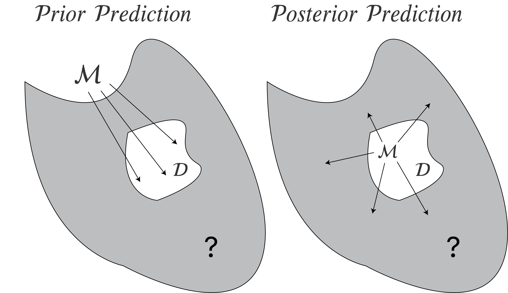

<link rel='stylesheet' href='../highlight/styles/default.css'>
<script src='../highlight/highlight.pack.js'></script>
<script>hljs.initHighlightingOnLoad();</script>
<script>$('pre.stan code').each(function(i, block) {hljs.highlightBlock(block);});</script>

Practice makes better. And faster. But what exactly is the relation between practice and reaction time? In this blog post, we will focus on two contenders: the *power law* and *exponential* function. We will implement these models in Stan and extend them to account for learning plateaus and the fact that, with increased practice, not only the mean reaction time but also its variance decreases. We will contrast two perspectives on predictive model comparison: a *(prior) predictive* perspective based on marginal likelihoods, and a *(posterior) predictive* perspective based on leave-one-out cross-validation. So let's get started![^1]


# Two models
We can model the relation between reaction time (in seconds) and the number of practice trials as a power law function. Let $f: \mathbb{N} \rightarrow \mathbb{R}^+$ be a function that maps the number of trials to reaction times. We write

$$
f_p(N) = \alpha + \beta N^{-r} \enspace ,
$$

where $\alpha$ is a lower bound (one cannot respond faster than that due to processing and motor control limits); $\beta$ is the learning gain from practice with respect to the first trial ($N = 1$); $N$ indexes the particular trial; and $r$ is the learning rate. Similarly, we can write


$$
f_e(N) = \alpha + \beta e^{-rN} \enspace ,
$$

where the parameters have the same interpretation, except that $\beta$ is the learning gain from practice compared to no practice ($N = 0$).[^2]

What is the main difference between those two functions? *The exponential model assumes a constant learning rate, while the power model assumes diminishing returns*. To see this, let $\alpha = 0$, and ignore for the moment that $N$ is discrete. Taking the derivative for the power law model results in

$$
\frac{\partial f_p(N)}{\partial N} = -r\beta N^{-r - 1} = (-r/N) \, \beta N^{-r} = (-r/N) \, f_p(N) \enspace ,
$$

which shows that the *local learning rate* --- the change in reaction time as a function of $N$ --- is $-r/N$; it depends on how many trials have been completed previously. The more one has practiced, the smaller the local learning rate $-r / N$. The exponential function, in contrast, shows no such dependency on practice:

$$
\frac{\partial f_e(N)}{\partial N} = -r\beta e^{-rN} = -r \, f_e(N) \enspace .
$$


```{r, echo = FALSE, fig.width = 14, fig.height = 7, fig.align = 'center', message = FALSE, warning = FALSE}
library('bbmle')

# simulate data
sim_power <- function(N, alpha, beta, r, t0 = 0, sdlog = 1) {
  t0 + (alpha + beta * N^(-r)) * rlnorm(length(N), 0, sdlog)
}

sim_exp <- function(N, alpha, beta, r, t0 = 0, sdlog = 1) {
  t0 + (alpha + beta * exp(-r*N)) * rlnorm(length(N), 0, sdlog)
}

plotfn <- function(x, title = '', ylim = NULL) {
  if (is.null(ylim)) {
    ylim <- round(c(min(x), max(x) + 1))
  }
  
  plot(x, xlab = 'Trials', ylab = 'Response Time (sec)',
       axes = FALSE, pch = 20, ylim = ylim, main = title, cex = 1.5, cex.main = 1.5, cex.lab = 1.5, cex.axis = 1.5)
  axis(1, las = 1)
  axis(2, las = 1, at = seq(1, round(max(x) + 1), .5))
}

negative_llh_pow <- function(y, N, alpha, beta, r, sigma_e, tau = 0) {
  -sum(dnorm(y, alpha + beta * (tau + 1) / (tau + N^r), sigma_e, log = TRUE))
}

negative_llh_exp <- function(y, N, alpha, beta, r, sigma_e, tau = 0) {
  -sum(dnorm(y, alpha + beta * (tau + 1) / (tau + exp(r*N)), sigma_e, log = TRUE))
}

fit_model <- function(y, model = 'exp', tau = FALSE) {
  if (model == 'exp') {
    if (tau) {
      fn <- function(alpha, beta, r, sigma_e, tau) negative_llh_exp(y, seq_along(y), alpha, beta, r, sigma_e, tau)
    } else {
      fn <- function(alpha, beta, r, sigma_e) negative_llh_exp(y, seq_along(y), alpha, beta, r, sigma_e)
    }
  } else {
    if (tau) {
      fn <- function(alpha, beta, r, sigma_e, tau) negative_llh_pow(y, seq_along(y), alpha, beta, r, sigma_e, tau)
    } else {
      fn <- function(alpha, beta, r, sigma_e) negative_llh_pow(y, seq_along(y), alpha, beta, r, sigma_e)
    }
  }
  
  start_vals <- list(
    'alpha' = runif(1, 0, 2), 'beta' = runif(1, 0, 2),
    'r' = runif(1, 0, 1), 'sigma_e' = runif(1, 0, 1)
  )
  
  upper <- c('alpha' = 10, 'beta' = 20, 'r' = 10, 'sigma_e' = 1)
  lower <- c('alpha' = 0, 'beta' = 0, 'r' = 0, 'sigma_e' = .0001)
  
  if (tau) {
    upper[['tau']] <- 5000
    lower[['tau']] <- 0
    start_vals[['tau']] <- runif(1, 0, 10)
  }
  
  
  fit <- mle2(
    fn, start = start_vals, method = 'L-BFGS-B',
    lower = lower, upper = upper
  )
  
  fit
}

add_lines <- function(N, fit_pow, fit_exp) {
  ns <- seq(N)
  cp <- coef(fit_pow)
  ce <- coef(fit_exp)
  lines(ns, ce[1] + ce[2] * exp(-ce[3]*ns), lty = 1, lwd = 2)
  lines(ns, cp[1] + cp[2] * ns^(-cp[3]), lty = 2, lwd = 2)
  legend('topright', legend = c('Power Law', 'Exponential'), lty = c(2, 1), bty = 'n', cex = 1.2)
}

set.seed(1)
N <- 60
ns <- seq(N)
xp <- sim_power(ns, 1, 2, .5, .3, .1)
xe <- sim_exp(ns, 1, 1.5, .1, .3, .1)

 set.seed(1)
n <- 30
ns <- seq(n)
xp <- sim_power(ns, 1, 2, .7, .3, .05)
xe <- sim_exp(ns, 1, 2, .2, .3, .05)

par(mfrow = c(1, 2))
plotfn(xp, title = 'Power Law Data', ylim = c(1, 4))
add_lines(N, fit_model(xp, 'power'), fit_model(xp, 'exp'))
plotfn(xe, title = 'Exponential Law Data')
add_lines(N, fit_model(xe, 'power'), fit_model(xe, 'exp'))
```

The figure above visualizes two data sets, generated from either a power law (left) or an exponential model (right), as well as the maximum likelihood fit of both models to these data. It is rather difficult to tell which model performs best just by eyeballing the fit. We thus need to engage in a more formal way of comparing models.


# Two perspectives on prediction
Let's agree that the best way to compare models is to look at predictive accuracy. Predictive accuracy with respect to what? The figure below illustrates two different answers one might give. The grey shaded surface represents unobserved data; the white island inside is the observed data; the model is denoted by $\mathcal{M}$.



On the left, the model makes predictions *before* seeing any data by means of its *prior predictive distribution*. The predictive accuracy is then evaluated on the actually observed data. In contrast, on the right, the model makes predictions *after* seeing the data by means of its *posterior predictive distribution*. In principle, its predictive accuracy is evaluated on data one does not observe (visualized as the grey area). One can estimate this expected *out-of-sample* predictive accuracy by cross-validation procedures which partition the observed data into a training and test set. The model only sees the training set, and makes predictions for the unseen test set.

One key practical distinction between these two perspectives is how predictions are generated. On the left, predictions are generated from the prior. On the right, the prior first gets updated to the posterior using the observed data, and it is through the posterior that predictions are made. In the next two sections, we make this difference more precise.[^3]


## Prior prediction: Marginal likelihoods
From this perspective, we weight the model's prediction of the observed data given a particular parameter setting by the prior. This is accomplished by integrating the likelihood with respect to the prior, which gives the so-called *marginal likelihood* of a model $\mathcal{M}$:

$$
p(y \mid \mathcal{M}) = \int_{\Theta} p(y \mid \theta, \mathcal{M}) \, p(\theta \mid \mathcal{M}) \, \mathrm{d}\theta \enspace .
$$

It is clear that the prior matters a great deal, but that is no surprise --- it is part of the model. A bad prior means a bad model. The ratio of two such marginal likelihoods is known as the Bayes factor.

If one is willing to assign priors to models, one can compute posterior model probabilities, i.e.,

$$
\begin{equation}
p(\mathcal{M}_k \mid y) = p(\mathcal{M}_k) \times \frac{p(y \mid \mathcal{M}_k)}{\sum_{i=1}^K p(y \mid \mathcal{M}_i) \, p(\mathcal{M}_i)} \enspace ,
\end{equation}
$$

where $K$ is the number of models under consideration (see also a [previous](https://fdabl.github.io/r/Spike-and-Slab.html) blogpost). Observe that the marginal likelihood features prominently: it is an updating factor from prior to posterior model probability. With this, one can also compute *Bayesian model-averaged* predictions:

$$
p(\tilde{y} \mid y) = \sum_{k=1}^K p(\tilde{y} \mid y, \mathcal{M}_k) \, \underbrace{p(\mathcal{M}_k \mid y)}_{w_k} \enspace ,
$$

where $\tilde{y}$ is unseen data, and where the prediction of each model gets weighted by its posterior probability. We denote a model weight, which in this case is its posterior probability, as $w_k$.


## Posterior prediction: Leave-one-out cross-validation
Another perspective aims to estimate the expected out-of-sample prediction error, or expected log predictive density, i.e.,

$$
\text{elpd}^{\mathcal{M}} = \mathbb{E}_{\tilde{y}} \left(\text{log} \, p(\tilde{y} \mid y) \right) \enspace ,
$$

where the expectation is taken with respect to unseen data $\tilde{y}$ (which is visualized as a grey surface with an $?$ inside in the figure above).

Clearly, as we do not have access to unseen data, we cannot evaluate this. However, one can approximate this quantity by computing the leave-one-out prediction error in our sample:

$$
\widehat{\text{elpd}}^{\mathcal{M}}_{\text{loo}} = \frac{1}{n} \sum_{i=1}^n \, \text{log} \, p(y_i \mid y_{-i}) \approx \mathbb{E}_{\tilde{y}} \left(\text{log} \, p(\tilde{y} \mid y) \right) \enspace,
$$

where $y_i$ is the $i^{\text{th}}$ data point, and $y_{-i}$ are all data points except $y_i$, where we have suppressed conditioning on $\mathcal{M}$ to not clutter notation (even more), and where

$$
\begin{aligned}
p(y_i \mid y_{-i}) &= \int_{\Theta} p(y_i, \theta \mid y_{-i}) \, \mathrm{d}\theta \\[.5em]
&= \int_{\Theta} p(y_i \mid y_{-i}, \theta) \, p(\theta \mid y_{-i}) \, \mathrm{d}\theta \enspace .
\end{aligned}
$$

Observe that this requires integrating over the *posterior distribution* of $\theta$ given all but one data point; this is in contrast to the marginal likelihood perspective, which requires integration with respect to the *prior distribution*. From this perspective, one can similarly compute model weights $w_k$

$$
w_k = \frac{\text{exp}\left(\widehat{\text{elpd}}^{\mathcal{M}_k}_{\text{loo}}\right)}{\sum_{i=1}^K \text{exp}\left(\widehat{\text{elpd}}^{\mathcal{M}_i}_{\text{loo}}\right)} \enspace ,
$$

where $\widehat{\text{elpd}}_{\text{loo}}^{\mathcal{M}_k}$ is the loo estimate for the expected log predictive density for model $\mathcal{M}_k$. For prediction, one averages across models using these *Pseudo Bayesian model-averaging* weights (Yao et al., 2018, p. 92).

However, Yao et al. (2018) and Vehtari et al. (2019) recommend against using these Pseudo BMA weights, as they do not take the uncertainty of the loo estimates into account. Instead, they suggest using Pseudo-BMA+ weights or stacking. For details, see Yao et al. (2018).

For an illuminating discussion about model selection based on marginal likelihoods or leave-one-out cross-validation, see Gronau & Wagenmakers ([2019a](https://link.springer.com/article/10.1007/s42113-018-0011-7)), Vehtari et al. ([2019](https://link.springer.com/article/10.1007/s42113-018-0020-6)), and Gronau & Wagenmakers ([2019b](https://link.springer.com/article/10.1007/s42113-018-0022-4)).

Now that we have taken a look at these two perspectives on prediction, in the next section, we will implement the power law and the exponential model in Stan.

<!-- $$ -->
<!-- \begin{aligned} -->
<!-- \text{PSBF}_{10} &= \frac{\prod_{i=1}^n p(y_i \mid y_{-i}, \mathcal{M}_1)}{\prod_{i=1}^n p(y_i \mid y_{-i}, \mathcal{M}_0)} \\[1em] -->
<!-- &= \text{exp}\left(\text{log} \, \prod_{i=1}^n p(y_i \mid y_{-i}, \mathcal{M}_1) - \text{log} \, \prod_{i=1}^n p(y_i \mid y_{-i}, \mathcal{M}_0)\right) \\[.5em] -->
<!-- &= \text{exp}\left(\sum_{i=1}^n \text{log} \, p(y_i \mid y_{-i}, \mathcal{M}_1) - \sum_{i=1}^n \text{log} \, p(y_i \mid y_{-i}, \mathcal{M}_0)\right) \\[.5em] -->
<!-- &= \text{exp}\left(\hat{\text{elpd}}^{\mathcal{M}_1}_{\text{loo}} - \hat{\text{elpd}}^{\mathcal{M}_0}_{\text{loo}} \right) \enspace . -->
<!-- \end{aligned} -->
<!-- $$ -->


# Implementation in Stan
As is common in psychology, people do not deterministically follow a power law or an exponential law. Instead, the law is probabilistic: given the same task, the person will respond faster or slower, never exactly as before. To allow for this, we assume that there is Gaussian noise around the function value. In particular, we assume that

$$
\text{RT}_N \sim \mathcal{N}\left(\alpha + \beta N^{-r}, \sigma_e^2\right) \enspace .
$$

Note that are not normally distributed; we address this later. We make the same assumption for the exponential model. The following code implements the power law model in Stan.

```{stan output.var='priors', eval=FALSE, tidy=FALSE}
// In the data block, we specify everything that is relevant for
// specifying the data. Note that PRIOR_ONLY is a dummy variable used later.

data {
  int<lower=1> n;
  real y[n];
  int<lower=0, upper=1> PRIOR_ONLY;
}


// In the parameters block, we specify all parameters we need.
// Although Stan implicitly adds flat priors on the (positive) real line
// we will specify informative priors below.

parameters {
  real<lower=0> r;
  real<lower=0> alpha;
  real<lower=0> beta;
  real<lower=0> sigma_e;
}

// In the model block, we specify our informative priors and
// the likelihood of the model, unless we want to sample only from
// the prior (i.e., if PRIOR_ONLY == 1)

model {
  target += lognormal_lpdf(alpha | 0, .5);
  target += lognormal_lpdf(beta | 1, .5);
  target += gamma_lpdf(r | 1, 3);
  target += gamma_lpdf(sigma_e | 0.5, 5);

  if (PRIOR_ONLY == 0) {
    for (trial in 1:n) {
      target += normal_lpdf(y[trial] | alpha + beta * trial^(-r), sigma_e);
    }
  }
}

// In this block, we make posterior predictions (ypred) and compute
// the log likelihood of each data point (log_lik)
// which is needed for the computation of loo later

generated quantities {
  real ypred[n];
  real log_lik[n];

  for (trial in 1:n) {
    ypred[trial] = normal_rng(alpha + beta * trial^(-r), sigma_e);
    log_lik[trial] = normal_lpdf(y[trial] | alpha + beta * trial^(-r), sigma_e);
  }

}
```

From a marginal likelihood perspective, the prior is an integral part of the model; this means we have to think very carefully about it. There are several principles that can guide us (see also Lee & Vanpaemel, 2018), but one that is particularly helpful here is to look at the prior predictive distribution. Do draws from the prior predictive distribution look like what we had in mind? Below, I have visualized the mean, the standard deviation around the mean, and several draws from it for (a) flat priors on the positive real line, and (b) informed priors that I chose based on reading Evans et al. (2018). In the Stan code, you can specify flat priors by commenting out the priors we have specified in the model block.

```{r, echo = FALSE, fig.width = 14, fig.height = 7, fig.align = 'center', message = FALSE, warning = FALSE}
library('rstan')

n <- length(ns)
fit1 <- sampling(readRDS('stan-compiled/compiled-power-prior-bad.RDS'),
                 data = list('y' = runif(n), 'n' = n), refresh = FALSE)
fit2 <- sampling(readRDS('stan-compiled/compiled-power-model.RDS'),
                 data = list('y' = runif(n), 'n' = n, 'PRIOR_ONLY' = 1), refresh = FALSE)

fite <- sampling(readRDS('stan-compiled/compiled-exponential-model.RDS'),
                 data = list('y' = runif(n), 'n' = n, 'PRIOR_ONLY' = 1), refresh = FALSE)


ypred1 <- rstan::extract(fit1, 'ypred')$ypred
ypred2 <- rstan::extract(fit2, 'ypred')$ypred

plot_pred <- function(
  ypred, nr_samples = 25, title = '',
  ylim = c(0, 8), shade_col = 'grey', lty = 'solid'
) {
  
  ns <- seq(ncol(ypred))
  sds <- apply(ypred, 2, sd)
  means <- apply(ypred, 2, mean)
  lo <- means - sds
  hi <- means + sds
  plot(means, type = 'l', main = title,
       ylim = ylim, panel.first =
       polygon(c(ns, rev(ns)), c(lo, rev(hi)),
       col = grDevices::adjustcolor(shade_col, alpha = .4), border = NA),
       xlab = 'Trials', ylab = 'Response Time (sec)', axes = FALSE,
       cex.axis = 1.5, cex.lab = 1.5, cex.main = 1.5, cex = 1.5,
       lty = lty
  )
  
  axis(2, las = 1)
  axis(1, at = seq(0, ncol(ypred), 5))
  
  for (i in sample(nrow(ypred), size = nr_samples)) {
    lines(ypred[i, ], col = 'skyblue')
  }
}

par(mfrow = c(1, 2))
set.seed(1)
plot_pred(ypred1, title = 'Prior Predictions: Flat Priors')
plot_pred(ypred2, title = 'Prior Predictions: Informed priors')
```

The Figure on the left shows that flat priors make terrible predictions. The mean of the prior predictive distribution is a constant function at zero, which is not at all what we had in mind when writing down the power law model. Even worse, flat priors allow for negative reaction time, something that is clearly impossible! In contrast, the Figure on the right seems reasonable. Below I have visualized the informed priors.

```{r, echo = FALSE, fig.width = 14, fig.height = 9, fig.align = 'center', message = FALSE, warning = FALSE}
library('latex2exp')

alpha <- seq(0, 10, .001)
beta <- seq(0, 10, .001)
r <- seq(0, 3, .001)
sigma_e <- seq(0, 2, .001)

par(mfrow = c(2, 2))
plot(alpha, dlnorm(alpha, mean = 1, sd = .5), xlim = c(0, 10), type = 'l', ylab = 'Density', lty = 1,
     xlab = TeX('$\\alpha$'), las = 1, lwd = 1, cex.lab = 1.5, cex.main = 1.5,
     cex.main = 1.5, axes = FALSE, main = 'Lognormal(1, 1/2)')
axis(2, las = 1); axis(1, at = seq(0, 10, 1))

plot(beta, dlnorm(beta, mean = 1, sd = .5), xlim = c(0, 10), type = 'l', ylab = 'Density', lty = 1,
     xlab = TeX('$\\beta$'), las = 1, lwd = 1, cex.lab = 1.5, cex.main = 1.5,
     cex.lab = 1.5, cex.main = 1.5, axes = FALSE, main = 'Lognormal(1, 1/2)')
axis(2, las = 1); axis(1, at = seq(0, 10, 1))

plot(r, dgamma(r, 1, 3), xlim = c(0, 3), type = 'l', ylab = 'Density', lty = 1,
     xlab = TeX('$r$'), las = 1, lwd = 1, cex.lab = 1.5, cex.main = 1.5,
     cex.main = 1.5, axes = FALSE, main = 'Gamma(1, 3)')
axis(2, las = 1); axis(1, at = seq(0, 3, 1))

plot(sigma_e, dgamma(sigma_e, .5, 5), xlim = c(0, .6), type = 'l', ylab = 'Density', lty = 1,
     xlab = TeX('$\\sigma_e$'), las = 1, lwd = 1, cex.lab = 1.5, cex.main = 1.5,
     cex.main = 1.5, axes = FALSE, main = 'Gamma(1/2, 5)')
axis(2, las = 1); axis(1, at = seq(0, 1, .2))
```

From a cross-validation perspective, priors do not matter *that* much; prediction is conditional on the observed data, and so the prior is transformed to a posterior before the model makes predictions. If the prior is not too misspecified, or if we have a sufficient amount of data so that the prior has only a weak influence on the posterior, a model's posterior predictions will not markedly depend on it.

# Practical model comparison
Let's check whether we select the correct model for the power law and the exponential data, respectively. I have generated the data above using the following code, which will make sense later in the blog post.

```{r}
sim_power <- function(N, alpha, beta, r, delta = 0, sdlog = 1) {
  delta + rlnorm(length(N), log(alpha + beta * N^(-r)), sdlog)
}

sim_exp <- function(N, alpha, beta, r, delta = 0, sdlog = 1) {
  delta + rlnorm(length(N), log(alpha + beta * exp(-r*N)), sdlog)
}

set.seed(1)
n <- 30
ns <- seq(n)
xp <- sim_power(ns, 1, 2, .7, .3, .05)
xe <- sim_exp(ns, 1, 2, .2, .3, .05)
```

We use the *bridgesampling* and the *loo* package to estimate Bayes factors and loo scores and stacking weights, respectively.

```{r, message = FALSE, warning = FALSE}
library('loo')
library('bridgesampling')

comp_power <- readRDS('stan-compiled/compiled-power-model.RDS')
comp_exp <- readRDS('stan-compiled/compiled-exponential-model.RDS')

# power model data
fit_pp <- sampling(
  comp_power,
  data = list('y' = xp, 'n' = n, 'PRIOR_ONLY' = 0),
  refresh = FALSE, chains = 4, iter = 8000, seed = 1
)

fit_ep <- sampling(
  comp_exp,
  data = list('y' = xp, 'n' = n, 'PRIOR_ONLY' = 0),
  refresh = FALSE, chains = 4, iter = 8000, seed = 1
)

# exponential data
fit_pe <- sampling(
  comp_power,
  data = list('y' = xe, 'n' = n, 'PRIOR_ONLY' = 0),
  refresh = FALSE, chains = 4, iter = 8000, seed = 1
)

fit_ee <- sampling(
  comp_exp,
  data = list('y' = xe, 'n' = n, 'PRIOR_ONLY' = 0),
  refresh = FALSE, chains = 4, iter = 8000, seed = 1
)
```

But before we do so, let's visualize the posterior predictions of both models for each simulated data set, respectively.

```{r, echo = FALSE, fig.width = 14, fig.height = 7, fig.align = 'center', message = FALSE, warning = FALSE}
ypred_pp <- rstan::extract(fit_pp)[['ypred']]
ypred_ep <- rstan::extract(fit_ep)[['ypred']]

ypred_pe <- rstan::extract(fit_pe)[['ypred']]
ypred_ee <- rstan::extract(fit_ee)[['ypred']]

par(mfrow = c(1, 2))
plot_pred(ypred_pp, nr_samples = 0, title = 'Posterior Predictions: Power Law Data', ylim = c(1, 4), lty = 'dashed')
points(xp, pch = 20)
par(new = TRUE)
plot_pred(ypred_ep, nr_samples = 0, title = '', ylim = c(1, 4), lty = 'solid', shade_col = 'skyblue')
legend('topright', legend = c('Power Law', 'Exponential'), lty = c(2, 1), bty = 'n', cex = 1.2)

plot_pred(ypred_pe, nr_samples = 0, title = 'Posterior Predictions: Exponential Law Data', ylim = c(1, 4), lty = 'dashed')
points(xe, pch = 20)
par(new = TRUE)
plot_pred(ypred_ee, nr_samples = 0, title = '', ylim = c(1, 4), lty = 'solid', shade_col = 'skyblue')
legend('topright', legend = c('Power Law', 'Exponential'), lty = c(2, 1), bty = 'n', cex = 1.2)
```

In the figure on the left, we see that the posterior predictions for the exponential model have a larger variance compared to the predictions of the power law model. Conversely, on the right it seems that the exponential model gives the better predictions.[^4]

We first compare the two models on the power law data, using the Bayes factor and loo. With the former, we find overwhelming evidence in favour of the power law model.

```{r}
bayes_factor(
  bridge_sampler(fit_pp, silent = TRUE),
  bridge_sampler(fit_ep, silent = TRUE)
)
```

Note that this estimate can vary with different runs (since we were stingy in sampling from the posterior). The comparison using loo yields the following output:

```{r}
loo_pp <- loo(fit_pp)
loo_ep <- loo(fit_ep)

loo_compare(loo_pp, loo_ep)
```

Note that the best model is always on top, and the comparison is already on the difference score. Following a two standard error heuristic (but see [here](https://discourse.mc-stan.org/t/interpreting-output-from-compare-of-loo/3380/4)), since the difference in the elpd scores is more than twice its standard error, we would choose the power law model as the better model. **But wait** -- what do these warnings mean? Let's look at the output of the loo function for the exponential law (suppressing the warning):

```{r, warning=FALSE}
loo_ep
```

We find that there are is one very bad Pareto $k$ value. What does this mean? There are many details about loo that you can read up on in Vehtari et al. (2018). Put briefly, to efficiently compute the loo score of a model, Vehtari et al. (2018) use *importance sampling* to compute the predictive density, which requires finding importance weights to better approximate this density. These importance weights are known to be unstable, and the authors introduce a particular stabilizing transformation which they call "Pareto smoothed importance sampling" (PSIS). The parameter $k$ is the shape parameter of this (generalized) Pareto distribution. If it is high, such as $k > 0.7$ as we find for one data point here, then this implies unstable estimates --- we should probably not trust the loo estimate for this model.[^5] Similarly pathological behaviour can be diagnosed by p_loo, which gives an estimate of the effective number of parameters. In this case, this is about double the number of actual parameters ($\alpha, \beta, r, \sigma_e^2$).

The two figures below visualize the $k$ values for each data point. We see that loo has troubles predicting the first data point for both the exponential and power law model.

```{r, echo = FALSE, fig.width = 14, fig.height = 7, fig.align = 'center', message = FALSE, warning = FALSE}
par(mfrow = c(1, 2))
plot(loo_ep, main = 'PSIS Diagnostic: Exponential')
plot(loo_pp, main = 'PSIS Diagnostic: Power Law')
```

We can also compute the stacking weights; but again, one should probably not trust these estimates:

```{r, warning=FALSE}
stacking_weights <- function(fit1, fit2) {
  log_lik_list <- list(
    '1' = extract_log_lik(fit1),
    '2' = extract_log_lik(fit2)
  )
  
  r_eff_list <- list(
    '1' = relative_eff(extract_log_lik(fit1, merge_chains = FALSE)),
    '2' = relative_eff(extract_log_lik(fit2, merge_chains = FALSE))
  )
  
  loo_model_weights(log_lik_list, method = 'stacking', r_eff_list = r_eff_list)
}

stacking_weights(fit_pp, fit_ep)
```

We could compute a "Stacked Pseudo Bayes factor" by taking the ratio of these two weights to see how much more weight one model is given compared to the other.[^6] This yields a factor of about 120 in favour of the power law model.

We can make the same comparisons using the exponential data. The Bayes factor again yields overwhelming support for the model that is closer to the true model, i.e., in this case the exponential model.[^7] But note that the evidence is an order of magnitude smaller than in the above comparison.

```{r}
bayes_factor(
  bridge_sampler(fit_ee, silent = TRUE),
  bridge_sampler(fit_pe, silent = TRUE)
)
```

This marked decrease in evidence is also tracked by loo, which now tells us that we cannot reliably distinguish between the two models[^8]:

```{r}
loo_compare(loo(fit_ee), loo(fit_pe))
```

Note that while we still get warnings, this time we only have one data point with $k \in [0.7, 1]$, which is bad, but not very bad. The stacking weights show that there is not a clear winner, with a factor of only about 6 in favour of the exponential model:

```{r, warning=FALSE}
stacking_weights(fit_ee, fit_pe)
```

Now that we have seen how one might compare these models in practice, in the next two sections, we will see how we can extend the model to be more realistic. To that end, I will focus only on the exponential model. In fact, the exponential model is what many researchers now prefer as the "law of practice". In a very influential article, Newell & Rosenbloom (1981) found that a power law fit best for data from a wide variety of tasks. While they relied on averaged data, Heathcote et al. (2000) looked at participant-specific data. They found that the decrease in reaction time follows an exponential function, implying that previous results were biased due to averaging; in fact, one can show that the (arithmetic) averaging of many exponential (i.e., non-linear) functions can lead to a group-level power law when individual differences exist (Myung, Kim, & Pitt, 2000).


# Extension I: Modeling plateaus
The above two models assume that participants *get it* from the first trial onwards, and become better immediately. However, real data often exhibits a *plateau*. We simulate such data using the following lines of code.

```{r}
set.seed(1)
dat <- c(
  rlnorm(15, 1.25, .1),
  sim_exp(seq(16, 50), 2, 5, .1, 0, .1)
)
```

```{r, echo = FALSE, fig.width = 9, fig.height = 7, fig.align = 'center', message = FALSE, warning = FALSE}
sim_power_plat <- function(N, alpha, beta, r, tau = 8, t0 = 0, sdlog = 1) {
  t0 + (alpha + beta * (tau + 1) / (tau + N^r)) * rlnorm(length(N), 0, sdlog)
}

ns <- seq(50)
#plotfn(dat, ylim = c(1, 6), title = '')
plot(dat, xlab = 'Trials', ylab = 'Response Time (sec)', ylim = c(1, 5), main = 'Data with a Plateau',
       axes = FALSE, pch = 20, cex = 1.5, cex.main = 1.5, cex.lab = 1.5, cex.axis = 1.5)
axis(1, las = 1, at = seq(0, 50, 5))
axis(2, las = 1)
  
cp <- coef(fit_model(dat, model = 'exp', tau = FALSE))
taum <- coef(fit_model(dat, model = 'exp', tau = TRUE))
lines(cp[1] + cp[2] * exp(-cp[3]*ns), lty = 2)
lines(taum[1] + taum[2] * (taum[5] + 1) / (taum[5] + exp(ns*taum[3])), lty = 1)

# lines(cp[1] + cp[2] * ns2^(-cp[3]), lty = 2)
# lines(taum[1] + taum[2] * (taum[5] + 1) / (taum[5] + ns2^taum[3]), lty = 1)
legend('topright', c('Exponential', 'Delayed Exponential'), lty = c(2, 1), bty = 'n', cex = 1.2)
```

How can we model this? Evans et al. (2018) suggest introducing a single parameter, $\tau$, and adjusting the model as follows:

$$
f_e(N) = \alpha + \beta \, \frac{\tau + 1}{\tau + e^{rN}} \enspace .
$$

Observe that for $\tau = 0$, we recover the original exponential model. For $\tau \rightarrow \infty$, the function becomes a constant function $\alpha + \beta$. Thus, large values for $\tau$ (and large values for $r$, so as to model the steep drop in reaction time) allow us to model the initial plateau we find in real data.

We can adjust the model in Stan easily:

```{stan output.var='priors', eval=FALSE, tidy=FALSE}
data {
  int<lower=1> n;
  real y[n];
  int<lower=0, upper=1> PRIOR_ONLY;
}

parameters {
  real<lower=0> r;
  real<lower=0> alpha;
  real<lower=0> beta;
  real<lower=0> sigma_e;
  real<lower=0> tau;
}

model {
  real mu;
  target += cauchy_lpdf(tau | 0, 1);
  target += lognormal_lpdf(alpha | 0, .5);
  target += lognormal_lpdf(beta | 1, .5);
  target += gamma_lpdf(r | 1, 3);
  target += gamma_lpdf(sigma_e | 0.5, 5);

  if (PRIOR_ONLY == 0) {
    for (trial in 1:n) {
      mu = alpha + beta * (tau + 1) / (tau + exp(r * trial));
      target += normal_lpdf(y[trial] | mu, sigma_e);
    }
  }
}

generated quantities {
  real mu;
  real ypred[n];
  real log_lik[n];

  for (trial in 1:n) {
    mu = alpha + beta * (tau + 1) / (tau + exp(r * trial));
    ypred[trial] = normal_rng(mu, sigma_e);
    log_lik[trial] = normal_lpdf(y[trial] | mu, sigma_e);
  }

}
```

We have put a half-Cauchy prior on $\tau$. This is because the Cauchy distribution has very fat tails, compared to for example the Normal or the Laplace distribution; see Figure below. This is desired, because we need large $\tau$ values to accommodate plateaus.

```{r, echo = FALSE, fig.width = 14, fig.height = 7, fig.align = 'center', message = FALSE, warning = FALSE}
library('RColorBrewer')
cols <- brewer.pal(3, 'Set1')

tau <- seq(0, 10, .001)

par(mfrow = c(1, 2))
plot(tau, dcauchy(tau, 0, 1)*2, xlim = c(0, 6), ylim = c(0, 1), type = 'l', ylab = 'Density', lty = 1,
     xlab = TeX('$\\tau$'), las = 1, lwd = 1, cex.lab = 1.5, cex.axis = 1.5,
     cex.main = 1.5, axes = FALSE, main = 'Tail behaviour', col = cols[1])
axis(2, las = 1); axis(1, at = seq(0, 6, 1))
lines(tau, dnorm(tau, 0, 1)*2, col = cols[2])
lines(tau, LaplacesDemon::dlaplace(tau, 0, 1)*2, col = cols[3])
legend('topright', legend = c('Cauchy', 'Normal', 'Laplace'), col = cols, bty = 'n', cex = 1.2, lty = 1)

plot(tau, dcauchy(tau, 0, 1, log = TRUE) + log(2), xlim = c(0, 10), ylim = c(-6, 2), type = 'l', ylab = 'Log Density', lty = 1,
     xlab = TeX('$\\tau$'), las = 1, lwd = 1, cex.lab = 1.5, cex.axis = 1.5,
     cex.main = 1.5, axes = FALSE, main = 'Tail behaviour (Log)', col = cols[1])
axis(2, las = 1); axis(1, at = seq(0, 10, 1))
lines(tau, dnorm(tau, 0, 1, log = TRUE) + log(2), col = cols[2])
lines(tau, LaplacesDemon::dlaplace(tau, 0, 1, log = TRUE) + log(2), col = cols[3])
legend('topright', legend = c('Cauchy', 'Normal', 'Laplace'), col = cols, bty = 'n', cex = 1.2, lty = 1)
```


The figure below compares the prior predictive distributions of the exponential to the *delayed exponential* model. As we can see, the additional $\tau$ parameter creates larger uncertainty in the predictions, with the some individual draws looking completely different from each other. [Drawing samples from a Cauchy](https://betanalpha.github.io/assets/case_studies/fitting_the_cauchy.html), whose mean and variance are [undefined](https://en.wikipedia.org/wiki/Cauchy_distribution#Explanation_of_undefined_moments), is tricky. 

```{r, echo = FALSE, fig.width = 14, fig.height = 7, fig.align = 'center', message = FALSE, warning = FALSE}
comp_exp_delayed <- readRDS('stan-compiled/compiled-delayed-exponential-model.RDS')

fit_ee <- sampling(
  comp_exp,
  data = list('y' = dat, 'n' = 50, 'PRIOR_ONLY' = 1),
  refresh = FALSE, chains = 4, iter = 4000
)

fit_ee2 <- sampling(
  comp_exp_delayed,
  data = list('y' = dat, 'n' = 50, 'PRIOR_ONLY' = 1),
  refresh = FALSE, chains = 4, iter = 4000
)

ypred1 <- rstan::extract(fit_ee, 'ypred')$ypred
ypred2 <- rstan::extract(fit_ee2, 'ypred')$ypred

par(mfrow = c(1, 2))
plot_pred(ypred1, title = 'Prior Predictions: Exponential Model')
plot_pred(ypred2, title = 'Prior Predictions: Delayed Exponential Model')
```

However, if we compare the two models to each other on the plateau data set, we see that the extended model predicts the data better:

```{r}
fit_ee <- sampling(
  comp_exp,
  data = list('y' = dat, 'n' = 50, 'PRIOR_ONLY' = 0),
  refresh = FALSE, chains = 4, iter = 8000, seed = 1
)

fit_ee_plateau <- sampling(
  comp_exp_delayed,
  data = list('y' = dat, 'n' = 50, 'PRIOR_ONLY' = 0),
  refresh = FALSE, chains = 4, iter = 8000, seed = 1
)

bayes_factor(
  bridge_sampler(fit_ee_plateau, silent = TRUE, method = 'warp3'),
  bridge_sampler(fit_ee, silent = TRUE, method = 'warp3')
)
```

This is a large Bayes factor. However, loo seems to favour the delayed exponential model much more, by about three standard errors:

```{r}
loo_compare(loo(fit_ee_plateau), loo(fit_ee))
```

This is also reflected in an extreme difference in stacking weights, which completely discounts the standard exponential model:

```{r}
stacking_weights(fit_ee_plateau, fit_ee)
```

Earlier, when comparing the exponential and power model on data generated from an exponential model, we found a Bayes factor in favour of the exponential model of about 1000, while the difference in loo was only about 1.5 standard errors. Here, we now find a Bayes factor in favour of the delayed exponential model of only about 150, while loo finds a difference of about three standard errors. This contrast becomes is illuminated by visualizing the posterior predictive distribution, see below.

```{r, echo = FALSE, fig.width = 8, fig.height = 7, fig.align = 'center', message = FALSE, warning = FALSE}
ypred_ee <- rstan::extract(fit_ee, 'ypred')$ypred
ypred_ee_plateau <- rstan::extract(fit_ee_plateau, 'ypred')$ypred

plot_pred(ypred_ee, nr_samples = 0, title = 'Data with a Plateau: Posterior Predictions', ylim = c(1, 5), lty = 'dashed')
points(dat, pch = 20)
par(new = TRUE)
plot_pred(ypred_ee_plateau, nr_samples = 0, title = '', ylim = c(1, 5), lty = 'solid', shade_col = 'skyblue')
legend('topright', legend = c('Exponential', 'Delayed Exponential'), lty = c(2, 1), bty = 'n', cex = 1.2)
```

We see that the delayed exponential model seems to "fit" the data much better.[^9] Since loo basically uses this posterior predictive distribution (except that it removes one data point) to predict individual data points, it now seems clearer why it should favour the delayed exponential model so much more strongly. In contrast, the prior predictive distributions of the exponential and the delayed exponential (visualized above) are rather similar. Since the Bayes factor evaluated the probability of the data given these prior predictive distributions, the evidence in favour of the delayed exponential model is only modest.

# Extension II: Modeling reaction times
## The Lognormal distribution
Reaction times are well known to be non-normally distributed. One popular distribution for them is the *Lognormal distribution*. Let $X \sim \mathcal{N}(\mu, \sigma^2)$. Then $Z = e^X$ is lognormally distributed. To arrive at its density function, we do a change of variables. Observe that

$$
P_z(Z \leq z) = P_z\left(e^X \leq z\right) = P_x(X \leq \text{log}\,z) = F_x(\text{log}\,z) \enspace ,
$$

where $F_x$ is the cumulative distribution function of $X$. Differentiating with respect to $z$ yields the probability density function for $Z$:

$$
p_z(z) = \frac{P_z(Z \leq z)}{\mathrm{d} z} = \frac{F_x(\text{log}\,z)}{\mathrm{d} z} = p_x(\text{log}\,z) \left|\frac{\text{log}\,z}{\mathrm{d}z}\right| = p_x(\text{log}\,z) \frac{1}{z} \enspace ,
$$

which spelled out is

$$
p_z(z) = \frac{1}{\sqrt{2\pi\sigma^2}} \text{exp}\left(-\frac{1}{2\sigma^2} (\text{log}\,z - \mu)^2\right) \frac{1}{z} \enspace .
$$

The figure below visualizes various lognormal distribution with different parameters $\mu$ and $\sigma^2$. The figure on the left shows how a change in $\sigma^2$ affects the distribution, while keeping $\mu = 1$. You can see that the "peak" of the distribution changes, indicating that the parameter $\mu$ is not independent of $\sigma^2$. In fact, while the mean and variance of a normal distribution are given by $\mu$ and $\sigma^2$, respectively, this is not so for a lognormal distribution. It seems difficult to compute the first two moments of the Lognormal distributions directly (you can try if you want!). However, there is a neat trick to compute *all* its moments basically instantaneously.


```{r, echo = FALSE, fig.width = 14, fig.height = 7, fig.align = 'center', message = FALSE, warning = FALSE}
cols <- brewer.pal(3, 'Set1')
z <- seq(0, 10, .01)

get_legend <- function(mu, sigma2) {
  TeX(sprintf('$\\mu = %.1f, \\, \\sigma^2 = %.1f', mu, sigma2))
}

par(mfrow = c(1, 2))
plot(z, dlnorm(z, mean = 2, sd = 1), xlim = c(0, 10), type = 'l', ylab = 'Density', lty = 1,
     xlab = TeX('$Z$'), las = 1, lwd = 1, cex.lab = 1.5, cex.main = 1.5, col = cols[1],
     cex.main = 1.5, axes = FALSE, main = 'Lognormal Distributions', ylim = c(0, .4))
lines(z, dlnorm(z, mean = 1, sd = 1), col = cols[2])
lines(z, dlnorm(z, mean = .5, sd = 1), col = cols[3])
axis(2, las = 1); axis(1, at = seq(0, 10, 1))


info <- c(
  get_legend(2, 1),
  get_legend(1, 1),
  get_legend(0.5, 1)
)

legend(
  'topright', col = cols,
  legend = info, box.lty = 0, lty = c(1, 1, 1), cex = 1.4, bty = 'n'
)

plot(z, dlnorm(z, mean = 1, sd = sqrt(2)), xlim = c(0, 10), type = 'l', ylab = 'Density', lty = 1,
     xlab = TeX('$Z$'), las = 1, lwd = 1, cex.lab = 1.5, cex.main = 1.5, col = cols[1],
     cex.main = 1.5, axes = FALSE, main = 'Lognormal Distributions', ylim = c(0, .4))
lines(z, dlnorm(z, mean = 1, sd = sqrt(1)), col = cols[2])
lines(z, dlnorm(z, mean = 1, sd = sqrt(.5)), col = cols[3])
axis(2, las = 1); axis(1, at = seq(0, 10, 1))


info <- c(
  get_legend(1, 2),
  get_legend(1, 1),
  get_legend(1, 0.5)
)

legend(
  'topright', col = cols,
  legend = info, box.lty = 0, lty = c(1, 1, 1), cex = 1.4, bty = 'n'
)
```


To do this, observe that the [*moment generating function*](https://en.wikipedia.org/wiki/Moment-generating_function) (MGF) of a random variable $X$ is given by

$$
M_X(t) := \mathbb{E}\left[e^{tX}\right] \enspace .
$$

Now, we're not going to use the MGF of the Lognormal --- in fact, because the integral diverges, it does not exist. Instead, we'll use the MGF of a Normal distribution. Since $Z = e^X$, we can write the $t^{\text{th}}$ moment such that

$$
\mathbb{E}\left[Z^t\right] = \mathbb{E}\left[e^{tX}\right] = M_X(t) = \text{exp}\left(t\mu + \frac{1}{2}t^2 \sigma^2\right) \enspace ,
$$

where the last term is the MGF of a normal distribution (see also Blitzstein & Hwan, 2014, p. 260-261). Thus, the mean and variance of a Lognormal distribution are given by

$$
\begin{aligned}
\mathbb{E}[Z] &= \text{exp}\left(\mu  + \frac{1}{2} \sigma^2\right) \\[.5em]
\text{Var}[Z] &= \mathbb{E}[Z^2] - \mathbb{E}[Z]^2 \\[.5em]
              &= \text{exp}\left(2\mu + 2\sigma^2\right) - \text{exp}\left(2\mu + \sigma^2\right) \\[.5em]
              &= \text{exp}\left(2\mu + \sigma^2\right) \left(\text{exp}\left(\sigma^2\right) - 1 \right) \enspace .
\end{aligned}
$$

This dependency between mean and variance is desired. In particular, it is well established that changes in mean reaction times are accompanied by proportional changes in the standard deviation (Wagenmakers & Brown, 2007).

[In contrast](https://fdabl.github.io/statistics/Two-Properties.html) to the Normal distribution, the Lognormal distribution is not closed under addition. This means that if $Z$ has a Lognormal distribution, $Z + \delta$ does not necessarily have a Lognormal distribution anymore. However, we are interested in modeling *shifts* in reaction times. For example, there is a reaction time $\alpha$ faster which participants cannot meaningfully respond. To allow for such shifts, we expand the Lognormal distribution by a parameter $\delta$ such that $Z = e^{X - \delta}$.[^10] This leads to the following density function

$$
p_z(z) = \frac{1}{\sqrt{2\pi\sigma^2}} \text{exp}\left(-\frac{1}{2\sigma^2} (\text{log}\,(z - \delta) - \mu)^2\right) \frac{1}{z - \delta} \enspace .
$$

## Extending the model
We extend the delayed exponential model such that

$$
\text{RT} \sim \text{Shifted-Lognormal}\left(\delta, \, \text{log}\left(\alpha' + \beta \frac{\tau + 1}{\tau + e^{rN}}\right), \, \sigma \right) \enspace.
$$

The median of a Shifted-Lognormal distribution is given by $\delta + e^\mu$, which is why we log the main part of the model above. Note that the previous asymptote $\alpha$ is now $\delta + \alpha'$. To be on the same scale as before, we assign $\delta$ and $\alpha'$ a Lognormal distribution with medians $0.50$ and $0.50$, respectively.

We can implement the model in Stan by writing a Shifted-Lognormal probability density function:

```{stan output.var='priors', eval=FALSE, tidy=FALSE}
// In the function block, we define our new probability density function

functions {
  real shiftlognormal_lpdf(real z, real delta, real mu, real sigma) {
    real lprob;
    
    lprob = (
      -log((z - delta)*sigma*sqrt(2*pi())) -
      (log(z - delta) - mu)^2 / (2*sigma^2)
    );
    
    return lprob;
  }
  
  real shiftlognormal_rng(real delta, real mu, real sigma) {
    return delta + lognormal_rng(mu, sigma);
  }
}

// In the data block, we specify everything that is relevant for
// specifying the data. Note that PRIOR_ONLY is a dummy variable used later.

data {
  int<lower=1> n;
  real y[n];
  int<lower=0, upper=1> PRIOR_ONLY;
}


// In the parameters block, we specify all parameters we need.
// Although Stan implicitly adds flat prior on the (positive) real line
// we will specify informative priors below.

parameters {
  real<lower=0> r;
  real<lower=0> tau;
  real<lower=0> delta;
  real<lower=0> alpha;
  real<lower=0> beta;
  real<lower=0> sigma_e;
}

// In the model block, we specify our informative priors and
// the likelihood of the model, unless we want to sample only from
// the prior (i.e., if PRIOR_ONLY == 1)

model {
  real mu;
  target += cauchy_lpdf(tau | 0, 1);
  target += lognormal_lpdf(delta | log(0.50), .5);
  target += lognormal_lpdf(alpha | log(0.50), .5);
  target += lognormal_lpdf(beta | 1, .5);
  target += gamma_lpdf(r | 1, 3);
  target += gamma_lpdf(sigma_e | 0.5, 5);

  if (PRIOR_ONLY == 0) {
    for (trial in 1:n) {
      mu = log(alpha + beta * (tau + 1) / (tau + exp(r*trial)));
      target += shiftlognormal_lpdf(y[trial] | delta, mu, sigma_e);
    }
  }
}

// In this block, we make posterior predictions (ypred) and compute
// the log likelihood of each data point given all the others (log_lik)
// which is needed for the computation of loo later

generated quantities {
  real mu;
  real ypred[n];
  real log_lik[n];

  for (trial in 1:n) {
    mu = log(alpha + beta * (tau + 1) / (tau + exp(r*trial)));
    ypred[trial] = shiftlognormal_rng(delta, mu, sigma_e);
    log_lik[trial] = shiftlognormal_lpdf(y[trial] | delta, mu, sigma_e);
  }

}
```

Visualizing the prior predictive distribution bares only limited insight into how these two models differ:

```{r, echo = FALSE, fig.width = 14, fig.height = 7, fig.align = 'center', message = FALSE, warning = FALSE}
comp_exp_delayed_log <- readRDS('stan-compiled/compiled-delayed-lognormal-exponential-model.RDS')

fit_ee3 <- sampling(
  comp_exp_delayed_log,
  data = list('y' = dat, 'n' = 50, 'PRIOR_ONLY' = 1),
  refresh = FALSE, chains = 4, iter = 4000
)

ypred3 <- rstan::extract(fit_ee3, 'ypred')$ypred

par(mfrow = c(1, 2))
plot_pred(ypred2, title = 'Prior Predictions: Delayed Model')
plot_pred(ypred3, title = 'Prior Predictions: Delayed Lognormal Model')
```

The Bayes factor in favour of the lognormal model is quite large:

```{r}
fit_ee_plateau_lognormal <- sampling(
  comp_exp_delayed_log,
  data = list('y' = dat, 'n' = 50, 'PRIOR_ONLY' = 0),
  refresh = FALSE, chains = 4, iter = 8000, seed = 1,
  control = list(adapt_delta = 0.9)
)

bayes_factor(
  bridge_sampler(fit_ee_plateau_lognormal, silent = TRUE, method = 'warp3'),
  bridge_sampler(fit_ee_plateau, silent = TRUE, method = 'warp3')
)
```

In contrast, loo shows barely any evidence: we would *not* choose the lognormal model, but we remain undecided. (The warning is because we have one $k \in [0.5, 0.7]$.)

```{r}
loo_compare(loo(fit_ee_plateau_lognormal), loo(fit_ee_plateau))
```

Using stacking, the weights result in a factor of about 24 in favour of the lognormal model:

```{r}
stacking_weights(fit_ee_plateau_lognormal, fit_ee_plateau)
```

The contrast between the Bayes factor and loo can again be illuminated by looking at the posterior predictive distribution for the respective models; see below. The lognormal model can account for decrease in variance with increased practice. Still, the predictions of both models are rather similar, so that there is little to distinguish them using loo.

```{r, echo = FALSE, fig.width = 8, fig.height = 7, fig.align = 'center', message = FALSE, warning = FALSE}
ypred_ee_plateau <- rstan::extract(fit_ee_plateau, 'ypred')$ypred
ypred_ee_plateau_lognormal <- rstan::extract(fit_ee_plateau_lognormal, 'ypred')$ypred

ypred_ee <- rstan::extract(fit_ee, 'ypred')$ypred
ypred_ee_plateau <- rstan::extract(fit_ee_plateau, 'ypred')$ypred

plot_pred(
  ypred_ee_plateau, nr_samples = 0, title = 'Data with a Plateau: Posterior Predictions',
  ylim = c(1, 5), lty = 'dashed'
)
points(dat, pch = 20)
par(new = TRUE)
plot_pred(ypred_ee_plateau_lognormal, nr_samples = 0, title = '', ylim = c(1, 5), lty = 'solid', shade_col = 'skyblue')
legend('topright', legend = c('Delayed Exponential', 'Delayed Lognormal Exponential'), lty = c(2, 1), bty = 'n', cex = 1)
```


# Modeling recap
Focusing on the exponential model, we have successively made our modeling more sophisticated (see also Evans et al., 2018). Barring priors, we have encountered the following models:

$$
\begin{aligned}
(1) \hspace{1em} &\text{RT} \sim \mathcal{N}\left(\alpha + \beta e^{-rN}, \sigma^2 \right) \\[1em]
(2) \hspace{1em} &\text{RT} \sim \mathcal{N}\left(\alpha + \beta \, \frac{\tau + 1}{\tau + e^{rN}}, \sigma^2 \right) \\[.5em]
(3) \hspace{1em} &\text{RT} \sim \text{Shifted-Lognormal}\left(\delta, \, \text{log}\left(\alpha' + \beta \frac{\tau + 1}{\tau + e^{rN}}\right), \, \sigma \right) \enspace .
\end{aligned}
$$

We went from (1) to (2) to account for learning plateaus; sometimes, participants take a while for learning to really kick in. We went from (2) to (3) to account for the fact that reaction times are decidedly nonnormal, and that there is a linear relationship between the mean and the standard deviation of reaction times.

We have also compared the power law to the exponential function, but so far we have looked only at simulated data. Since this blog post is already quite lengthy, we defer the treatment of real data to a future blog post.


<!-- # Using real data -->

<!-- ```{r, echo = FALSE, fig.width = 10, fig.height = 5, fig.align = 'center', message = FALSE, warning = FALSE} -->
<!-- library('dplyr') -->
<!-- library('ggpubr') -->
<!-- library('ggplot2') -->

<!-- set.seed(1) -->
<!-- dat <- readRDS('stan-compiled/Evans-dat.RDS') -->
<!-- datf <- filter(dat, task == 2, id %in% sample(1:36, replace = TRUE, size = 4)) -->

<!-- ggplot(datf, aes(x = trial, y = RT)) + -->
<!--   geom_point(size = 1, alpha = .4) + -->
<!--   facet_wrap(~ id, scales = 'free', nrow = 2) + theme_pubclean() + -->
<!--   xlab('Trial') + -->
<!--   ylab('Reaction Time (sec)') -->
<!-- ``` -->

# Conclusion
In this blog post, we took a closer look at what has been dubbed the *law of practice*: the empirical fact that reaction time decreases as an exponential function (previously: power law) with practice. We compared two perspectives on prediction: one based on marginal likelihoods, and one based on leave-one-out cross-validation. The latter allows the model to gorge on data, update its parameters, and then make predictions based on the *posterior predictive distribution*, while the former forces the model to make predictions using the *prior predictive distribution*. We have implemented the power law and exponential model in Stan, and extended the latter to model an initial learning plateau and account for the empirical observation that not only mean reaction time decreases, but also its variance.

---

*I would like to thank Nathan Evans, Quentin Gronau, and Don van den Bergh for helpful comments on this blog post.*

---

## References
- Blitzstein, J. K., & Hwang, J. ([2014](https://projects.iq.harvard.edu/stat110/home)). *Introduction to Probability*. London, UK: Chapman and Hall/CRC.
- Evans, N. J., Brown, S. D., Mewhort, D. J., & Heathcote, A. ([2018](https://psycnet.apa.org/record/2018-30695-005)). Refining the law of practice. *Psychological Review, 125*(4), 592-605.
- Fong, E., & Holmes, C. ([2019](https://arxiv.org/abs/1905.08737)). On the marginal likelihood and cross-validation. arXiv preprint arXiv:1905.08737.
- Gelman, A., & Shalizi, C. R. ([2013](https://onlinelibrary.wiley.com/doi/abs/10.1111/j.2044-8317.2011.02037.x)). Philosophy and the practice of Bayesian statistics. *British Journal of Mathematical and Statistical Psychology, 66*(1), 8-38.
- Gronau, Q. F., & Wagenmakers, E. J. ([2019a](https://link.springer.com/article/10.1007/s42113-018-0011-7)). Limitations of Bayesian leave-one-out cross-validation for model selection. *Computational Brain & Behavior, 2*(1), 1-11.
- Gronau, Q. F., & Wagenmakers, E. J. ([2019b](https://link.springer.com/article/10.1007/s42113-018-0022-4)). Rejoinder: More limitations of Bayesian leave-one-out cross-validation. Computational brain & behavior, 2(1), 35-47.
- Heathcote, A., Brown, S., & Mewhort, D. J. K. ([2000](https://link.springer.com/article/10.3758/BF03212979)). The power law repealed: The case for an exponential law of practice. *Psychonomic bulletin & Review, 7*(2), 185-207.
- Lee, M. D., & Vanpaemel, W. ([2018](https://link.springer.com/article/10.3758/s13423-017-1238-3)). Determining informative priors for cognitive models. *Psychonomic Bulletin & Review, 25*(1), 114-127.
- Lee, M. D. ([2018](https://osf.io/zky2v/)). Bayesian methods in cognitive modeling. *Stevens' Handbook of Experimental Psychology and Cognitive Neuroscience, 5*, 1-48.
- Myung, I. J., Kim, C., & Pitt, M. A. ([2000](https://link.springer.com/article/10.3758/BF03198418)). Toward an explanation of the power law artifact: Insights from response surface analysis. *Memory & Cognition, 28*(5), 832-840.
- Newell, A. (1973). You can't play 20 questions with nature and win: Projective comments on the papers of this symposium. In W. G. Chase (Ed.), *Visual information processing* (pp. 283-308). New York, US: Academic Press.
- Newell, A., & Rosenbloom, P. S. (1981). Mechanisms of skill acquisition and the law of practice. In J.R. Anderson (Ed.), *Cognitive skills and their acquisition* (pp. 1-55). Hillsdale, NJ: Erlbaum.
- Vehtari, A., Gelman, A., & Gabry, J. ([2015](https://arxiv.org/abs/1507.02646)). Pareto smoothed importance sampling. arXiv preprint arXiv:1507.02646.
- Vehtari, A., Simpson, D. P., Yao, Y., & Gelman, A. ([2019](https://link.springer.com/article/10.1007/s42113-018-0020-6)). Limitations of "Limitations of Bayesian leave-one-out cross-validation for model selection". *Computational Brain & Behavior, 2*(1), 22-27.
- Vehtari, A., Gelman, A., & Gabry, J. ([2017](https://link.springer.com/article/10.1007/s11222-016-9696-4)). Practical Bayesian model evaluation using leave-one-out cross-validation and WAIC. *Statistics and Computing, 27*(5), 1413-1432.
- Wagenmakers, E. J., & Brown, S. ([2007](http://www.ejwagenmakers.com/2007/WagenmakersBrown2007.pdf)). On the linear relation between the mean and the standard deviation of a response time distribution. *Psychological Review, 114*(3), 830-841.
- Yao, Y., Vehtari, A., Simpson, D., & Gelman, A. ([2018](https://projecteuclid.org/euclid.ba/1516093227)). Using stacking to average Bayesian predictive distributions (with discussion). *Bayesian Analysis, 13*(3), 917-1003.

---
## Footnotes
[^1]: This blog post is heavily based on the modeling work of Evans et al. (2018). If you want to know more, I encourage you to check out the paper!
[^2]: You may also rewrite the power law as an exponential function, i.e., $f_p(N) = \alpha + \beta e^{-r \, \text{log} N}$, to see their algebraic difference more clearly.
[^3]: As it turns out, there is a connection between the two: the "[...] the marginal likelihood is formally equivalent to exhaustive leave-$p$-out cross-validation averaged over all values of $p$ and all held-out test sets when using the log posterior predictive probability as a scoring rule." (Fong & Holmes, 2019).
[^4]: Note that, if a simpler model is not ruled out by the data, then it might be reasonable to obtain evidence in favour of it, even though a more complex model has generated the data. For $n \rightarrow \infty$, we would probably still want to have consistent model selection; that is, select the model which actually generated the data, assuming that it is in the set of models we are considering.
[^5]: For data points for which $k > 0.7$, Vehtari et al. (2017) suggest to compute the predictive density directly, instead of relying on Pareto smoothed importance sampling.
[^6]: I am not sure whether Vehtari would like this "Stacked Pseudo Bayes factor". [Here](https://discourse.mc-stan.org/t/interpreting-elpd-diff-loo-package/1628/2), he seems to suggest that one should choose a model when it's stacking weight is 1. Otherwise, I suppose his philosophy is aligned with that of Gelman & Shalizi (2013), i.e., expand the model so that it can account for whatever the other model does better. Update: [Here's](https://twitter.com/avehtari/status/1134121009282539521) Vehtari himself. Three cheers for the web!
[^7]: Although there is a temporal order in the data, as trial 21 cannot, for example, come before trial 12, we are not particularly interested in predicting the future using past observations. Therefore, using vanilla loo seems adequate. If one is interested in predicting future observations, one could use approximate *leave-future-out* cross-validation, see Bürkner, Gabry, & Vehtari ([2019](https://arxiv.org/abs/1902.06281)).
[^8]: Michael Lee argues that this idea of trying to recover the "true" model is misguided. Bayes' rule gives the optimal means to select among models. Given a particular data set, if the Bayes factor favours a model that did, in fact, not generate the data, it is still correct to select this model. After all, it predicts the data better than the model that generated it. Lee (2018) distinguishes between *inference* (saying what follows from a model and data) and *inversion* (recovering truth).
[^9]: As Lee (2018, p. 27) points out, the word "fit" is unhelpful in a Bayesian context. There are no degrees of freedom; once the model is specified, inference follows directly from probability theory. So "updating a model" is better terminology than "fitting a model".
[^10]: One can also do this without writing a custom function by using the standard lognormal function, and then just subtracting the shift parameter $\delta$ in the function call.

<!-- There are at least two ways to see this. For simplicity, let $\alpha = 0$. Taking logarithms on both sides, the two equations become: -->

<!-- $$ -->
<!-- \begin{aligned} -->
<!-- \text{log} \, f_e(N) &= \text{log} \, \beta - r N \hspace{3em} (1)  \\[.5em] -->
<!-- \text{log} \, f_p(N) &= \text{log} \, \beta - r \, \text{log} \, N \hspace{1.4em} (2) -->
<!-- \end{aligned} -->
<!-- $$ -->

<!-- We see that the power law model (2) is a linear function in $r$ (on the log scale). The exponential model (1), in contrast, is a non-linear function in $r$ (on the log scale), converging to the asymptote much quicker than the power law model. Moreover, the exponential model allows only for a constant difference between the reaction times on different trials (on the log scale); the difference in log reaction time on one trial and the trial right after is $r$. In contrast, the power model (2) allows that the difference scales in $N$. In the beginning of the practice trials, the difference between trials is comparatively large; for example, $\text{log}(1) - \text{log}(2) = -0.69$. With increasing $N$, the differences between the log reaction times gets smaller and smaller; for example, $\text{log}(10) - \text{log}(11) = -0.10$. Therefore, learning slows down with increased practice. -->