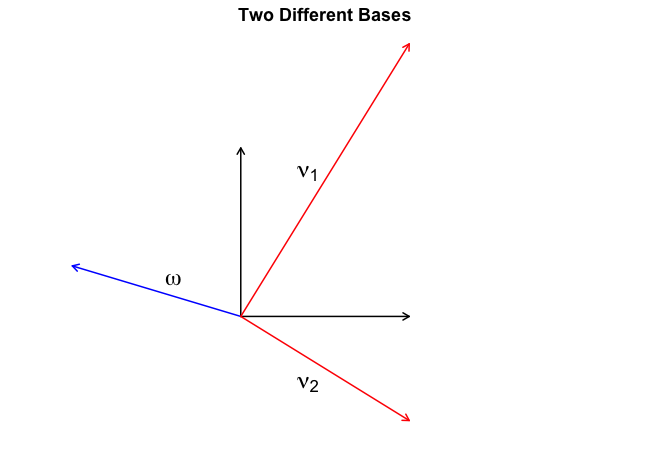

Leonardo Bonacci, better known as Fibonacci, has influenced our lives profoundly. At the beginning of the $13^{th}$ century, he introduced the Hindu-Arabic numeral system to Europe. Instead of the Roman numbers, where **I** stands for one, **V** for five, **X** for ten, and so on, the Hindu-Arabic numeral system uses position to index magnitude. This leads to much shorter expressions for large numbers.[^1]

While the history of the [numerical system](https://thonyc.wordpress.com/2017/02/10/the-widespread-and-persistent-myth-that-it-is-easier-to-multiply-and-divide-with-hindu-arabic-numerals-than-with-roman-ones/) is fascinating, this blog post will look at what Fibonacci is arguably most well known for: the *Fibonacci sequence*. In particular, we will use ideas from linear algebra to come up with a closed-form expression of the $n^{th}$ Fibonacci number[^2]. On our journey to get there, we will also gain some insights about recursion in R.[^3]


# The rabbit puzzle
In Liber Abaci, Fibonacci poses the following question (paraphrasing):

> Suppose we have two newly-born rabbits, one female and one male. Suppose these rabbits produce another pair of female and male rabbits after one month. These newly-born rabbits will, in turn, also mate after one month, producing another pair, and so on. Rabbits never die. How many pairs of rabbits exist after one year?

The Figure below illustrates this process. Every point denotes one rabbit pair over time. To indicate that every newborn rabbit pair needs to wait one month before producing new rabbits, rabbits that are not fertile yet are coloured in grey, while rabbits ready to procreate are coloured in red.


<div style="text-align:center;">
  
</div>

We can derive a linear recurrence relation that describes the Fibonacci sequence. In particular, note that rabbits never die. Thus, at time point $n$, all rabbits from time point $n - 1$ carry over. Additionally, we know that every fertile rabbit pair will produce a new rabbit pair. However, they have to wait one month, so that the amount of fertile rabbits equals the amount of rabbits at time point $n - 2$. Resultingly, the Fibonacci sequence {$F_n$}$_{n=1}^{\infty}$ is:

$$
F_n = F_{n-1} + F_{n-2} \enspace ,
$$

for $n \geq 3$ and $F_1 = F_2 = 1$. Before we derive a closed-form expression that computes the $n^{th}$ Fibonacci number directly, in the next section, we play around with alternative, more straightforward solutions in R.


# Implementation in R
We can write a wholly inefficient, but beautiful program to compute the $n^{th}$ Fibonacci number:

```{r}
fib <- function(n) ifelse(n < 2, 1, fib(n-1) + fib(n-2))
```

R takes roughly 5 seconds to compute the $30^{\text{th}}$ Fibonacci number; computing the $40^{\text{th}}$ number exhausts my patience. This recursive solution is not particularly efficient because R executes the function an unnecessary amount of times. For example, the call tree for *fib(5)* is:

- *fib(5)*
- *fib(4)* + *fib(3)*
- (*fib(3)* + *fib(2)*) + (*fib(2)* + *fib(1)*)
- ((*fib(2)* + *fib(1)*) + (*fib(1)* + *fib(0)*)) + ((*fib(1)* + *fib(0)*) + *fib(1)*)
- ((*fib(1)* + *fib(0)*) + *fib(1)*) + (*fib(1)* + *fib(0)*)) + ((*fib(1)* + *fib(0)*) + *fib(1)*)

which shows that *fib(2)* was called three times. This is not necessary, as we can store the outcome of this function call instead of recomputing it every time. This technique is called [memoization](https://en.wikipedia.org/wiki/Memoization) (see also the R package [memoise](https://github.com/r-lib/memoise)). Implementing this leads to:

```{r}
fib_mem <- function(n) {
  cache <- list()
  inside <- function(n) n %in% as.numeric(names(cache))
  
  fib <- function(n) {
    if (n < 2) {
      return(n)
      
    } else if (!(inside(n))) {
      cache[[as.character(n)]] <<- fib(n-1) + fib(n-2)
      
    } 
    cache[[as.character(n)]]
  }
  
  fib(n)
}
```

This computes the $1000^{th}$ Fibonacci in a tenth of a second. We can, of course, write this sequentially, and also store all intermediate Fibonacci numbers. This also avoids memory issues brought about by the recursive implementation. Interestingly, although this algorithm seems like it should be $O(n)$, it is actually $O(n^2)$ since we are adding increasingly large numbers (for more on this, see [here](https://catonmat.net/linear-time-fibonacci)).

```{r}
fib_seq <- function(n) {
  num <- rep(1, n)
  
  for (i in seq(3, n)) {
     num[i] <- num[i-1] + num[i-2]
  }
  
  num
}
```

The first 30 Fibonacci numbers are: 1, 1, 2, 3, 5, 8, 13, 21, 34, 55, 89, 144, 233, 377, 610, 987, 1597, 2584, 4181, 6765, 10946, 17711, 28657, 46368, 75025, 121393, 196418, 317811, 514229, 832040.

This is a rapid increase, as made apparent by the left Figure below. The Figure on the right shows that there is structure in how the sequence grows.

```{r, echo = FALSE, fig.align = 'center', fig.width = 12, fig.height = 6}
num <- fib_seq(30)

par(mfrow = c(1, 2))
plot(
  num, axes = FALSE, pch = 20, col = 'black',
  xlab = expression(n^th ~ ' Fibonacci Number'), ylab = 'Value',
  main = 'Rapid Increase in Value'
)
axis(1)
axis(2)

plot(
  log(num), axes = FALSE, pch = 20, col = 'black',
  xlab = expression(n^th ~ ' Fibonacci Number'), ylab = 'Value (Log)',
  main = 'Constant Increase in Log Value'
)

axis(1)
axis(2)
```

We will return to the structure in growth at the end of the blog post. First, we need to derive a closed-form expression of the $n^{th}$ Fibonacci number. In the next section, we take a step towards that by realizing that diagonal matrices make for easier computations.


# Diagonal matrices are good
Our goal is to get a closed form expression of the $n^{th}$ Fibonacci number. The first thing to note is that, due to linear recursion, we can view the Fibonacci numbers as applying a linear map. In particular, define $T \in \mathcal{L}(\mathbb{R}^2)$ by:

$$
T(x, y) = (y, x + y) \enspace .
$$

We note that:

$$
T^n(0, 1) = (F_n, F_{n+1}) \enspace ,
$$

which we will prove by induction. In particular, note that the base case $n = 1$:

$$
T^1(0, 1) = (1, 0 + 1) = (1, 1) = (F_1, F_2) \enspace ,
$$

does in fact give the first two Fibonacci numbers. Now for the induction step: we assume that this holds for an arbitrary $n$, and we show that it holds for $n + 1$ using the following:

$$
\begin{aligned}
T^n(0, 1) &= (F_n, F_{n+1}) \\[1em]
T(T^n(0, 1)) &= T(F_n, F_{n+1}) \\[1em]
T^{n+1}(0, 1) &= (F_{n+1}, F_n + F_{n+1}) \\[1em] 
T^{n+1}(0, 1) &= (F_{n+1}, F_{n+2}) \enspace .
\end{aligned}
$$

The last equality follows from the definition of the Fibonacci sequence, i.e., the fact that any number is equal to the sum of the previous two numbers. The matrix of this linear map with respect to the standard basis is given by:

$$
A \equiv \mathcal{M}(T) = \begin{pmatrix} 0 & 1 \\ 1 & 1\end{pmatrix} \enspace ,
$$

since $T(1, 0) = (0, 1)$ and $T(0, 1) = (1, 1)$. Observe that:

$$
\begin{pmatrix} 0 & 1 \\ 1 & 1\end{pmatrix} \begin{pmatrix} x \\ y \end{pmatrix} = \begin{pmatrix} y \\ x + y \end{pmatrix} \enspace .
$$

In the sequential R code for computing the Fibonacci numbers, we have applied the linear map $n$ times, which gave us the Fibonacci number we were interested in. We can write this in matrix form:

$$
\begin{pmatrix} 0 & 1 \\ 1 & 1\end{pmatrix}^n \begin{pmatrix} 0 \\ 1 \end{pmatrix} = \begin{pmatrix} F_n \\ F_{n+1} \end{pmatrix} \enspace .
$$

If you were to compute, say, the $3^{th}$ Fibonacci number using this equation, you would have to multiply $A$ three times with itself. Now assume you had something like:

$$
\begin{pmatrix} \lambda_1 & 0 \\ 0 & \lambda_2 \end{pmatrix}^n \begin{pmatrix} 0 \\ 1 \end{pmatrix} = \begin{pmatrix} F_n \\ F_{n+1} \end{pmatrix} \enspace .
$$

Using the above equation, the matrix powers would become trivial:

$$
\begin{pmatrix} \lambda_1 & 0 \\ 0 & \lambda_2 \end{pmatrix}^n = \begin{pmatrix} \lambda_1^n & 0 \\ 0 & \lambda_2^n \end{pmatrix} \enspace .
$$

There would be no need to repeatedly engage in matrix multiplication; instead, we would arrive at the $n^{th}$ Fibonacci number using only scalar multiplication! Our task is thus as follows: find a new matrix for the linear map which is diagonal. To solve this, we will need eigenvalues and eigenvectors.

# Finding eigenvalues and eigenvectors
An eigenvector-eigenvalue pair $(v, \lambda)$ satisfies for $v \neq 0$ that:

$$
Tv = \lambda v \enspace ,
$$

which means that for a particular vector $v$, the linear map only stretches the vector by a constant $\lambda$. Here's the key: using the eigenvectors as basis, the matrix of the linear map is diagonal. This is because the matrix of our linear map, $A$, is defined by:

$$
\begin{aligned}
Tv_1 &= A_{11} v_1 + A_{21} v_2  \\
Tv_2 &= A_{12} v_1 + A_{22} v_2  \enspace .
\end{aligned}
$$

Now since the basis consists only of eigenvectors, we know that $Tv_1 = \lambda v_1$ and $Tv_2 = \lambda v_2$, which implies that $A_{11} = \lambda_1$ and $A_{21} = 0$, as well as $A_{12} = 0$ and $A_{22} = \lambda_2$. For a wonderful explanation of eigenvalues and eigenvectors, see [this video](https://www.youtube.com/watch?v=PFDu9oVAE-g) by 3Blue1Brown.[^4]

In order to find the eigenvalues and eigenvectors, note that the linear map satisfies the following two equations:

$$
\begin{aligned}
T(x, y) &= \lambda (x, y) \\[1em] 
T(x, y) &= (y, x + y) \enspace .
\end{aligned}
$$

This leads to:

$$
\begin{aligned}
\lambda x &= y \\[1em]
 \lambda y &= x + y \enspace .
\end{aligned}
$$

We substitute the first expression into the second one, yielding:

$$
\begin{aligned}
\lambda^2 x &= x + y \\[1em]
(\lambda^2 - 1)x &= y \enspace ,
\end{aligned}
$$

which we now substitute into the first equation, which results in:

$$
\begin{aligned}
\lambda x  &= (\lambda^2 - 1)x\\[1em]
0 &= \lambda^2 - \lambda - 1\enspace .
\end{aligned}
$$

We can now apply the *quadratic formula* or "Mitternachtsformel", as it is called in parts of Germany because students should know the formula when they are roused from sleep at midnight. We are neither in Germany, nor is it midnight, nor can I actually remember the formula, so let's quickly derive it for our problem:

$$
\begin{aligned}
\lambda^2 - \lambda - 1 &= 0 \\[1em]
\lambda^2 - \lambda &= 1 \\[1em]
4\lambda^2 - 4\lambda &= 4 \\[1em]
4\lambda^2 - 4\lambda + 1&= 4 + 1 \\[1em]
(2\lambda - 1)^2&= 4 + 1 \\[1em]
2\lambda - 1 &= \pm \sqrt{4 + 1} \\[1em]
\lambda &= \frac{1 \pm \sqrt{5}}{2} \enspace .
\end{aligned}
$$

Now that we have found both eigenvalues, we go hunting for the eigenvectors! We put the eigenvalue into the equations from above:

$$
\begin{aligned}
\frac{1 \pm \sqrt{5}}{2} x &= y \\[1em]
\frac{1 \pm \sqrt{5}}{2} y &= x + y \enspace .
\end{aligned}
$$

If we set $x = 1$, then $y = \frac{1 \pm \sqrt{5}}{2}$. Thus, two eigenvectors are:

$$
\begin{aligned}
v_1 &= \left(1, \frac{1 + \sqrt{5}}{2}\right) \\[1em]
v_2 &= \left(1, \frac{1 - \sqrt{5}}{2}\right) \enspace .
\end{aligned}
$$

As a sanity check to see whether this is indeed true, we check whether $Tv_1 = \lambda_1 v_1$:

$$
\begin{aligned}
Tv_1 &= \left(\frac{1 + \sqrt{5}}{2}, 1 + \frac{1 + \sqrt{5}}{2}\right) \\[1em]
\lambda v_1 &= \frac{1 + \sqrt{5}}{2} \left(1, \frac{1 + \sqrt{5}}{2}\right) \\[1em]
            &= \left(\frac{1 + \sqrt{5}}{2}, \left(\frac{1 + \sqrt{5}}{2}\right)^2\right) \\[1em]
            &= \left(\frac{1 + \sqrt{5}}{2}, \frac{1 + 2\sqrt{5} + 5}{4}\right) \\[1em]
            &= \left(\frac{1 + \sqrt{5}}{2}, \frac{3}{2} + \frac{\sqrt{5}}{2} \right) \\[1em]
            &= \left(\frac{1 + \sqrt{5}}{2}, 1 + \frac{1 + \sqrt{5}}{2} \right) \enspace ,
\end{aligned}
$$

which shows that the two expression are equal. Moreover, the dot product of the two eigenvectors is zero, which means that the two eigenvectors are linearly independent (as they should be). In the next section, we will find that [the same territory can be described by different maps](https://en.wikipedia.org/wiki/Map%E2%80%93territory_relation).


# Change of basis
Now that we have found the eigenvalues and eigenvectors, we can create the matrix $D$ of the linear map $T$ which is diagonal with respect to the basis of eigenvectors:

$$
D = \begin{pmatrix} \frac{1 + \sqrt{5}}{2} & 0 \\ 0 & \frac{1 - \sqrt{5}}{2} \end{pmatrix} \enspace .
$$

We are not done yet, however. Note that $D$ is the matrix of the linear map $T$ with respect to the basis that consists of both eigenvectors $v_1$ and $v_2$, *not* with respect to the standard basis. We have changed our coordinate system --- our map --- as indicated by the Figure below; the black coloured vectors are the standard basis vectors while the vectors coloured in red are our new basis vectors.

<!-- <div style = "float: left; padding: 10px 10px 10px 0px;"> -->
<!--  -->

<div style="text-align:center;">
  
</div>


```{r, fig.cap = '', echo = FALSE, eval = FALSE, fig.width = 10, fig.height = 6}
library('latex2exp')
# I had to hardcode the path because there is some issue with size otherwise

l1 <- (1 + sqrt(5)) / 2
l2 <- (1 - sqrt(5)) / 2

png('assets/img/change-of-basis.png', width = 650, height = 450)
par(mar = c(1, 0, 2, 0))
plot(
  0, 1, xlim = c(0, 1), ylim = c(l2, l1), cex = 0, axes = FALSE,
  xlab = '', ylab = '', asp = 1, pty = 's', main = 'Two Different Bases', cex.main = 1.5
)
arrows(0, 0, 1, 0, length = .1, lwd = 2)
arrows(0, 0, 0, 1, length = .1, lwd = 2)

arrows(0, 0, -1, .3, length = .1, col = 'blue', lwd = 2)
arrows(0, 0, 1, lambda1, length = .1, col = 'red', lwd = 2)
arrows(0, 0, 1, lambda2, length = .1, col = 'red', lwd = 2)
text(.4, .85, TeX('$\\nu_1$'), cex = 2)
text(.4, -.4, TeX('$\\nu_2$'), cex = 2)
text(-.4, .22, TeX('$\\omega$'), cex = 2)
dev.off()
```
<!-- </div> -->

To build some intuition, let's play around with representing $\omega$ in both the standard basis and our new eigenbasis. Any vector is a linear combination of the basis vectors. Let $a_1$ and $a_2$ be the coefficients for the standard basis such that:

$$
\omega = a_1 \begin{pmatrix} 1 \\ 0 \end{pmatrix} + a_2 \begin{pmatrix} 0 \\ 1 \end{pmatrix} \enspace .
$$

Now because I have drawn it earlier, I know that $a_1 = -1$ and $a_2 = 0.3$. This is the representation of $\omega$ in the standard basis. How do we represent it in our eigenbasis? Well, using the eigenbasis the vector $\omega$ is still a linear combination of the basis vectors, but with different coefficients; denote them as $b_1$ and $b_2$. We thus have:

$$
\omega = b_1 \begin{pmatrix} 1 \\ \frac{1 + \sqrt{5}}{2} \end{pmatrix} + b_2 \begin{pmatrix} 1 \\ \frac{1 - \sqrt{5}}{2} \end{pmatrix} = a_1 \begin{pmatrix} 1 \\ 0 \end{pmatrix} + a_2 \begin{pmatrix} 0 \\ 1 \end{pmatrix}  \enspace .
$$

If we write this in matrix form, we have:

$$
\begin{aligned}
\begin{pmatrix} 1 & 1 \\ \frac{1 + \sqrt{5}}{2} & \frac{1 - \sqrt{5}}{2} \end{pmatrix} \begin{pmatrix} b_1 \\ b_2 \end{pmatrix} &= \begin{pmatrix} 1 & 0 \\ 0 & 1 \end{pmatrix} \begin{pmatrix} a_1 \\ a_2 \end{pmatrix}\\[1em]
\begin{pmatrix} b_1 \\ b_2 \end{pmatrix} &= \begin{pmatrix} 1 & 1 \\ \frac{1 + \sqrt{5}}{2} & \frac{1 - \sqrt{5}}{2} \end{pmatrix}^{-1} \begin{pmatrix} 1 & 0 \\ 0 & 1 \end{pmatrix} \begin{pmatrix} a_1 \\ a_2 \end{pmatrix} \enspace .
\end{aligned}
$$

Thus, we can represent a vector $a$ with basis $S$ in our new basis $E$ by computing:

$$
b = E^{-1} S \, a \enspace .
$$

In our eigenbasis, the vector $\omega$ has the coordinates:

```{r}
lambda1 <- (1 + sqrt(5)) / 2
lambda2 <- (1 - sqrt(5)) / 2

S <- diag(2)
a <- c(-1, .3)
E <- cbind(c(1, lambda1), c(1, lambda2))

solve(E) %*% S %*% a
```

This means we have the representation:

$$
\omega = -0.14 \begin{pmatrix} 1 \\ \frac{1 + \sqrt{5}}{2} \end{pmatrix} - 0.86 \begin{pmatrix} 1 \\ \frac{1 - \sqrt{5}}{2} \end{pmatrix} \enspace ,
$$

which makes intuitive sense when you look at the Figure above. For another beautiful linear algebra video by 3Blue1Brown, this time about changing bases, see [here](https://www.youtube.com/watch?v=P2LTAUO1TdA&t=598s). In the next section, we will use what we have learned above to express the $n^{th}$ Fibonacci number in closed-form.


# Closed-form Fibonacci
Recall from above that our solution to finding the $n^{th}$ Fibonacci number in matrix form is:

$$
\begin{pmatrix} 0 & 1 \\ 1 & 1\end{pmatrix}^n \begin{pmatrix} 0 \\ 1 \end{pmatrix} = \begin{pmatrix} F_n \\ F_{n+1} \end{pmatrix} \enspace .
$$

Now, we have swapped the non-diagonal matrix $A$ with the diagonal matrix $D$ by changing the basis from the standard basis to the eigenbasis. However, the vector $(0, 1)^T$ is still in the standard basis! In order to change its representation to the eigenbasis, we multiply it with $E^{-1}$, as discussed above. We write:


$$
\begin{pmatrix} \frac{1 + \sqrt{5}}{2} & 0 \\ 0 & \frac{1 - \sqrt{5}}{2} \end{pmatrix}^n \begin{pmatrix} 1 & 1 \\ \frac{1 + \sqrt{5}}{2} & \frac{1 - \sqrt{5}}{2} \end{pmatrix}^{-1} \begin{pmatrix} 0 \\ 1 \end{pmatrix} = \begin{pmatrix} F_n \\ F_{n+1} \end{pmatrix} \enspace .
$$

Let's use this to compute, say, the $10^{th}$ Fibonacci number (which is 55) in R:


```{r}
D <- diag(c(lambda1, lambda2))
D^10 %*% solve(E) %*% c(0, 1)
```

Ha! This didn't quite work, did it? We got the answer for $F_{10}$ roughly when rounding, but $F_{11}$ is completely off. What did we miss? Well, this is in fact the correct answer --- it is just in the wrong basis! We have to convert this from the eigenbasis to the standard basis. To do this, observe that:

$$
\begin{aligned}
b &= E^{-1} S \, a \\
E b &= S \, a \\
E b &= a \enspace ,
\end{aligned}
$$

since $S$ is the identity matrix. Thus, all we have to do is to multiply with $E$:

```{r}
E %*% D^10 %*% solve(E) %*% c(0, 1)
```

which is the correct solution. To get the closed-form solution algebraically, we first invert the matrix $E$:

$$
E^{-1} = -\frac{1}{\sqrt{5}} \begin{pmatrix} \frac{1 - \sqrt{5}}{2} & -1 \\ - \frac{1 + \sqrt{5}}{2} & 1\end{pmatrix} \enspace ,
$$

and we write:

$$
\begin{aligned}
\begin{pmatrix} F_n \\ F_{n+1} \end{pmatrix} &= \begin{pmatrix} 1 & 1 \\ \frac{1 + \sqrt{5}}{2} & \frac{1 - \sqrt{5}}{2} \end{pmatrix} \begin{pmatrix} \frac{1 + \sqrt{5}}{2} & 0 \\ 0 & \frac{1 - \sqrt{5}}{2} \end{pmatrix}^n -\frac{1}{\sqrt{5}} \begin{pmatrix} \frac{1 - \sqrt{5}}{2} & -1 \\ - \frac{1 + \sqrt{5}}{2} & 1\end{pmatrix}\begin{pmatrix} 0 \\ 1 \end{pmatrix} \\[1em]
&= -\frac{1}{\sqrt{5}} \begin{pmatrix} 1 & 1 \\ \frac{1 + \sqrt{5}}{2} & \frac{1 - \sqrt{5}}{2} \end{pmatrix} \begin{pmatrix} \frac{1 + \sqrt{5}}{2} & 0 \\ 0 & \frac{1 - \sqrt{5}}{2} \end{pmatrix}^n \begin{pmatrix} -1 \\ 1 \end{pmatrix} \\[1em]
&= -\frac{1}{\sqrt{5}} \begin{pmatrix} 1 & 1 \\ \frac{1 + \sqrt{5}}{2} & \frac{1 - \sqrt{5}}{2} \end{pmatrix} \begin{pmatrix} -\left(\frac{1 + \sqrt{5}}{2}\right)^n \\ \left(\frac{1 - \sqrt{5}}{2}\right)^n \end{pmatrix} \\[1em]
&= -\frac{1}{\sqrt{5}} \begin{pmatrix} -\left(\frac{1 + \sqrt{5}}{2}\right)^n + \left(\frac{1 - \sqrt{5}}{2}\right)^n \\ -\left(\frac{1 + \sqrt{5}}{2}\right)^{n+1} + \left(\frac{1 - \sqrt{5}}{2}\right)^{n+1} \end{pmatrix} \\[1em]
&= \frac{1}{\sqrt{5}} \begin{pmatrix} \left(\frac{1 + \sqrt{5}}{2}\right)^n - \left(\frac{1 - \sqrt{5}}{2}\right)^n \\ \left(\frac{1 + \sqrt{5}}{2}\right)^{n+1} - \left(\frac{1 - \sqrt{5}}{2}\right)^{n+1} \end{pmatrix} \enspace .
\end{aligned}
$$

The closed-form expression of the $n^{th}$ Fibonacci number is thus given by:

$$
F_n = \frac{1}{\sqrt{5}} \left[ \left(\frac{1 + \sqrt{5}}{2}\right)^n - \left(\frac{1 - \sqrt{5}}{2}\right)^n \right] \enspace .
$$

We verify this in R:

```{r}
fib_closed <- function(n) {
  1/sqrt(5) * (((1 + sqrt(5))/2)^n - ((1 - sqrt(5))/2)^n)
}

print(fib_closed(seq(30)))
```


# The golden ratio
In the above section, we have derived a closed-form expression of the $n^{th}$ Fibonacci number. In this section, we return to an observation we have made at the beginning: there is structure in how the Fibonacci numbers grow. Johannes Kepler, after whom the university in my home town is named, (re)discovered that:

$$
\begin{aligned}
\lim_{n \rightarrow \infty} \frac{F_{n+1}}{F_n} &= \lim_{n \rightarrow \infty} \frac{\frac{1}{\sqrt{5}} \left[ \left(\frac{1 + \sqrt{5}}{2}\right)^{n+1} - \left(\frac{1 - \sqrt{5}}{2}\right)^{n+1} \right]}{\frac{1}{\sqrt{5}} \left[ \left(\frac{1 + \sqrt{5}}{2}\right)^n - \left(\frac{1 - \sqrt{5}}{2}\right)^n \right]} \\[1em]
&= \lim_{n \rightarrow \infty} \frac{\left(\frac{1 + \sqrt{5}}{2}\right)^{n+1} - \left(\frac{1 - \sqrt{5}}{2}\right)^{n+1}}{\left(\frac{1 + \sqrt{5}}{2}\right)^n - \left(\frac{1 - \sqrt{5}}{2}\right)^n} \\[1em]
&= \frac{\left(\frac{1 + \sqrt{5}}{2}\right)^{n+1}}{\left(\frac{1 + \sqrt{5}}{2}\right)^n} \\[1em]
&= \frac{1 + \sqrt{5}}{2} \approx 1.618 \enspace ,
\end{aligned}
$$

which is the [golden ratio](https://en.wikipedia.org/wiki/Golden_ratio). The golden ratio $\phi$ denotes that the ratio of two parts is equal to the ratio of the sum of the parts to the larger part, i.e., for $a > b > 0$:

$$
\phi \equiv \frac{a}{b} = \frac{a + b}{a} \enspace .
$$

We have observed this empirically in the first Figure, which visualized the differences in the log of two consecutive Fibonacci numbers, and which yielded already for small $n$:

$$
\text{log} \, F_{n+1} - \text{log} \, F_n = \text{log} \, \frac{F_{n + 1}}{F_n} \approx 0.4812 \enspace ,
$$

which exponentiated yields the golden ratio. Observe that $\left(\frac{1 - \sqrt{5}}{2}\right)^n$ goes to zero very quickly as $n$ grows so that we can compute the $n^{th}$ Fibonacci number by:

$$
F_n = \left \lfloor \frac{1}{\sqrt{5}} \phi^n \right \rceil \enspace ,
$$

where we simply round to the nearest integer. To finally answer Fibonacci's puzzle:

```{r}
fib_golden <- function(n) round(((1 + sqrt(5))/2)^n / sqrt(5))
fib_golden(12)
```

After a mere twelve months of incest, there are 144 rabbit pairs![^5]

There are various [generalizations](https://en.wikipedia.org/wiki/Generalizations_of_Fibonacci_numbers) of the Fibonacci sequence. One such generalization is to allow higher orders $k$ in the sequence, which for $k = 3$ is known as the [Tribonacci sequence](https://www.youtube.com/watch?v=fMJflV_GUpU). Our approach for $k = 2$ can be straightforwardly generalized to account for any order $k$ (if you want to go down a rabbit hole, see for example [this](https://math.stackexchange.com/questions/41667/fibonacci-tribonacci-and-other-similar-sequences)).


# Conclusion
In this blog post, we have taken a detailed look at the Fibonacci sequence. In particular, we saw that it is the answer to a puzzle about procreating rabbits, and how to speed up a recursive algorithm for finding the $n^{th}$ Fibonacci number. We then used ideas from linear algebra to arrive at a closed-form expression of the $n^{th}$ Fibonacci number. Specifically, we have noted that the Fibonacci sequence is a linear recurrence relation --- it can be viewed as repeatedly applying a linear map. With this insight, we observed that the matrix of the linear map is non-diagonal, which makes repeated execution tedious; diagonal matrices, on the other hand, are easy to multiply. We arrived at a diagonal matrix by changing the basis from the standard basis to the basis of eigenvectors, which led to a diagonal matrix of eigenvalues for the linear map. With this representation, the $n^{th}$ Fibonacci number is available in closed-form. In order to get it into the standard basis, we had to change basis back from the eigenbasis. We also saw how the Fibonacci numbers relate to the golden ratio $\phi$.

---
I would like to thank Don van den Bergh, Jonas Haslbeck, and Sophia Crüwell for helpful comments on this blog post.

---

## Footnotes
[^1]: This is the main reason why the Hinu-Arabic numeral system took over. The belief that it is easier to multiply and divide using Hindu-Arabic numerals is [incorrect](https://thonyc.wordpress.com/2017/02/10/the-widespread-and-persistent-myth-that-it-is-easier-to-multiply-and-divide-with-hindu-arabic-numerals-than-with-roman-ones/).
[^2]: This blog post is inspired by exercise 16 on p. 161 in [Linear Algebra Done Right](http://linear.axler.net/).
[^3]: I have learned that there is already (very good) ink spilled on this topic, see for example [here](https://bosker.wordpress.com/2011/04/29/the-worst-algorithm-in-the-world/) and [here](https://bosker.wordpress.com/2011/07/27/computing-fibonacci-numbers-using-binet%E2%80%99s-formula/). A nice essay is also [this](https://opinionator.blogs.nytimes.com/2012/09/24/proportion-control/?mtrref=undefined&gwh=C0500419D79A9E5B64F17ABC970C5125&gwt=pay) piece by Steve Strogatz, who, by the way, wrote a wonderful book called [Sync](https://www.goodreads.com/book/show/354421.Sync). He's also been on Sean Carroll's Mindscape podcast, listen [here](https://www.preposterousuniverse.com/podcast/2019/04/08/episode-41-steven-strogatz-on-synchronization-networks-and-the-emergence-of-complex-behavior/).
[^4]: If you forget everything that is written in this blog post, but through it were made aware of the videos by 3Blue1Brown (or [Grant Sanderson](https://www.numberphile.com/podcast/3blue1brown), as he is known in the real world), then I consider this blog post a success.
[^5]: The downside of the closed-form solution is that it is difficult to calculate the power of the square root with high accuracy. In fact, *fib_golden* is incorrect for $n > 70$. Our *fib_mem* implementation is also incorrect, but only for $n > 93$. (I've compared it against Fibonacci numbers calculated from [here](https://www.miniwebtool.com/list-of-fibonacci-numbers/?number=100)).