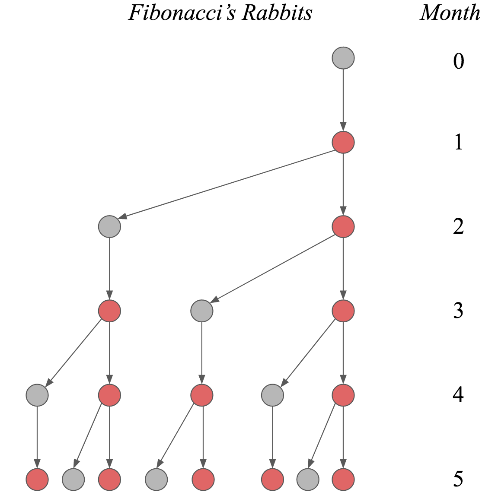

Differential equations are a powerful tool for modeling how systems change over time, but they can be a little hard to get into. Love, on the other hand, is humanity's perennial topic; some even claim it is all you need. In this blog post --- inspired by Strogatz (1988, 2015) --- I will introduce linear differential equations as a means to study the types of love affairs two people might find themselves in.

Do opposites attract? What happens to a relationship if lovers are out of touch with their own feelings? We will answer these and other questions using two coupled linear differential equations. On our journey, we will use graphical as well as mathematical methods to classify the types of relationships this modeling framework can accommodate. In a follow-up blog post, we will also play around with non-linear terms and add a third wheel to the mix, which can lead to chaos --- in the technical sense of the term, of course. Excited? Then let's get started!


# Introducing Romeo
<blockquote>
A lovestruck Romeo sang the streets of serenade <br>
Laying everybody low with a love song that he made <br>
Finds a streetlight, steps out of the shade <br>
Says something like, "You and me, babe, how about it?"
</blockquote>

Romeo is quite the emotional type. Let $R(t)$ denote his feelings at time point $t$. Following common practice, we will usually write $R$ instead of $R(t)$, making the time dependence implicit. The process which describes how Romeo's feelings change is rather simple: it depends only on Romeo's current feelings. We write:

$$
\frac{\mathrm{d}R}{\mathrm{d}t} = aR \enspace ,
$$

which is a linear differential equation. Note that this *implicitly* encodes how Romeo's feelings change over time, since when we know $R$ at time point $t$, we can compute the direction and speed with which $R$ will change --- the derivative denotes velocity. Our goal, however, is to find an explicit, closed-form expression for Romeo's feelings at time point $t$. In this particular case, we can do this analytically:

$$
\begin{aligned}
\frac{\mathrm{d}R}{\mathrm{d}t} &= aR \\[.5em]
\frac{1}{aR}\mathrm{d}R &= \mathrm{dt} \\[.5em]
\frac{1}{a}\int \frac{1}{R}\mathrm{d}R &= \int \mathrm{dt} \\[.5em]
\frac{1}{a} \left[\text{log} \, R + C \right] &= t \\[.5em]
\text{log} \, R &= a t - C \\[.5em]
R &= e^{at - C} \enspace .
\end{aligned}
$$

A differential equation describes how something changes; to kickstart the process, we need an initial condition $R_0$. This allows us to find the constant of integration $C$. In particular, assume that $R = R_0$ at $t = 0$, which leads to:

$$
\begin{aligned}
R_0 &= e^{-C} \\[.5em]
\text{log} \, R_0 &= -C \enspace ,
\end{aligned}
$$

such that:

$$
\begin{aligned}
R &= e^{at + \text{log} \, R_0} \\[.5em]
R &= R_0 e^{at} \enspace .
\end{aligned}
$$

The left two panels of the figure below visualize how Romeo's feelings change over time for $a > 0$ with initial condition $R_0 = 1$ (top) or $R_0 = -1$ (bottom). The right two panels show how his feelings change for $a < 0$ with $R_0 = 100$ (top) or $R_0 = -100$ (bottom).

```{r, echo = FALSE, warning = FALSE, fig.align = 'center', fig.width = 12, fig.height = 12, dpi=400}
library('latex2exp')

t <- seq(0, 5, .01)
fn <- function(t, a = 1, R0 = 1) R0*exp(a*t)

plot_romeo <- function(R0, a, t, title, ylim = c(0, 100)) {
  plot(
    t, fn(t, a = a[1], R0 = R0), axes = FALSE, type = 'l', lwd = 2, col = 'black',
    xlab = 'Time', ylab = 'R(t)', lty = 'solid', ylim = ylim, cex.main = 1.5, cex.lab = 1.5, cex.axis = 2,
    main = title
  )
    
  lines(
    t, fn(t, a = a[2], R0 = R0), axes = FALSE, type = 'l', lwd = 2, col = 'black',  lty = 'dashed'
  )
  
  lines(
    t, fn(t, a = a[3], R0 = R0), axes = FALSE, type = 'l', lwd = 2, col = 'black', lty = 'dotted'
  )
  
  axis(1)
  axis(2, las = 2)
}

par(mfrow = c(2, 2))
a1 <- c(.75, 1, 1.5)
a2 <- -c(.5, 1, 2)
title1 <- TeX('Solution to $$\\frac{dR}{dt} = aR$$ with $$R_0 > 0$$')
title2 <- TeX('Solution to $$\\frac{dR}{dt} = aR$$ with $$R_0 < 0$$')

plot_romeo(1, a1, t, title1)
legend(
  'topleft', lty = c('solid', 'dashed', 'dotted'),
  legend = c('a = 0.75', 'a = 1.00', 'a = 1.50'), cex = 1.5, lwd = 2,
  box.lty = 0, bty = 'n'
)

plot_romeo(100, a2, t, title1)
legend(
  'topright', lty = c('solid', 'dashed', 'dotted'),
  legend = c('a = -0.50', 'a = -1.00', 'a = -2.00'), cex = 1.5, lwd = 2,
  box.lty = 0, bty = 'n'
)

plot_romeo(-1, a1, t, title2, ylim = c(-100, 0))
legend(
  'bottomleft', lty = c('solid', 'dashed', 'dotted'),
  legend = c('a = 0.75', 'a = 1.00', 'a = 1.50'), cex = 1.5, lwd = 2,
  box.lty = 0, bty = 'n'
)

plot_romeo(-100, a2, t, title2, ylim = c(-100, 0))
legend(
  'bottomright', lty = c('solid', 'dashed', 'dotted'),
  legend = c('a = -0.50', 'a = -1.00', 'a = -2.00'), cex = 1.5, lwd = 2,
  box.lty = 0, bty = 'n'
)
```

We conclude: Romeo is a simple guy, albeit with an emotion regulation problem. When the object of his affection is such that $a > 0$, his feelings will either grow exponentially towards mad love if he starts out with a positive first impression ($R_0 > 0$), or grow exponentially towards mad hatred if he starts out with a negative first impression ($R_0 < 0$). On the other hand, if $a < 0$, then regardless of his initial feelings, they will decay exponentially towards indifference.

For $R_0 = 0$, Romeo's feelings never change. For any other initial condition, we have uhindered, exponential growth when $a > 0$; it never stops. For any other initial condition and $a < 0$, we crash down to zero very rapidly. Thus $R = 0$ is a *fixed point* in both cases, which is *stable* for $a < 0$ but becomes *unstable* if $a > 0$. We can visualize this in *phase space* on a line. The phase space is filled with all possible trajectories because each point can serve as the initial condition.

```{r, echo = FALSE, warning = FALSE, message = FALSE, fig.align = 'center', fig.width = 8, fig.height = 4, dpi=400}
library('fields')

par(mfrow = c(2, 1))
plot(
  0, 0, cex = 2, axes = FALSE, main = TeX('Stable Fixed Point: $a$ < 0'),
  xlab = '', ylab = '', pch = 20, xlim = c(-2.2, 2.2)
)
abline(h = 0, lwd = 2)

x <- c(-2, -1.5, -1, -.5, .5, 1, 1.5, 2)
arrow.plot(
  x, 0, -1 * x, 0,
  arrow.ex = .15, length = .1, lwd = 2, col = 'black'
)

plot(
  0, 0, cex = 1.5, axes = FALSE, main = TeX('Unstable Fixed Point: $a$ > 0'),
  xlab = '', ylab = '', xlim = c(-2.2, 2.2)
)
# abline(h = 0, lwd = 2)
lines(c(-2.2, -.05), c(0, 0), lwd = 2)
lines(c(.05, 2.2), c(0, 0), lwd = 2)
# lines(c(-.035, .035), c(0, 0), lwd = 2, col = 'white')

arrow.plot(
  x, 0, 1 * x, 0,
  arrow.ex = .15, length = .1, lwd = 2, col = 'black'
)
```


In the next section, a wonderful new episode in Romeo's life begins: he meets Juliet.


# Introducing Juliet
<blockquote>
Juliet says, "Hey, it's Romeo, you nearly gave me a heart attack" <br>
He's underneath the window, she's singing, "Hey, la, my boyfriend's back <br>
You shouldn't come around here singing up at people like that <br>
Anyway, what you gonna do about it?"
</blockquote>

Life becomes more complicated for Romeo now that Juliet is in his life. It is their first real relationship, and they have much to learn. We start simple. Let $J$ denote Juliet's feelings for Romeo, and let $R$ denote Romeo's feelings for Juliet. We can extend our single linear differential equation from above to a system of two linear differential equations:

$$
\begin{aligned}
\frac{\mathrm{d}R}{\mathrm{d}t} &= aR\\[.5em]
\frac{\mathrm{d}J}{\mathrm{d}t} &= dJ \enspace .
\end{aligned}
$$

Using the results from above, the solutions to the two differential equations are:

$$
\begin{aligned}
R(t)  &= R_0 e^{at} \\[.5em]
J(t)  &= J_0 e^{dt} \enspace ,
\end{aligned}
$$

where $R(t)$ and $J(t)$ give the trajectories of love for Romeo and Juliet, respectively, and $J_0$ is Juliet's initial feeling towards Romeo at $t = 0$. In contrast to the one-dimensional phase diagram from above, we now have a two-dimensional picture which is known as a *vector field*.

```{r, echo = FALSE, warning = FALSE}
library('fields')

plot_vector_field <- function(A, title = '', ...) {
  x <- seq(-4, 4, .50)
  y <- seq(-4, 4, .50)
  
  RJ <- as.matrix(expand.grid(x, y))
  dRJ <- t(A %*% t(RJ))
  
  plot(
    x, y, type = 'n', axes = FALSE, xlab = '', ylab = '', main = title, cex.main = 1.5, ...
  )
  
  arrow.plot(
    RJ, dRJ,
    arrow.ex = .075, length = .05, lwd = 1.5, col = 'gray82', xpd = TRUE
  )
  
  text(3.9, -.2, 'R', cex = 1.25, font = 2)
  text(-.2, 3.9, 'J', cex = 1.25, font = 2)
  lines(c(-4, 4), c(0, 0), lwd = 1)
  lines(c(0, 0), c(4, -4), lwd = 1)
}
```

Analogously to the case of a single differential equation, $a < 0$ and $d < 0$ imply exponential decay for Romeo and Juliet's love, and $a > 0$ and $d > 0$ imply exponential growth. The left figure below visualizes decay: whatever the initial state of their love, it will crash into the origin of indifference. The figure on ther right visualizes growth: whatever the initial state, except for indifference, their feelings will grow exponentially and eventually consume them.

```{r, echo = FALSE, warning = FALSE, fig.align = 'center', fig.width = 15, fig.height = 8, dpi=400}
par(mfrow = c(1, 2))
A <- diag(2)
plot_vector_field(-A, title = 'a = d = -1', cex.main = 1.5)
points(0, 0, pch = 20, cex = 2.2)

plot_vector_field(A, title = 'a = d = 1', cex.main = 1.5)
points(0, 0, cex = 1.7)
points(0, 0, cex = 2.2, col = 'white', pch = 20)
```

This can result in happy, ever increasing love if they start out liking each other (top right quadrant), but can also result in an increasingly violent feud if they start out disliking each other (bottom left quadrant). For asymmetric starts, one of them will be hopelessly in love with the other, while the other's hate grows unboundedly. The fixed point (0, 0) is *stable* on the left, as any tiny perturbation will move the system towards it. In contrast, the fixed point on the right is *unstable*, as any ounce of love or hate, no matter how small, will make the system explode. One unfortunate subtlety arises, however: if Romeo loves Juliet, but Juliet is indifferent, then Juliet will forever stay indifferent even though Romeo's love grows without bound.

Another interesting case occurs when their affection is asymmetric, i.e., $a \neq d$. The figure below on the left shows one such case for negative parameters: we see that whatever feelings Juliet has for Romeo, they decay faster then the feelings Romeo has for Juliet. Moreover, since $(a, d) < 0$, the origin is stable. The figure on the right shows a more impactful asymmetry: Romeo's feelings decay ($a < 0$), but Juliet's increase ($d > 0$). Regardless of what the initial feelings of Romeo are, he will always end up in a state of indifference with respect to Juliet (all arrows point to the y-axis). Juliet, on the other hand, will go increasingly mad with love or hate, depending on her initial feelings --- the exception being if she starts out with indifference ($J_0 = 0$): then she will stay indifferent. This type of fixed point is called a *saddle point*, which occurs if there is one vector along which the system is stable (here the x-axis) and one vector along which the system is unstable (here the y-axis).

```{r, echo = FALSE, warning = FALSE, fig.align = 'center', fig.width = 15, fig.height = 8, dpi=400}
par(mfrow = c(1, 2))
plot_vector_field(cbind(c(-1, 0), c(0, -2)), title = 'a = -1, d = -2', cex.main = 1.5)
points(0, 0, pch = 20, cex = 2.2)

plot_vector_field(cbind(c(-1, 0), c(0, 1)), title = 'a = -1, d = 1', cex.main = 1.5)
points(0, 0, cex = 1.7)
points(0, 0, cex = 2.2, col = 'white', pch = 20)
```

What happens if Romeo's feelings never change, i.e., $a = 0$? This is visualized as the figure on the left below: Romeo's feelings will always stay at the initial point. Juliet's feelings decrease ($d < 0$), so regardless of where she is, the system will end up at a stable fixed point on the x-axis. A similar situation occurs if Juliet's feelings never change, and Romeo's feelings decay ($a < 0$), which is visualized in the figure on the right: all points on the y-axis are stable fixed points. If instead the moving parties' feelings would increase instead of decay, the fixed points would be unstable. The most boring case is $a = 0$ and $d = 0$, because then every point on the plane is a fixed point: however the two lovers start, they will never change.

```{r, echo = FALSE, warning = FALSE, fig.align = 'center', fig.width = 15, fig.height = 8, dpi=400}
par(mfrow = c(1, 2))
plot_vector_field(cbind(c(0, 0), c(0, -1)), title = 'a = 0, d = -1', cex.main = 1.5)
points(seq(-4, 4, .5), rep(0, 17), pch = 20, cex = 1.8)

plot_vector_field(cbind(c(-1, 0), c(0, 0)), title = 'a = -1, d = 0', cex.main = 1.5)
points(rep(0, 17), seq(-4, 4, .5), pch = 20, cex = 1.8)
```

Note that in all the love affairs described above, the feelings of Romeo and Juliet are actually *independent of each other*. They *do not communicate* with each other, and *we all know that communication is key*! In the next section, Romeo and Juliet's relationship matured and they start taking each other seriously. Formally, we *couple* the two love birds and analyze what types of love this can set free.

# Coupled differential equations
In the previous section, we saw that the behaviour of the system was determined entirely by the values of $a$ and $d$ --- depending on whether $a$ or $d$ were positive, negative, or zero, the system would either be stable or unstable along the $R$ or $J$ dimension. Incorporating communication complicates the system, but is ultimately for the better. To model the fact that Romeo and Juliet now respond to each other's feelings, we simply write:

$$
\begin{aligned}
\frac{\mathrm{d}R}{\mathrm{d}t} &= aR + bJ\\[.5em]
\frac{\mathrm{d}J}{\mathrm{d}t} &= cR + dJ \enspace ,
\end{aligned}
$$

or in matrix form:

$$
\begin{aligned}
\begin{pmatrix}
\frac{\mathrm{d}R}{\mathrm{d}t} \\
\frac{\mathrm{d}J}{\mathrm{d}t}
\end{pmatrix} &= \begin{pmatrix} a & b \\ c & d \end{pmatrix} \begin{pmatrix} R \\ J\end{pmatrix} \\[.5em]
\dot{\mathbf{x}} &= A \mathbf{x} \enspace .
\end{aligned}
$$

The classification of such a system is more difficult. In the next section, we introduce one type of relationship between a matured Romeo and Juliet that will motivate a general solution to coupled differential equations.


## The Saddle of love
<blockquote>
I might not be the right one <br>
It might not be the right time <br>
But there's something about us I've got to do <br>
Some kind of secret I will share with you
</blockquote>

In a previous life, Juliet and Romeo did not communicate ($b = c = 0$) but listened to their own feelings in opposite ways ($a = -1$ and $d = 1$). Here we include communication:

$$
\begin{aligned}
\frac{\mathrm{d}R}{\mathrm{d}t} &= -2R  + J\\[.5em]
\frac{\mathrm{d}J}{\mathrm{d}t} &= -R + 2J \enspace .
\end{aligned}
$$

Specifically, Romeo dampens his feelings the more strongly he feels ($a = -2$) and listens to Juliet such that whichever way her feelings go, Romeo's follow suit ($b = 1$). Juliet does the opposite: she increases her feelings of love or hate the more strongly she feels ($d = 2$), and responds to Romeo such that whichever way his feelings go, Juliet's feelings move the other way ($c = -1$). In a sense, Romeo and Juliet are opposites --- can any good come from this?

```{r, echo = FALSE, eval = FALSE, warning = FALSE, fig.align = 'center', fig.width = 8, fig.height = 8, dpi=400}
A <- cbind(c(-2, -1), c(1, 2))
plot_vector_field(A, title = 'The Saddle of Love')
points(0, 0, cex = 1.7)
points(0, 0, cex = 2.2, col = 'white', pch = 20)
```

Before answering this question, we first find a general solution to systems of linear differential equations. This gives us a way to formally classify any (linear) relationships between Romeo and Juliet. The solution will involve eigenvectors and eigenvalues, so let's put our sleeves up and get to work!


## Solving coupled differential equations
In contrast to the first system of linear equations above where Romeo and Juliet did not communicate with each other, the system now is *coupled*: Romeo's feelings influence Juliet's and vice versa. Now, if their feelings would instead be independent, then the solution to the differential equations would be easy: just as above, their respective feelings would either grow or decay exponentially. The dependence between their feelings is encoded in the matrix $A$. If $A$ were diagonal, then the equations would be independent.

The solution to our problem thus presents itself: somehow, we must manage to make the matrix $A$ diagonal. We can do this by changing basis, a trick we have also used in deriving a [closed-form expression of the Fibonacci numbers](https://fabiandablander.com/r/Fibonacci.html) in a previous blog post. If you are unfamiliar with these ideas, it might pay to read the previous blog post before proceeding.

Assuming that $A$ is *diagonalizable* (more on that latter), we can write:

$$
\begin{aligned}
A &= E \Lambda E^{-1} \\[.5em]
\begin{pmatrix} a & b \\ c & d \end{pmatrix} &=  \begin{pmatrix} \mathbf{v}_1 & \mathbf{v}_2\end{pmatrix}\begin{pmatrix} \lambda_1 & 0 \\ 0 & \lambda_2 \end{pmatrix} \begin{pmatrix} \mathbf{v}_1 & \mathbf{v}_2\end{pmatrix}^{-1} \enspace ,
\end{aligned}
$$

where $(\lambda_1, \lambda_2)$ are the eigenvalues of $A$ and $\mathbf{v}_1$ and $\mathbf{v}_2$ are the respective eigenvectors. Conceptually, multiplying a vector with $E^{-1}$ changes its basis from the standard basis to the basis of eigenvectors. In this space, the matrix encoding the dependence between our two differential equations is the diagonal matrix of eigenvalues $\Lambda$ --- the two differential equations are independent! We know that in this space the solution to the differential equations are independent exponential functions. However, we have to change back to our standard basis, and we do so by multiplying with $E$.

With this insight, our system of differential equation becomes:

$$
\begin{aligned}
\dot{\mathbf{x}} &= E \Lambda E^{-1} \mathbf{x} \\
E^{-1} \dot{\mathbf{x}} &= \Lambda E^{-1} \mathbf{x} \\
\dot{\mathbf{u}} &= \Lambda \mathbf{u} \enspace ,
\end{aligned}
$$

where we have defined $\mathbf{u} = E^{-1}\mathbf{x}$, which is now with respect to the eigenbasis. Now since:

$$
\Lambda = \begin{pmatrix} \lambda_1 & 0 \\ 0 & \lambda_2 \end{pmatrix} \enspace ,
$$

the solution to the two differential equations is:

$$
\mathbf{u} = \begin{pmatrix} C_1e^{\lambda_1 t} \\ C_2e^{\lambda_2 t} \end{pmatrix} \enspace ,
$$

where $C_1$ and $C_2$ are the constants of integration which we earlier denoted as $R_0$ and $J_0$. To change back basis, we multiply with $E$:

$$
\begin{aligned}
\mathbf{x} &= E \mathbf{u} \\[.5em]
\mathbf{x} &= \begin{pmatrix} \mathbf{v}_1 & \mathbf{v}_2 \end{pmatrix} \begin{pmatrix} C_1e^{\lambda_1 t} \\ C_2e^{\lambda_2 t} \end{pmatrix} \\[.5em]
\mathbf{x} &= \mathbf{v}_1 C_1e^{\lambda_1 t} + \mathbf{v}_2 C_2e^{\lambda_2 t} \enspace ,
\end{aligned}
$$

where $\mathbf{v}_1$ and $\mathbf{v}_2$ are eigenvectors and $\lambda_1$ and $\lambda_2$ are the corresponding eigenvalues. Therefore, solving a system of ordinary linear differential equations reduces to finding the eigenvalues and eigenvectors of the matrix $A$.


## Finding eigenvalues and eigenvectors
An eigenvector of a matrix is a vector that is only stretched by the matrix by a factor of $\lambda$, such that for $v \neq 0$:

$$
\begin{aligned}
A\mathbf{v} &= \lambda \mathbf{v} \\[.5em]
(A - I\lambda) \mathbf{v} &= 0 \enspace ,
\end{aligned}
$$

which is true when the determinant of $(A - I\lambda)$ is zero, that is, $\left\vert A - I\lambda\right\vert = 0$. We write:

$$
\begin{aligned}
\left\vert\begin{pmatrix} a & b \\ c & d\end{pmatrix} - \begin{pmatrix} \lambda & 0 \\ 0 & \lambda \end{pmatrix}\right\vert &= 0 \\[1em]
\left\vert\begin{pmatrix} a - \lambda & b \\ c & d - \lambda \end{pmatrix}\right\vert &= 0 \\[1em]
(a - \lambda)(d - \lambda) - bc &= 0 \\[1em]
\lambda^2 - \lambda(a + d) - ad + bc &= 0 \enspace .
\end{aligned}
$$

We define:

$$
\begin{aligned}
\tau &\equiv \text{trace}(A) = a + d \\[.5em]
\Delta &\equiv \vert A\vert = ad - bc \enspace ,
\end{aligned}
$$

and recall the quadratic formula to find both eigenvalues:

$$
\lambda = \frac{\tau \pm \sqrt{\tau^2 - 4\Delta}}{2} \enspace .
$$

In the next section, we apply this to the "saddle of love" differential equation in order to better understand the trajectories Romeo and Juliet's love could take.


## Solving the saddle of love
Recall that we have:

$$
\begin{aligned}
\frac{\mathrm{d}R}{\mathrm{d}t} &= -2R  + J\\[.5em]
\frac{\mathrm{d}J}{\mathrm{d}t} &= -R + 2J \enspace .
\end{aligned}
$$

such that:

$$
A = \begin{pmatrix} -2 & 1 \\ -1 & 2\end{pmatrix} \enspace .
$$

For our saddle of love, the eigenvalues are:

$$
\begin{aligned}
\lambda &= \frac{0 \pm \sqrt{0 - 4\cdot(-3)}}{2} = \frac{\pm \sqrt{4 \cdot 3}}{2} = \pm \sqrt{3} \enspace .
\end{aligned}
$$

To find the first eigenvector, we compute for the first eigenvalue $\lambda_1 = \sqrt{3}$:

$$
\begin{aligned}
(A - I\lambda_1)\mathbf{v}_1 &= 0 \\[.5em]
\begin{pmatrix} -2 - \sqrt{3} & -1 \\ 1 & 2 - \sqrt{3} \end{pmatrix} \begin{pmatrix} v_1 \\ v_2\end{pmatrix} &= \begin{pmatrix} 0 \\ 0 \end{pmatrix} \enspace ,
\end{aligned}
$$

which has solution $\mathbf{v}_1 = (1, 2 + \sqrt{3})^T$. For $\lambda_2 = -\sqrt{3}$, the eigenvector is $\mathbf{v}_2 = (1, 2 - \sqrt{3})^T$. We can verify this in R:

```{r}
A <- cbind(c(-2, -1), c(1, 2))
eigen(A)
```

which scales the eigenvectors to have unit length by dividing by its norm, and in this case also multiplies by $-1$; this does not matter, as eigenvectors are only defined up to a constant factor.

Plugging the eigenvalues and eigenvectors into our general solution form yields:

$$
\begin{aligned}
\mathbf{x} &= \mathbf{v}_1 C_1e^{\lambda_1 t} + \mathbf{v}_2 C_2e^{\lambda_2 t} \\[.5em]
\mathbf{x} &= \begin{pmatrix} 1 \\ 2 + \sqrt{3} \end{pmatrix} C_1e^{\sqrt{3} t} + \begin{pmatrix} 1 \\ 2 - \sqrt{3} \end{pmatrix} C_2e^{-\sqrt{3}t} \enspace .
\end{aligned}
$$

We still need to solve for the constants $C_1$ and $C_2$. Assume that at $t = 0$, the feelings for Romeo and Juliet are $\mathbf{x} = (1, 1)^T$. Then we have:

$$
\begin{aligned}
\begin{pmatrix} 1 \\ 1 \end{pmatrix} &= \begin{pmatrix} 1 & 1 \\ 2 + \sqrt{3} & 2 - \sqrt{3} \end{pmatrix} \begin{pmatrix} C_1 \\ C_2 \end{pmatrix} \\[.5em]
\begin{pmatrix} 1 & 1 \\ 2 + \sqrt{3} & 2 - \sqrt{3} \end{pmatrix}^{-1}\begin{pmatrix} 1 \\ 1 \end{pmatrix} &=  \begin{pmatrix} C_1 \\ C_2 \end{pmatrix} \\[.5em]
\begin{pmatrix} 0.21 \\ 0.79 \end{pmatrix} &=  \begin{pmatrix} C_1 \\ C_2 \end{pmatrix} \enspace ,
\end{aligned}
$$

which yields the following solutions for Romeo and Juliet:

$$
\begin{aligned}
R(t) &= 0.21 \cdot e^{\sqrt{3} t} + 0.79 \cdot e^{-\sqrt{3} t} \\[.5em]
J(t) &= 0.79 \cdot e^{\sqrt{3} t} + 0.21 \cdot e^{-\sqrt{3} t} \enspace .
\end{aligned}
$$

Note how this result differs from when Romeo and Juliet did not communicate: the solution is a linear combination of two exponentials --- the two lovebirds are clearly coupled! Now that we have seen one worked example, the code below computes the trajectory of Romeo and Juliet for an arbitrary matrix $A$:

```{r}
solve_linear <- function(A, inits = c(1, 1), tmax = 20, n = 500) {
  
  # compute eigenvectors and eigenvalues
  eig <- eigen(A)
  E <- eig$vectors
  lambdas <- eig$values
  
  # solve for the initial conditon
  C <- solve(E) %*% inits
  
  # create time steps
  ts <- seq(0, tmax, length.out = n)
  x <- matrix(0, nrow = n, ncol = ncol(A))
  
  for (i in seq(n)) {
    t <- ts[i]
    x[i, ] <- E %*% (C * exp(lambdas * t))
  }
  
  # Re drops the imaginary part ... more on that later!
  Re(x)
}
```

The code for visualizing vector fields for two coupled linear differential equations is given below.

```{r}
library('fields')

plot_vector_field <- function(A, title = '', ...) {
  x <- seq(-4, 4, .50)
  y <- seq(-4, 4, .50)
  
  RJ <- as.matrix(expand.grid(x, y))
  dRJ <- t(A %*% t(RJ))
  
  plot(
    x, y, type = 'n', axes = FALSE,
    xlab = '', ylab = '', main = title, cex.main = 1.5, ...
  )
  
  arrow.plot(
    RJ, dRJ,
    arrow.ex = .1, length = .05, lwd = 1.5, col = 'gray82'
  )
  
  text(3.9, -.2, 'R', cex = 1.25, font = 2)
  text(-.2, 3.9, 'J', cex = 1.25, font = 2)
  lines(c(-4, 4), c(0, 0), lwd = 1)
  lines(c(0, 0), c(4, -4), lwd = 1)
}
```

Before we visualize the vector field, let me again stress that the solution to a system of two coupled linear differential equation is of the form:

$$
\mathbf{x} = \mathbf{v}_1 C_1e^{\lambda_1 t} + \mathbf{v}_2 C_2e^{\lambda_2 t} \enspace .
$$

The eigenvectors coincide with the standard basis vectors when the two differential equations are independent, as was the case above when Romeo and Juliet did not communicate. In such cases, exponential growth or decay is along the standard basis vectors, i.e., the x- and y-axes. For the case we are considering now, this is not the true --- the eigenvectors are different from the standard basis vectors. It therefore makes sense to visualize the eigenvectors, as they are in some sense more fundamental to the solution. However, we want to retain the interpretability of the standard basis, as this is our reference frame for the initial condition. In the following visualizations, therefore, we add the eigenvectors which makes it apparent exactly in which directions there is exponential growth or decay.

```{r, echo = TRUE, warning = FALSE, fig.align = 'center', fig.width = 8, fig.height = 8, dpi=400}
plot_eigenvectors <- function(A, ...) {
  E <- eigen(A)$vectors * 4
  arrows(-E[1, 1], -E[2, 1], E[1, 1], E[2, 1], length = 0, lty = 2, ...)
  arrows(-E[1, 2], -E[2, 2], E[1, 2], E[2, 2], length = 0, lty = 2, ...)
}

add_line <- function(A, inits) {
  lines(solve_linear(A, inits = inits), col = 'red', lwd = 1.5)
}

A <- cbind(c(-2, -1), c(1, 2))
plot_vector_field(A, title = 'The Saddle of Love')
plot_eigenvectors(A)

add_line(A, c(3.5, 1))
add_line(A, c(3.5, .75))
add_line(A, -c(3.5, 1))
add_line(A, -c(3.5, .75))

points(0, 0, cex = 1.7)
points(0, 0, cex = 2.2, col = 'white', pch = 20)
```

The figure above visualizes the resulting vector field, the standard basis (solid lines), the eigenvectors (dashed lines), and four example trajectories (red lines). The eigenvectors define different quadrants than the standard basis. If Romeo and Juliet start in the top right or top left eigenquadrant, then their love grows exponentially. If they start in the bottom left or bottom right eigenquadrant, their hate grows exponentially. Note that we again have a saddle point, as there is exponential decay along one eigenvector and exponential growth along the other; only if Romeo and Juliet's initial feelings are exactly on the decaying eigenvector do we end up in a state of indifference.

<!-- An interesting case is if Juliet starts out positive while Romeo has initial feelings of hate, but not too much so that they are in the bottom left eigenquadrant, their love grows eternally. This makes sense: Romeo downweights his own feelings ($b = -2$) and is positively influenced by Juliet's love ($d = 1$). -->

<!-- On the other hand, if Juliet starts out negative and Romeo starts with love, they increasingly hate each other. This is again reasonable, as Romeo downplays his own positive feelings and "takes over" Juliet's negative ones. So, too, is their fate when both start out with hate. -->

In the next section, we go beyond the saddle of love and study what different matrices $A$ imply for the stability landscape of love affairs.


# A classification of linear systems
All we need to know to classify the relationship between Romeo and Juliet is the trace $\tau = a + d$ and the determinant $\Delta = ad - bc$ of the matrix $A$. We can rewrite these in terms of eigenvalues:

$$
\begin{aligned}
\lambda_1 + \lambda_2 &= \frac{1}{2}\left(\tau + \sqrt{\tau^2 - 4\Delta}\right) + \frac{1}{2}\left(\tau - \sqrt{\tau^2 - 4\Delta}\right) = \tau \\[.5em]
\lambda_1 \lambda_2 &= \frac{1}{2}\left(\tau + \sqrt{\tau^2 - 4\Delta}\right)\frac{1}{2}\left(\tau - \sqrt{\tau^2 - 4\Delta}\right) \\[.5em]
&= \frac{1}{4} \left(\tau^2 - \tau^2 + 4\Delta\right) \\[.5em]
&= \Delta \enspace ,
\end{aligned}
$$

which means that we can characterize a linear system solely by its eigenvalues. If $\lambda_1 < 0$ we have exponential decay and if $\lambda_1 > 0$ we have exponential growth in the direction of the first eigenvector, $\mathbf{v}_1$. The same holds for $\lambda_2$ and $\mathbf{v}_2$.


## Keepin' it real: Attracting and repelling nodes
<blockquote>
No it ain't no use in callin' out my name, gal <br>
Like you never done before <br>
And it ain't no use in callin' out my name, gal <br>
I can't hear ya any more.
</blockquote>

If $\tau^2 - 4\Delta > 0$, both eigenvalues are real. If both are negative, then the origin is an attracting fixed point; if they are positive, the origin is a repelling fixed point. As an example, take this matrix:

$$
A_{1} = \begin{pmatrix} -1 & 0.50 \\ 1 & -1\end{pmatrix} \enspace ,
$$

which means that Romeo downplays his feelings as strongly as Juliet, but is influenced only half as strongly by Juliet's feeling as Juliet is by his feelings.

The matrix:

$$
A_{2} = \begin{pmatrix} 1 & 0.50 \\ 0.25 & 0.50 \end{pmatrix} \enspace ,
$$

shows what both Romeo and Juliet reinforce each other's feeings ($b = 0.50$ and $c = 0.25$) as well as their own ($a = 1$ and d = $0.50$). We know from above that this cannot be mathematically stable!

The figure on the left below shows that indifference is the result of the relationship govenered by $A_1$, regardless of the starting point. Nodes generally have a slow and a fast eigendirection; the larger the eigenvalue, the stronger the pull in the direction of the corresponding eigenvector. For the stable node on the left, the fast eigendirection is clearly given by the negative eigenvector --- all trajectories are strongly pulled in its direction; only gradually are they pulled in the other eigendirection until they end up at the origin.

```{r, echo = FALSE, warning = FALSE, fig.align = 'center', fig.width = 15, fig.height = 8, dpi=400}
par(mfrow = c(1, 2))
A1 <- cbind(c(-1, 1), c(.5, -1))
A2 <- cbind(c(1, .25), c(.5, .5))

plot_vector_field(A1, title = 'An Attracting Node')
plot_eigenvectors(A1)
add_line(A1, c(3.5, .5))
add_line(A1, -c(3.5, .5))
add_line(A1, c(3.5, -2))
add_line(A1, -c(3.5, -2))
points(0, 0, pch = 20, cex = 2)

plot_eigen <- function(E, ...) {
  arrows(-E[1, 1], -E[2, 1], E[1, 1], E[2, 1], length = 0, lty = 2, ...)
  arrows(-E[1, 2], -E[2, 2], E[1, 2], E[2, 2], length = 0, lty = 2, ...)
}

plot_vector_field(A2, title = 'A Repelling Node')
plot_eigenvectors(A2)
# add_line(A2, c(0, -.2))
# add_line(A2, -c(0, -.2))
add_line(A2, c(-.2, .3))
add_line(A2, c(-.5, .6))
add_line(A2, -c(-.5, .6))
add_line(A2, -c(-.2, .3))
points(0, 0, cex = 1.7)
points(0, 0, cex = 2.2, col = 'white', pch = 20)
```

The figure on the right shows the relationship governed by $A_2$, which yields a more tumultuous love affair. In particular, Romeo and Juliet always have opposite feelings toward each other that also grow exponentially: Romeo becomes madder and madder in love with Juliet while Juliet becomes more and more hateful towards him, or the reverse --- it doesn't matter how loud one of them calls the other, there will be no positive response. The fast eigendirection is now given by the positive eigenvector; all trajectories initially go up (or down) a bit, before they get pulled heavily in the eigenvector's direction, moving almost parallel to it.

In both the above cases, the eigenvalues are distinct. This allows one eigendirection to be slow and the other fast. In the next section, we look at what happens when both eigenvalues are equal.


## One-dimensional love
<blockquote>
Ah, now I don't hardly know her <br>
But I think I could love her <br>
Crimson and clover
</blockquote>

If $\tau^2 - 4\Delta = 0$, the matrix $A$ does not have distinct eigenvalues. We can distinguish two cases. First, as in our very first example, we could have:

$$
A = \begin{pmatrix} \lambda & 0 \\ 0 & \lambda \end{pmatrix} \enspace ,
$$

which yields a *star node*: all directions point either to the origin ($\lambda < 0$) or away from it ($\lambda > 0$). We have visualized this vector field for $\lambda = -1$ and $\lambda = 1$ when Romeo met Juliet, so we do not visualize it here. In this case, $A$ is *diagonalizable*, that is, we can find matrices $\Lambda$ and $E$ such that:

$$
A = E \Lambda E^{-1} \enspace .
$$

To see this in R, assume that $\lambda = -1$. The following could should give us $A$ back.

```{r}
check_decomposition <- function(A) {
  eig <- eigen(A)
  E <- eig$vectors
  Lambda <- diag(eig$values)
  
  E %*% Lambda %*% solve(E)
}

A <- -diag(2)
check_decomposition(A)
```

For $A$ to be diagonalizable, we require that $E$, the matrix of eigenvectors, is invertible. A matrix is invertible if it is *full rank*, which requires that the eigenvectors be independent, that is, they must span the plane. This brings us to the second case. Assume that:

$$
A = \begin{pmatrix} -1 & -1 \\ 0 & -1 \end{pmatrix} \enspace .
$$

Then the two eigenvalues are again equal, but *the eigenvectors are not independent*. We can still compute the eigendecomposition in R:

```{r}
A[1, 2] <- -1
eigen(A)
```

The only eigenvector is $\mathbf{v}_1 = (1, 0)^T$, even though R tells us that there are two distinct ones due to numerical imprecision. If we were to diagonalize the matrix, we would get an error, since $E$ is *singular*, that is, not invertible:

```{r}
check_decomposition(A)
```

We can, however, still visualize the vector field. We now have a *degenerate node* in which all trajectories are parallel to the eigenvector (which in this case is the x-axis, since $\mathbf{v}_1 = (1, 0)^T$).

```{r, echo = FALSE, warning = FALSE, fig.align = 'center', fig.width = 15, fig.height = 8, dpi=400}
par(mfrow = c(1, 2))
plot_vector_field(A, title = 'One-dimensional Attraction')
points(0, 0, pch = 20, cex = 2)

plot_vector_field(-A, title = 'One-dimensional Repulsion')
points(0, 0, cex = 1.7)
points(0, 0, cex = 2.2, col = 'white', pch = 20)
```

While we can plot the vector field, we cannot use our diagonalization trick to compute a closed-form solution, since we cannot invert $E$. We could use numerical methods to compute trajectories; I will discuss this in more detail in a follow-up post on nonlinear differential equations for which we generally cannot get a closed-form expression. However, we can get such an expression for linear systems even if $A$ is not diagonalizable by using *matrix exponentials*. Since this would take us a little too far here, I defer this treatment to the *Post Scriptum*.

In the next two sections, we complete our classification of linear systems by allowing Romeo and Juliet's love to oscillate.


## Spiralling love
<blockquote>
Sometimes I feel so happy <br>
Sometimes I feel so sad <br>
Sometimes I feel so happy <br>
But mostly you just make me mad <br>
Baby, you just make me mad
</blockquote>

Observe that:

$$
\lambda = \frac{\tau}{2} \pm \frac{\sqrt{\tau^2 - 4\Delta}}{2} \enspace ,
$$

which will be complex if $\tau^2 - 4\Delta < 0$. We rewrite the eigenvalues slightly:

$$
\begin{aligned}
\lambda &= \frac{\tau}{2} \pm \frac{\sqrt{\tau^2 - 4\Delta}}{2} \\[.5em]
        &= \frac{\tau}{2} \pm \frac{\sqrt{-1}\sqrt{4\Delta - \tau^2}}{2} \\[.5em]
        &= \alpha \pm i\omega \enspace ,
\end{aligned}
$$

where $\alpha = \tau / 2$ and $\omega = \sqrt{4\Delta - \tau^2} / 2$. The solution to the system of differential equation is still of the form:

$$
\mathbf{x} = \mathbf{v}_1 C_1e^{\lambda_1 t} + \mathbf{v}_2 C_2e^{\lambda_2 t} \enspace .
$$

However, the $\lambda$'s are now complex which results in:

$$
e^{\lambda t} = e^{(\alpha \pm i \omega)t} = e^{\alpha t} e^{\pm i\omega t} = e^{\alpha t} \left[\text{cos}(\omega t) + i \cdot \text{sin}(\omega t) \right] \enspace .
$$

For $\alpha < 0$ and $\omega \neq 0$ we have *dampened oscillations*: they decay exponentially. For $\alpha > 0$ and $\omega \neq 0$ we have *amplifying oscillations*: they grow exponentially. To see this visually, let's take the matrix

$$
A = \begin{pmatrix} -0.20 & -1 \\ 1 & 0\end{pmatrix} \enspace .
$$

This implies that Romeo dampens his own feelings slightly ($a = -0.10$) and feels more love when Juliet hates him and more hate if Juliet loves him ($b = -1$). On the other hand, Juliet does not listen to her own feelings ($d = 0$) and mimicks Romeo's feelings ($c = 1$). Where does this lead the two love birds?

The figure below on the left visualizes the vector field and one trajectory of love. The figure on the right visualizes Romeo and Juliet's trajectory separately.

```{r, echo = FALSE, warning = FALSE, fig.align = 'center', fig.width = 15, fig.height = 8, dpi=400}
library('RColorBrewer')

cols <- brewer.pal(3, 'Set1')
par(mfrow = c(1, 2))

S <- cbind(c(-.2, 1), c(-1, 0))
plot_vector_field(S, title = 'The Stable Spiral of Love', cex.main = 1.5, lwd = 2)

n <- 1000
tmax <- 50
u <- solve_linear(S, c(2, 2), tmax = tmax, n = n)

lines(u, col = 'red', lwd = 2)
points(0, 0, pch = 20, cex = 2)

plot(
  seq(0, tmax, length.out = n), u[, 1], type = 'l',
  lwd = 2, col = cols[2], axes = FALSE, xlab = 'Time', ylab = 'Feelings',
  main = 'Dampened Oscillation', ylim = c(-3, 3), cex.main = 1.5, cex.lab = 1.5, cex.axis = 1.5,
)
lines(seq(0, tmax, length.out = n), u[, 2], type = 'l', lwd = 2, col = cols[1])

legend(
  'topright', col = cols,
  legend = c('Juliet', 'Romeo'), cex = 1.5, lwd = 2,
  box.lty = 0, bty = 'n'
)
axis(1)
axis(2, las = 1)
```

Although both lovers start at mutual affection, over the course of their relationship, they feel happy, then sad, then happy, then sad, until they don't feel anymore. If, on the other hand, we change $A$ to

$$
A = \begin{pmatrix} 0.10 & -1 \\ 1 & 0\end{pmatrix} \enspace ,
$$

we have $\alpha = 0.05$ which is positive. This implies slower growth than we had decay before ($\alpha = -0.10$). If we allow both lovers only an ounce of mutual affection $(0.1, 0.1)$, they will spiral forever, they feelings always growing, always changing.

```{r, echo = FALSE, warning = FALSE, fig.align = 'center', fig.width = 15, fig.height = 8, dpi=400}
par(mfrow = c(1, 2))

S <- cbind(c(.1, 1), c(-1, 0))
plot_vector_field(S, title = 'The Unstable Spiral of Love', cex.main = 1.5, lwd = 2)

n <- 1000
tmax <- 50
u <- solve_linear(S, c(.2, .2), tmax = tmax, n = n)

lines(u, col = 'red', lwd = 2)
points(0, 0, pch = 20, cex = 2)

plot(
  seq(0, tmax, length.out = n), u[, 1], type = 'l',
  lwd = 2, col = cols[2], axes = FALSE, xlab = 'Time', ylab = 'Feelings',
  main = 'Amplifying Oscillation', ylim = c(-6, 6), cex.main = 1.5, cex.lab = 1.5, cex.axis = 1.5,
)
lines(seq(0, tmax, length.out = n), u[, 2], type = 'l', lwd = 2, col = cols[1])

legend(
  'topright', col = cols,
  legend = c('Juliet', 'Romeo'), cex = 1.5, lwd = 2,
  box.lty = 0, bty = 'n'
)
axis(1)
axis(2, las = 1)
```

I encourage you to play around with the code a bit to get an intuition for these things. In the next section, we look at a special case of this linear system before we wrap-up.


## The circle of love
<blockquote>
Oh, so long, Marianne <br>
It's time that we began to laugh <br>
And cry and cry and laugh about it all again. <br>
</blockquote>

An interesting special case of the spiral of love occurs when $\alpha = 0$ such that all eigenvalues are imaginary. As an example, let $a = 0$, $b = -1$, $c = 1$, and $d = 0$ such that:

$$
\begin{aligned}
\frac{\mathrm{d}R}{\mathrm{d}t} &= -J \\[.5em]
\frac{\mathrm{d}J}{\mathrm{d}t} &= R \enspace .
\end{aligned}
$$

Romeo and Juliet do not listen to their own feelings anymore, but only to their partner's feelings. However, they do so in opposite ways. For Romeo, this model implies that when Juliet's feelings for him are high ($J > 0$), Romeo's feelings for Juliet *decrease*. If they are low ($J < 0$), then his feelings *increase*. For Juliet, it is exactly the opposite: when Romeo's feelings are strong ($R > 0$), her feelings *increase*, while when his feelings wane ($R < 0$), her feelings *decrease*. Is this a (mathematically) stable relationship? To find out, we visualize the vector field below as well as three love trajectories.

```{r, echo = FALSE, warning = FALSE, fig.align = 'center', fig.width = 8, fig.height = 8, dpi=400}
A <- cbind(c(0, 1), c(-1, 0))
u1 <- solve_linear(A, inits = c(.5, .5))
u2 <- solve_linear(A, inits = c(1, 1))
u3 <- solve_linear(A, inits = c(1.5, 1.5))

plot_vector_field(A, title = 'Trajectories on the Circle of Love')
points(0, 0, pch = 20, cex = 2)

lines(Re(u1), col = 'red', lwd = 1.5)
lines(Re(u2), col = 'red', lwd = 1.5)
lines(Re(u3), col = 'red', lwd = 1.5)
```

Romeo and Juliet are stuck in a never ending circle! Regardless of the starting point, they will be prisoners to the Sisyphean circle of love which will make them laugh and cry and cry and laugh about it all again. Except, of course, when they start at the origin $(0, 0)$: if they start with indifference, they will forever stay indifferent. Note that the fixed point is now called a *center* which is *neutrally stable*, since nearby trajectories are neither attracted nor repelled from the fixed point.

We have started and ended our journey of relationships with two extremes: ignoring the other's feelings and ignoring one's own. Both are unhealthy. *Communication is key*. In the next section, we recap the types of linear systems we have seen in this blog post.


# Classification recap
<blockquote>
She took off a silver locket <br>
She said remember me by this <br>
She put her hand in my pocket <br>
I got a keepsake and a kiss
</blockquote>

The figure below summarizes the classification of linear systems we have, step by step, developed in this blog post (see also Strogatz, 2015, p. 140).

<!-- <div style="text-align:center;"> -->
<!--    -->
<!-- </div> -->
```{r, echo = FALSE, warning = FALSE, fig.align = 'left', fig.width = 8, fig.height = 7, dpi=400}
# polygon(c(delta, rev(delta)), c(tau, rep(0, length(tau))), col = 'gray80')
# polygon(c(delta, rev(delta)), c(-tau, rep(0, length(tau))), col = 'gray80')
# 
# polygon(c(delta, rev(delta)), c(tau, rep(5, length(tau))), col = 'gray90')
# polygon(c(delta, rev(delta)), c(-tau, rep(-5, length(tau))), col = 'gray90')

plot(
  0, 0, xlim = c(-1, 5.6), ylim = c(-5, 5), cex = 0,
  axes = FALSE, xlab = '', ylab = ''
)

lines(c(0, 6), c(0, 0), lwd = 2)
lines(c(0, 0), c(5.5, -5.5), lwd = 2)
points(0, 0, pch = 20, cex = 1.8)

get_tau <- function(delta) sqrt(4*delta)

delta <- seq(0, 5, .01)
tau <- get_tau(delta)

lines(delta, tau, lwd = 2)
lines(delta, -tau, lwd = 2)


text(2.50, 1.5, 'Unstable Spirals', cex = 1.2, font = 3)
text(2.375, -1.5, 'Stable Spirals', cex = 1.2, font = 3)

text(4.6, 1.25, 'Centers', cex = 1, font = 3)
arrows(4.5, 1, 4, .1, length = .1, lwd = 1.5)

text(4.6, -2.35, 'Stars, Degenerate Nodes', cex = 1, font = 3)
arrows(4.7, -2.6, 4.1, -get_tau(4.1) + .1, length = .1, lwd = 1.5)

text(-.75, 2.5, 'Plane of \n Fixed Points', cex = 1, font = 3)
arrows(-.7, 2.1, -.05, .1, length = .1, lwd = 1.5)

text(-.75, -3.5, 'Line of \n Fixed Points', cex = 1, font = 3)
arrows(-.65, -3.1, -.05, -2, length = .1, lwd = 1.5)
 

text(1.2, 4, 'Unstable Nodes', cex = 1.2, font = 3)
text(1.075, -4, 'Stable Nodes', cex = 1.2, font = 3)

text(-1, 0, 'Saddle Points', cex = 1.2, font = 3, srt = 90)

text(5.45, 4.565, TeX('$\\tau^2 - 4\\Delta = 0$$'), cex = 1.05)
text(-.2, 5.2, expression(tau), cex = 1.5)
text(5.65, -.25, expression(Delta), cex = 1.5)
```

If both $\tau = 0$ and $\Delta = 0$, the eigenvalues are zero and the solution is a constant: Romeo and Juliet's feelings will forever stay wherever they started --- we have a plane of fixed points. If $\tau = 0$ but $\Delta \neq 0$, either Romeo or Juliet's feelings are constant, and the other person's feelings either exponentially grow or decay --- we have a line of fixed points.

Saddle points occur when $\tau \neq 0$ and $\Delta < 0$, which implies that one eigenvalue is positive and the other is negative, that is, we have exponentially growth in one eigendirection and exponential decay in the other; the fixed point $(0, 0)$ is generally unstable, except when the initial condition is exactly on the vector along we which there is exponential decay.

If $\tau = 0$ and $\Delta = 0$ all eigenvalues are imaginary, resulting in a *center* --- the circle of love. These become *spirals* if $\tau \neq 0$, since the eigenvalues now have a real part which results in amplifying oscillations ($\tau > 0$) or dampened oscillations ($\tau < 0$).

On the parabola described by $\tau^2 - 4\Delta = 0$ we have repeated eigenvalues. If the resulting eigenvectors are independent, we have a *star node* in which all directions either point towards the origin ($\lambda < 0$) or away from it ($\lambda > 0$).

If the resulting eigenvectors are not independent, we have a *degenerate node*; we cannot invert the matrix of eigenvectors anymore and thus need to use other methods. One such method is provided by matrix exponentials --- see the *Post Scriptum*.

Above the parabola, we either have *stable nodes* for $\tau < 0$ and *unstable nodes* for $\tau > 0$.[^1]


# Conclusion
<blockquote>
When you can fall for chains of silver, you can fall for chains of gold <br>
You can fall for pretty strangers and the promises they hold <br>
You promised me everything, you promised me thick and thin, yeah <br>
Now you just say "Oh, Romeo, yeah, you know I used to have a scene with him"
</blockquote>

In this blog post, we have seen that linear differential equations are a powerful tool to model how systems change over time in general, and how the love affair between two lovebirds can evolve in particular. We have started out with an isolated Romeo whose feelings either exponentially grow or decay. Romeo then met Juliet, and we have extended the single differential equation to a system of two equations to accommodate this life event.

Love affairs can take many shapes and forms. We have classified those depending on their stability landscape, and seen that linear differential equations can be solved in closed-form by using eigenvectors and eigenvalues or matrix exponentials. In a follow-up blog post, Romeo and Juliet's love will overcome the shackles of linearity, and we end up with nonlinear differential equations. This will make for more intriguing relationships. We will also add a third lover and study how the dynamics change --- it might get chaotic!


---
I would like to thank [Oisín Ryan](https://ryanoisin.github.io/) for discussion as well as extensive and very helpful comments on this blog post.

---

## Post Scriptum
### Solving differential equations using matrix exponentials
<!-- <blockquote> -->
<!-- There must be some kind of way outta here <br> -->
<!-- Said the joker to the thief <br> -->
<!-- There's too much confusion <br> -->
<!-- I can't get no relief -->
<!-- </blockquote> -->
Recall that the solution to the single linear differential equation $\frac{\mathrm{d}x}{\mathrm{d}t} = ax$ is:

$$
x(t) = x_0 e^{at} \enspace .
$$

The series expansion of $e$ is given by:


$$
\begin{aligned}
e^{at} &= 1 + at + \frac{(at)^2}{2!} + \frac{(at)^3}{3!} + \ldots \\[.5em]
       &= \sum_{k=0}^{\infty} \frac{(at)^k}{k!} \enspace .
\end{aligned}
$$

The idea is to generalize this to allow for a matrix in the exponent. In particular, analogously to the one-dimensional case, we want the system

$$
\frac{\mathrm{d}\mathbf{x}}{\mathrm{d}t} = A\mathbf{x} \enspace ,
$$

to have solutions of the form:

$$
\mathbf{x}(t) = \mathbf{x}_0e^{At} \enspace .
$$

First, we generalize the series expansion of $e$ to matrices:

$$
\begin{aligned}
e^{At} &= I + At + \frac{(At)^2}{2!} + \frac{(At)^3}{3!} + \ldots \\[.5em]
       &= \sum_{k=0}^{\infty} \frac{t^k}{k!} A^k \enspace ,
\end{aligned}
$$

where

$$
\begin{aligned}
A^0 &= I \\[.5em]
A^k &= \underbrace{A \cdot A \cdot \ldots \cdot A}_{\text{k times}} \enspace .
\end{aligned}
$$

With this definition, we assume that $\mathbf{x} = \mathbf{x}_0 e^{At}$ and check whether it is true that:

$$
\frac{\mathrm{d}\mathbf{x}}{\mathrm{d}t} = \frac{\mathrm{d}\mathbf{x}_0e^{At}}{\mathrm{d}t} = A \mathbf{x} = A \mathbf{x}_0 e^{At} \enspace .
$$

Observe that:

$$
\begin{aligned}
\frac{\mathrm{d}\mathbf{x}_0e^{At}}{\mathrm{d}t} &= \mathbf{x}_0 \left(0 + A + \frac{2A^2 t}{2!} + \frac{3A^3t^2}{3!} + \ldots\right) \\[.5em]
&= \mathbf{x}_0 \left(A + A^2t + \frac{A^3t^2}{2!} + \ldots\right) \\[.5em]
&= \mathbf{x}_0 A\left(I + At + \frac{A^2t^2}{2!} + \ldots \right) \\[.5em]
&= \mathbf{x}_0 A e^{At} \\[.5em]
&= A \mathbf{x}_0  e^{At} \\[.5em]
&= A \mathbf{x} \enspace ,
\end{aligned}
$$

which shows that, indeed, the matrix exponential of $A$ is a solution to a system of linear differential equations!

<!-- Why do we care? Our motivating example was that we cannot use the eigen decomposition to solve a system of linear differential equations when the eigenvectors are not independent, since the resulting matrix is not invertible. Using the matrix exponential, however, there is no mention of eigenvectors. -->

The matrix exponential solution *generalizes* the solution using eigendecomposition to non-diagonal matrices $A$. For a diagonalizable matrix $A$, we can connect the approach of using the [matrix exponential](https://en.wikipedia.org/wiki/Matrix_exponential) to solve a system of linear differential equations to the eigendecomposition approach we have discussed above. Observe that:

$$
\begin{aligned}
e^{A} &= E e^{\Lambda} E^{-1} \\[.5em]
      &= E \begin{pmatrix} e^{\lambda_1} & 0 \\ 0 & e^{\lambda_2}\end{pmatrix} E^{-1} \enspace ,
\end{aligned}
$$

that is, by noting that the matrix exponential of a diagonal matrix given by simply exponentiating each element. This is then the solution in the eigenbasis, which we transform back by multiplying with $E$, as we have done earlier. For diagonalizable matrices, this is a very convenient way of computing the matrix exponential. For general matrices, this is not possible and one needs to rely on other ways of computing the matrix exponential (see Moler & Van Loan, 2003).

To return to our initial problem: we want an expression for the solution of the system described by:

$$
A = \begin{pmatrix} -1 & -1 \\ 0 & -1 \end{pmatrix} \enspace \enspace ,
$$

in order to easily compute the trajectory of Romeo and Juliet's feelings. Assuming that $\mathbf{x}_0 = (1, 1)$, the solution to the system is:

$$
\mathbf{x}(t) = \begin{pmatrix} 1 \\ 1\end{pmatrix} e^{At} \enspace ,
$$

which we can implement straightforwardly in R.

```{r, warning = FALSE, message = FALSE}
library('expm')

solve_linear2 <- function(A, inits = c(1, 1), tmax = 20, n = 1000) {
  
  # create time steps
  ts <- seq(0, tmax, length.out = n)
  x <- matrix(NA, nrow = n, ncol = ncol(A))
  
  for (i in seq(n)) {
    t <- ts[i]
    x[i, ] <- expm(A*t) %*% inits
  }
  
  x
}
```

The figure below visualizes a few trajectories of this system that were hithertho uncomputable using the eigendecomposition.

```{r, echo = FALSE, warning = FALSE, fig.align = 'center', fig.width = 15, fig.height = 8, dpi=400}
par(mfrow = c(1, 2))
A <- cbind(c(-1, 0), c(-1, -1))

plot_vector_field(A, title = 'One-dimensional Attraction')
plot_trajectory <- function(A, inits) lines(solve_linear2(A, inits), col = 'red', lwd = 2)
plot_trajectory(A, c(3, 3))
plot_trajectory(A, c(-3, 3))
plot_trajectory(A, c(-3, -3))
plot_trajectory(A, c(3, -3))
points(0, 0, pch = 20, cex = 2)

plot_vector_field(-A, title = 'One-dimensional Repulsion')
plot_trajectory(-A, c(0, .2))
plot_trajectory(-A, c(0, -.2))
plot_trajectory(-A, c(.3, -.1))
plot_trajectory(-A, c(-.3, .1))
points(0, 0, cex = 1.7)
points(0, 0, cex = 2.2, col = 'white', pch = 20)
```

<!-- [Strogatz mentions](https://youtu.be/QrHRaA93Nrg?list=PLbN57C5Zdl6j_qJA-pARJnKsmROzPnO9V&t=4404) that such degenerate nodes are rather unlikely in the real world, and that fits with our story since $d = 0$ implies that Juliet does not listen to her heart, which contradicts our assumption that she has matured as a lover. -->

---

## References
- Strogatz, S. H. ([1988](https://www.tandfonline.com/doi/abs/10.1080/0025570X.1988.11977342)). Love affairs and differential equations. *Mathematics Magazine, 6*1(1), 35-35.
- Strogatz, S. H. ([2015](http://www.stevenstrogatz.com/books/nonlinear-dynamics-and-chaos-with-applications-to-physics-biology-chemistry-and-engineering)). Nonlinear Dynamics and Chaos: With applications to Physics, Biology, Chemistry, and Engineering. Colorado, US: Westview Press.
- Nonlinear Dynamics and Chaos Lectures by Steven Strogatz, especially [Lecture 5](https://www.youtube.com/watch?v=QrHRaA93Nrg&list=PLbN57C5Zdl6j_qJA-pARJnKsmROzPnO9V&index=5).
- Ryan, O., Kuiper, R. M., & Hamaker, E. L. ([2018](https://link.springer.com/chapter/10.1007/978-3-319-77219-6_2)). A continuous time approach to intensive longitudinal data: What, Why and How? In K. v. Montfort, J. H. L. Oud, & M. C. Voelkle (Eds.), *Continuous time modeling in the behavioral and related sciences*. New York: Springer.
- Moler, C., & Van Loan, C. ([2003](https://epubs.siam.org/doi/abs/10.1137/S00361445024180?casa_token=ROT7WzzdP14AAAAA:qedJ1cEiWWcPbjq42eSdeKk7LhoAcJYx4eahw3txUDckZS0QCOJhCXaH2nSsuBViH_i8YwBwxQ)). Nineteen dubious ways to compute the exponential of a matrix, twenty-five years later. *SIAM review, 45*(1), 3-49.

---

## Footnotes
[^1]: We have used the love affair between Romeo and Juliet to motivate the classification of a system of two linear differential equations. This was the main goal of the blog post. With this classification in mind, however, one could now study love affairs from a more "substantive" point of view; see Strogatz (1988) and Strogatz (2015, p. 143).