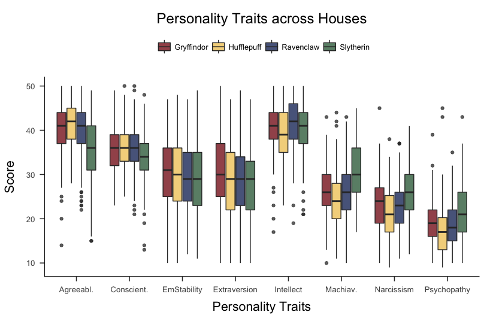

If you are reading this, you are probably a Ravenclaw. Or a Hufflepuff. Certainly not a Slytherin ... but maybe a Gryffindor?

In this blog post, we let three subjective Bayesians predict the outcome of ten coin flips. We will derive prior predictions, evaluate their accuracy, and see how fortune favours the bold. We will also discover a neat trick that allows one to easily compute Bayes factors for models with parameter restrictions compared to models without such restrictions, and use it to answer a question we truly care about: are Slytherins really the bad guys?

# Preliminaries
As in a [previous blog post](https://fabiandablander.com/r/Regularization.html), we start by studying coin flips. Let $\theta \in [0, 1]$ be the bias of the coin and let $y$ denote the number of heads out of $n$ coin flips. We use the Binomial likelihood

$$
p(y \mid \theta) = {n \choose y} \theta^y (1 - \theta)^{n - y} \enspace ,
$$

and a Beta prior for $\theta$:

$$
p(\theta) = \frac{1}{\text{B}(a, b)} \theta^{a - 1} (1 - \theta)^{b - 1} \enspace .
$$

This prior is *conjugate* for this likelihood which means that the posterior is again a Beta distribution. The Figure below shows two examples of this.

```{r, echo = FALSE, fig.width = 14, fig.height = 6, fig.align = 'center', message = FALSE, warning = FALSE, dpi=400}
library('latex2exp')

plot_updating <- function(a = 1, b = 1, k = 0, N = 0, null = NULL, CI = NULL, ymax = 'auto', ylab = 'Density') {
  x <- seq(.001, .999, .001) ## set up for creating the distributions
  y1 <- dbeta(x, a, b) # data for prior curve
  y3 <- dbeta(x, a + k, b + N - k) # data for posterior curve
  y2 <- dbeta(x, 1 + k, 1 + N - k) # data for likelihood curve, plotted as the posterior from a beta(1,1)
  y.max <- ifelse(is.numeric(ymax), ymax, 1.25 * max(y1, y2, y3, 1.6))
  title <- paste0('Beta(', a, ', ', b, ')', ' to Beta(', a + k, ', ', b + N - k, ')')
  
  plot(x, y1, xlim = c(0, 1), ylim = c(0, y.max), type = 'l', ylab = ylab, lty = 2,
       xlab = TeX('$\\theta$'), las = 1, main = title, lwd = 3,
       cex.lab = 1.5, cex.main = 1.5, col = 'skyblue', axes = FALSE)
  
  axis(1, at = seq(0, 1, .2)) #adds custom x axis
  axis(2, las = 1) # custom y axis
  
  # if there is new data, plot likelihood and posterior
  lines(x, y2, type = 'l', col = 'darkorange', lwd = 2, lty = 3)
  lines(x, y3, type = 'l', col = 'darkorchid1', lwd = 5)
  legend('topleft', c('Prior', 'Posterior', 'Likelihood'),
         col = c('skyblue', 'darkorchid1', 'darkorange'), 
         lty = c(2, 1, 3), lwd = c(3, 5, 2), bty = 'n',
         y.intersp = 1, x.intersp = .4, seg.len =.7)
}

par(mfrow = c(1, 2))

plot_updating(a = 1, b = 1, k = 3, N = 3)
plot_updating(a = 2, b = 2, k = 3, N = 3, ylab = '')
```

In this blog post, we will use a *prior predictive* perspective on model comparison by means of Bayes factors. For an extensive contrast with a perspective based on *posterior prediction*, see [this blog post](https://fabiandablander.com/r/Law-of-Practice.html). The Bayes factor indicates how much better a model $\mathcal{M}_1$ predicts the data $y$ *relative to another model* $\mathcal{M}_0$:

$$
\text{BF}_{10} = \frac{p(y \mid \mathcal{M}_1)}{p(y \mid \mathcal{M}_0)} \enspace ,
$$

where we can write the *marginal likelihood* of a generic model $\mathcal{M}$ more complicatedly to see the dependence on the model's priors:

$$
p(y \mid \mathcal{M}) = \int_{\Theta} p(y \mid \theta, \mathcal{M}) \, p(\theta \mid \mathcal{M}) \, \mathrm{d}\theta \enspace .
$$

After these preliminaries, in the next section, we visit Ron, Harry, and Hermione in Hogwarts.


# The Hogwarts prediction contest
Ron, Harry, and Hermione just came back from a straining adventure --- Death Eaters and all. They deserve a break, and Hermione suggests a small prediction contest to relax. Ron is put off initially; relaxing by thinking? That's not his style. Harry does not care either way; both are eventually convinced.

The goal of the contest is to accuratly predict the outcome of $n = 10$ coin flips. Luckily, this is not a particularly complicated problem to model, and we can use the Binomial likelihood we have discussed above. In the next section, Ron, Harry, and Hermione --- all subjective Bayesians --- clearly state their prior beliefs which is required to make predictions.


## Prior beliefs
Ron is not big on thinking, and so trusts his previous intuitions that coins are usually unbiased; he specifies a point mass on $\theta = 0.50$ as his prior. Harry spreads his bets evenly, and believes that all chances governing the coin flip's outcome are equally likely; he puts a uniform prior on $\theta$. Hermione, on the other hand, believes that the coin *cannot* be biased towards tails; instead, she believes that all values $\theta \in [0.50, 1]$ are equally likely. She thinks this because Dobby --- the house elf --- is the one who throws the coin, and she has previously observed him passing time by flipping coins, which strangely almost always landed up heads. To sum up, their priors are:

$$
\begin{aligned}
\text{Ron} &: \theta  = 0.50 \\[.5em]
\text{Harry} &: \theta  \sim \text{Beta}(1, 1) \\[.5em]
\text{Hermione} &: \theta  \sim \text{Beta}(1, 1)\mathbb{I}(0.50, 1) \enspace ,
\end{aligned}
$$

which are visualized in the Figure below.

```{r, echo = FALSE, fig.width = 10, fig.height = 4, fig.align = 'center', message = FALSE, warning = FALSE, dpi=400}
library('latex2exp')

x <- seq(.000, 1, .001)
par(mfrow = c(1, 3))

plot(
  0, 0, xlim = c(0, 1), type = 'l', ylab = 'Density', lty = 1,
  xlab = TeX('$\\theta$'), las = 1, main = 'Ron\'s Prior', lwd = 3, ylim = c(0, 2.5),
  cex.lab = 1.5, cex.main = 1.5, col = 'skyblue', axes = FALSE
)

arrows(0.5, 0, .5, 2, col = 'skyblue', lwd = 3)
axis(1, at = seq(0, 1, .2)) #adds custom x axis
axis(2, las = 1) # custom y axis

plot(
  x, dbeta(x, 1, 1), xlim = c(0, 1), type = 'l', ylab = 'Density', lty = 1,
  xlab = TeX('$\\theta$'), las = 1, main = 'Harry\'s Prior', lwd = 3, ylim = c(0, 2.5),
  cex.lab = 1.5, cex.main = 1.5, col = 'skyblue', axes = FALSE
)
  
axis(1, at = seq(0, 1, .2)) #adds custom x axis
axis(2, las = 1) # custom y axis

plot(
  x, dunif(x, .5, 1), xlim = c(0, 1), type = 'l', ylab = 'Density', lty = 1,
  xlab = TeX('$\\theta$'), las = 1, main = 'Hermione\'s Prior', lwd = 3, ylim = c(0, 2.5),
  cex.lab = 1.5, cex.main = 1.5, col = 'skyblue', axes = FALSE
)

axis(1, at = seq(0, 1, .2)) #adds custom x axis
axis(2, las = 1) # custom y axis
```

In the next section, the three use their beliefs to make probabilistic predictions.


## Prior predictions
Ron, Harry, and Hermione are subjective Bayesians and therefore evaluate their performance by their respective predictive accuracy. Each of the trio has a *prior predictive distribution*. For Ron, true to character, this is the easiest to derive. We associate model $\mathcal{M}_0$ with him and write:

$$
\begin{aligned}
p(y \mid \mathcal{M}_0) &= \int_{\Theta} p(y \mid \theta, \mathcal{M}_0) \, p(\theta \mid \mathcal{M}_0) \, \mathrm{d}\theta \\[.5em]
&= {n \choose y} 0.50^y (1 - 0.50)^{n - y} \enspace ,
\end{aligned}
$$

where the integral --- the sum! --- is just over the value $\theta = 0.50$. Ron's prior predictive distribution is simply a Binomial distribution. He is delighted by this fact, and enjoys a short rest while the others derive their predictions.

It is Harry's turn, and he is a little put off by his integration problem. However, he realizes that the integrand is an unnormalized Beta distribution, and swiftly writes down its normalizing constant, the Beta function. Associating $\mathcal{M}_1$ with him, his steps are:

$$
\begin{aligned}
p(y \mid \mathcal{M}_1) &= \int_{\Theta} p(y \mid \theta, \mathcal{M}_1) \, p(\theta \mid \mathcal{M}_1) \, \mathrm{d}\theta \\[.5em]
&= \int_{\Theta} {n \choose y} \theta^y (1 - \theta)^{n - y} \, \frac{1}{\text{B}(1, 1)} \theta^{1 - 1} (1 - \theta)^{1 - 1} \, \mathrm{d}\theta \\[.5em]
&= \int_{\Theta} {n \choose y} \theta^y (1 - \theta)^{n - y}  \, \mathrm{d}\theta \\[.5em]
&= {n \choose y} \text{Beta}(y + 1, n - y + 1) \enspace ,
\end{aligned}
$$

which is a [Beta-Binomial distribution](https://en.wikipedia.org/wiki/Beta-binomial_distribution) with $\alpha = \beta = 1$.

Hermione's integral is the most complicated of the three, but she is also the smartest of the bunch. She is a master of the wizardry that is computer programming, which allows her to solve the integral numerically.[^1] We associate $\mathcal{M}_r$, which stands for *restricted* model, with her and write:

$$
\begin{aligned}
p(y \mid \mathcal{M}_r) &= \int_{\Theta} p(y \mid \theta, \mathcal{M}_r) \, p(\theta \mid \mathcal{M}_r) \, \mathrm{d}\theta \\[.5em]
&= \int_{0.50}^1 {n \choose y} \theta^y (1 - \theta)^{n - y} \, 2 \, \mathrm{d}\theta \\[.5em]
&= 2{n \choose y}\int_{0.50}^1 \theta^y (1 - \theta)^{n - y} \mathrm{d}\theta \enspace .
\end{aligned}
$$

We can draw from the prior predictive distributions by simulating from the prior and then making predictions through the likelihood. For Hermione, for example, this yields:

```{r}
nr_draws <- 20
theta_Hermione <- runif(n = nr_draws, min = 0.50, max = 1)
predictions_Hermione <- rbinom(n = nr_draws, size = 10, prob = theta_Hermione)

predictions_Hermione
```

Let's visualize Ron's, Harry's, and Hermione's prior predictive distributions to get a better feeling for what they believe are likely coin flip outcomes. First, we implement their prior predictions in R:

```{r}
Ron <- function(y, n = 10) {
  choose(n, y) * 0.50^n
}

Harry <- function(y, n = 10) {
  choose(n, y) * beta(y + 1, n - y + 1)
}

Hermione <- function(y, n = 10) {
  int <- integrate(function(theta) theta^y * (1 - theta)^(n - y), 0.50, 1)
  2 * choose(n, y) * int$value
}
```

Even though Ron believes that $\theta = 0.50$, this does not mean that his prior prediction puts all mass on $y = 5$; deviations from this value are plausible. Harry's prior predictive distribution also makes sense: since he believes all values for $\theta$ to be equally likely, he should believe all outcomes are equally likely. Hermione, on the other hand, believes that $\theta \in [0.50, 1]$, so her prior probabilities for outcomes with few heads ($y < 5$) drastically decrease.

```{r, echo = FALSE, fig.width = 10, fig.height = 4, fig.align = 'center', message = FALSE, warning = FALSE, dpi=400}
y <- seq(0, 10)
par(mfrow = c(1, 3))

barplot(
  Ron(y), ylab = 'Probability Mass',
  xlab = 'y', las = 1, main = 'Ron\'s Predictions',
  cex.lab = 1.5, cex.main = 1.5, col = 'skyblue', width = .75,
  names.arg = as.character(seq(0, 10, 1)), ylim = c(0, .3)
)

# axis(2, las = 1) # custom y axis

barplot(
  Harry(y), ylab = 'Probability Mass',
  xlab = 'y', las = 1, main = 'Harry\'s Predictions',
  cex.lab = 1.5, cex.main = 1.5, col = 'skyblue', width = .75,
  names.arg = as.character(seq(0, 10, 1)), ylim = c(0, .3)
)

barplot(
  sapply(y, Hermione), ylab = 'Probability Mass',
  xlab = 'y', las = 1, main = 'Hermione\'s Predictions',
  cex.lab = 1.5, cex.main = 1.5, col = 'skyblue', width = .75,
  names.arg = as.character(seq(0, 10, 1)), ylim = c(0, .3)
)
```

After the three have clearly stated their prior beliefs and derived their prior predictions, Dobby throws a coin ten times. The coin comes up heads nine times. In the next section, we discuss the relative predictive performance of Ron, Harry, and Hermione based on these data.


## Evaluating predictions
To assess the relative predictive performance of Ron, Harry, and Hermione, we need to compute the probability mass of $y = 9$ for their respective prior predictive distributions. Compared to Ron, Hermione did roughly 19 times better:

```{r}
Hermione(9) / Ron(9)
```

Harry, on the other hand, did about 9 times better than Ron:

```{r}
Harry(9) / Ron(9)
```

With these two comparisons, we also know by how much Hermione outperformed Harry, since by transitivity we have:

$$
\text{BF}_{r1} = \frac{p(y \mid \mathcal{M}_r)}{p(y \mid \mathcal{M}_0)} \times \frac{p(y \mid \mathcal{M}_0)}{p(y \mid \mathcal{M}_1)} = \text{BF}_{r0} \times \frac{1}{\text{BF}_{10}} \approx 2 \enspace ,
$$

which is indeed correct:

```{r}
Hermione(9) / Harry(9)
```


Note that this is also immediately apparent from the visualizations above, where Hermione's allocated probability mass is about twice as large as Harry's for the case where $y = 9$.

Hermione was bold in her prediction, and was rewarded with being favoured by a factor of two in predictive performance. Note that if her predictions would have been even bolder, say restricting her prior to $\theta \in [0.80, 1]$, she would have reaped higher rewards than a Bayes factor in favour of two. Contrast this to Dobby throwing the coin ten times and with only one heads showing. Then Harry's marginal likelihood is still $\text{Beta}(11, 1) = \frac{1}{11}$. However, Hermione's is not twice as much; instead, it is a mere $0.001065$, which would result in a Bayes factor of about $85$ in favour of Harry!

```{r}
Harry(1) / Hermione(1)
```

This means that with bold predictions, one can also lose a lot. However, this is tremendously insightful, since Hermione would immediately realize where she went wrong. For a discussion that also points out the flexibility of Bayesian model comparison, see Etz, Haaf, Rouder, & Vandeckerckhove (2018).

In the next section, we will discover a nice trick which simplifies the computation of the Bayes factor; we do not need to derive marginal likelihoods, but can simply look at the prior and the posterior distribution of the parameter of interest in the unrestricted model.


# Prior / Posterior trick
As it it turns out, the relative predictive performance of Hermione compared to Harry is given by the ratio of the purple area to the blue area in the figure below.

```{r, echo = FALSE, fig.width = 7, fig.height = 6, fig.align = 'center', message = FALSE, warning = FALSE, dpi=400}
library('ggplot2')

plot_updating2 <- function(a = 1, b = 1, k = 0, N = 0, null = NULL, CI = NULL, ymax = 'auto', ylab = 'Density') {
  x <- seq(.001, .999, .001) ## set up for creating the distributions
  y1 <- dbeta(x, a, b) # data for prior curve
  y2 <- dbeta(x, 1 + k, 1 + N - k) # data for likelihood curve, plotted as the posterior from a beta(1,1)
  y3 <- dbeta(x, a + k, b + N - k) # data for posterior curve
  y.max <- ifelse(is.numeric(ymax), ymax, 1.25 * max(y1, y2, y3, 1.6))
  title <- paste0('Beta(', a, ', ', b, ')', ' to Beta(', a + k, ', ', b + N - k, ')')
  
  plot(x, y1, xlim = c(0, 1), ylim = c(0, y.max), type = 'l', ylab = ylab, lty = 1,
       xlab = TeX('$\\theta$'), las = 1, main = title, lwd = 3,
       cex.lab = 1.5, cex.main = 1.5, col = 'skyblue', axes = FALSE)
  
  x2 <- seq(0.5, .9999, .001)
  polygon(c(0.5, x2, 1), c(0, dbeta(x2, 10, 2), 0), col = alpha('darkorchid1', alpha = .4), border = FALSE)
  rect(xleft = .5, xright = 1, ybottom = 0, ytop = 1, col = alpha('skyblue', alpha = .4), border = FALSE)
  
  lines(x, y1, xlim = c(0, 1), ylim = c(0, y.max), type = 'l', ylab = ylab, lty = 1,
       xlab = TeX('$\\theta$'), las = 1, main = title, lwd = 3,
       cex.lab = 1.5, cex.main = 1.5, col = 'skyblue')

  axis(1, at = seq(0, 1, .2)) #adds custom x axis
  axis(2, las = 1) # custom y axis
  
  # if there is new data, plot likelihood and posterior
  lines(x, y3, type = 'l', col = 'darkorchid1', lwd = 3)
  legend(x = -.025, y = 5.2, c('Prior', 'Posterior'),
         col = c('skyblue', 'darkorchid1'), 
         lty = c(1, 1), lwd = c(3, 3), bty = 'n',
         y.intersp = 1, x.intersp = .4, seg.len =.7)
}

plot_updating2(a = 1, b = 1, k = 9, N = 10)
```

In other words, the Bayes factor in favour of the *restricted* model (i.e., Hermione) compared to the *unrestricted* or *encompassing* model (i.e., Harry) is given by the posterior probability of $\theta$ being in line with the restriction compared to the prior probability of $\theta$ being in line with the restriction. We can check this numerically:

```{r}
# (1 - pbeta(0.50, 10, 2)) / 0.50 would also work
integrate(function(theta) dbeta(theta, 10, 2), 0.50, 1)$value /  0.50
```

This is a very cool result which, to my knowledge, was first described in Kluglist & Hoijtink (2005). In the next section, we prove it.


## Proof
The proof uses two insights. First, note that we can write the priors in the restricted model, $\mathcal{M}_r$, as priors in the encompassing model, $\mathcal{M}_1$, subject to some constraints. In the Hogwarts prediction context, Hermione's prior was a restricted version of Harry's prior:

$$
\begin{aligned}
p(\theta \mid \mathcal{M}_r) &= p(\theta \mid \mathcal{M}_1)\mathbb{I}(0.50, 1) \\[1em]
                             &= \begin{cases} \frac{p(\theta \mid \mathcal{M}_1)}{\int_{0.50}^1 p(\theta \mid \mathcal{M}_1) \, \mathrm{d}\theta} & \text{if} \hspace{1em} \theta \in [0.50, 1] \\[1em] 0 & \text{otherwise}\end{cases}
\end{aligned}
$$

```{r, echo = FALSE, fig.width = 10, fig.height = 5, fig.align = 'center', message = FALSE, warning = FALSE, dpi=400}
library('latex2exp')

x <- seq(.000, 1, .001)
par(mfrow = c(1, 2))

plot(
  x, dbeta(x, 1, 1), xlim = c(0, 1), type = 'l', ylab = 'Density', lty = 1,
  xlab = TeX('$\\theta$'), las = 1, main = 'Harry\'s Prior', lwd = 3, ylim = c(0, 2.5),
  cex.lab = 1.5, cex.main = 1.5, col = 'skyblue', axes = FALSE
)
  
axis(1, at = seq(0, 1, .2)) #adds custom x axis
axis(2, las = 1) # custom y axis

plot(
  x, dunif(x, .5, 1), xlim = c(0, 1), type = 'l', ylab = 'Density', lty = 1,
  xlab = TeX('$\\theta$'), las = 1, main = 'Hermione\'s Prior', lwd = 3, ylim = c(0, 2.5),
  cex.lab = 1.5, cex.main = 1.5, col = 'skyblue', axes = FALSE
)

axis(1, at = seq(0, 1, .2)) #adds custom x axis
axis(2, las = 1) # custom y axis
```

We have to divide by the term

$$
K = \int_{0.50}^1 p(\theta \mid \mathcal{M}_1) \, \mathrm{d}\theta = 0.50 \enspace ,
$$

so that the restricted prior integrates to 1, as all proper probability distributions must. As a direct consequence, note that the density of a value $\theta = \theta^{\star}$ is given by:

$$
p(\theta^{\star} \mid \mathcal{M}_r) = p(\theta^{\star} \mid \mathcal{M}_1) \cdot \frac{1}{K} \enspace ,
$$

where $K$ is the renormalization constant. This means that we can rewrite terms which include the restricted prior in terms of the unrestricted prior from the encompassing model. This also holds for the posterior!

To see that we can also write the restricted posterior in terms of the unrestricted posterior from the encompassing model, note that the likelihood is the same under both models and that:

$$
\begin{aligned}
p(\theta \mid y, \mathcal{M}_r) &= \frac{p(y \mid \theta, \mathcal{M}_r) \, p(\theta \mid \mathcal{M}_r)}{\int_{0.50}^1 p(y \mid \theta, \mathcal{M}_r) \, p(\theta \mid \mathcal{M}_r) \, \mathrm{d}\theta} \\[.5em]
&= \frac{p(y \mid \theta, \mathcal{M}_1) \, p(\theta \mid \mathcal{M}_1) \, \frac{1}{K}}{\int_{0.50}^1 p(y \mid \theta, \mathcal{M}_1) \, p(\theta \mid \mathcal{M}_1) \, \frac{1}{K} \, \mathrm{d}\theta} \\[.5em]
&= \frac{p(y \mid \theta, \mathcal{M}_1) \, p(\theta \mid \mathcal{M}_1)}{\int_{0.50}^1 p(y \mid \theta, \mathcal{M}_1) \, p(\theta \mid \mathcal{M}_1) \, \mathrm{d}\theta} \\[.5em]
&= \frac{\frac{p(y \mid \theta, \mathcal{M}_1) \, p(\theta \mid \mathcal{M}_1)}{\int p(y \mid \theta, \mathcal{M}_1) \, p(\theta \mid \mathcal{M}_1) \, \mathrm{d}\theta}}{\int_{0.50}^1 \frac{p(y \mid \theta, \mathcal{M}_1) \, p(\theta \mid \mathcal{M}_1)}{\int p(y \mid \theta, \mathcal{M}_1) \, p(\theta \mid \mathcal{M}_1) \, \mathrm{d}\theta} \, \mathrm{d}\theta} \\[.5em]
&= \frac{p(\theta \mid y, \mathcal{M}_1)}{\int_{0.50}^1 p(\theta \mid y, \mathcal{M}_1) \, \mathrm{d}\theta} \enspace ,
\end{aligned}
$$

where we have to renormalize by 

$$
Z = \int_{0.50}^1 p(\theta \mid y, \mathcal{M}_1) \, \mathrm{d}\theta \enspace ,
$$

which is

```{r}
1 - pbeta(0.50, 10, 2)
```

The figure below visualizes Harry's and Hermione's posterior. Sensibly, since Hermione excluded all $\theta \in [0, 0.50]$ in her prior, such values receive zero credence in her posterior. However, the difference in posterior distributions between Harry and Hermione is very weak in contrast to the difference in prior distribution. This is reflected in $Z$ being close to 1.

```{r, echo = FALSE, fig.width = 10, fig.height = 5, fig.align = 'center', message = FALSE, warning = FALSE, dpi=400}
library('latex2exp')

x <- seq(.000, 1, .001)
par(mfrow = c(1, 2))

Hermione_posterior <- function(x, y = 9, n = 10) {
  fn <- function(x) {
    dunif(x, 0.5, 1) * dbinom(y, n, x)
  }
  
  dunif(x, 0.5, 1) * dbinom(y, n, x) / integrate(fn, 0.5, 1)$value
}

plot(
  x, dbeta(x, 10, 2), xlim = c(0, 1), type = 'l', ylab = 'Density', lty = 1,
  xlab = TeX('$\\theta$'), las = 1, main = 'Harry\'s Posterior', lwd = 3, ylim = c(0, 5),
  cex.lab = 1.5, cex.main = 1.5, col = 'darkorchid1', axes = FALSE
)

axis(1, at = seq(0, 1, .2)) #adds custom x axis
axis(2, las = 1) # custom y axis

plot(
  x, Hermione_posterior(x), xlim = c(0, 1), type = 'l', ylab = 'Density', lty = 1,
  xlab = TeX('$\\theta$'), las = 1, main = 'Hermione\'s Posterior', lwd = 3, ylim = c(0, 5),
  cex.lab = 1.5, cex.main = 1.5, col = 'darkorchid1', axes = FALSE
)

axis(1, at = seq(0, 1, .2)) #adds custom x axis
axis(2, las = 1) # custom y axis
```

Similar to the prior, we can write the density of a value $\theta = \theta^\star$ in terms of the encompassing model:

$$
p(\theta^{\star} \mid y, \mathcal{M}_r) = p(\theta^{\star} \mid y, \mathcal{M}_1) \cdot \frac{1}{Z} \enspace .
$$

Now that we have established that we can write both the prior and the posterior density of parameters in the restricted model in terms of the parameters in the unrestricted model, as a second step, note that we can swap the posterior and the marginal likelihood terms in Bayes' rule such that:

$$
p(y \mid \mathcal{M}_1) = \frac{p(y \mid \theta, \mathcal{M}_1) \, p(\theta \mid \mathcal{M}_1)}{p(\theta \mid y, \mathcal{M}_1)} \enspace ,
$$

from which it follows that:

$$
\text{BF}_{r1} = \frac{p(y \mid \mathcal{M}_r)}{p(y \mid \mathcal{M}_1)} = \frac{\frac{p(y \mid \theta, \mathcal{M}_r) \, p(\theta \mid \mathcal{M}_r)}{p(\theta \mid y, \mathcal{M}_r)}}{\frac{p(y \mid \theta, \mathcal{M}_1) \, p(\theta \mid \mathcal{M}_1)}{p(\theta \mid y, \mathcal{M}_1)}} \enspace .
$$

Now suppose that we have values that are in line with the restriction, i.e., $\theta = \theta^{\star}$. Then:

$$
\begin{aligned}
\text{BF}_{r1} = \frac{\frac{p(y \mid \theta^\star, \mathcal{M}_r) \, p(\theta^\star\mid \mathcal{M}_r)}{p(\theta^\star \mid y, \mathcal{M}_r)}}{\frac{p(y \mid \theta^\star, \mathcal{M}_1) \, p(\theta^\star \mid \mathcal{M}_1)}{p(\theta^\star \mid y, \mathcal{M}_1)}}
= \frac{\frac{p(y \mid \theta^\star, \mathcal{M}_r) \, p(\theta^\star \mid \mathcal{M}_1) \, \frac{1}{K}}{p(\theta^\star \mid y, \mathcal{M}_1) \, \frac{1}{Z}}}{\frac{p(y \mid \theta^\star, \mathcal{M}_1) \, p(\theta^\star \mid \mathcal{M}_1)}{p(\theta^\star \mid y, \mathcal{M}_1)}}
= \frac{\frac{p(y \mid \theta^\star, \mathcal{M}_r) \, \frac{1}{K}}{\frac{1}{Z}}}{p(y \mid \theta^\star, \mathcal{M}_1)} = \frac{\frac{1}{K}}{\frac{1}{Z}} = \frac{Z}{K} \enspace ,
\end{aligned}
$$

where we have used the previous insights and the fact that the likelihood under $\mathcal{M}_r$ and $\mathcal{M}_1$ is the same. If we expand the constants for our previous problem, we have:

$$
\text{BF}_{r1} = \frac{Z}{K} = \frac{\int_{0.50}^1 p(\theta \mid y, \mathcal{M}_1) \, \mathrm{d}\theta}{\int_{0.50}^1 p(\theta \mid \mathcal{M}_1) \, \mathrm{d}\theta} = \frac{p(\theta \in [0.50, 1] \mid y, \mathcal{M}_1)}{p(\theta \in [0.50, 1] \mid \mathcal{M}_1)} \enspace ,
$$

which is, as claimed above, the posterior probability of values for $\theta$ that are in line with the restriction divided by the prior probability of values for $\theta$ that are in line with the restriction. Note that this holds for arbitrary restrictions of an arbitrary number of parameters (see Kluglist & Hoijtink, 2005). In the limit where we take the restriction to be infinitesimally small, that is, constrain the parameter to be a point value, this results in the Savage-Dickey density ratio (Wetzels, Grasman, & Wagenmakers, 2010).

<!-- To illustrate this, assume that Hermione could have believed that $\theta$ is equally likely to be smaller $0.25$ or larger than $0.75$. Her prior and posterior are visualized in the figure below. -->

<!-- ```{r, echo = FALSE, fig.width = 10, fig.height = 5, fig.align = 'center', message = FALSE, warning = FALSE, dpi=400} -->
<!-- library('latex2exp') -->

<!-- x <- seq(.000, 1, .001) -->
<!-- par(mfrow = c(1, 2)) -->

<!-- Hermione_prior <- function(x) { -->

<!--   if (x < .25) { -->
<!--     res <- dunif(x, 0, 0.25) / 2 -->
<!--   } else { -->
<!--     res <- dunif(x, 0.75, 1) / 2 -->
<!--   } -->

<!--   res -->
<!-- } -->

<!-- Hermione_posterior <- function(x, y = 9, n = 10) { -->
<!--   fn <- function(x) { -->
<!--     Hermione_prior(x) * dbinom(y, n, x) -->
<!--   } -->

<!--   2 * Hermione_prior(x) * dbinom(y, n, x) -->
<!-- } -->

<!-- plot( -->
<!--   x, sapply(x, Hermione_prior), xlim = c(0, 1), type = 'l', ylab = 'Density', lty = 1, -->
<!--   xlab = TeX('$\\theta$'), las = 1, main = 'Hermione\'s Prior', lwd = 3, ylim = c(0, 4), -->
<!--   cex.lab = 1.5, cex.main = 1.5, col = 'skyblue', axes = FALSE -->
<!-- ) -->

<!-- axis(1, at = seq(0, 1, .2)) #adds custom x axis -->
<!-- axis(2, las = 1) # custom y axis -->

<!-- plot( -->
<!--   x, sapply(x, Hermione_posterior), xlim = c(0, 1), type = 'l', ylab = 'Density', lty = 1, -->
<!--   xlab = TeX('$\\theta$'), las = 1, main = 'Hermione\'s Posterior', lwd = 3, ylim = c(0, 4), -->
<!--   cex.lab = 1.5, cex.main = 1.5, col = 'darkorchid1', axes = FALSE -->
<!-- ) -->

<!-- axis(1, at = seq(0, 1, .2)) #adds custom x axis -->
<!-- axis(2, las = 1) # custom y axis -->
<!-- ``` -->

<!-- The Bayes factor in favour of Hermione compared to Harry is given by: -->

<!-- ```{r} -->
<!-- K <- 2 -->
<!-- Z <- pbeta(0.25, 10, 2) + (1 - pbeta(0.75, 10, 2)) -->

<!-- Z / K -->
<!-- ``` -->

In the next section, we apply this idea to a data set that relates Hogwarts Houses to personality traits.


# Hogwarts Houses and personality
So, are you a Slytherin, Hufflepuff, Ravenclaw, or Gryffindor? And what does this say about your personality?

Inspired by Crysel et al. (2015), Lea Jakob, Eduardo Garcia-Garzon, Hannes Jarke, and I analyzed self-reported personality data from 847 people as well as their self-reported Hogwards House affiliation.[^2] We wanted to answer questions such as: do people who report belonging to Slytherin tend to score highest on Narcissism, Machiavellianism, and Psychopathy? Are Hufflepuffs the most agreeable, and Gryffindors the most extraverted? The Figure below visualizes the raw data.

<div style="text-align:center;">
  
</div>

We used a between-subjects ANOVA as our model and, in the case of for example Agreeableness, compared the following hypotheses:

$$
\begin{aligned}
\mathcal{H}_0&: \mu_H = \mu_G = \mu_R = \mu_S \\[.5em]
\mathcal{H}_r&: \mu_H > (\mu_G , \mu_R , \mu_S) \\[.5em]
\mathcal{H}_1&: \mu_H , \mu_G , \mu_R , \mu_S
\end{aligned}
$$

We used the BayesFactor R package to compute the Bayes factor in favour of $\mathcal{H}_1$ compared to $\mathcal{H}_0$. For the restricted hypotheses $\mathcal{H}_r$, we used the prior/posterior trick outlined above; and indeed, we found strong evidence in favour of the notion that, for example, Hufflepuffs score highest on Agreeableness. Curious about Slytherin and the other Houses? You can read the published paper with all the details [here](https://www.collabra.org/article/10.1525/collabra.240/).


# Conclusion
Participating in a relaxing prediction contest, we saw how three subjective Bayesians named Ron, Harry, and Hermione formalized their beliefs and derived their predictions about the likely outcome of ten coin flips. By restricting her prior beliefs about the bias of the coin to exclude values smaller than $\theta = 0.50$, Hermione was the boldest in her predictions and was ultimately rewarded. However, if the outcome of the coin flips would have turned out differently, say $y = 2$, then Hermione would have immediately realized how wrong her beliefs were. I think we as scientists need to be more like Hermione: we need to make more precise predictions, allowing us to construct more powerful tests and "fail" in insightful ways.

We also saw a neat trick by which one can compute the Bayes factor in favour of a restricted model compared to an unrestricted model by estimating the proportion of prior and posterior values of the parameter that are in line with the restriction --- no painstaking computation of marginal likelihoods required! We used this trick to find evidence for what we all knew deep in our hearts already: Hufflepuffs are *so* agreeable.

---
*I would like to thank Sophia Crüwell and Lea Jakob for helpful comments on this blog post.*

---
## References
- Klugkist, I., Kato, B., & Hoijtink, H. ([2005](https://onlinelibrary.wiley.com/doi/full/10.1111/j.1467-9574.2005.00279.x)). Bayesian model selection using encompassing priors. *Statistica Neerlandica, 59*(1), 57-69.
- Wetzels, R., Grasman, R. P., & Wagenmakers, E. J. ([2010](https://www.sciencedirect.com/science/article/pii/S0167947310001180)). An encompassing prior generalization of the Savage–Dickey density ratio. *Computational Statistics & Data Analysis, 54*(9), 2094-2102.
- Etz, A., Haaf, J. M., Rouder, J. N., & Vandekerckhove, J. ([2018](https://journals.sagepub.com/doi/full/10.1177/2515245918773087)). Bayesian inference and testing any hypothesis you can specify. *Advances in Methods and Practices in Psychological Science, 1*(2), 281-295.
- Crysel, L. C., Cook, C. L., Schember, T. O., & Webster, G. D. ([2015](https://www.sciencedirect.com/science/article/abs/pii/S0191886915002615)). Harry Potter and the measures of personality: Extraverted Gryffindors, agreeable Hufflepuffs, clever Ravenclaws, and manipulative Slytherins. *Personality and Individual Differences, 83*, 174-179.
- Jakob, L., Garcia-Garzon, E., Jarke, H., & Dablander, F. ([2019](https://www.collabra.org/article/10.1525/collabra.240/)). The Science Behind the Magic? The Relation of the Harry Potter “Sorting Hat Quiz” to Personality and Human Values. *Collabra: Psychology, 5*(1).

---
## Footnotes
[^1]: The analytical solution is [unpleasant](https://www.wolframalpha.com/input/?i=Integral%5Btheta%5Ey+*+%281+-+theta%29%5E%28n+-+y%29%2C+theta%2C+0.50%2C+1%5D).
[^2]: You can discover your Hogwarts House affiliation at [https://www.pottermore.com/](https://www.pottermore.com/).