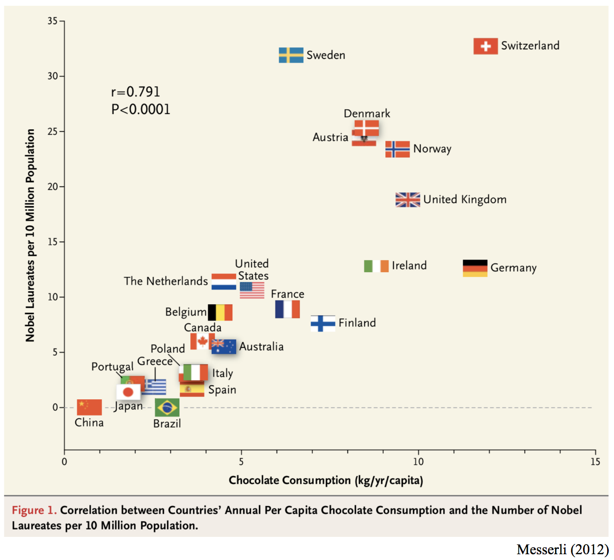
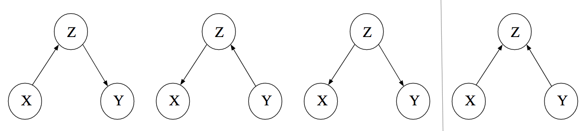
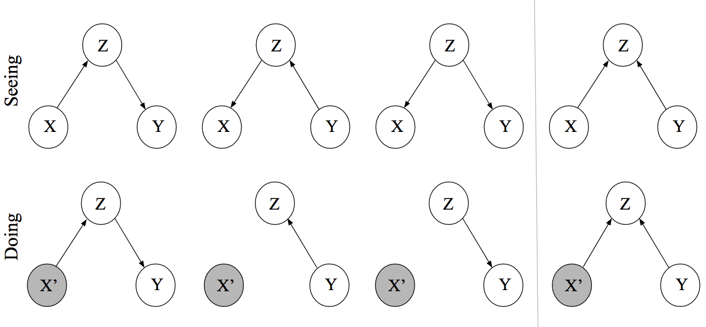
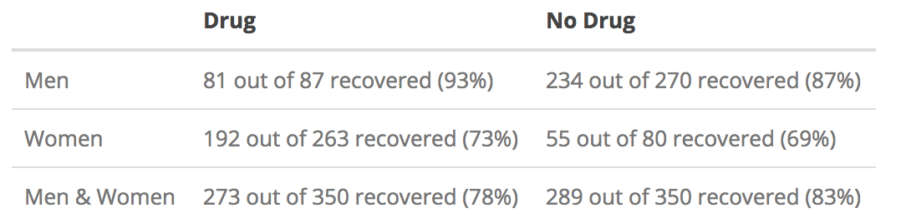
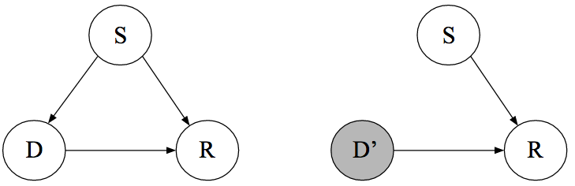
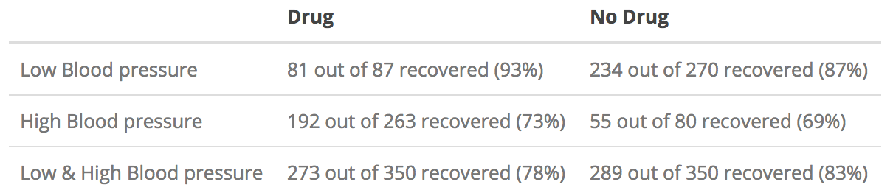
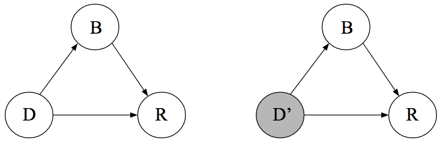
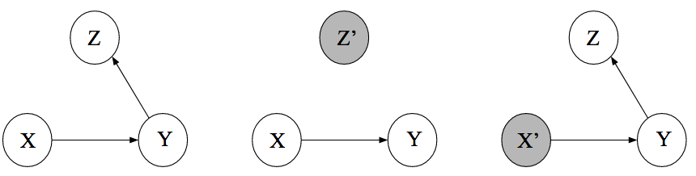

Causal inference goes beyond prediction by modeling the outcome of interventions and formalizing counterfactual reasoning. In this blog post, I provide an introduction to the graphical approach to causal inference in the tradition of Sewell Wright, Judea Pearl, and others.

We first rehash the common adage that correlation is not causation. We then move on to climb what Pearl calls the "ladder of causal inference", from association (*seeing*) to intervention (*doing*) to counterfactuals (*imagining*). We will discover how directed acyclic graphs describe conditional (in)dependencies; how the *do*-calculus describes interventions; and how Structural Causal Models allow us to imagine what could have been. This blog post is by no means exhaustive, but should give you a first appreciation of the concepts that surround causal inference; references to further readings are provided below. Let's dive in![^1]


# Correlation and Causation
Messerli (2012) published a paper entitled "Chocolate Consumption, Cognitive Function, and Nobel Laureates" in *The New England Journal of Medicine* showing a strong positive relationship between chocolate consumption and the number of Nobel Laureates. I have found an even stronger relationship using updated data[^2], as visualized in the figure below.

```{r, echo = FALSE, fig.width = 8, fig.height = 6, fig.align = 'center', message = FALSE, warning = FALSE, dpi = 400}
library('ggplot2')
library('ggrepel')
nobel <- read.csv('assets/data/nobel-chocolate.csv')
coffee <- c(3.9, 8.2, 5.5, 5.3, 7.2, NA, 5.2, 3.1, 3.2, 9.6, 4.9, NA, 3.1, 2.6, NA, NA, NA, NA, NA)
nobel$Coffee <- coffee

ggplot(nobel, aes(x = Chocolate, y = Laureates10_million, label = Country)) +
  geom_point() + 
  geom_text_repel(
    # nudge_y      = 0.05,
    # direction    = "x",
    # vjust        = 0,
    # segment.size = 0.2
  ) + 
  xlab('Chocolate Consumption 2017 (kg/yr/capita)') +
  ylab('Nobel Laureates per 10 Million Population') +
  ggtitle('Nobel Prizes and Chocolate Consumption') +
  theme_bw() +
  scale_x_continuous(breaks = seq(0, 10, 2)) +
  scale_y_continuous(breaks = seq(0, 35, 5)) +
  geom_segment(aes(x=0,xend=10,y=-Inf,yend=-Inf))+
  geom_segment(aes(y=0,yend=35,x=-Inf,xend=-Inf))+
  theme(
    # axis.line = element_line(colour = "black"),
    axis.line = element_blank(),
    panel.grid.major = element_blank(),
    panel.grid.minor = element_blank(),
    panel.border = element_blank(),
    panel.background = element_blank(),
    plot.title = element_text(hjust = .5, size = 16)
  )

# plot(
#   nobel$Chocolate, nobel$Laureates10_million, axes = FALSE, pch = 20,
#   cex = 0, xlab = 'Chocolate Consumption 2017 (kg/yr/capita)',
#   ylab = 'Nobel Laureates per 10 Million Population', xlim = c(0, 10), ylim = c(0, 35),
#   main = 'Nobel Prizes and Chocolate Consumption'
# )
# axis(1)
# axis(2, las = 2)
# 
# text(nobel$Chocolate, nobel$Laureates10_million, nobel$Country, col = 'gray40')
# library(XML)
# library(httr)
# 
# theurl <- "http://en.wikipedia.org/wiki/List_of_countries_by_Nobel_laureates_per_capita"
# tables <- readHTMLTable(rawToChar(GET(theurl)$content), stringsAsFactors = FALSE)
# 
# 
# nobel_prizes <- tables[[1]]
# 
# colnames(nobel_prizes) <- nobel_prizes[1, ]
# nobel_prizes <- nobel_prizes[-1, ]
# # Clean column names
# colnames(nobel_prizes) <- 
#   gsub(" ", "_", 
#        gsub("(/|\\[[0-9]+\\])", "", 
#             gsub("\n", " ", colnames(nobel_prizes))
#         )
#     )
#  
# # Delete those that aren't countries and thus lack rank
# nobel_prizes$Rank <- as.numeric(as.character(nobel_prizes$Rank))
# nobel_prizes <- subset(nobel_prizes, is.na(Rank) == FALSE)
#  
# dat <- data.frame(
#   Entity = c('Switzerland', 'Austria', 'Germany', 'Ireland', 'Great Britain', 'Sweden', 'Estonia', 'Norway',
#              'Poland', 'Belgium', 'Finland', 'Slovakia', 'The Netherlands', 'New Zealand', 'Denmark',
#              'Australia', 'Czech Republic', 'Russia', 'United States', 'France', 'Brazil', 'Japan',
#              'South Africa', 'China'),
#   Chocolate = c(8.8, 8.1, 7.9, 7.9, 7.6, 6.6, 6.5, 5.8, 5.7, 5.6, 5.4, 5.2, 5.1, 5, 4.9, 4.9, 4.9, 4.8,
#                 4.4, 4.3, 1.2, 1.2, 0.9, 0.1)
# )
# 
# library('dplyr')
# nobel <- filter(nobel_prizes, Entity %in% dat$Entity)
# chocolate <- filter(dat, Entity %in% nobel$Entity)
# nobel$Chocolate <- chocolate$Chocolate
# nobel$Laureates10_million <- as.numeric(nobel$Laureates10_million)
```


<!-- <center> -->
<!--    -->
<!-- </center> -->


<!-- Similarly, this great website tells us that US spending on science, space, and technology correlates strongly with suicides by hanging, strangulation, and suffocation: -->

<!-- <center> -->
<!--   <!--  -->
<!--    -->
<!-- </center> -->

Now, except for [people in the chocolate business](https://www.confectionerynews.com/Article/2012/10/11/Chocolate-creates-Nobel-prize-winners-says-study), it would be quite a stretch to suggest that increasing chocolate consumption would increase the number Nobel Laureates. Correlation does not imply causation because it does not constrain the possible causal relations enough. Hans Reichenbach (1956) formulated the *common cause principle* which speaks to this fact:

> If two random variables $X$ and $Y$ are statistically dependent ($X \not \perp Y$), then either (a) $X$ causes $Y$, (b) $Y$ causes $X$, or (c) there exists a third variable $Z$ that causes both $X$ and $Y$. Further, $X$ and $Y$ become independent given $Z$, i.e., $X \perp Y \mid Z$.

An in principle straightforward way to break this uncertainty is to conduct an experiment: we could, for example, force the citizens of Austria to consume more chocolate, and study whether this increases the number of Nobel laureates in the following years. Such experiments are clearly unfeasible, but even in less extreme settings it is frequently unethical, impractical, or impossible --- think of smoking and lung cancer --- to study an association experimentally.

Causal inference provides us with tools that license causal statements even in the absence of a true experiment. This comes with strong assumptions. In the next section, we discuss the "causal hierarchy".


# The Causal Hierarchy
Pearl (2019a) introduces a causal hierarchy with three levels --- association, intervention, and counterfactuals --- as well as three prototypical actions corresponding to each level --- *seeing*, *doing*, and *imagining*. In the remainder of this blog post, we will tackle each level in turn.

# Seeing
Association is on the most basic level; it makes us see that two or more things are somehow related. Importantly, we need to distinguish between *marginal* associations and *conditional* associations. The latter are the key building block of causal inference. The figure below illustrates these two concepts. 

```{r, echo = FALSE, fig.width = 12, fig.height = 6, fig.align = 'center', message = FALSE, warning = FALSE, dpi = 400}
library('mvtnorm')
library('RColorBrewer')
set.seed(1)

n <- 500
S <- cbind(c(1, 0), c(0, 1))
cols <- brewer.pal(3, 'Set1')

d1 <- rmvnorm(n, c(4, 4), S)
d2 <- rmvnorm(n, c(5.5, 5.5), S)
d <- rbind(d1, d2)


par(mfrow = c(1, 2))
plot(
  d, pch = 20, xlim = c(-2, 12), ylim = c(-2, 12), axes = FALSE, col = 'gray40',
  xlab = 'X', ylab = 'Y', main = 'Marginal Dependence between X and Y'
)
abline(lm(d[, 1] ~ d[, 2]), lwd = 1.5, lty = 2)
axis(1)
axis(2, las = 2)

plot(
  d, pch = 20, xlim = c(-2, 12), ylim = c(-2, 12),
  col = cols[rep(c(1, 2), each = n)], axes = FALSE,
  xlab = 'X', ylab = 'Y', main = 'Conditional Independence between X and Y given Z'
)
axis(1)
axis(2, las = 2)
abline(lm(d1[, 1] ~ d1[, 2]), lwd = 1.5, lty = 2, col = 'red')
abline(lm(d2[, 1] ~ d2[, 2]), lwd = 1.5, lty = 2, col = 'blue')
legend('topright', legend = c('Z = 0', 'Z = 1'), col = cols, bty = 'n', lwd = 2, cex = 1.2)
```


If we look at the whole, aggregated data on the left we see that the continuous variables $X$ and $Y$ are positively correlated: an increase in values for $X$ co-occurs with an increase in values for $Y$. This relation describes the *marginal* association of $X$ and $Y$ because we do not care whether $Z = 0$ or $Z = 1$. On the other hand, if we condition on the binary variable $Z$, we find that there is no relation: $X \perp Y \mid Z$. (For more on marginal and conditional associations in the case of Gaussian distributions, see [this](https://fabiandablander.com/statistics/Two-Properties.html) blog post). In the next section, we discuss a powerful tool that allows us to visualize such dependencies.


## Directed Acyclic Graphs
We can visualize the statistical dependencies between the three variables using a graph. A graph is a mathematical object that consists of nodes and edges. In the case of *Directed Acyclic Graphs* (DAGs), these edges are directed. We take our variables $(X, Y, Z$) to be nodes in such DAG and we draw (or omit) edges between these nodes so that the conditional (in)dependence structure in the data is reflected in the graph. We will explain this more formally shortly. For now, let's focus on the relationship between the three variables. We have seen that $X$ and $Y$ are marginally dependent but conditionally independent given $Z$. It turns out that we can draw *three* DAGs that encode this fact; these are the first three DAGs in the figure below. $X$ and $Y$ are dependent through $Z$ in these graphs, and conditioning on $Z$ *blocks* the path between $X$ and $Y$. We state this more formally shortly.

<center>
  
</center>

While it is natural to interpret the arrows causally, we do not do so here. For now, the arrows are merely tools that help us describe associations between variables.

The figure above also shows a fourth DAG, which encodes a different set of conditional (in)dependence relations between $X$, $Y$, and $Z$. The figure below illustrates this: looking at the aggregated data we do not find a relation between $X$ and $Y$ --- they are *marginally independent* --- but we do find one when looking at the disaggregated data --- $X$ and $Y$ are *conditionally dependent* given $Z$.

```{r, echo = FALSE, fig.width = 12, fig.height = 6, fig.align = 'center', message = FALSE, warning = FALSE, dpi = 400}
library('RColorBrewer')
set.seed(1)

n <- 500
S <- cbind(c(1, -.5), c(-.5, 1))
cols <- brewer.pal(3, 'Set1')

d1 <- rmvnorm(n, c(4, 4), S)
d2 <- rmvnorm(n, c(5.5, 5.5), S)
d <- rbind(d1, d2)


par(mfrow = c(1, 2))
plot(
  d, pch = 20, xlim = c(-2, 12), ylim = c(-2, 12), axes = FALSE, col = 'gray40',
  xlab = 'X', ylab = 'Y', main = 'Marginal Independence between X and Y'
)
axis(1)
axis(2, las = 2)
abline(lm(d[, 1] ~ d[, 2]), lwd = 1.5, lty = 2)

plot(
  d, pch = 20, xlim = c(-2, 12), ylim = c(-2, 12),
  col = cols[rep(c(1, 2), each = n)], axes = FALSE,
  xlab = 'X', ylab = 'Y', main = 'Conditional Dependence between X and Y given Z'
)
axis(1)
axis(2, las = 2)
abline(lm(d1[, 1] ~ d1[, 2]), lwd = 1.5, lty = 2, col = 'red')
abline(lm(d2[, 1] ~ d2[, 2]), lwd = 1.5, lty = 2, col = 'blue')
legend('topright', legend = c('Z = 0', 'Z = 1'), col = cols, bty = 'n', lwd = 2, cex = 1.2)
```

A real-world example might help build intuition: Looking at people who are single and who are in a relationship as a separate group, being attractive ($X$) and being intelligent ($Y$) are two independent traits. This is what we see in the left panel in the figure above. Let's make the reasonable assumption that both being attractive and being intelligent are positively related with being in a relationship. What does this imply? First, it implies that, on average, single people are less attractive and less intelligent (see red data points). Second, and perhaps counter-intuitively, it implies that in the population of single people (and people in a relationship, respectively), being attractive and being intelligent are *negatively correlated*. After all, if the handsome person you met at the bar were also intelligent, then he would most likely be in a relationship!

In this example, visualized in the fourth DAG, $Z$ is commonly called a *collider*. Suppose we want to estimate the association between $X$ and $Y$ in the whole population. Conditioning on a collider (for example, by only analyzing data from people who are not in a relationship) while computing the association between $X$ and $Y$ will lead to a different estimate, and the induced bias is known as *collider bias*. It is a serious issue not only in dating, but also for example in medicine.

The simple graphs shown above are the building blocks of more complicated graphs. In the next section, we describe a tool that can help us find (conditional) independencies between sets of variables.[^3]


<!-- The conditional independence relations are easily glanced from these simple graphs. For *chains* and *forks*, $X$ and $Y$ are marginally dependent but conditionally independent given $Z$. For *colliders*, we have that they are marginally independent, but conditionally dependent given $Z$ --- think of our dating example. For larger graphs, it is more difficult to see this.  -->


## $d$-separation
For large graphs, it is not obvious how to conclude that two nodes are (conditionally) independent. *d*-separation is a tool that allows us to check this algorithmically. We need to define some concepts:

- A *path* from $X$ to $Y$ is a sequence of nodes and edges such that the start and end nodes are $X$ and $Y$, respectively.
- A conditioning set $\mathcal{L}$ is the set of nodes we condition on (it can be empty).
- A collider along a path blocks that path. However, conditioning on a collider (or any of its descendants) unblocks that path.

With these definitions out of the way, we call two nodes $X$ and $Y$ $d$-separated by $\mathcal{L}$ if conditioning on all members in $\mathcal{L}$ blocks all paths between the two nodes.

If this is your first encounter with $d$-separation, then this is a lot to wrap your head around. To get some practice, look at the graph on the left side. First, note that there are no *marginal* dependencies; this means that without conditioning or blocking nodes, any two nodes are connected by a path. For example, there is a path going from $X$ to $Y$ through $Z$, and there is a path from $V$ to $U$ going through $Y$ and $W$.

<div style='float: left;'>
<center>
  
</center>
</div>

However, there are a number of *conditional* independencies. For example, $X$ and $Y$ are conditionally independent given $Z$. Why? There are two paths from $X$ to $Y$: one through $Z$ and one through $W$. However, since $W$ is a collider on the path from $X$ to $Y$, the path is already blocked. The only unblocked path from $X$ to $Y$ is through $Z$, and conditioning on it therefore blocks all remaining open paths. Additionally conditioning on $W$ would unblock one path, and $X$ and $Y$ would again be associated.

So far, we have implicitly assumed that conditional (in)dependencies in the graph correspond to conditional (in)dependencies between variables. We make this assumption explicit now. In particular, note that *d*-separation provides us with an independence model $\perp_{\mathcal{G}}$ defined on graphs. To connect this to our standard probabilistic independence model $\perp_{\mathcal{P}}$ defined on random variables, we assume the following *Markov property*:

$$
X \perp_{\mathcal{G}} Y \mid Z \implies X \perp_{\mathcal{P}} Y \mid Z \enspace .
$$

In words, we assume that if the nodes $X$ and $Y$ are *d*-separated by $Z$ in the graph $\mathcal{G}$, the corresponding random variables $X$ and $Y$ are conditionally independent given $Z$. This implies that all conditional independencies in the data are represented in the graph.[^4] Moreover, the statement above implies (and is implied by) the following factorization:

$$
p(X_1, X_2, \ldots, X_n) = \prod_{i=1}^n p(X_i \mid \text{pa}^{\mathcal{G}}(X_i)) \enspace ,
$$

where $\text{pa}^{\mathcal{G}}(X_i)$ denotes the parents of the node $X_i$ in graph $\mathcal{G}$ (see Peters, Janzing, & Schölkopf, p. 101). A node is a parent of another node if it has an outgoing arrow to that node; for example, $X$ is a parent of $Z$ and $W$ in the graph above. The above factorization implies that a node $X$ is independent of its non-descendants given its parents.

*d*-separation is an extremely powerful tool. Until now, however, we have only looked at DAGs to visualize (conditional) independencies. In the next section, we go beyond *seeing* to *doing*.


# Doing
We do not merely want to see the world, but also change it. From this section on, we are willing to interpret DAGs causally. As Dawid (2009a) warns, this is a serious step. In merely describing conditional independencies --- *seeing* --- the arrows in the DAG played a somewhat minor role, being nothing but "incidental construction features supporting the $d$-separation semantics" (Dawid, 2009a, p. 66). In this section, we endow the DAG with a causal meaning and interpret the arrows as denoting *direct causal effects*.

What is a causal effect? Following Pearl and others, we take an *interventionist* position and say that a variable $X$ has a causal influence on $Y$ if changing $X$ leads to changes in $Y$. This position is a very useful one in practice, but not everybody agrees with it (e.g., Cartwright, 2007).

The figure below shows the observational DAGs from above (top row) as well as the manipulated DAGs (bottom row) where we have intervened on the variable $X$, that is, set the value of the random variable $X$ to a constant $x$. Note that setting the value of $X$ cuts all incoming causal arrows since its value is thereby determined only by the intervention, not by any other factors.

<center>
  
</center>

As is easily verified with $d$-separation, the first three graphs in the top row encode the same conditional independence structure. This implies that we cannot distinguish them using only observational data. Interpreting the edges causally, however, we see that the DAGs have a starkly different interpretation. The bottom row makes this apparent by showing the result of an intervention on $X$. In the leftmost causal DAG, $Z$ is on the causal path from $X$ to $Y$, and intervening on $X$ therefore influences $Y$ through $Z$. In the DAG next, to it $Z$ is on the causal path from $Y$ to $X$, and so intervening on $X$ does not influence $Y$. In the third DAG, $Z$ is a common cause and --- since there is no other path from $X$ to $Y$ --- intervening on $X$ does not influence $Y$. For the collider structure in the rightmost DAG, intervening on $X$ does not influence $Y$ because there is no unblocked path from $X$ to $Y$.

To make the distinction between seeing and doing, Pearl introduced the *do*-operator. While $p(Y \mid X = x)$ denotes the *observational* distribution, which corresponds to the process of seeing, $p(Y \mid do(X = x))$ corresponds to the *interventional* distribution, which corresponds to the process of doing. The former describes what values $Y$ would likely take on when $X$ *happened to be* $x$, while the latter describes what values $Y$ would likely take on when $X$ *would be set to* $x$.

## Computing causal effects
$P(Y \mid do(X = x))$ describes the causal effect of $X$ on $Y$, but how do we compute it? Actually *doing* the intervention might be unfeasible or unethical --- side-stepping actual interventions and still getting at causal effects is the whole point of this approach to causal inference. We want to learn causal effects from observational data, and so all we have is the observational DAG. The causal quantity, however, is defined on the manipulated DAG. We need to build a bridge between the observational DAG and the manipulated DAG, and we do this by making two assumptions.

First, we assume that *interventions are local*. This means that if I set $X = x$, then this only influences the variable $X$, with no other direct influence on any other variable. Of course, intervening on $X$ will influence other variables, but only through $X$, not directly through us intervening. In colloquial terms, we do not have a "fat hand", but act like a surgeon precisely targeting only a very specific part of the DAG; we say that the DAG is composed of *modular* parts. We can encode this using the factorization property above:

$$
p(X_1, X_2, \ldots, X_n) = \prod_{i=1}^n p(X_i \mid \text{pa}^{\mathcal{G}}(X_i)) \enspace ,
$$

which we now interpret causally. The factors in the product are sometimes called *causal Markov kernels*; they constitute the modular parts of the system.

Second, we assume that the mechanism by which variables interact do not change through interventions; that is, the mechanism by which a cause brings about its effects does not change whether this occurs naturally or by intervention (see e.g., Pearl, Glymour, & Jewell, p. 56).

With these two assumptions in hand, further note that $p(Y \mid do(X = x))$ can be understood as the *observational* distribution in the manipulated DAG --- $p_m(Y \mid X = x)$ --- that is, the DAG where we set $X = x$. This is because after *doing* the intervention (which catapults us into the manipulated DAG), all that is left for us to do is to *see* its effect.  Observe that the leftmost and rightmost DAG above remain the same under intervention on $X$, and so the interventional distribution $p(Y \mid do(X = x))$ is just the conditional distribution $p(Y \mid X = x)$. The middle DAGs require a bit more work:

$$
\begin{aligned}
p(Y = y \mid do(X = x)) &= p_{m}(Y = y \mid X = x) \\[.5em]
&= \sum_{z} p_{m}(Y = y, Z = z \mid X = x) \\[.5em]
&= \sum_{z} p_{m}(Y = y \mid X = x, Z = z) \, p_m(Z = z) \\[.5em]
&= \sum_{z} p(Y = y \mid X = x, Z = z) \, p(Z = z) \enspace .
\end{aligned}
$$

The first equality follows by definition. The second and third equality follow from the *sum* and *product* rule of probability. The last line follows from the assumption that the mechanism through which $X$ influences $Y$ is independent of whether we set $X$ or whether $X$ naturally occurs, that is,  $p_{m}(Y = y \mid X = x, Z = z) = p(Y = y \mid X = x, Z = z)$, and the assumption that interventions are local, that is, $p_m(Z = z) = p(Z = z)$. Thus, the interventional distribution we care about is equal to the conditional distribution of $Y$ given $X$ when we adjust for $Z$. Graphically speaking, this blocks the path $X \leftarrow Z \leftarrow Y$ in the left middle graph and the path $X \leftarrow Z \rightarrow Y$ in the right middle graph. If there were a path $X \rightarrow Y$ in these two latter graphs, and if we would not adjust for $Z$, then the causal effect of $X$ on $Y$ would be *confounded*. For these simple DAGs, however, it is already clear from the fact that $X$ is independent of $Y$ given $Z$ that $X$ cannot have a causal effect on $Y$. In the next section, study a more complicated graph and look at confounding more closely.


## Confounding
Confounding has been given various definitions over the decades, but usually denotes the situation where a (possibly unobserved) common cause obscures the causal relationship between two or more variables. Here, we are slightly more precise and call a causal effect of $X$ on $Y$ confounded if $p(Y \mid X = x) \neq p(Y \mid do(X = x))$, which also implies that collider bias is a type of confounding. This occured in the middle two DAGs in the example above, as well as in the chocolate consumption and Nobel Laureates example at the beginning of the blog post. Confounding is the bane of observational data analysis. Helpfully, causal DAGs provide us with a tool to describe multivariate relations between variables. Once we have stated our assumptions clearly, the *do*-calculus further provides us with a means to know what variables we need to adjust for so that causal effects are unconfounded.

We follow Pearl, Glymour, & Jewell (2016, p. 61) and define the *backdoor criterion*:

> Given two nodes $X$ and $Y$, an adjustment set $\mathcal{L}$ fulfills the backdoor criterion if no member in $\mathcal{L}$ is a descendant of $X$ and members in $\mathcal{L}$ block all paths between $X$ and $Y$. Adjusting for $\mathcal{L}$ thus yields the causal effect of $X \rightarrow Y$.

The key observation is that this (a) blocks all spurious, that is, non-causal paths between $X$ and $Y$, (b) leaves all directed paths from $X$ to $Y$ unblocked, and (c) creates no spurious paths.

<div style='float: left;'>
<center>
  
</center>
</div>

To see this action, let's again look at the DAG on the left. The causal effect of $Z$ on $U$ is confounded by $X$, because in addition to the legitimate causal path $Z \rightarrow Y \rightarrow W \rightarrow U$, there is also an unblocked path $Z \leftarrow X \rightarrow W \rightarrow U$ which confounds the causal effect. The backdoor criterion would have us condition on $X$, which blocks the spurious path and renders the causal effect of $Z$ on $U$ unconfounded. Note that conditioning on $W$ would also block this spurious path; however, it would also block the causal path $Z \rightarrow Y \rightarrow W \rightarrow U$.

Before moving on, let's catch a quick breath. We have already discussed a number of very important concepts. At the lowest level of the causal hierarchy --- association --- we have discovered DAGs and $d$-separation as a powerful tool to reason about conditional (in)dependencies between variables. Moving to intervention, the second level of the causal hierarchy, we have satisfied our need to interpret the arrows in a DAG causally. Doing so required strong assumptions, but it allowed us to go beyond *seeing* and model the outcome of interventions. This hopefully clarified the notion of confounding. In particular, collider bias is a type of confounding, which has important practical implications: we should not blindly enter all variables into a regression in order to "control" for them, but think carefully about what the underlying causal DAG could look like. Otherwise, we might induce spurious associations.

The concepts from causal inference can help us understand methodological phenomena that have been discussed for decades. In the next section, we apply the concepts we have seen so far to make sense of one such phenomenon: *Simpson's Paradox*.


# Example Application: Simpson's Paradox
This section follows the example given in Pearl, Glymour, & Jewell (2016, Ch. 1) with slight modifications. Suppose you observe $N = 700$ patients who either *choose* to take a drug or not; note that this is not a randomized control trial. The table below shows the number of recovered patients split across sex.

```{r, echo = FALSE, results = 'asis', eval = FALSE}
library('kableExtra')

simpson <- cbind(
  c('81 out of 87 recovered (93%)', '192 out of 263 recovered (73%)', '273 out of 350 recovered (78%)'),
  c('234 out of 270 recovered (87%)', '55 out of 80 recovered (69%)', '289 out of 350 recovered (83%)')
)
rownames(simpson) <- c('Low Blood pressure', 'High Blood pressure', 'Low & High Blood pressure')

tab <- kable(
  simpson, 'html',
  col.names = c('Drug', 'No Drug'),
  # row.names = c('Men', 'Women', 'Men and Women'),
  row.names = TRUE,
  escape = TRUE
)
kable_styling(tab, full_width = FALSE)
```

<center>
  
</center>

We observe that more men as well as more women recover when taking the drug (93% and 73%) compared to when not taking the drug (87% and 69%). And yet, when taken together, *fewer* patients who took the drug recovered (78%) compared to patients who did not take the drug (83%). This is puzzling --- should a doctor prescribe the drug or not?

To answer this question, we need to compute the causal effect that taking the drug has on the probability of recovery. As a first step, we draw the causal DAG. Suppose we know that women are more likely to take the drug, that being a woman has an effect on recovery more generally, and that the drug has an effect on recovery. Moreover, we know that the *treatment cannot cause sex*. This is a trivial yet crucial observation --- it is impossible to express this in purely statistical language. Causal DAGs provide us with a tool to make such an assumption explicit; the graph below makes explicit that sex ($S$) is a common cause of both drug taking ($D$) and recovery ($R$). We denote $S = 1$ as being female, $D = 1$ as having chosen the drug, and $R = 1$ as having recovered. The left DAG is observational, while the right DAG indicates the intervention $do(D = d)$, where $d$ denotes taking the drug ($d = 0$) or not taking the drug ($d = 1$).

<center>
  
</center>

We are interested in the probability of recovery if we would force everybody to take, or not take, the drug; we call the difference between these two probabilities the *average causal effect*. This is key: the *do*-operator is about populations, not individuals. Using it, we cannot make statements that pertain to the recovery of an individual patient; we can only refer to the probability of recovery as defined on populations of patients. We will discuss *individual causal effects* in the section on counterfactuals at the end of the blog post.

Computing the average causal effect requires knowledge about the interventional distributions $p(R \mid do(D = 0))$ and $p(R \mid do(D = 1))$. As discussed above, these correspond to the conditional distribution in the manipulated DAG which is shown above on the right. The backdoor criterion tells us that the conditional distribution in the observational DAG will correspond to the interventional distribution when blocking the spurious path $D \leftarrow S \rightarrow R$. Using the adjustment formula we have derived above, we expand:

$$
\begin{aligned}
p(R = 1 \mid do(D = 1)) &= \sum_{s} p(R = 1\mid D = 1, S = s) \, p(S = s) \\[.5em]
                    &= p(R = 1\mid D = 1, S = 0) \, p(S = 0) + p(R = 1\mid D = 1, S = 1) \, p(S = 1) \\[.5em]
                    &= \frac{81}{87} \times \frac{87 + 270}{700} + \frac{192}{263} \times \frac{263 + 80}{700} \\[.5em]
                    &\approx 0.832 \enspace .
\end{aligned}
$$

In words, we first compute the benefit of taking the drug separately for men and women, and then we average the result by weighting it with the fraction of men and women in the population. This tells us that, if we force everybody to take the drug, about $82\%$ of people will recover. We can similarly compute the probability of recovery given we force all patients to not choose the drug:

$$
\begin{aligned}
p(R = 1\mid do(D = 0)) &= \sum_{s} p(R = 1\mid D = 0, S = s) \, p(S = s) \\[.5em]
                    &= p(R = 1\mid D = 0, S = 0) \, p(S = 0) + p(R = 1\mid D = 0, S = 1) \, p(S = 1) \\[.5em]
                    &= \frac{243}{270} \times \frac{87 + 270}{700} + \frac{55}{80} \times \frac{263 + 80}{700} \\[.5em]
                    &\approx 0.782 \enspace .
\end{aligned}
$$

Therefore, taking the drug does indeed have a positive effect on recovery on average, and the doctor should prescribe the drug.

Note that this conclusion heavily depended on the causal graph. While graphs are wonderful tools in that they make our assumptions explicit, these assumptions are --- of course --- not at all guaranteed to be correct. These assumptions are strong, stating that the graph must encode all causal relations between variables, and that there is no unmeasured confounding, something we can never guarantee in observational data.

Let's look at a different example but with the exact same data. In particular, instead of the variable sex we look at the *post-treatment* variable blood pressure. This means we have measured blood pressure after the patients have taken the drug. Should a doctor prescribe the drug or not?

<center>
  
</center>

Since blood pressure is a post-treatment variable, it cannot influence a patient's decision to take the drug or not. We draw the following causal DAG, which makes clear that the drug has an indirect effect on recovery through blood pressure, in addition to having a direct causal effect.[^5]

<center>
  
</center>

From this DAG, we find that the causal effect of $D$ on $R$ is unconfounded. Therefore, the two causal quantities of interest are given by:

$$
\begin{aligned}
p(R = 1 \mid do(D = 1)) &= p(R = 1 \mid D = 1) = 0.78 \\[.5em]
p(R = 1 \mid do(D = 0)) &= p(R = 1 \mid D = 0) = 0.83 \enspace .
\end{aligned}
$$

This means that the drug is indeed harmful. In the general population (combined data), the drug has a negative effect. Suppose that the drug has a direct positive effect on recovery, but an indirect negative effect through blood pressure. If we only look at patients with a particular blood pressure, then only the drug's positive effect on recovery remains. However, since the drug does influence recovery negatively through blood pressure, it would be misleading to take the association between $D$ and $R$ conditional on $Z$ as our estimate for the causal effect. In contrast to the previous example, using the aggregate data is the correct way to analyze these data in order to estimate the average causal effect.

So far, our treatment has been entirely model-agnostic. In the next section, we discuss Structural Causal Models (SCM) as the fundamental building block of causal inference. This will unify the previous two levels of the causal hierarchy --- *seeing* and *doing* --- as well as open up the third and final level: counterfactuals.

# Structural Causal Models
In this section, we discuss Structural Causal Models (SCM) as the fundamental building block of causal inference. SCMs relate causal and probabilistic statements. As an example, we specify:

$$
\begin{aligned}
X &:= \epsilon_X \\[.5em]
Y &:= f(X, \epsilon_X) \enspace .
\end{aligned}
$$

$X$ is a direct cause of $Y$ which it influences through the function $f()$, and the noise variables $\epsilon_X$ and $\epsilon_Y$ are assumed to be independent. In a SCM, we take each equation to be a causal statement, and we stress this by using the assignment symbol $:=$ instead of the equality sign $=$. Note that this is in stark contrast to standard regression models; here, we explicitly state our causal assumptions.

As we will see below, Structural Causal Models imply observational distributions (*seeing*), interventional distributions (*doing*), as well as counterfactuals (*imagining*). Thus, they can be seen as the fundamental building block of this approach to causal inference. In the following, we restrict the class of Structural Causal Models by allowing only linear relationships between variables and assuming independent Gaussian error terms.[^6] As an example, take the following SCM (Peters, Janzing, & Schölkopf, 2017, p. 90):

$$
\begin{aligned}
X &:= \epsilon_X \\[.5em]
Y &:= X + \epsilon_Y \\[.5em]
Z &:= Y + \epsilon_Z \enspace ,
\end{aligned}
$$

where $\epsilon_X, \epsilon_Y \stackrel{\text{iid}}{\sim} \mathcal{N}(0, 1)$ and $\epsilon_Z \stackrel{\text{iid}}{\sim} \mathcal{N}(0, 0.1)$. Again, each line explicates the causal link variables. For example, we assume that $X$ has a direct causal effect on $Y$, that this effect is linear, and that it is obscured by independent Gaussian noise.

The assumption of Gaussian errors induces a multivariate Gaussian distribution on $(X, Y, Z)$ whose independence structure is visualized in the leftmost DAG below. The middle DAG shows an intervention on $Z$, while the rightmost DAG shows an intervention on $X$. Recall that, as discussed above, intervening on a variable cuts all incoming arrows.

<center>
  
</center>

At the first level of the causal hierarchy --- association --- we might ask ourselves: does $X$ or $Z$ predict $Y$ better? To illustrate the answer for our example, we simulate $n = 1000$ observations from the Structural Causal model:

```{r, echo = TRUE}
set.seed(1)

n <- 1000
x <- rnorm(n, 0, 1)
y <- x + rnorm(n, 0, 1)
z <- y + rnorm(n, 0, 0.1)
```

The figure below shows that $Y$ has a much stronger association with $Z$ than with $X$; this is because the standard deviation of the error $\epsilon_X$ is only a tenth of the standard deviation of the error $\epsilon_Z$. For prediction, therefore, $Z$ is the more relevant variable.

```{r, echo = FALSE, fig.align = 'center', fig.width = 12, fig.height = 6, dpi = 400}
par(mfrow = c(1, 2))
plot(
  x, y, axes = FALSE, pch = 20, xlim = c(-4, 4), col = grDevices::adjustcolor('black', 0.2),
  main = 'Predicting Y using X', xlab = 'X', ylab = 'Y', ylim = c(-6, 6)
)
axis(1)
axis(2, las = 2)

plot(
  z, y, axes = FALSE, pch = 20, col = grDevices::adjustcolor('black', 0.2),
  main = 'Predicting Y using Z', xlab = 'Z', ylab = 'Y', xlim = c(-6, 6), ylim = c(-6, 6)
)
axis(1)
axis(2, las = 2)
```

But does $Z$ actually have a causal effect on $Y$? This is a question about intervention, which is squarely located at the second level of the causal hierarchy. With the knowledge of the underlying Structural Causal Model, we can easily simulate interventions in R and visualize their outcomes:

```{r, echo = TRUE, fig.align = 'center', fig.width = 12, fig.height = 4, dpi = 400}
# Simulate data from the SCM where do(Z = z)
intervene_z <- function(z, n = 1000) {
  x <- rnorm(n, 0, 1)
  y <- x + rnorm(n, 0, 1)
  cbind(x, y, z)
}

# Simulate data from the SCM where do(X = x)
intervene_x <- function(x, n = 1000) {
  y <- x + rnorm(n, 0, 1)
  z <- y + rnorm(n, 0, 0.1)
  cbind(x, y, z)
}

set.seed(1)
datz <- intervene_z(z = 2)
datx <- intervene_x(x = 2)


par(mfrow = c(1, 3))
hist(
  y, xlab = 'Y', breaks = 30,
  xlim = c(-6, 6), col = 'gray76', main = 'P(Y)'
)
hist(
  datz[, 2], xlab = 'Y', breaks = 30,
  xlim = c(-6, 6), col = 'gray76', main = 'P(Y | do(Z = 2))'
)
hist(
  datx[, 2], xlab = 'Y', breaks = 20,
  xlim = c(-6, 6), col = 'gray76', main = 'P(Y | do(X = 2))'
)
```

The leftmost histogram below shows the marginal distribution of $Y$ when no intervention takes place. The histogram in the middle shows the marginal distribution of $Y$ in the manipulated DAG where we set $Z = 2$. Observe that, as indicated by the causal graph, $Z$ does not have a causal effect on $Y$ such that $p(Y \mid do(Z = 2)) = p(Y)$. The histogram on the right shows the marginal distribution of $Y$ in the manipulated DAG where we set $X = 2$.

Clearly, then, $X$ has a causal effect on $Y$. While we have touched on it already when discussing Simpson's paradox, we now formally define the *Average Causal Effect*:

$$
\text{ACE}(X \rightarrow Y) = \mathbb{E}\left[Y \mid do(X = x + 1)\right] - \mathbb{E}\left[Y \mid do(X = x)\right] \enspace ,
$$

which in our case equals one, as can also be seen from the Structural Causal Model. Thus, SCMs allow us to model the outcome of interventions.[^7] However, note again that this is strictly about populations, not individuals. In the next section, we see how SCMs can allow us to climb up to the final level of the causal hierarchy, moving beyond the average to define individual causal effects.


# Counterfactuals
In the *Unbearable Lightness of Being*, Milan Kundera has Tomáš ask himself:

> "Was it better to be with Tereza or to remain alone?"

To which he answers:

> "There is no means of testing which decision is better, because there is no basis for comparison. We live everything as it comes, without warning, like an actor going on cold. And what can life be worth if the first rehearsal for life is life itself?"

Kundera is describing, as Holland (1986, p. 947) put it, the "fundamental problem of causal inference", namely that we only ever observe one realization. If Tomáš chooses to stay with Tereza, then he cannot not choose to stay with Tereza. He cannot go back in time and revert his decision, living instead "everything as it comes, without warning". This does not mean, however, that Tomáš cannot assess afterwards whether his choice has been wise. In contrast, humans constantly evaluate mutually exclusive options, only one of which ever comes true; that is, humans reason *counterfactually*.

To do this formally requires strong assumptions. The *do*-operator, introduced above, is too weak to model counterfactuals. This is because it operates on distributions that are defined on populations, not on individuals. We can define an average causal effect using the *do*-operator, but --- unsurprisingly --- it only ever refers to averages. Structural Causal Models allow counterfactual reasoning on the level of the individual. To see this, we use a simple example.

Suppose we want to study the causal effect of grandma's treatment for the common cold ($T$) on the speed of recovery ($R$). Usually, people recover from the common cold in [seven to ten days](https://en.wikipedia.org/wiki/Common_cold), but grandma swears she can do better with a simple intervention --- we agree on doing an experiment. Assume we have the following SCM:

$$
\begin{aligned}
T &:= \epsilon_T \\[.5em]
R &:= \mu + \beta T + \epsilon \enspace ,
\end{aligned}
$$

where $\mu$ is an intercept, $\epsilon_T \sim \text{Bern}(0.50)$ indicates random assignment to either receive the treatment ($T = 1$) or not receive it ($T = 0$), and $\epsilon \stackrel{\text{iid}}{\sim} \mathcal{N}(0, \sigma)$. The SCM tells us that the direct causal effect of the treatment on how quickly patients recover from the common cold is $\beta$. This causal effect is obscured by individual error terms for each patient $\epsilon = (\epsilon_1, \epsilon_2, \ldots, \epsilon_N)$, which are aggregate terms for all the things left unmodelled (see [this](https://fabiandablander.com/r/Curve-Fitting-Gaussian.html) blog post for some history). In particular, $\epsilon_k$ summarizes all the things that have an effect on the speed of recovery for patient $k$.

Once we have collected the data, suppose we find that $\mu = 7$, $\beta = -2$, and $\sigma = 2$. This does speak for grandma's treatment, since it shortens the recovery time by 2 days on average:

$$
\begin{aligned}
\text{ACE}(T \rightarrow R) &= \mathbb{E}\left[R \mid do(T = 1)\right] - \mathbb{E}\left[R \mid do(T = 0)\right] \\[.5em]
                            &= \mathbb{E}\left[\mu + \beta + \epsilon\right] - \mathbb{E}\left[\mu + \epsilon\right] \\[.5em]
                            &= \left(\mu + \beta\right) - \mu \\[.5em]
                            &= \beta \enspace .
\end{aligned}
$$

Given the value for $\epsilon_k$, the Structural Causal Model is fully determined, and we may write $R(\epsilon_k)$ for the speed of recovery for patient $k$. To make this example more concrete, we simulate some data in R:

```{r}
set.seed(1)
n <- 100

# Structural Causal Model
e_T <- rbinom(n, 1, .5)
e <- rnorm(n, 0, 2)

T <- e_T
R <- 5 - 2*T + e

dat <- cbind(T, R, e)
head(dat)
```

We see that the first patient did not receive the treatment ($T = 0$), took about $R = 5.80$ days to recover from the common cold, and has a unique value $\epsilon_1 = 0.78$. Would this particular patient have recovered more quickly if we had given him grandma's treatment even though we did not? We denote this quantity of interest as $R_{T = 1}(\epsilon_1)$ to contrast it with the actually observed $R_{T = 0}(\epsilon_1)$. To compute this seemingly otherworldly quantity, we simply plug the value $T = 1$ and $\epsilon_1 = 0.78$ into our Structural Causal Model, which yields:

$$
R_{T = 0}(\epsilon_1) = 5 - 2 + 0.78 = 3.78 \enspace .
$$

<!-- There is one remaining complication. Since $\epsilon_1 \sim \mathcal{N}(0, \sigma)$, that is, there is uncertainty as to the effect of unmodelled factors, the counterfactual quantity $R_{T = 1}(\epsilon_1)$ is not deterministic but stochastic. We can average over this uncertainty by taking the expectation, which yields the expected duration of the recovery for patient $k = 1$ when given the treatment, even though the patient did not receive the treatment and had an actual recovery speed of $5.80$. Formally, this is: -->

<!-- $$ -->
<!-- \mathbb{E}\left[R_{T = 1} \mid T = 0, R = 5.80\right] = \mathbb{E}\left[5 - 2 + \epsilon_1\right] = 3 \enspace . -->
<!-- $$ -->

Using this, we can define the *individual causal effect* as:

$$
\begin{aligned}
\text{ICE}(R \rightarrow T) &= R_{T = 1}(\epsilon_1) - R_{T = 0}(\epsilon_1) \\[.5em]
                            &= 5.78 - 3.78 \\[.5em]
                            &= 2 \enspace ,
\end{aligned}
$$

which in this example is equal to the average causal effect due to the [linearity of the underlying SCM](https://stats.stackexchange.com/a/385558) (Pearl, Glymour, & Jewell 2016, p. 106). In general, individual causal effects are not identified, and we have to resort to average causal effects.[^8]

<!-- $$ -->
<!-- \begin{aligned} -->
<!-- \text{ICE}(T \rightarrow R) &= \mathbb{E}\left[R_{T = 1} \mid T = 1, R = 5.80\right] - \mathbb{E}\left[R_{T = 1} \mid T = 0, R = 5.80\right] \\[.5em] -->
<!-- &= \mathbb{E}\left[5 - 2 + \epsilon_1\right] - \mathbb{E}\left[5 + \epsilon_1\right] \\[.5em] -->
<!-- &= 3 \enspace , -->
<!-- \end{aligned} -->
<!-- $$ -->

Answering the question of whether a particular patient would have recovered more quickly had we given him the treatment even though we did not give him the treatment seems almost fantastical. It is a *cross-world* statement: given what we have observed, we ask about what would have been if things had turned out different. It may strike you as a bit eerie to speak about different worlds. Peters, Janzing, & Schölkopf (2017, p. 106) state that it is "debatable whether this additional [counterfactual] information [encoded in the SCM] is useful." It certainly requires strong assumptions. More broadly, Dawid (2000) argues in favour of causal inference without counterfactuals, and he does not seem to have shifted his position in [recent years](https://twitter.com/fdabl/status/1110944752571158528). Yet if we want to design machines that can achieve human level reasoning, we need to endow them with counterfactual thinking (Pearl, 2019a). Moreover, many concepts that a relevant in legal and ethical domains, such as fairness (Kusner et al., 2017), require counterfactuals.

Before we end, note that the graphical approach to causal inference outlined in this blog post is not the only game in town. The *potential outcome* framework for causal inference developed by [Donald Rubin](https://en.wikipedia.org/wiki/Rubin_causal_model) and others avoids graphical models and takes counterfactual quantities as primary. However, although starting from counterfactual statements that are defined at the individual level, it is my understand that most work that uses potential outcomes focuses on *average causal effects*. As outlined above, this only requires the second level of the causal hierarchy --- *doing* --- and are therefore much less contentious than *individual causal effects*, which sit at the top of the causal hierarchy.

The graphical approach outlined in this blog post and the potential outcome framework are logically equivalent (Peters, Janzing, & Schölkopf, 2017, p. 125), and although there is quite some debate surrounding the two approaches, it is probably wise to be pragmatic and simply choose the tool that works best for a particular application. As Lauritzen (2004, p. 189) put it, he sees the

> "different formalisms as different 'languages'. The French language may be best for making love whereas the Italian may be more suitable for singing, but both are indeed possible, and I have no difficulty accepting that potential responses, structural equations, and graphical models coexist as languages expressing causal concepts each with their virtues and vices.[^9]"

For further reading, I wholeheartedly recommend the textbooks by Pearl, Glymour, & Jewell ([2016](http://bayes.cs.ucla.edu/PRIMER/)) as well as Peters, Janzing, & Schölkopf ([2017](https://mitpress.mit.edu/books/elements-causal-inference)). For bedtime reading, I can recommend Pearl & McKenzie ([2018](https://www.goodreads.com/book/show/36204378-the-book-of-why)). Miguel Hernán teaches an excellent introductory online course on causal diagrams [here](https://www.edx.org/course/causal-diagrams-draw-your-assumptions-before-your).


# Conclusion
In this blog post, we have touched on several key concepts of causal inference. We have started with the puzzling observation that chocolate consumption and the number of Nobel Laureates are strongly positively related. At the lowest level of the causal ladder --- association --- we have seen how directed acyclic graphs can help us visualize conditional independencies, and how *d*-separation provides us with an algorithmic tool to check such independencies.

Moving up to the second level --- intervention --- we have seen how the *do*-operator models populations under interventions. This helped us define *confounding* --- the bane of observational data analysis --- as occuring when $p(Y \mid X = x) \neq p(Y \mid do(X = x))$. This comes with the important observation that entering all variables into a regression in order to "control" for them is misguided; rather, we need to carefully think about the underlying causal relations lest we want to introduce bias by for example conditioning on a collider. The *backdoor criterion* provided us with a graphical way to assess whether an effect is confounded or not.

Finally, we have seen that Structural Causal Models (SCMs) provide the building block from which observational and interventional distributions follow. SCMs further imply counterfactual statements, which sit at the top of the causal hierarchy. These allow us to move beyond the *do*-operator and average causal effects: they enable us to answer questions about what would have been if things had been different.

---
*I would like to thank [Oisín Ryan](https://ryanoisin.github.io/) and [Sophia Crüwell](https://cruwell.com/) for very helpful comments on this blog.*

---

## References
- Bollen, K. A., & Pearl, J. ([2013](https://link.springer.com/chapter/10.1007/978-94-007-6094-3_15)). Eight myths about causality and structural equation models. In *Handbook of Causal Analysis for Social Research* (pp. 301-328). Springer, Dordrecht.
- Cartwright, N. (2007). *Hunting Causes and Using them: Approaches in Philosophy and Economics*. Cambridge University Press.
- Dawid, A. P. ([2000](https://www.tandfonline.com/doi/abs/10.1080/01621459.2000.10474210)). Causal inference without counterfactuals. *Journal of the American Statistical Association, 95*(450), 407-424.
- Hernán, M.A., & Robins J.M. ([2020](https://www.hsph.harvard.edu/miguel-hernan/causal-inference-book/)). *Causal Inference: What If*. Boca Raton: Chapman & Hall/CRC.
- Holland, P. W. ([1986](https://www.tandfonline.com/doi/abs/10.1080/01621459.1986.10478354)). Statistics and causal inference. *Journal of the American statistical Association, 81*(396), 945-960.
- Kusner, M. J., Loftus, J., Russell, C., & Silva, R. ([2017](https://papers.nips.cc/paper/6995-counterfactual-fairness)). Counterfactual fairness. In *Advances in Neural Information Processing Systems* (pp. 4066-4076).
- Lauritzen, S. L., Aalen, O. O., Rubin, D. B., & Arjas, E. ([2004](https://www.jstor.org/stable/4616823?casa_token=aseDj2RNgjcAAAAA:iJpo1EhqcVN_89UT2AMMR0FynAC9mnake3YgBbFUoG81rNn8jbVQcQTs6NJdt3l3XDOQDRBreeILUOpvNrRglQ8CR6HQuHbg7x_F6CIIdaK_rTVfFfZMUg&seq=1#metadata_info_tab_contents)). Discussion on Causality [with Reply]. *Scandinavian Journal of Statistics, 31*(2), 189-201.
- Pearl, J. ([2019a](https://dl.acm.org/citation.cfm?id=3241036)). The seven tools of causal inference, with reflections on machine learning. *Commun. ACM, 62*(3), 54-60.
- Pearl, J. ([2019b](https://www.degruyter.com/view/j/jci.2019.7.issue-1/jci-2019-2002/jci-2019-2002.xml)). On the Interpretation of do (x) do (x). *Journal of Causal Inference, 7*(1).
- Pearl, J. ([2012](https://ftp.cs.ucla.edu/pub/stat_ser/r370.pdf)). The Causal Foundations of Structural Equation Modeling.
- Pearl, J., Glymour, M., & Jewell, N. P. ([2016](http://bayes.cs.ucla.edu/PRIMER/)). Causal Inference in Statistics: A Primer. John Wiley & Sons.
- Peters, J., Janzing, D., & Schölkopf, B. ([2017](https://mitpress.mit.edu/books/elements-causal-inference)). *Elements of Causal Inference: Foundations and Learning Algorithms*. MIT Press.

---
## Footnotes
[^1]: The content of this blog post is an extended write-up of a one-hour lecture I gave to 3rd year psychology undergraduate students at the University of Amsterdam. You can view the presentation, which includes exercises at the end, [here](https://fabiandablander.com/assets/talks/Causal-Lecture).
[^2]: Messerli (2012) was the first to look at this relationship. The data I present here are somewhat different. I include Nobel Laureates up to 2019, and I use the 2017 chocolate consumption data as reported [here](https://www.statista.com/statistics/819288/worldwide-chocolate-consumption-by-country/). You can download the data set [here](https://fabiandablander.com/assets/data/nobel-chocolate.csv)). To get the data reported by Messerli (2012) into R, you can follow [this](http://gforge.se/2012/12/chocolate-and-nobel-prize/) blogpost.
[^3]: I can recommend [this](https://www.edx.org/course/causal-diagrams-draw-your-assumptions-before-your) course on causal diagrams by Miguel Hernán to get more intuition for causal graphical models.
[^4]: If the converse implication, that is, the implication from the distribution to the graph holds we say that the graph is *faithful* to the distribution. This is an important assumption in causal learning, because it allows one to estimate causal relations from conditional independencies in the data.
[^5]: A causal effect is *direct* only at at particular level of abstraction. The drug works by inducing certain biochemical reactions that might themselves be described by DAGs. On a finer scale, then, the direct effect seizes to be direct.
[^6]: Structural Causal Models are closely related to Structural Equation Models. The latter allow latent variables, but they causal content has been debated throughout the last century. For more information, see for example Pearl (2012) and Bollen & Pearl (2013).
[^7]: For the interpretation of the *do*-operator for non-manipulable causes, see Pearl (2019b).
[^8]: Here, we have focused on *deterministic* counterfactuals, which assign a single value to the counterfactual $R_{T = 1}(\epsilon_1)$. This is in contrast to *stochastic* or *non-deterministic* counterfactuals, which follow a distribution. This distinction does not matter for average causal effects, but it does for individual ones (Hernán & Robins, 2020, p. 10).
[^9]: One can only hope that Bayesians and Frequentists become inspired by the pragmatism expressed here so poetically by Lauritzen.