```{r setup, include=FALSE}
knitr::opts_chunk$set(echo = FALSE, warning = FALSE, message = FALSE, fig.align = 'center')
```


##
<center>
<div style="margin-top: 50px;">
  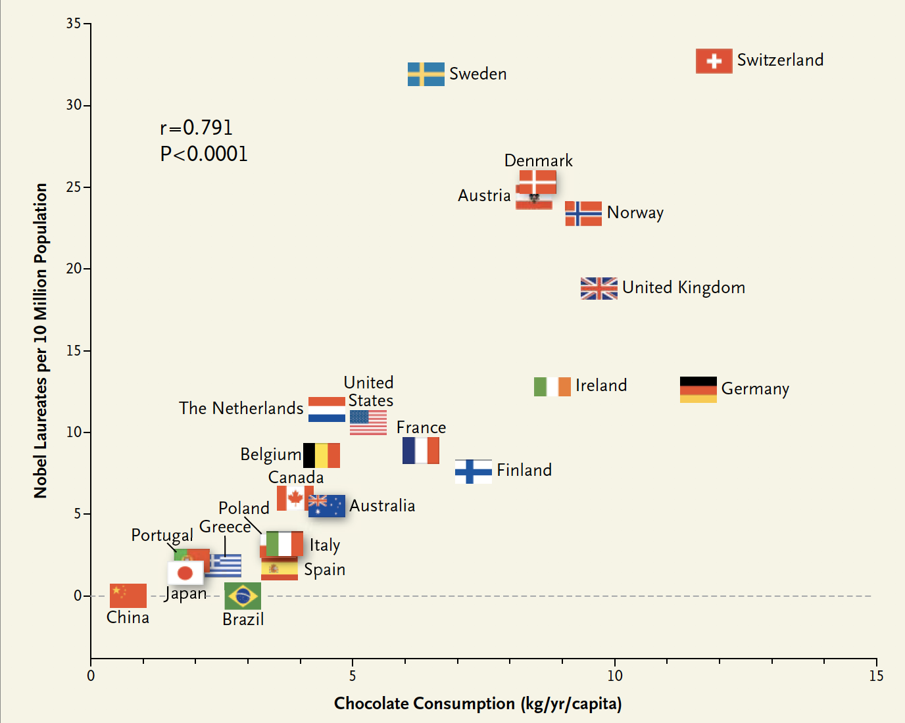
</div>
</center>
<div class="recommend">Messerli ([2012](https://www.nejm.org/doi/full/10.1056/nejmon1211064))</div>

##
<center>
<div style="margin-top: 50px;">
  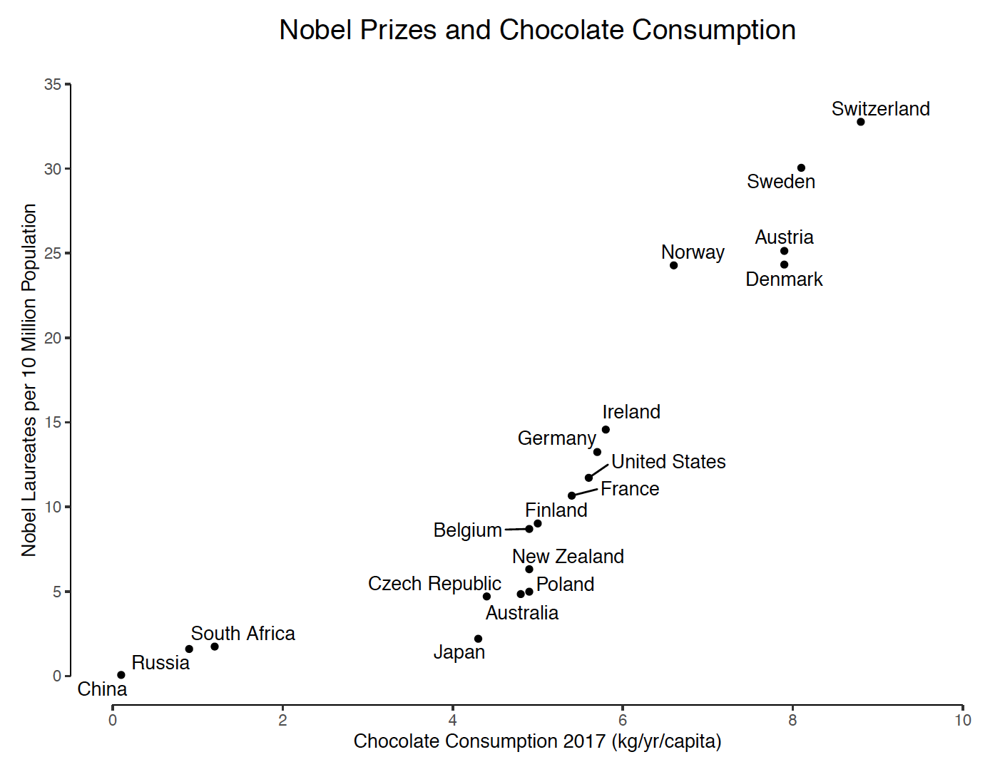
</div>
</center>
<div class="recommend">Dablander ([2020](https://psyarxiv.com/b3fkw))</div>

##
<center>
<div style="margin-top: 50px;">
  
</div>
</center>

## 
<center>
<div style="margin-top: 100px;">
  
</div>
</center>

<div class="recommend">[tylervigen.com/spurious-correlations](https://www.tylervigen.com/spurious-correlations)</div>


## 
<center>
<div style="margin-top: 100px;">
  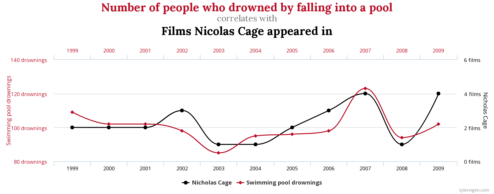
</div>
</center>

<div class="recommend">[tylervigen.com/spurious-correlations](https://www.tylervigen.com/spurious-correlations)</div>


## Causal inference
<div style="margin-right: -60px; margin-top: -150px; float: right;">
  
</div>
- In all previous examples, we can achieve good to excellent *predictions*
- But we do not merely want to predict systems, but also *change* them!

<span style = "color:"></span>

- Causal inference goes beyond prediction by modeling the outcome of interventions
    - Ask not what $Y$ is likely to be if $X$ *happened to be* $x$
    - Ask what $Y$ is likely to be if $X$ *were set to* $x$
    
<span style = "color:"></span>

- It provides tools that allow us to draw causal conclusions from **observational** data
    - Because randomized experiments are often infeasible, unethical, or impossible


## Causal inference
<div style="margin-right: -60px; margin-top: -150px; float: right;">
  
</div>
- In all previous examples, we can achieve good to excellent *predictions*
- But we do not merely want to predict systems, but also *change* them!

<span style = "color:"></span>

- Causal inference goes beyond prediction and models the outcome of interventions
- It provides tools that allow us to draw causal conclusions from **observational** data

<center>
<div style="margin-top: 25px;">
  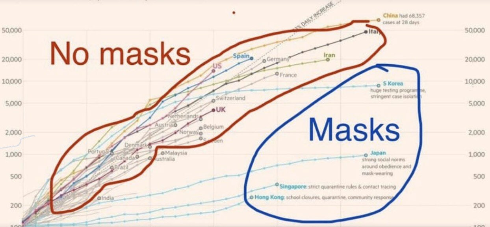
</div>
</center>

<div class="recommend">[Source](https://twitter.com/peripatetical/status/1244484957482782720)</div>


## Causal inference
<div style="margin-right: -60px; margin-top: -150px; float: right;">
  
</div>
- In all previous examples, we can achieve good to excellent *predictions*
- But we do not merely want to predict systems, but also *change* them!

<span style = "color:"></span>

- Causal inference goes beyond prediction and models the outcome of interventions
- It provides tools that allow us to draw causal conclusions from **observational** data

<center>
<div style="margin-top: 0px;">
  
</div>
</center>

<div class="recommend">[Source](https://www.alexpghayes.com/blog/elon-musk-send-tweet/)</div>


## Causal inference
<div style="margin-right: -60px; margin-top: -150px; float: right;">
  
</div>
- In all previous examples, we can achieve good to excellent *predictions*
- But we do not merely want to predict systems, but also *change* them!

<span style = "color:"></span>

- Causal inference goes beyond prediction and models the outcome of interventions
- It provides tools that allow us to draw causal conclusions from **observational** data

<center>
<div style="margin-top: 50px;">
  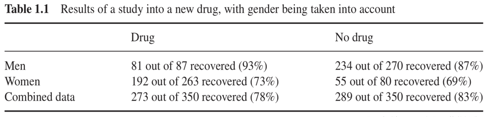
</div>
</center>
<div class="recommend">Pearl, Glymour, & Jewell ([2016](http://bayes.cs.ucla.edu/PRIMER/))</div>


## Outline
- **1) Core concepts**
    - Causality versus causal inference
    - Relating causal to probabilistic statements (DAGs)
    - Formalizing interventions, causal effects, and confounding
    - Simpson's paradox
    - Structural Causal Models

<span style = "color:"></span>

- **2) Exercises I**

<span style = "color:"></span>

- **3) Causal discovery**
    - PC Algorithm
    - Invariant causal prediction
    - Restricted SCMs
    - Synthetic control
    - Interrupted Time-series
    
<span style = "color:"></span>

- **4) Exercises II**


# Core concepts
## Causality versus Causal inference
- David Hume defined a cause "[...] to be an object, followed by another, and where all the objects similar to the first, are followed by objects similar to the second." (Hume, 1748, section VII)

- A key problem is that most causes are not invariably followed by their effects
    - Not everybody who smokes gets lung cancer
    - Instead, smoking *increases the probability* of getting lung cancer
    
<span style = "color:"></span>

- Causality is a big topic in philosophy
- We are interested here in causal inference
    - Identifying and estimating causal effects in the population
    - Causal effects = numerical quantities measuring changes in the distribution of an outcome under different interventions (e.g., Hernán & Robins, [2020](https://www.hsph.harvard.edu/miguel-hernan/causal-inference-book/))

<div class="recommend">[SEP Entry](https://plato.stanford.edu/entries/causation-probabilistic/)</div>


## Linking association to causation
- Reichenbach's *common cause principle*: "If two random variables $X$ and $Y$ are statistically dependent ($X \not \perp Y$), then either (a) $X$ causes $Y$, (b) $Y$ causes $X$, or (c) there exists a third variable $Z$ that causes both $X$ and $Y$. Further, $X$ and $Y$ become independent given $Z$, i.e., $X \perp Y \mid Z$."

<span style = "color:"></span>

- Probabilistic independence of $X$ and $Y$ means that
    - $P(Y, X) = P(Y \mid X) \, P(X) = P(Y) \, P(X)$
- Probabilistic independence of $X$ and $Y$ given $Z$ means that
    - $P(Y, X, Z) = P(Y \mid Z, X) \, P(Z, X) = P(Y \mid Z) \, P(Z, X)$

<span style = "color:"></span>

- The language of probability is limiting
- We cannot, for example, state that rain causes the streets to be wet
- We use Directed Acyclic Graphs (DAGs) to express such causal statements

<div style="margin-top: 0px; float: right;">
  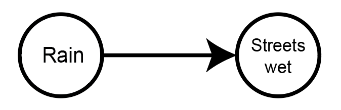
</div>

<div class="recommend">Pearl ([2000](https://www.nejm.org/doi/full/10.1056/nejmon1211064)), Spirtes et al. ([1993](https://mitpress.mit.edu/books/causation-prediction-and-search-second-edition)), Peters et al. ([2017](https://mitpress.mit.edu/books/elements-causal-inference))</div>

## Three fundamental structures
- DAGs depict causal relations and imply certain **(conditional) independencies**

<center>
<div style="margin-top: 20px;">
  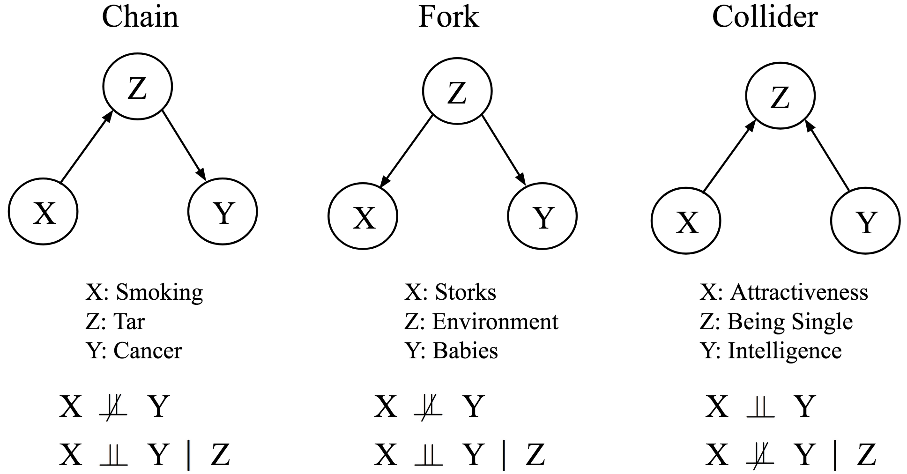
</div>
</center>

## Three fundamental structures
- DAGs depict causal relations and imply certain **(conditional) independencies**

<center>
<div style="margin-top: 50px;">
  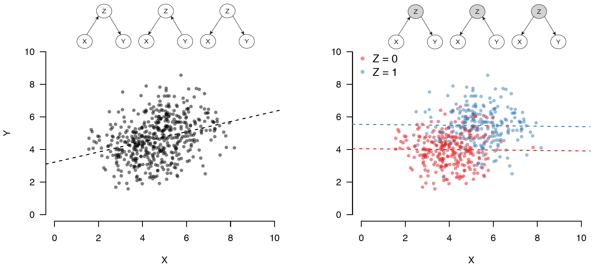
</div>
</center>


## Three fundamental structures
- DAGs depict causal relations and imply certain **(conditional) independencies**

<center>
<div style="margin-top: 50px;">
  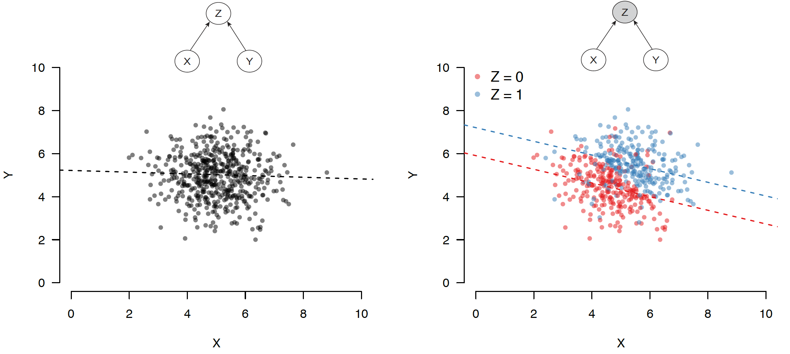
</div>
</center>


## Large DAGs and *d*-separation
- *d*-separation allows us to read off (conditional) independencies from any DAG
- We need to define a few concepts first:
    - A *path* from $X$ to $Y$ is a sequence of nodes & edges such that the start & end nodes are $X$ and $Y$
    - A conditioning set $\mathcal{L}$ is the set of nodes we condition on (it can be empty)
    - Conditioning on a non-collider along a path *blocks* that path
    - A collider along a path blocks that path
    - Conditioning on a collider or any of its descendants *unblocks* a path (e.g., $X \rightarrow W \leftarrow Y$)
    
<span style = "color:"></span>

- Two nodes $X$ and $Y$ are *d*-separated by $\mathcal{L}$ if and only if members of $\mathcal{L}$ block all paths between $X$ and $Y$
    
<span style = "color:"></span>

<div style="margin-top: -15px;">
  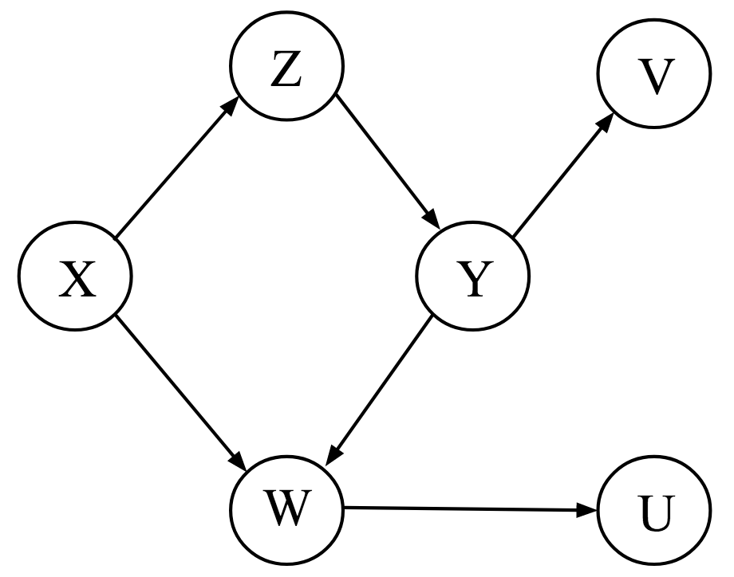
</div>

## Linking independence models
- *d*-separation gives us an indendence model $\perp_{\mathcal{G}}$ that is defined on graphs
- Probability theory gives us an independence model $\perp_{\mathcal{P}}$ that is defined on random variables

<span style = "color:"></span>

- The *causal Markov condition* relates the two:

$$
X \perp_{\mathcal{G}} Y \mid Z \Rightarrow X \perp_{\mathcal{P}} Y \mid Z \enspace .
$$

- If nodes $X$ and $Y$ are $d$-separated by $Z$, then they are probabilistically independent given $Z$
- This condition implies (and is implied by) the following factorization:

$$
p(X_1, \ldots, X_n) = \prod_{i=1}^n p(X_i \mid \text{pa}^{\mathcal{G}}(X_i)) \enspace ,
$$

- where $n$ is the number of nodes and $\text{pa}^{\mathcal{G}}(X_i)$ are the parents of node $X_i$
- In other words, a node is independent of its non-descendants given its parents

<div class="recommend">Peters, Janzing, & Schölkopf ([2017](https://mitpress.mit.edu/books/elements-causal-inference), p. 101)</div>

## Formalizing interventions
<div style="margin-right: -60px; margin-top: -150px; float: right;">
  
</div>
- $p(Y \mid X = x)$ describes what values of $Y$ are likely if $X$ **happened to be** x
    - We call this the **observational distribution**
- $p(Y \mid do(X = x))$ describes what values of $Y$ are likely if $X$ **is set to** x
    - We call this the **interventional distribution**
    
<center>
<div style="margin-top: 0px;">
  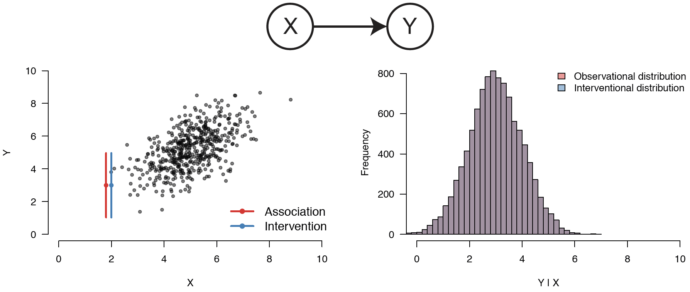
</div>
</center>

## Formalizing interventions
<div style="margin-right: -60px; margin-top: -150px; float: right;">
  
</div>
- $p(Y \mid X = x)$ describes what values of $Y$ are likely if $X$ **happened to be** x
    - We call this the **observational distribution**
- $p(Y \mid do(X = x))$ describes what values of $Y$ are likely if $X$ **is set to** x
    - We call this the **interventional distribution**

<center>
<div style="margin-top: 0px;">
  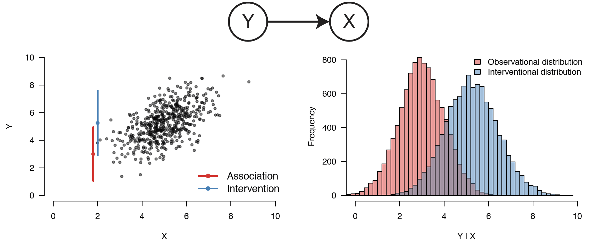
</div>
</center>

## Formalizing interventions
- An intervention $do(X = x)$ implies cutting all incoming edges to $X$

<center>
<div style="margin-top: 50px;">
  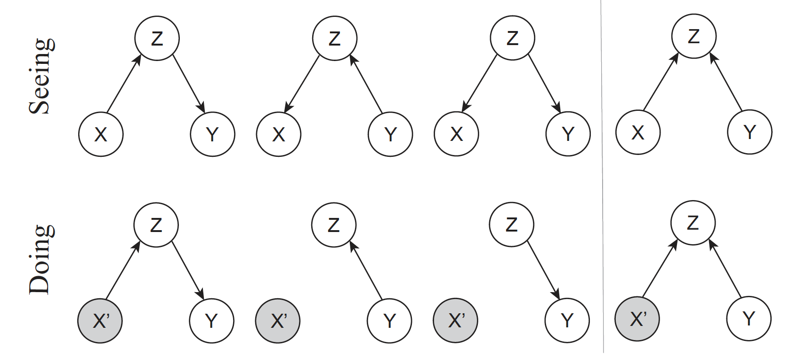
</div>
</center>

## Formalizing interventions
- $p(Y \mid do(X = x))$ is observational distribution $p_m(Y \mid X = x)$ in manipulated DAG
- For the left-most and right-most DAG, we have that $p(Y \mid do(X = x)) = p(Y \mid X = x)$
- For the two middle DAGs, we have to do some work:

<span style = "color:"></span>

$$
\begin{aligned}
p(Y = y \mid do(X = x)) &= p_m(Y = y \mid X = x) \\[0.50em]
                    &= \sum_{z} p_m(Y = y, Z = z \mid X = x) \hspace{5.25em} \text{... Sum rule} \\[0.50em]
                    &= \sum_{z} p_m(Y = y \mid X = x, Z = z) \, p_m(Z = z) \hspace{1.45em} \text{... Product rule} \\[0.50em]
                    &= \sum_{z} p(Y = y \mid X = x, Z = z) \, p(Z = z) \hspace{2.5em} \text{... Assumptions}
\end{aligned}
$$

- Assumption I: Mechanism is independent of whether $X = x$ or $do(X = x)$ (invariance)
- Assumption II: Interventions only change a single node (no 'fat hand')
- Assumption III: There is no unobserved confounding (causal sufficiency)


## Confounding and valid adjustment
- The causal effect of $X$ on $Y$ is **confounded** if $p(Y \mid do(X = x)) \neq p(Y \mid X = x)$
- In observational data, there will always be confounding factors
    - What variables should we adjust for?
    - This requires knowledge about the underlying DAG
    - (Don't just adjust for all variables --- can induce bias!)

<span style = "color:"></span>

- One valid adjustment sets are the parents of $X$
- Another one is given by the backdoor criterion (e.g., Pearl, Glymour, & Jewell, [2016](http://bayes.cs.ucla.edu/PRIMER/), p. 61)

<!-- - **Backdoor Criterion** : An adjustment set $\mathcal{Z}$ fulfills the backdoor criterion if no member in $\mathcal{Z}$ is a descendant of $X$ and members in $\mathcal{Z}$ block all paths between $X$ and $Y$ that contain an arrow into $X$. Adjusting for $\mathcal{Z}$ thus yields the causal effect of $X \rightarrow Y$. -->

- Rationale:
    - We block all spurious paths between $X$ and $Y$
    - We leave all directed paths from $X$ to $Y$ unperturbed
    - We create no new spurious paths
    
<div style="margin-top: -150px; float: right;">
  
</div>


## Recap
- Causal inference is distinct from causality and requires a language that goes beyond association
- Directed Acyclic Graphs (DAGs) provide us with a way to state causal relations

<span style = "color:"></span>

- Reichenbach's common cause principle links associations to causation
- It is implied by the causal Markov condition (e.g., Peters et al., [2017](https://mitpress.mit.edu/books/elements-causal-inference), p. 104), which
    - implies the factorization $p(X_1, \ldots, X_n) = \prod_{i=1}^n p(X_i \mid \text{pa}^{\mathcal{G}}(X_i))$
    - relates causal relationships to probabilistic relationships $X \perp_{\mathcal{G}} Y \mid Z \Rightarrow X \perp_{\mathcal{P}} Y \mid Z$

<span style = "color:"></span>

- Three fundamental DAG structures: chain, fork, collider
- For larger DAGs, $d$-separation helps us to find conditional independencies

<span style = "color:"></span>

- The $do$-calculus formalizes interventions
- Confounding occurs if $p(Y \mid do(X = x)) \neq p(Y \mid X = x)$
- DAGs help us find adjustment sets that unconfound the causal effect, in case they exist
    
$$
p(Y = y \mid do(X = x)) = \sum_{z} p(Y = y \mid X = x, Z = z) \, p(Z = z)
$$

## Simpson's paradox
- 350 patients chose to take a drug and 350 chose not to
- Given these data, is the drug helpful or harmful?
- Should a doctor prescribe the drug to a patient?

<center>
<div style="margin-top: 50px;">
  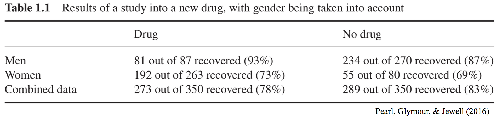
</div>
</center>


## Simpson's paradox
- 350 patients chose to take a drug and 350 chose not to
- Given these data, is the drug helpful or harmful?
- Should a doctor prescribe the drug to a patient?

<center>
<div style="margin-top: 50px;">
  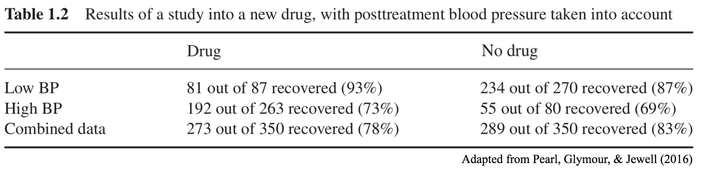
</div>
</center>

## Simpson's paradox
- The data are exactly the same in both cases
- Statistics alone cannot provide an answer
- We need to have an understanding of the causal story behind these data
- We can visualize the causal relations using DAGs

<center>
<div style="margin-top: 50px;">
  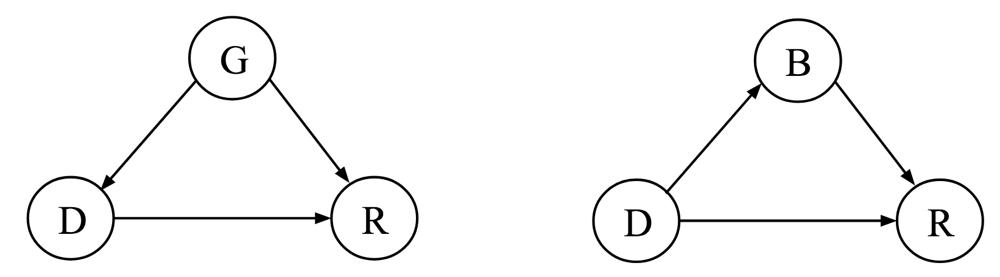
</div>
</center>


## Simpson's paradox
- Suppose we know that estrogen has a negative effect on recovery
- Note also that more women choose the drug than men
- Therefore, being a woman has an effect on drug taking as well as recovery
    - Should **condition** on gender!
    - This blocks the backdoor path $D \leftarrow G \rightarrow R$
    - And therefore unconfounds the effect $D \rightarrow R$

<div style="margin-top: -180px; float: right;">
  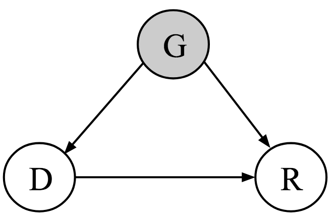
</div>

<center>
<div style="margin-top: 25px;">
  
</div>
</center>


## Simpson's paradox
- Blood pressure is measured *after* taking the drug
    - It cannot cause choosing the drug
    - Instead, it is a mechanism of how the drug works
    - Should **not condition** on blood pressure!

<div style="margin-top: -120px; float: right;">
  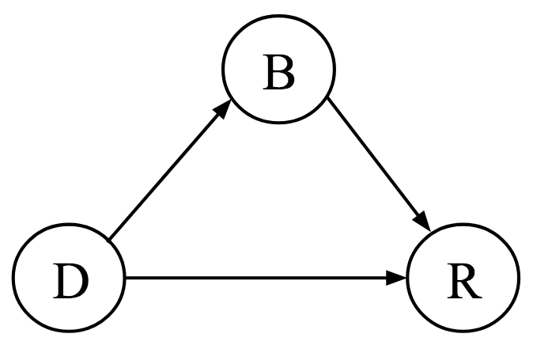
</div>

<center>
<div style="margin-top: 100px;">
  
</div>
</center>


## Structural Causal Models
<center>
<div style="margin-top: 75px;">
  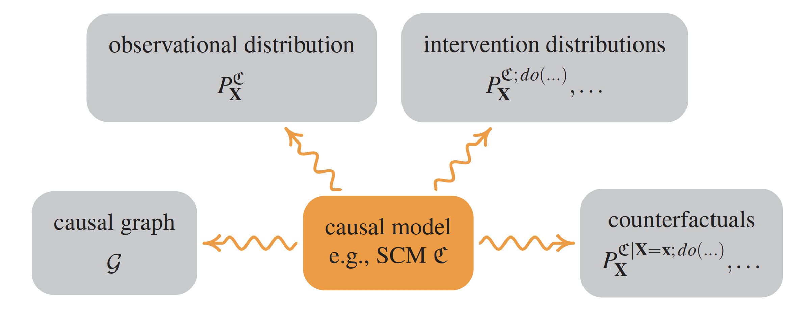
</div>
</center>

<div class="recommend">Peters, Janzing, & Schölkopf ([2017](https://mitpress.mit.edu/books/elements-causal-inference), p. 85)</div>


## Structural Causal Models
- Structural Causal Models (SCM) as the fundamental building blocks of causal inference
    - We understand relations between variables in a SCM to be *causal*
    - Here, we will assume *acyclic, linear* SCMs with Gaussian error terms
    - The relations in such SCMs can be visualized in DAGs

<span style = "color:"></span>

- **Example**:

$$
\begin{aligned}
X &:= \epsilon_X \\[.5em]
Y &:= X + \epsilon_Y \\[.5em]
Z &:= Y + \epsilon_Z \enspace ,
\end{aligned}
$$

- with $\epsilon_X, \epsilon_Y \stackrel{\text{iid}}{\sim} \mathcal{N}(0, 1)$, $\epsilon_Z \stackrel{\text{iid}}{\sim} \mathcal{N}(0, 0.1)$, and $\epsilon_X \perp \epsilon_Y \perp \epsilon_Z$

<span style = "color:"></span>

- Note the factorization of the joint distribution:

$$
p(X_1, \ldots, X_n) = \prod_{i=1}^n p(X_i \mid \text{pa}^{\mathcal{G}}(X_i)) \hspace{6em}
p(X, Y, Z) = p(Z \mid Y) \, p(Y \mid X) \, p(X)
$$

<center>
<div style="margin-top: -320px; float: right;">
  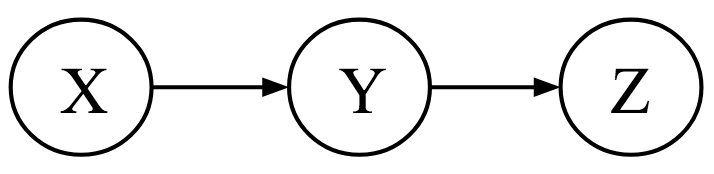
</div>
</center>

## Structural Causal Models
```{r, echo = TRUE}
set.seed(1)

n <- 100
x <- rnorm(n, 0, 1)
y <- x + rnorm(n, 0, 1)
z <- y + rnorm(n, 0, 0.1)
```

```{r, fig.align = 'center', fig.width = 9, fig.height = 4}
par(mfrow = c(1, 2))
plot(
  x, y, axes = FALSE, pch = 20, xlim = c(-3, 3),
  main = 'Predicting Y using X', xlab = 'X', ylab = 'Y'
)
axis(1)
axis(2, las = 2)

plot(
  z, y, axes = FALSE, pch = 20,
  main = 'Predicting Y using Z', xlab = 'Z', ylab = 'Y'
)
axis(1)
axis(2, las = 2)
```

## Structural Causal Models
<center>
<div style="margin-top: 50px;">
  
</div>
</center>

## Average causal effect
<!-- - Interventional distribution $p(Y \mid do(Z))$ is observational distribution $p_m(Y \mid Z)$ in manipulated DAG -->

<!-- $$ -->
<!-- \begin{aligned} -->
<!-- p(Y \mid do(Z = z)) = p_m(Y \mid Z = z) = p_m(Y) = p(Y) \enspace . -->
<!-- \end{aligned} -->
<!-- $$ -->

- We define the **average causal effect (ACE)** as

$$
ACE(Z \rightarrow Y) = \mathbb{E}\left[Y \mid do(Z = z + 1) \right] - \mathbb{E}\left[Y \mid do(Z = z) \right] \enspace .
$$

- For linear Gaussian SCMs, the expectations are easy to evaluate
- In our example, the average causal effect $Z \rightarrow Y$ is given by:

$$
ACE(Z \rightarrow Y) = \mathbb{E}[X + \epsilon_Y] - \mathbb{E}[X + \epsilon_Y] = 0 \enspace .
$$

- On the other hand, the average causal effect $X \rightarrow Y$ is given by:

$$
\begin{aligned}
ACE(X \rightarrow Y) &= \mathbb{E}[X + 1 + \epsilon_Y] - \mathbb{E}[X + \epsilon_Y] \\[0.50em]
                     &= 1 + \mathbb{E}[X + \epsilon_Y] - \mathbb{E}[X + \epsilon_Y] \\[0.50em]
                     &= 1 \enspace .
\end{aligned}
$$

- Can extent this beyond the first moment (e.g., Gische & Völkle [2020](https://www.researchgate.net/profile/Christian-Gische/publication/335030449_Gische_Voelkle_Causal_Inference_in_Linear_Models/links/5f4e166d458515a88ba6f45f/Gische-Voelkle-Causal-Inference-in-Linear-Models.pdf))

## Recap and resources
- Causal DAGs allow us to be explicit about our causal assumptions
    - Assuming invariance, causal sufficiency, and no 'fat hand', we can derive valid adjustment sets
    - This provides a path toward drawing causal conclusions from observational data

<span style = "color:"></span>

- Structural Causal Models (SCMs) are the soul of (this approach to) causal inference
    - Parameterize DAGs and allow us to make quantitative statements
    - They encode observational as well as interventional distributions
    
<span style = "color:"></span>

- Causal inference books freely available
    - Hernán & Robins ([2020](https://www.hsph.harvard.edu/miguel-hernan/causal-inference-book/))
    - Peters, Janzing, & Schölkopf ([2017](https://mitpress.mit.edu/books/elements-causal-inference))
    - Pearl, Glymour, & Jewell ([2016](http://bayes.cs.ucla.edu/PRIMER/))
    - Pearl & Mackenzie ([2018](https://www.goodreads.com/book/show/36204378-the-book-of-why))

<div style="margin-top: -125px; float: right;">
  
</div>

<div class='recommend'>[Causal Diagrams](https://online-learning.harvard.edu/course/causal-diagrams-draw-your-assumptions-your-conclusions) course by Miguel Hernán</div>

# [Exercises I](https://fabiandablander.com/assets/talks/Causal-Exercises-Max-Planck.html)

# Causal discovery
## Outline
- **1) Core concepts**
    - Causality versus causal inference
    - Relating causal to probabilistic statements (DAGs)
    - Formalizing interventions, causal effects, and confounding
    - Simpson's paradox
    - Structural Causal Models

<span style = "color:"></span>

- **2) Exercises I**

<span style = "color:"></span>

- **3) Causal discovery**
    - PC Algorithm
    - Invariant causal prediction
    - Restricted SCMs
    - Synthetic control
    - Interrupted Time-series
    
<span style = "color:"></span>

- **4) Exercises II**


## Causal discovery
- We focus on purely *observational* data for now
- Given a $n$ observations $\mathbf{X} = (X_1, X_2, \ldots, X_n)$ can we learn the underlying causal graph?

<span style = "color:"></span>

- Broadly speaking, there are three approaches to learning DAGs
    - Constraint-based methods (use independence relations)
    - Score-based methods (minimize some quantity over all graphs)
    - Hybrid methods (combination of both)
    
<span style = "color:"></span>

- We focus on the most prominent constraint-based method, the PC-Algorithm
    - Named after **<u>P</u>**eter Spirtes & **<u>C</u>**lark Glymour (Spirtes et al., 2000)


## DAG learning: First problem
- Given a $n$ observations $\mathbf{X} = (X_1, X_2, \ldots, X_n)$ can we learn the underlying causal graph?

<center>
<div style="margin-top: 50px;">
  
</div>
</center>

## DAG learning: Second problem
- Given a $n$ observations $\mathbf{X} = (X_1, X_2, \ldots, X_n)$ can we learn the underlying causal graph?

<center>
<div style="margin-top: 50px;">
  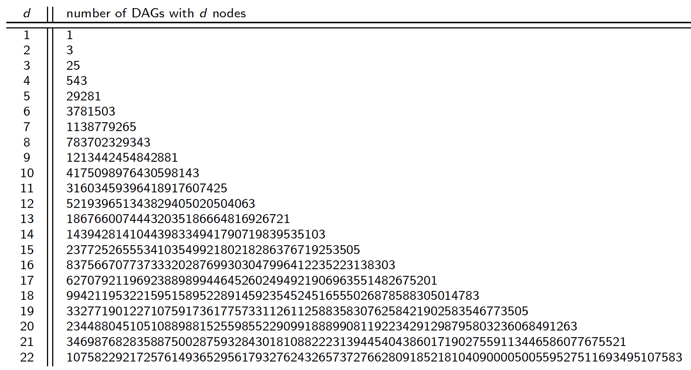
</div>
</center>

<div class="recommend">https://oeis.org/A003024/b003024.txt</div>

## PC Algorithm
- Uses independencies to learn about the DAG (Kalisch & Bühlmann, [2007](https://www.jmlr.org/papers/v8/kalisch07a.html); Kalisch et al., [2012](https://www.jstatsoft.org/article/view/v047i11))
- Recall the *causal Markov condition*: for any nodes $X$, $Y$, and $Z$ we have that

$$
X \perp_{\mathcal{G}} Y \mid Z \Rightarrow X \perp_{\mathcal{P}} Y \mid Z
$$

- Many causal discovery methods (including the PC-Algorithm) further assume *faithfulness*:

$$
X \perp_{\mathcal{P}} Y \mid Z \Rightarrow X \perp_{\mathcal{G}} Y \mid Z
$$

- Faithfulness allows infering causal relations (depicted $\mathcal{G}$) from probabilistic associations in the data
- The PC-Algorithm further assumes no hidden or selection variables


## PC Algorithm
- We learn a whole class of *Markov equivalent* DAGs that represent the same dependencies
- Two DAGs encode the same conditional independencies if and only if (e.g., Verma & Pearl, 1991):
    - They have the same *skeleton*
    - They have the same *v-structures*

<span style = "color:"></span>

- So-called *Completed Partially Directed Acyclic Graphs* (CPDAGs) encode the equivalence class
- Below are the four DAGs
    
<center>
<div style="margin-top: 50px;">
  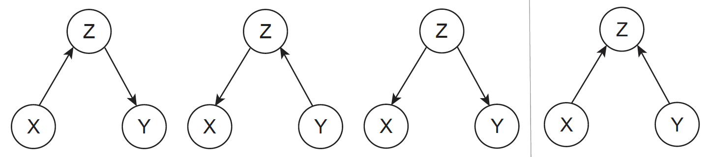
</div>
</center>

## PC Algorithm
- We learn a whole class of *Markov equivalent* DAGs that represent the same dependencies
- Two DAGs encode the same conditional independencies if and only if (e.g., Verma & Pearl, 1991):
    - They have the same *skeleton*
    - They have the same *v-structures*

<span style = "color:"></span>

- So-called *Completed Partially Directed Acyclic Graphs* (CPDAGs) encode the equivalence class
- Here are the skeletons of the four DAGs (simply remove arrows)

<center>
<div style="margin-top: 50px;">
  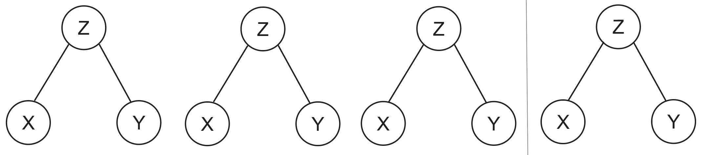
</div>
</center>


## PC Algorithm
- We learn a whole class of *Markov equivalent* DAGs that represent the same dependencies
- Two DAGs encode the same conditional independencies if and only if (e.g., Verma & Pearl, 1991):
    - They have the same *skeleton*
    - They have the same *v-structures*

<span style = "color:"></span>

- So-called *Completed Partially Directed Acyclic Graphs* (CPDAGs) encode the equivalence class
- Finally, here are the CPDAGs

<center>
<div style="margin-top: 50px;">
  
</div>
</center>

## PC Algorithm
- The PC-Algorithm proceeds in two steps:
    - First, we estimate the skeleton of the DAG
    - Second, we orient edges if possible
    
<span style = "color:"></span>

- Operates according to two principles:
    - There is an edge $X_i - X_j$ if and only if $X_i \not \perp X_j \mid S$ for all $S \subseteq V\setminus \{X_i, X_j\}$
    - If $X_i - X_j - X_k$, orient edges $X_i \rightarrow X_j \leftarrow X_k$ iff $X_i \not \perp X_k \mid S$ for all $S$ where $X_j \subset S$
        - In other words, we only orient edges if we can identify a collider
        
## PC Algorithm
- Algorithm works as follows:

    1. Create a fully connected undirected network $\mathcal{G}$
    2. For every  pair of vertices $(X_i, X_j)$, test whether $X_i \perp X_j$
        - If independence holds, remove edge $X_i - X_j$ from $\mathcal{G}$
    3. For every remaining edge with $X_k$ being connected to $X_i$ or $X_j$
        - Test whether $X_i \perp X_j \mid X_k$
        - If independence holds, remove edge $X_i - X_j$ from $\mathcal{G}$
    4. Do this until all neighbours of both $X_i$ and $X_j$ are exhausted
        - For example, test $X_i \perp X_j \mid X_k, X_l$ etc. and remove edge if independence holds
    5. Orient edges when a collider is identified
    6. If applicable, orient more edges that are logically implied using Meek's rules (Meek, [1995](https://www.google.com/url?sa=t&rct=j&q=&esrc=s&source=web&cd=&cad=rja&uact=8&ved=2ahUKEwjWq8XI45PuAhWKKewKHV_tASgQFjABegQIBBAC&url=https%3A%2F%2Farxiv.org%2Fpdf%2F1302.4972&usg=AOvVaw1epspvSpWokWA8sEeH2Xum))
  
        
## PC Algorithm: Example 1
<div style="margin-right: -50px; margin-top: -140px; float: right;">
  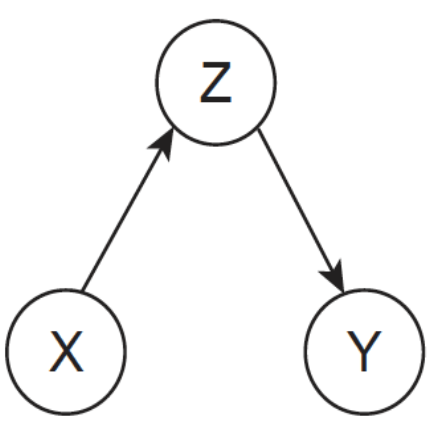
</div>

- Suppose the true DAG is $X \rightarrow Z \rightarrow Y$
- The PC-Algorithm would proceed as follows

<center>
<div style="margin-top: 50px;">
  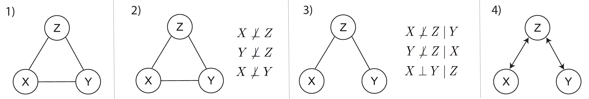
</div>
</center>

## PC Algorithm: Example 1
```{r, echo = TRUE, message = FALSE, warning = FALSE, fig.width = 3, fig.height = 2.5}
library('pcalg')
set.seed(1)

n <- 1000
X <- rnorm(n)
Z <- X + rnorm(n)
Y <- Z + rnorm(n)

suffStat <- list('C' = cor(cbind(X, Y, Z)), 'n' = n)
fit <- pc(suffStat = suffStat, indepTest = gaussCItest, p = 3, alpha = 0.01)

plot(fit, main = '')
```

## PC Algorithm: Example 2
<div style="margin-right: -50px; margin-top: -140px; float: right;">
  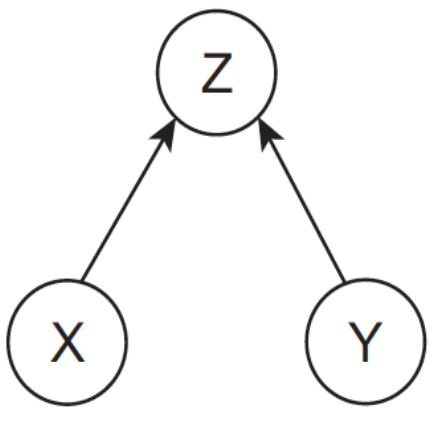
</div>

- Suppose the true DAG is $X \rightarrow Z \leftarrow Y$
- The PC-Algorithm would proceed as follows

<center>
<div style="margin-top: 50px;">
  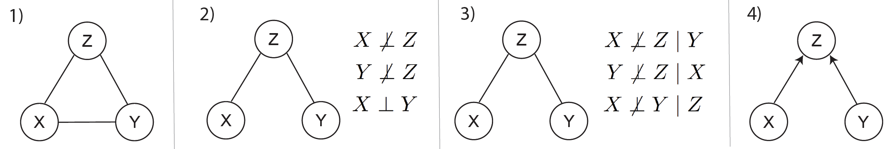
</div>
</center>

## PC Algorithm: Example 2
```{r, echo = TRUE, message = FALSE, warning = FALSE, fig.width = 3, fig.height = 2.5}
library('pcalg')
set.seed(1)

n <- 1000
X <- rnorm(n)
Y <- rnorm(n)
Z <- X + Y + rnorm(n)

suffStat <- list('C' = cor(cbind(X, Y, Z)), 'n' = n)
fit <- pc(suffStat = suffStat, indepTest = gaussCItest, p = 3, alpha = 0.01)

plot(fit, main = '')
```

    
## PC Algorithm: Issues
- Assumes an oracle that can correctly tell us all possible conditional independencies
- This is usually not the case, and we rely on standard conditional independence tests from statistics
- No uncertainty quantification
<!-- - Because PC operates in a sequential manner, errors early on get exacerbated -->

<span style = "color:"></span>

<!-- - Conditional independence testing is a hard problem (Shah & Peters, [2020](https://projecteuclid.org/euclid.aos/1594972828)) -->
- Faithfulness may not hold in contexts where we estimate population parameters (Uhler et al., [2013](https://projecteuclid.org/euclid.aos/1366138197))

<span style = "color:"></span>

- PC algorithm cannot deal with hidden or selection variables (Kalisch et al., [2012](https://www.jstatsoft.org/article/view/v047i11))
    
<span style = "color:"></span>

- Problems in practice (see e.g., Ramsey et al., [2011](https://www.sciencedirect.com/science/article/pii/S105381190900977X), for neuroscience context)
    - Indirect measurements and measurement error (see also Westfall & Yarkoni, [2016](https://journals.plos.org/plosone/article?id=10.1371/journal.pone.0152719))
    - What is the 'correct' granularity for causal variables? (Eberhardt, [2016](https://authors.library.caltech.edu/67575/); Weichwald & Peters, [2020](https://www.mitpressjournals.org/doi/abs/10.1162/jocn_a_01623))
        - For example, 'bad' versus 'good' cholesterol
        
<div class='recommend'>David Kinney on granularity, [Santa Fe Podcast E19](https://www.santafe.edu/culture/podcast)</div>
    
## Invariant Causal Prediction (ICP)
- Given $n$ observations $(Y, X_1, \ldots, X_n)$ can we learn the causal parents of $Y$, $\text{pa}^{\mathcal{G}}(Y)$?
  - Yes, if we have data from different environments $e \in \mathcal{E}$
  - These can be observational and interventional, as long as we never intervene on $Y$ directly
    
<span style = "color:"></span>

- ICP exploits the invariance assumption that underlies causal inference (Peters et al. [2017](https://rss.onlinelibrary.wiley.com/doi/full/10.1111/rssb.12167))
- In particular, we have that the conditional distribution $p(Y \mid \text{pa}^{\mathcal{G}}(Y))$ is invariant across $\mathcal{E}$

- For linear Gaussian SCMs

$$
Y^e := \mu + \sum_{i \, \in \, \text{pa}^{\mathcal{G}}(Y)} \beta_i^e \cdot X_i^e + \varepsilon_Y^e \hspace{3em} \varepsilon_Y^e \perp (X_i, \ldots X_{|\text{pa}^{\mathcal{G}}(Y)|}) \enspace ,
$$

- this means that $\beta_i^e$ and $\sigma\left(\varepsilon^e_Y\right)$ are the same across all $e \in \mathcal{E}$

## 
<center>
<div style="margin-top: -20px;">
  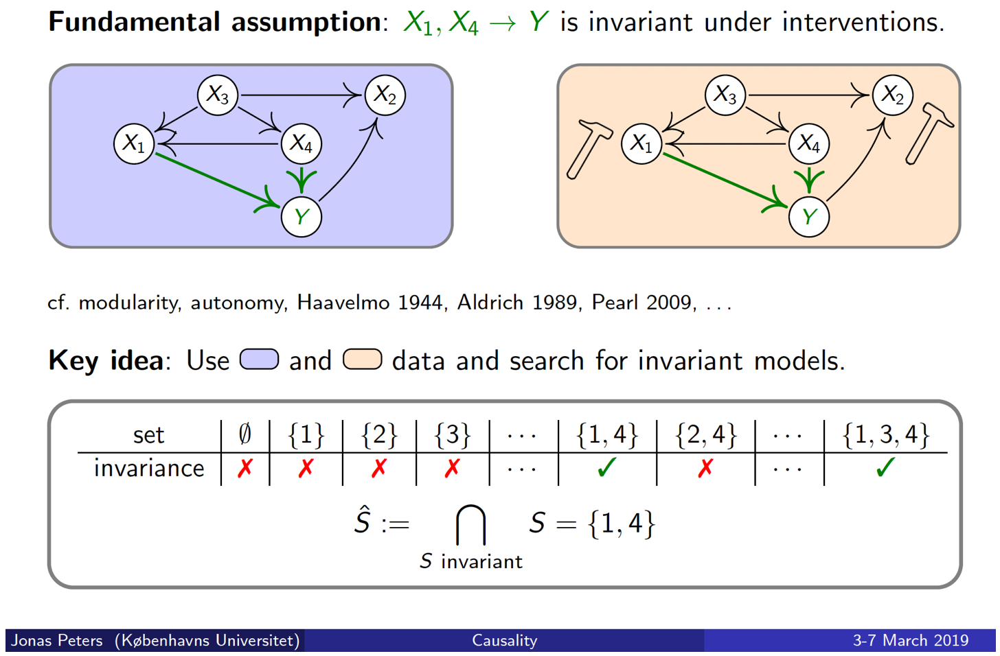
</div>
</center>

## Invariant Causal Prediction
- Suppose we have $n$ observations from $(X, Y, Z)$ under two different environments $e \in \mathcal{E} = \{0, 1\}$

<div style='width: 50%; float: left;'>
$$
\begin{aligned}
X^1 &:= \varepsilon_{X^1}  \\[0.50em]
Y^1 &:= X^1 + \varepsilon_{Y^1} \\[0.50em]
Z^1 &:= Y^1 + \varepsilon_{Z^1} \\[0.50em]
\end{aligned}
$$
</div>

<div style='width: 50%; float: right;'>

$$
\begin{aligned}
X^2 &:= 2 + \varepsilon_{X^2}\\[0.50em]
Y^2 &:= X^2 + \varepsilon_{Y^2} \\[0.50em]
Z^2 &:= Y^1 + \varepsilon_{Z^2} \\[0.50em]
\end{aligned}
$$
</div>

## Invariant Causal Prediction
- Suppose we have $n$ observations from $(X, Y, Z)$ under two different environments $e \in \mathcal{E} = \{0, 1\}$

```{r, echo = FALSE, fig.width = 10, fig.height = 3.5}
library('RColorBrewer')
cols <- brewer.pal('Set1', n = 3)[1:2]

set.seed(1)
n <- 500
X1 <- rnorm(n)
Y1 <- X1 + rnorm(n)
Z1 <- Y1 + rnorm(n)

X2 <- 2 + rnorm(n)
Y2 <- X2 + rnorm(n)
Z2 <- Y2 + rnorm(n)

plot_graph <- function(X, Y, col, new = FALSE, lims = c(-6, 6), ...) {
  par(new = new)
  plot(X, Y, pch = 20, col = col, axes = FALSE, xlim = lims, ylim = lims, ...)
  axis(1)
  axis(2, las = 2)
  abline(lm(Y ~ 0 + X), col = adjustcolor(col, 1), lwd = 2)
}

col1 <- adjustcolor(cols[2], 0.50)
col2 <- adjustcolor(cols[1], 0.50)

par(mfrow = c(1, 3))
plot_graph(X1, Y1, col1)
plot_graph(X2, Y2, col2, new = TRUE)
legend('topleft', legend = c('e = 1', 'e = 2'), col = c(col1, col2), lwd = 2, pch = 20, bty = 'n')

plot_graph(Z1, Y1, col1, xlab = 'Z')
plot_graph(Z2, Y2, col2, new = TRUE, xlab = 'Z')
legend('topleft', legend = c('e = 1', 'e = 2'), col = c(col1, col2), lwd = 2, pch = 20, bty = 'n')


p1 <- hist(Y1, breaks = 30, plot = FALSE)
p2 <- hist(Y2, breaks = 30, plot = FALSE)
plot(p1, col = col1, xlim = c(-6, 8), main = '', xlab = 'Y')
plot(p2, col = col2, xlim = c(-6, 8), add = TRUE)
legend('topleft', legend = c('e = 1', 'e = 2'), fill = c(col1, col2), bty = 'n')
```

```{r, echo = FALSE, eval = FALSE}
mx1 <- lm(Y1 ~ 0 + X1)
mx2 <- lm(Y2 ~ 0 + X2)

mz1 <- lm(Y1 ~ 0 + Z1)
mz2 <- lm(Y2 ~ 0 + Z2)

mxz1 <- lm(Y1 ~ 0 + X1 + Z1)
mxz2 <- lm(Y2 ~ 0 + X2 + Z2)

par(mfrow = c(1, 2))
plot(fitted(mx1), resid(mx1), pch = 20, col = col1)
points(fitted(mx2), resid(mx2), pch = 20, col = col2)

plot(fitted(mz1), resid(mz1), pch = 20, col = col1)
points(fitted(mz2), resid(mz2), pch = 20, col = col2)

par(mfrow = c(1, 2))
plot(resid(mx1), pch = 20, col = col1)
points(resid(mx2), pch = 20, col = col2)

plot(resid(mz1), pch = 20, col = col1)
points(resid(mz2), pch = 20, col = col2)
```

## Invariant Causal Prediction
```{r, echo = TRUE}
library('InvariantCausalPrediction')
set.seed(1); n <- 500

X <- c(rnorm(n), 2 + rnorm(n))
Y <- X + rnorm(n)
Z <- Y + rnorm(n)

X <- cbind(X, Z); colnames(X) <- c('X', 'Z'); indicator <- rep(1:2, each = n)
ICP(X, Y, indicator, test = 'exact', showCompletion = FALSE)
```

```{r, echo = FALSE, eval = FALSE}
library('InvariantCausalPrediction')
set.seed(1); n <- 500

X <- c(rnorm(n), 2 + rnorm(n))
Y <- X + rnorm(n)
Z <- Y + rnorm(n)

X <- c(rnorm(n), 0 + rnorm(n))
Y <- X + rnorm(n)
Z <- c(Y[seq(n)] + rnorm(n), 2 + rnorm(n))

X <- c(rnorm(n), 0 + rnorm(n))
Y <- c(X[seq(n)] + rnorm(n), 2 + rnorm(n))
Z <- Y + rnorm(n)

X <- cbind(X, Z); colnames(X) <- c('X', 'Z'); indicator <- rep(1:2, each = n)
ICP(X, Y, indicator, test = 'exact')
```
    
    
## Invariant Causal Prediction
- Does not learn the whole DAG (which is too ambitious anyway)
- Allows us to learn the causal parents of an outcome using data from different environments
- Does not require faithfulness, and comes with uncertainty quantification and error control

<span style = "color:"></span>

- Extensions include
    - Accounting for hidden variables
    - Nonlinear SCMs (Heinze-Deml, Peters, & Meinshausen [2018](https://www.degruyter.com/view/journals/jci/6/2/article-20170016.xml))
    - Time-series data (Pfister, Bühlmann, & Peters, [2018](https://www.tandfonline.com/doi/abs/10.1080/01621459.2018.1491403))
    
<span style = "color:"></span>

- For an application to neuroscience, see Weichwald & Peters ([2020](https://www.mitpressjournals.org/doi/abs/10.1162/jocn_a_01623))

## Outline
- **1) Core concepts**
    - Causality versus causal inference
    - Relating causal to probabilistic statements (DAGs)
    - Formalizing interventions, causal effects, and confounding
    - Simpson's paradox
    - Structural Causal Models

<span style = "color:"></span>

- **2) Exercises I**

<span style = "color:"></span>

- **3) Causal discovery**
    - PC Algorithm
    - Invariant causal prediction
    - Restricted SCMs
    - Synthetic control
    - Interrupted Time-series
    
<span style = "color:"></span>

- **4) Exercises II**

    
## Learning Cause-Effect Pairs
- Conditional independence test methods require at least three variables to be applicable
- This means they cannot tell us whether $X \rightarrow Y$ or $Y \rightarrow X$

<center>
<div style="margin-top: 25px;">
  
</div>
</center>

## Learning Cause-Effect Pairs
- Conditional independence test methods require at least three variables to be applicable
- This means they cannot tell us whether $X \rightarrow Y$ or $Y \rightarrow X$

<center>
<div style="margin-top: 25px;">
  
</div>
</center>


## The problem
- Suppose we have the following SCM

$$
\begin{aligned}
X &:= \varepsilon_X \\
Y &:= f(X, \varepsilon_Y) \\
\end{aligned}
$$

- with $X \perp \varepsilon_Y$ and $\varepsilon_X \perp \varepsilon_Y$

- The problem is that there is an equivalent SCM of the form

$$
\begin{aligned}
Y &:= \varepsilon_y \\
X &:= g(Y, \varepsilon_X) \\
\end{aligned}
$$

- with $Y \perp \varepsilon_X$ and $\varepsilon_X \perp \varepsilon_Y$ (e.g., Spirtes & Zhang, [2016](https://link.springer.com/article/10.1186/s40535-016-0018-x))

<span style = "color:"></span>

- Thus we cannot distinguish $X \rightarrow Y$ from $Y \rightarrow X$ when allowing these flexible SCMs
- Assumptions about $f$ and the distribution of $\varepsilon$ can help us uncover the direction!
- In addition to assumming no confounding and no selection bias (Mooij et al. [2016](https://dl.acm.org/doi/abs/10.5555/2946645.2946677))


## Linear Non-Gaussian Acyclic Models (LiNGAMs)
- If $f$ is a **linear** function and $\varepsilon$ **non-gaussian**, causal direction is identified (Shimizu et al., [2006](https://www.jmlr.org/papers/v7/shimizu06a.html))

<center>
<div style="margin-top: 0px;">
  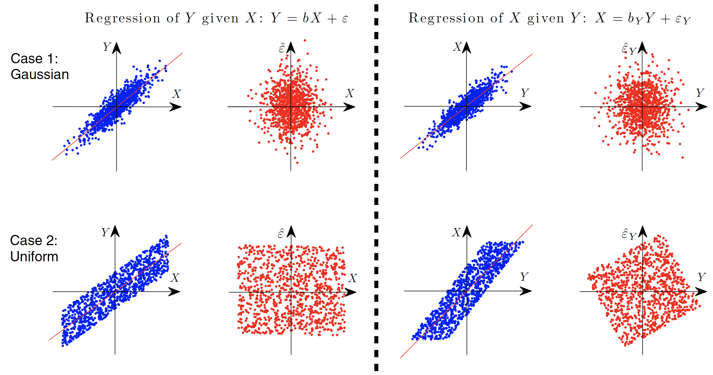
</div>
</center>

<div class='recommend'>Spirtes & Zhang ([2016](https://link.springer.com/article/10.1186/s40535-016-0018-x))</div>

## Nonlinear Gaussian Additive Noise Model
- If $f$ is a **nonlinear** function and $\varepsilon$ **Gaussian**, causal direction is identified (Hoyer et al., [2009](https://papers.nips.cc/paper/2008/hash/f7664060cc52bc6f3d620bcedc94a4b6-Abstract.html), Peters et al., [2014](https://dl.acm.org/doi/abs/10.5555/2627435.2670315))

<center>
<div style="margin-top: 0px;">
  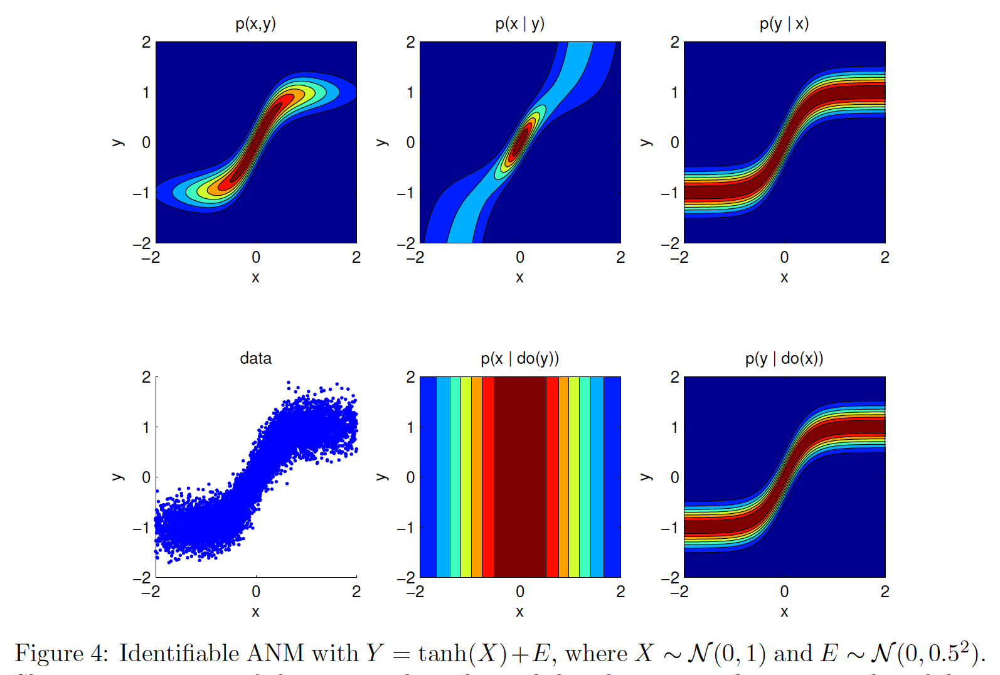
</div>
</center>

<!-- ## Nonlinear Gaussian Additive Noise Model -->
```{r, echo = FALSE, eval = FALSE}
library('mgcv')
library('dHSIC')
set.seed(1)

n <- 1000
x <- rnorm(n, 0, 1)
y <- tanh(x) + rnorm(n, 0, 0.5^2)

m1 <- gam(y ~ s(x))
m2 <- gam(x ~ s(y))

dhsic.test(m1$residuals, x, method = 'gamma')$p.value
dhsic.test(m2$residuals, y, method = 'gamma')$p.value
```

## Cause-Effect pairs data base
<center>
<div style="margin-top: 0px;">
  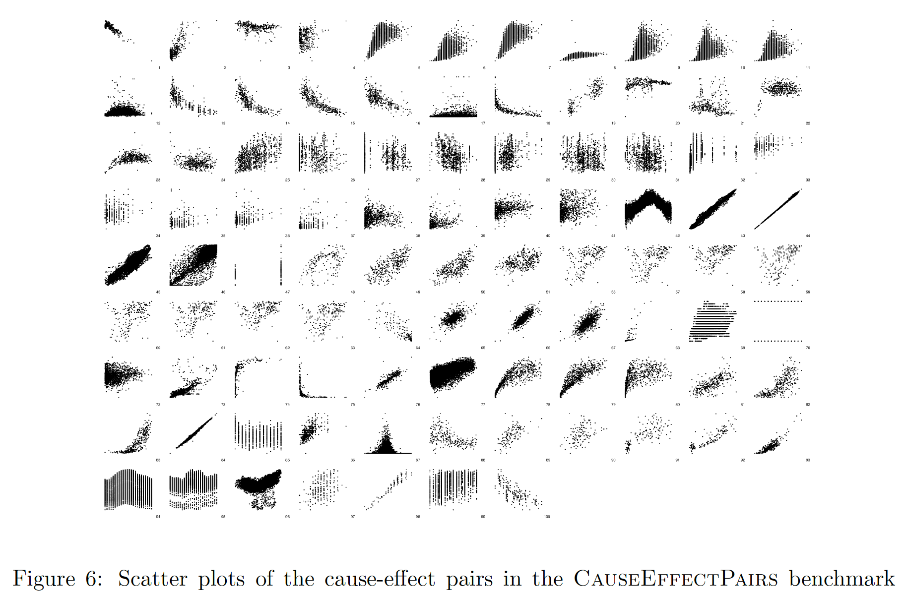
</div>
</center>
<div class="recommend">Mooij et al. ([2016](https://dl.acm.org/doi/abs/10.5555/2946645.2946677))</div>

## Cause-Effect pairs: Example I
```{r, echo = TRUE}
library('pcalg')
options(scipen = 99, digits = 4)

url <- 'https://webdav.tuebingen.mpg.de/cause-effect/'
dat <- read.table(paste0(url, 'pair0064.txt'), col.names = c('drinking_water_access', 'infant_mortality'))

lingam(dat)$Bpruned
```

## Cause-Effect pairs: Example II
```{r, echo = TRUE}
library('mgcv')
library('dHSIC')
options(scipen = 99, digits = 4)

url <- 'https://webdav.tuebingen.mpg.de/cause-effect/'
dat <- read.table(paste0(url, 'pair0038.txt'), col.names = c('age', 'bmi'))

m1 <- gam(bmi ~ s(age), data = dat)
m2 <- gam(age ~ s(bmi), data = dat)
```

<div style='margin-top: -75px;'>
```{r, echo = FALSE, fig.width = 8.25, fig.height = 4.2}
par(mfrow = c(1, 2))
plot(m1)
plot(m2)
```
</div>

## Cause-Effect pairs: Example II
```{r, echo = TRUE}
library('mgcv')
library('dHSIC')
options(scipen = 99, digits = 4)

url <- 'https://webdav.tuebingen.mpg.de/cause-effect/'
dat <- read.table(paste0(url, 'pair0038.txt'), col.names = c('age', 'bmi'))

m1 <- gam(bmi ~ s(age), data = dat)
m2 <- gam(age ~ s(bmi), data = dat)

c(
  dhsic.test(resid(m1), dat$age, method = 'gamma')$p.value, # Age \perp error
  dhsic.test(resid(m2), dat$bmi, method = 'gamma')$p.value  # BMI \perp error
)
```

## Synthetic control: Motivation
<center>
<div style="margin-top: 0px;">
  
</div>
</center>

<div class="recommend">[Tweet](https://twitter.com/peripatetical/status/1244484957482782720)</div>


## Synthetic control: Motivation
<center>
<div style="margin-top: 0px;">
  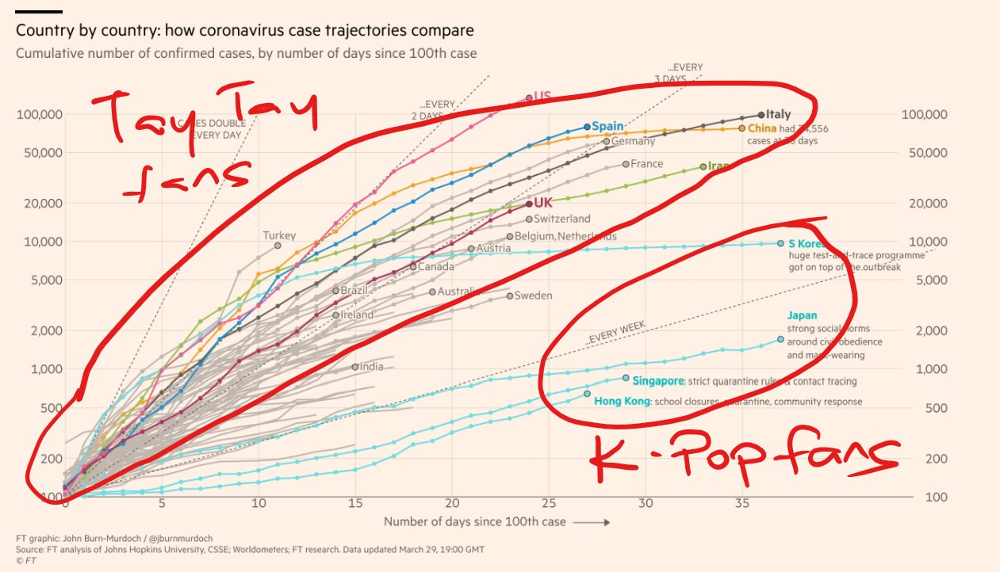
</div>
</center>

<div class="recommend">[Tweet](https://twitter.com/peripatetical/status/1244484957482782720)</div>


## Synthetic control: Motivation
- Can't say that face masks curb infections from these data
- The problem is that there are likely many confounding variables
- We could try to find a suitable control group. Maybe compare Japan to Iran?
- But this choice is very subjective (and obviously incorrect)

<span style = "color:"></span>

- The **synthetic control method** provides a data-driven solution (Abadie et al., [2010](https://amstat.tandfonline.com/doi/abs/10.1198/jasa.2009.ap08746); Abadie et al., [2011](https://papers.ssrn.com/sol3/papers.cfm?abstract_id=1958891))

<span style = "color:"></span>

- Compare a treated unit $Y$ against a synthetic unit $Y_s$
    - $Y_s$ is a weighted average of control units
    - It best approximates the most relevant characteristics of $Y$ prior to treatment
    
## Synthetic control: Motivation
- Observe $j = 1, \ldots, J + 1$ units for time $t = 1, \ldots, T$
- Suppose that $j = 1$ is the treated unit $j = 2, \ldots, J + 1$ are the control units
- Some policy takes place at time point $T_0$, so that $t = 1, \ldots, T_0$ is pre-intervention
- Define two potential outcomes
    - $Y_{1t}^N$ is the value of the treated unit at $t$ where no intervention took place
    - $Y_{1t}^I$ is the value of the treated unit at $t$ where an intervention took place
    - The treatment effect is given by $\alpha_t =Y_{1t}^I - Y_{1t}^N$
    
<span style = "color:"></span>

- The issue is, of course, that we don't observe $Y_{1t}^N$ for $t > T_0$
- The synthetic control method aims to best approximate $Y_{1t}^N$ for $t > T_0$


## Synthetic control: Face masks
- Mitze et al. ([2020](https://papers.ssrn.com/sol3/papers.cfm?abstract_id=3620634)) apply the synthetic control method to face masks 
- Used a weighted combination of covariates from 409 regions to build the synthetic control

<center>
<div style="margin-top: 0px;">
  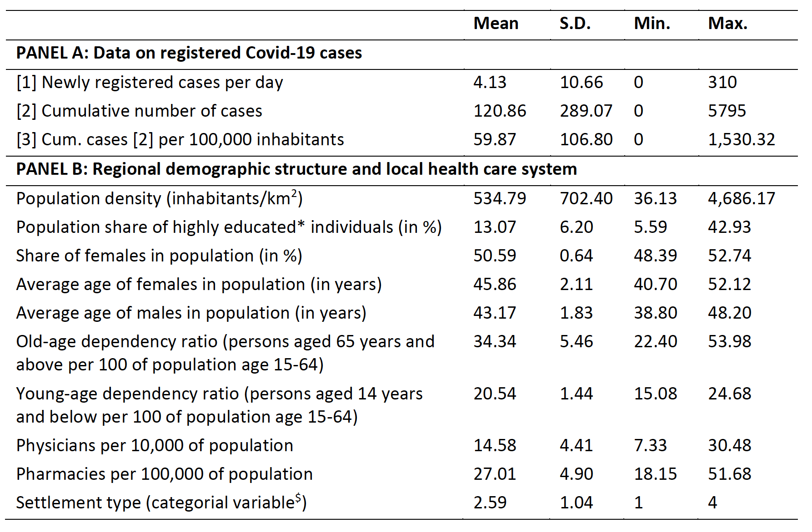
</div>
</center>

## Synthetic control: Face masks
- Mitze et al. ([2020](https://papers.ssrn.com/sol3/papers.cfm?abstract_id=3620634)) apply the synthetic control method to face masks 
- Used a weighted combination of covariates from 409 regions to build the synthetic control

<center>
<div style="margin-top: 25px;">
  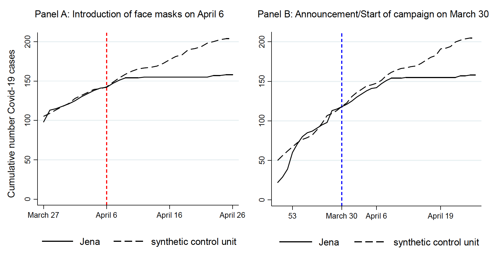
</div>
</center>


## Synthetic control: Tesla
<center>
<div style="margin-top: 0px;">
  
</div>
</center>

<div class="recommend">[Source](https://www.alexpghayes.com/blog/elon-musk-send-tweet/)</div>


## Synthetic control: CausalImpact
<center>
<div style="margin-top: -25px;">
  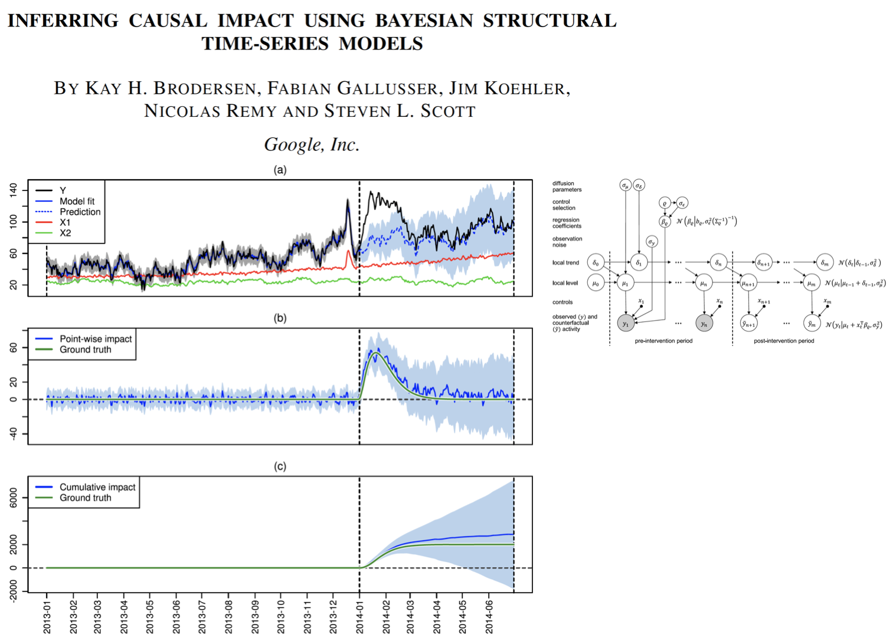
</div>
</center>

<div class="recommend">[Brodersen Talk](https://www.youtube.com/watch?v=GTgZfCltMm8)</div>


## Synthetic control: Tesla
- Use the S&P500 as a synthetic control

<center>
<div style="margin-top: 0px;">
  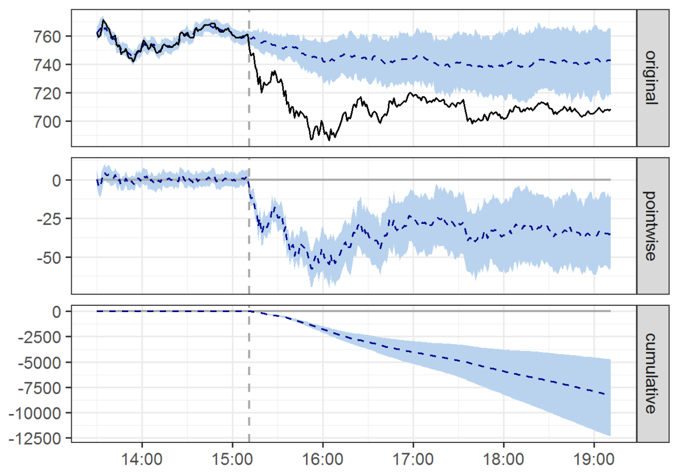
</div>
</center>

<div class="recommend">[Source](https://www.alexpghayes.com/blog/elon-musk-send-tweet/)</div>


<!-- ## Synthetic control: CausalImpact -->
<!-- - Combines three sources of information -->
<!--     - Time-series of the treated unit prior to the intervention -->
<!--     - Time-series of the untreated units prior to intervention -->
<!--     - Prior information about likely parameter values (spike and slab priors) -->

<!-- <span style = "color:"></span> -->

<!-- - In contrast to Abadie et al. ([2010](https://amstat.tandfonline.com/doi/abs/10.1198/jasa.2009.ap08746)), allows for non-convex combinations of control units  -->


## Interrupted Time-series Analysis (ITS)
- Similar to synthetic control, except that we do not use a control unit (Bernal et al., [2017](https://academic.oup.com/ije/article/46/1/348/2622842), [2019](https://academic.oup.com/ije/article-abstract/48/6/2062/5419048))
- Leefting & Hinne ([2020](http://proceedings.mlr.press/v136/leeftink20a.html)) apply it to Kundalini Yoga

<center>
<div style="margin-top: 75px;">
  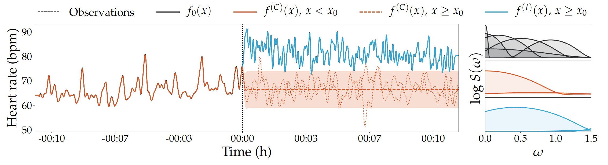
</div>
</center>


## Happiness / Sadness across the world
<center>
<div style="margin-top: -25px;">
  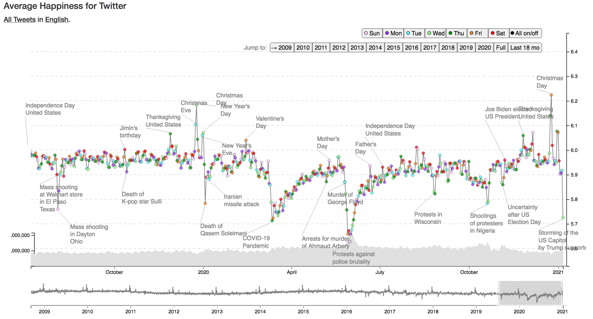
</div>
</center>

<div class="recommend">[Podcast Episode](https://gimletmedia.com/shows/reply-all/kwh96n)</div>


## Recap
- Causal discovery is very ambitious
- PC algorithm learns Markov equivalent DAGs from observational data
    - Assumes faithfulness, no hidden and no selection variables
    - Faithfulness is a strong assumption, conditional independence testing is hard
    
<span style = "color:"></span>

- ICP uses data from different environments to learn causal parents
    - Assumes invariant mechanisms (standard in causal inference)
    - Does not require faithfulness, can be extended to nonlinear case, hidden variables, time-series
    
<span style = "color:"></span>

- Restricted SCMs learn the causal direction ($X \rightarrow Y$ or $Y \rightarrow X$)
    - LiNGAMs assume linear function with non-Gaussian error
    - Nonlinear Gaussian additive noise models assume non-linear function with Gaussian error
    
<span style = "color:"></span>

- Synthetic control methods create a control to learn causal effect (usually after some intervention)
- Interrupted time-series similar in spirit, except no synthetic control


# [Exercises II](https://fabiandablander.com/assets/talks/Causal-Exercises-Max-Planck.html)